# DevExpress SVG Icon Catalog

> Ten katalog jest przeznaczony do użytku wewnętrznego.
> Do korzystania z zasobów DevExpress wymagana jest aktywna licencja DevExpress.

Wygenerowano: 2026-03-23 19:09:21

Liczba ikon: 3061

## Spis setów

- [blazorimages (196)](#blazorimages)
- [devav (181)](#devav)
- [fluentimages (191)](#fluentimages)
- [images (251)](#images)
- [svgimages (2242)](#svgimages)

## Zawartość

Podgląd ikon ma stały rozmiar 100x100.

## blazorimages

Liczba ikon: 196

### business objects

Liczba ikon: 20

<table>
  <tr>
    <td align="center" valign="top" width="12.5%"> <a href="icons/blazorimages/business-objects/bo_audit_changehistory.svg"><code>bo_audit_changehistory.svg</code></a></td>
    <td align="center" valign="top" width="12.5%"> <a href="icons/blazorimages/business-objects/bo_dashboard.svg"><code>bo_dashboard.svg</code></a></td>
    <td align="center" valign="top" width="12.5%"> <a href="icons/blazorimages/business-objects/bo_department.svg"><code>bo_department.svg</code></a></td>
    <td align="center" valign="top" width="12.5%"> <a href="icons/blazorimages/business-objects/bo_document.svg"><code>bo_document.svg</code></a></td>
    <td align="center" valign="top" width="12.5%"> <a href="icons/blazorimages/business-objects/bo_employee.svg"><code>bo_employee.svg</code></a></td>
    <td align="center" valign="top" width="12.5%"> <a href="icons/blazorimages/business-objects/bo_folder.svg"><code>bo_folder.svg</code></a></td>
    <td align="center" valign="top" width="12.5%"> <a href="icons/blazorimages/business-objects/bo_mydetails.svg"><code>bo_mydetails.svg</code></a></td>
    <td align="center" valign="top" width="12.5%"> <a href="icons/blazorimages/business-objects/bo_note.svg"><code>bo_note.svg</code></a></td>
  </tr>
  <tr>
    <td align="center" valign="top" width="12.5%"> <a href="icons/blazorimages/business-objects/bo_person.svg"><code>bo_person.svg</code></a></td>
    <td align="center" valign="top" width="12.5%"> <a href="icons/blazorimages/business-objects/bo_phone.svg"><code>bo_phone.svg</code></a></td>
    <td align="center" valign="top" width="12.5%"> <a href="icons/blazorimages/business-objects/bo_report.svg"><code>bo_report.svg</code></a></td>
    <td align="center" valign="top" width="12.5%"> <a href="icons/blazorimages/business-objects/bo_resources.svg"><code>bo_resources.svg</code></a></td>
    <td align="center" valign="top" width="12.5%"> <a href="icons/blazorimages/business-objects/bo_resume.svg"><code>bo_resume.svg</code></a></td>
    <td align="center" valign="top" width="12.5%"> <a href="icons/blazorimages/business-objects/bo_role.svg"><code>bo_role.svg</code></a></td>
    <td align="center" valign="top" width="12.5%"> <a href="icons/blazorimages/business-objects/bo_sale_item.svg"><code>bo_sale_item.svg</code></a></td>
    <td align="center" valign="top" width="12.5%"> <a href="icons/blazorimages/business-objects/bo_scheduler.svg"><code>bo_scheduler.svg</code></a></td>
  </tr>
  <tr>
    <td align="center" valign="top" width="12.5%"> <a href="icons/blazorimages/business-objects/bo_statemachine.svg"><code>bo_statemachine.svg</code></a></td>
    <td align="center" valign="top" width="12.5%"> <a href="icons/blazorimages/business-objects/bo_task.svg"><code>bo_task.svg</code></a></td>
    <td align="center" valign="top" width="12.5%"> <a href="icons/blazorimages/business-objects/bo_unknown.svg"><code>bo_unknown.svg</code></a></td>
    <td align="center" valign="top" width="12.5%"> <a href="icons/blazorimages/business-objects/bo_user.svg"><code>bo_user.svg</code></a></td>
    <td></td>
    <td></td>
    <td></td>
    <td></td>
  </tr>
</table>

### xaf

Liczba ikon: 176

<table>
  <tr>
    <td align="center" valign="top" width="12.5%"> <a href="icons/blazorimages/xaf/action_bell.svg"><code>action_bell.svg</code></a></td>
    <td align="center" valign="top" width="12.5%"> <a href="icons/blazorimages/xaf/action_cancel.svg"><code>action_cancel.svg</code></a></td>
    <td align="center" valign="top" width="12.5%"> <a href="icons/blazorimages/xaf/action_change_state.svg"><code>action_change_state.svg</code></a></td>
    <td align="center" valign="top" width="12.5%"> <a href="icons/blazorimages/xaf/action_clear.svg"><code>action_clear.svg</code></a></td>
    <td align="center" valign="top" width="12.5%"> <a href="icons/blazorimages/xaf/action_clear_settings.svg"><code>action_clear_settings.svg</code></a></td>
    <td align="center" valign="top" width="12.5%"> <a href="icons/blazorimages/xaf/action_clonemerge_clone_object.svg"><code>action_clonemerge_clone_object.svg</code></a></td>
    <td align="center" valign="top" width="12.5%"> <a href="icons/blazorimages/xaf/action_close.svg"><code>action_close.svg</code></a></td>
    <td align="center" valign="top" width="12.5%"> <a href="icons/blazorimages/xaf/action_closeallbutthis.svg"><code>action_closeallbutthis.svg</code></a></td>
  </tr>
  <tr>
    <td align="center" valign="top" width="12.5%"> <a href="icons/blazorimages/xaf/action_closealltabs.svg"><code>action_closealltabs.svg</code></a></td>
    <td align="center" valign="top" width="12.5%"> <a href="icons/blazorimages/xaf/action_closetab.svg"><code>action_closetab.svg</code></a></td>
    <td align="center" valign="top" width="12.5%"> <a href="icons/blazorimages/xaf/action_columnchooser.svg"><code>action_columnchooser.svg</code></a></td>
    <td align="center" valign="top" width="12.5%"> <a href="icons/blazorimages/xaf/action_copy.svg"><code>action_copy.svg</code></a></td>
    <td align="center" valign="top" width="12.5%"> <a href="icons/blazorimages/xaf/action_createdashboard.svg"><code>action_createdashboard.svg</code></a></td>
    <td align="center" valign="top" width="12.5%"> <a href="icons/blazorimages/xaf/action_dashboard_designer.svg"><code>action_dashboard_designer.svg</code></a></td>
    <td align="center" valign="top" width="12.5%"> <a href="icons/blazorimages/xaf/action_dashboard_new.svg"><code>action_dashboard_new.svg</code></a></td>
    <td align="center" valign="top" width="12.5%"> <a href="icons/blazorimages/xaf/action_dashboard_showdesigner.svg"><code>action_dashboard_showdesigner.svg</code></a></td>
  </tr>
  <tr>
    <td align="center" valign="top" width="12.5%"> <a href="icons/blazorimages/xaf/action_dashboard_viewer.svg"><code>action_dashboard_viewer.svg</code></a></td>
    <td align="center" valign="top" width="12.5%"> <a href="icons/blazorimages/xaf/action_delete.svg"><code>action_delete.svg</code></a></td>
    <td align="center" valign="top" width="12.5%"> <a href="icons/blazorimages/xaf/action_deletedashboard.svg"><code>action_deletedashboard.svg</code></a></td>
    <td align="center" valign="top" width="12.5%"> <a href="icons/blazorimages/xaf/action_dismiss.svg"><code>action_dismiss.svg</code></a></td>
    <td align="center" valign="top" width="12.5%"> <a href="icons/blazorimages/xaf/action_dismissall.svg"><code>action_dismissall.svg</code></a></td>
    <td align="center" valign="top" width="12.5%"> <a href="icons/blazorimages/xaf/action_document_object_inplace.svg"><code>action_document_object_inplace.svg</code></a></td>
    <td align="center" valign="top" width="12.5%"> <a href="icons/blazorimages/xaf/action_edit.svg"><code>action_edit.svg</code></a></td>
    <td align="center" valign="top" width="12.5%"> <a href="icons/blazorimages/xaf/action_editmodel.svg"><code>action_editmodel.svg</code></a></td>
  </tr>
  <tr>
    <td align="center" valign="top" width="12.5%"> <a href="icons/blazorimages/xaf/action_export.svg"><code>action_export.svg</code></a></td>
    <td align="center" valign="top" width="12.5%"> <a href="icons/blazorimages/xaf/action_export_tocsv.svg"><code>action_export_tocsv.svg</code></a></td>
    <td align="center" valign="top" width="12.5%"> <a href="icons/blazorimages/xaf/action_export_todocx.svg"><code>action_export_todocx.svg</code></a></td>
    <td align="center" valign="top" width="12.5%"> <a href="icons/blazorimages/xaf/action_export_tohtml.svg"><code>action_export_tohtml.svg</code></a></td>
    <td align="center" valign="top" width="12.5%"> <a href="icons/blazorimages/xaf/action_export_toimage.svg"><code>action_export_toimage.svg</code></a></td>
    <td align="center" valign="top" width="12.5%"> <a href="icons/blazorimages/xaf/action_export_tomht.svg"><code>action_export_tomht.svg</code></a></td>
    <td align="center" valign="top" width="12.5%"> <a href="icons/blazorimages/xaf/action_export_topdf.svg"><code>action_export_topdf.svg</code></a></td>
    <td align="center" valign="top" width="12.5%"> <a href="icons/blazorimages/xaf/action_export_tortf.svg"><code>action_export_tortf.svg</code></a></td>
  </tr>
  <tr>
    <td align="center" valign="top" width="12.5%"> <a href="icons/blazorimages/xaf/action_export_totext.svg"><code>action_export_totext.svg</code></a></td>
    <td align="center" valign="top" width="12.5%"> <a href="icons/blazorimages/xaf/action_export_toxls.svg"><code>action_export_toxls.svg</code></a></td>
    <td align="center" valign="top" width="12.5%"> <a href="icons/blazorimages/xaf/action_export_toxlsx.svg"><code>action_export_toxlsx.svg</code></a></td>
    <td align="center" valign="top" width="12.5%"> <a href="icons/blazorimages/xaf/action_filtereditor.svg"><code>action_filtereditor.svg</code></a></td>
    <td align="center" valign="top" width="12.5%"> <a href="icons/blazorimages/xaf/action_hideitem.svg"><code>action_hideitem.svg</code></a></td>
    <td align="center" valign="top" width="12.5%"> <a href="icons/blazorimages/xaf/action_hideitemfromdashboard-1.svg"><code>action_hideitemfromdashboard-1.svg</code></a></td>
    <td align="center" valign="top" width="12.5%"> <a href="icons/blazorimages/xaf/action_hideitemfromdashboard.svg"><code>action_hideitemfromdashboard.svg</code></a></td>
    <td align="center" valign="top" width="12.5%"> <a href="icons/blazorimages/xaf/action_linkunlink_link.svg"><code>action_linkunlink_link.svg</code></a></td>
  </tr>
  <tr>
    <td align="center" valign="top" width="12.5%"> <a href="icons/blazorimages/xaf/action_linkunlink_unlink.svg"><code>action_linkunlink_unlink.svg</code></a></td>
    <td align="center" valign="top" width="12.5%"> <a href="icons/blazorimages/xaf/action_logonviaazuread.svg"><code>action_logonviaazuread.svg</code></a></td>
    <td align="center" valign="top" width="12.5%"> <a href="icons/blazorimages/xaf/action_logonviagithub.svg"><code>action_logonviagithub.svg</code></a></td>
    <td align="center" valign="top" width="12.5%"> <a href="icons/blazorimages/xaf/action_logonviagoogle.svg"><code>action_logonviagoogle.svg</code></a></td>
    <td align="center" valign="top" width="12.5%"> <a href="icons/blazorimages/xaf/action_logonviamicrosoftentraid.svg"><code>action_logonviamicrosoftentraid.svg</code></a></td>
    <td align="center" valign="top" width="12.5%"> <a href="icons/blazorimages/xaf/action_logonvianegotiate.svg"><code>action_logonvianegotiate.svg</code></a></td>
    <td align="center" valign="top" width="12.5%"> <a href="icons/blazorimages/xaf/action_logonviawindows.svg"><code>action_logonviawindows.svg</code></a></td>
    <td align="center" valign="top" width="12.5%"> <a href="icons/blazorimages/xaf/action_markcompleted.svg"><code>action_markcompleted.svg</code></a></td>
  </tr>
  <tr>
    <td align="center" valign="top" width="12.5%"> <a href="icons/blazorimages/xaf/action_modeldifferences_copy.svg"><code>action_modeldifferences_copy.svg</code></a></td>
    <td align="center" valign="top" width="12.5%"> <a href="icons/blazorimages/xaf/action_modeldifferences_create.svg"><code>action_modeldifferences_create.svg</code></a></td>
    <td align="center" valign="top" width="12.5%"> <a href="icons/blazorimages/xaf/action_modeldifferences_export.svg"><code>action_modeldifferences_export.svg</code></a></td>
    <td align="center" valign="top" width="12.5%"> <a href="icons/blazorimages/xaf/action_modeldifferences_import.svg"><code>action_modeldifferences_import.svg</code></a></td>
    <td align="center" valign="top" width="12.5%"> <a href="icons/blazorimages/xaf/action_modeldifferences_reset.svg"><code>action_modeldifferences_reset.svg</code></a></td>
    <td align="center" valign="top" width="12.5%"> <a href="icons/blazorimages/xaf/action_more.svg"><code>action_more.svg</code></a></td>
    <td align="center" valign="top" width="12.5%"> <a href="icons/blazorimages/xaf/action_navigation_chevron_left.svg"><code>action_navigation_chevron_left.svg</code></a></td>
    <td align="center" valign="top" width="12.5%"> <a href="icons/blazorimages/xaf/action_navigation_chevron_right.svg"><code>action_navigation_chevron_right.svg</code></a></td>
  </tr>
  <tr>
    <td align="center" valign="top" width="12.5%"> <a href="icons/blazorimages/xaf/action_navigation_next_object.svg"><code>action_navigation_next_object.svg</code></a></td>
    <td align="center" valign="top" width="12.5%"> <a href="icons/blazorimages/xaf/action_navigation_previous_object.svg"><code>action_navigation_previous_object.svg</code></a></td>
    <td align="center" valign="top" width="12.5%"> <a href="icons/blazorimages/xaf/action_new.svg"><code>action_new.svg</code></a></td>
    <td align="center" valign="top" width="12.5%"> <a href="icons/blazorimages/xaf/action_optimisticlock_ignorecollision.svg"><code>action_optimisticlock_ignorecollision.svg</code></a></td>
    <td align="center" valign="top" width="12.5%"> <a href="icons/blazorimages/xaf/action_optimisticlock_merge.svg"><code>action_optimisticlock_merge.svg</code></a></td>
    <td align="center" valign="top" width="12.5%"> <a href="icons/blazorimages/xaf/action_optimisticlock_refresh.svg"><code>action_optimisticlock_refresh.svg</code></a></td>
    <td align="center" valign="top" width="12.5%"> <a href="icons/blazorimages/xaf/action_optimisticlock_reloadcollision.svg"><code>action_optimisticlock_reloadcollision.svg</code></a></td>
    <td align="center" valign="top" width="12.5%"> <a href="icons/blazorimages/xaf/action_organizedashboard.svg"><code>action_organizedashboard.svg</code></a></td>
  </tr>
  <tr>
    <td align="center" valign="top" width="12.5%"> <a href="icons/blazorimages/xaf/action_postpone.svg"><code>action_postpone.svg</code></a></td>
    <td align="center" valign="top" width="12.5%"> <a href="icons/blazorimages/xaf/action_printing_preview.svg"><code>action_printing_preview.svg</code></a></td>
    <td align="center" valign="top" width="12.5%"> <a href="icons/blazorimages/xaf/action_refresh.svg"><code>action_refresh.svg</code></a></td>
    <td align="center" valign="top" width="12.5%"> <a href="icons/blazorimages/xaf/action_report_showdesigner.svg"><code>action_report_showdesigner.svg</code></a></td>
    <td align="center" valign="top" width="12.5%"> <a href="icons/blazorimages/xaf/action_resetpassword.svg"><code>action_resetpassword.svg</code></a></td>
    <td align="center" valign="top" width="12.5%"> <a href="icons/blazorimages/xaf/action_resetviewsettings.svg"><code>action_resetviewsettings.svg</code></a></td>
    <td align="center" valign="top" width="12.5%"> <a href="icons/blazorimages/xaf/action_save.svg"><code>action_save.svg</code></a></td>
    <td align="center" valign="top" width="12.5%"> <a href="icons/blazorimages/xaf/action_save_alt.svg"><code>action_save_alt.svg</code></a></td>
  </tr>
  <tr>
    <td align="center" valign="top" width="12.5%"> <a href="icons/blazorimages/xaf/action_save_close.svg"><code>action_save_close.svg</code></a></td>
    <td align="center" valign="top" width="12.5%"> <a href="icons/blazorimages/xaf/action_save_new.svg"><code>action_save_new.svg</code></a></td>
    <td align="center" valign="top" width="12.5%"> <a href="icons/blazorimages/xaf/action_search.svg"><code>action_search.svg</code></a></td>
    <td align="center" valign="top" width="12.5%"> <a href="icons/blazorimages/xaf/action_search_lookup.svg"><code>action_search_lookup.svg</code></a></td>
    <td align="center" valign="top" width="12.5%"> <a href="icons/blazorimages/xaf/action_security_changepassword.svg"><code>action_security_changepassword.svg</code></a></td>
    <td align="center" valign="top" width="12.5%"> <a href="icons/blazorimages/xaf/action_showinreport.svg"><code>action_showinreport.svg</code></a></td>
    <td align="center" valign="top" width="12.5%"> <a href="icons/blazorimages/xaf/action_showitemondashboard.svg"><code>action_showitemondashboard.svg</code></a></td>
    <td align="center" valign="top" width="12.5%"> <a href="icons/blazorimages/xaf/action_snooze.svg"><code>action_snooze.svg</code></a></td>
  </tr>
  <tr>
    <td align="center" valign="top" width="12.5%"> <a href="icons/blazorimages/xaf/action_statemachine.svg"><code>action_statemachine.svg</code></a></td>
    <td align="center" valign="top" width="12.5%"> <a href="icons/blazorimages/xaf/action_validation_validate.svg"><code>action_validation_validate.svg</code></a></td>
    <td align="center" valign="top" width="12.5%"> <a href="icons/blazorimages/xaf/add_group.svg"><code>add_group.svg</code></a></td>
    <td align="center" valign="top" width="12.5%"> <a href="icons/blazorimages/xaf/alert_close.svg"><code>alert_close.svg</code></a></td>
    <td align="center" valign="top" width="12.5%"> <a href="icons/blazorimages/xaf/alert_danger.svg"><code>alert_danger.svg</code></a></td>
    <td align="center" valign="top" width="12.5%"> <a href="icons/blazorimages/xaf/alert_info.svg"><code>alert_info.svg</code></a></td>
    <td align="center" valign="top" width="12.5%"> <a href="icons/blazorimages/xaf/alert_options.svg"><code>alert_options.svg</code></a></td>
    <td align="center" valign="top" width="12.5%"> <a href="icons/blazorimages/xaf/alert_warning.svg"><code>alert_warning.svg</code></a></td>
  </tr>
  <tr>
    <td align="center" valign="top" width="12.5%"> <a href="icons/blazorimages/xaf/arrow_left.svg"><code>arrow_left.svg</code></a></td>
    <td align="center" valign="top" width="12.5%"> <a href="icons/blazorimages/xaf/attachment.svg"><code>attachment.svg</code></a></td>
    <td align="center" valign="top" width="12.5%"> <a href="icons/blazorimages/xaf/best_fit.svg"><code>best_fit.svg</code></a></td>
    <td align="center" valign="top" width="12.5%"> <a href="icons/blazorimages/xaf/contextmenu_best_fit_all.svg"><code>contextmenu_best_fit_all.svg</code></a></td>
    <td align="center" valign="top" width="12.5%"> <a href="icons/blazorimages/xaf/contextmenu_clear_all_sorting.svg"><code>contextmenu_clear_all_sorting.svg</code></a></td>
    <td align="center" valign="top" width="12.5%"> <a href="icons/blazorimages/xaf/contextmenu_clear_filter.svg"><code>contextmenu_clear_filter.svg</code></a></td>
    <td align="center" valign="top" width="12.5%"> <a href="icons/blazorimages/xaf/contextmenu_clear_grouping.svg"><code>contextmenu_clear_grouping.svg</code></a></td>
    <td align="center" valign="top" width="12.5%"> <a href="icons/blazorimages/xaf/contextmenu_clear_sorting.svg"><code>contextmenu_clear_sorting.svg</code></a></td>
  </tr>
  <tr>
    <td align="center" valign="top" width="12.5%"> <a href="icons/blazorimages/xaf/contextmenu_group_collapse.svg"><code>contextmenu_group_collapse.svg</code></a></td>
    <td align="center" valign="top" width="12.5%"> <a href="icons/blazorimages/xaf/contextmenu_group_expand.svg"><code>contextmenu_group_expand.svg</code></a></td>
    <td align="center" valign="top" width="12.5%"> <a href="icons/blazorimages/xaf/contextmenu_hide_column.svg"><code>contextmenu_hide_column.svg</code></a></td>
    <td align="center" valign="top" width="12.5%"> <a href="icons/blazorimages/xaf/contextmenu_hide_filter_row.svg"><code>contextmenu_hide_filter_row.svg</code></a></td>
    <td align="center" valign="top" width="12.5%"> <a href="icons/blazorimages/xaf/contextmenu_hide_footer.svg"><code>contextmenu_hide_footer.svg</code></a></td>
    <td align="center" valign="top" width="12.5%"> <a href="icons/blazorimages/xaf/contextmenu_hide_group_panel.svg"><code>contextmenu_hide_group_panel.svg</code></a></td>
    <td align="center" valign="top" width="12.5%"> <a href="icons/blazorimages/xaf/contextmenu_hide_search_panel.svg"><code>contextmenu_hide_search_panel.svg</code></a></td>
    <td align="center" valign="top" width="12.5%"> <a href="icons/blazorimages/xaf/contextmenu_show_column.svg"><code>contextmenu_show_column.svg</code></a></td>
  </tr>
  <tr>
    <td align="center" valign="top" width="12.5%"> <a href="icons/blazorimages/xaf/contextmenu_show_filter_row.svg"><code>contextmenu_show_filter_row.svg</code></a></td>
    <td align="center" valign="top" width="12.5%"> <a href="icons/blazorimages/xaf/contextmenu_show_footer.svg"><code>contextmenu_show_footer.svg</code></a></td>
    <td align="center" valign="top" width="12.5%"> <a href="icons/blazorimages/xaf/contextmenu_show_group_panel.svg"><code>contextmenu_show_group_panel.svg</code></a></td>
    <td align="center" valign="top" width="12.5%"> <a href="icons/blazorimages/xaf/contextmenu_show_search_panel.svg"><code>contextmenu_show_search_panel.svg</code></a></td>
    <td align="center" valign="top" width="12.5%"> <a href="icons/blazorimages/xaf/contextmenu_sort_ascending.svg"><code>contextmenu_sort_ascending.svg</code></a></td>
    <td align="center" valign="top" width="12.5%"> <a href="icons/blazorimages/xaf/contextmenu_sort_descending.svg"><code>contextmenu_sort_descending.svg</code></a></td>
    <td align="center" valign="top" width="12.5%"> <a href="icons/blazorimages/xaf/contextmenu_variants.svg"><code>contextmenu_variants.svg</code></a></td>
    <td align="center" valign="top" width="12.5%"> <a href="icons/blazorimages/xaf/create_tabbed_group.svg"><code>create_tabbed_group.svg</code></a></td>
  </tr>
  <tr>
    <td align="center" valign="top" width="12.5%"> <a href="icons/blazorimages/xaf/drop_selected_into_this.svg"><code>drop_selected_into_this.svg</code></a></td>
    <td align="center" valign="top" width="12.5%"> <a href="icons/blazorimages/xaf/drop_selected_under_this.svg"><code>drop_selected_under_this.svg</code></a></td>
    <td align="center" valign="top" width="12.5%"> <a href="icons/blazorimages/xaf/filter_editor.svg"><code>filter_editor.svg</code></a></td>
    <td align="center" valign="top" width="12.5%"> <a href="icons/blazorimages/xaf/filter_editor_active.svg"><code>filter_editor_active.svg</code></a></td>
    <td align="center" valign="top" width="12.5%"> <a href="icons/blazorimages/xaf/grid_cancel.svg"><code>grid_cancel.svg</code></a></td>
    <td align="center" valign="top" width="12.5%"> <a href="icons/blazorimages/xaf/grid_edit.svg"><code>grid_edit.svg</code></a></td>
    <td align="center" valign="top" width="12.5%"> <a href="icons/blazorimages/xaf/grid_new.svg"><code>grid_new.svg</code></a></td>
    <td align="center" valign="top" width="12.5%"> <a href="icons/blazorimages/xaf/grid_save.svg"><code>grid_save.svg</code></a></td>
  </tr>
  <tr>
    <td align="center" valign="top" width="12.5%"> <a href="icons/blazorimages/xaf/hamburger.svg"><code>hamburger.svg</code></a></td>
    <td align="center" valign="top" width="12.5%"> <a href="icons/blazorimages/xaf/image_cancel.svg"><code>image_cancel.svg</code></a></td>
    <td align="center" valign="top" width="12.5%"> <a href="icons/blazorimages/xaf/image_delete.svg"><code>image_delete.svg</code></a></td>
    <td align="center" valign="top" width="12.5%"> <a href="icons/blazorimages/xaf/image_edit.svg"><code>image_edit.svg</code></a></td>
    <td align="center" valign="top" width="12.5%"> <a href="icons/blazorimages/xaf/layoutcustomization_group.svg"><code>layoutcustomization_group.svg</code></a></td>
    <td align="center" valign="top" width="12.5%"> <a href="icons/blazorimages/xaf/layoutcustomization_group_hidden.svg"><code>layoutcustomization_group_hidden.svg</code></a></td>
    <td align="center" valign="top" width="12.5%"> <a href="icons/blazorimages/xaf/layoutcustomization_hide.svg"><code>layoutcustomization_hide.svg</code></a></td>
    <td align="center" valign="top" width="12.5%"> <a href="icons/blazorimages/xaf/layoutcustomization_hidetext.svg"><code>layoutcustomization_hidetext.svg</code></a></td>
  </tr>
  <tr>
    <td align="center" valign="top" width="12.5%"> <a href="icons/blazorimages/xaf/layoutcustomization_item.svg"><code>layoutcustomization_item.svg</code></a></td>
    <td align="center" valign="top" width="12.5%"> <a href="icons/blazorimages/xaf/layoutcustomization_item_hidden.svg"><code>layoutcustomization_item_hidden.svg</code></a></td>
    <td align="center" valign="top" width="12.5%">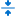 <a href="icons/blazorimages/xaf/layoutcustomization_makecollapsible.svg"><code>layoutcustomization_makecollapsible.svg</code></a></td>
    <td align="center" valign="top" width="12.5%"> <a href="icons/blazorimages/xaf/layoutcustomization_makenotcollapsible.svg"><code>layoutcustomization_makenotcollapsible.svg</code></a></td>
    <td align="center" valign="top" width="12.5%"> <a href="icons/blazorimages/xaf/layoutcustomization_rename.svg"><code>layoutcustomization_rename.svg</code></a></td>
    <td align="center" valign="top" width="12.5%"> <a href="icons/blazorimages/xaf/layoutcustomization_reset.svg"><code>layoutcustomization_reset.svg</code></a></td>
    <td align="center" valign="top" width="12.5%"> <a href="icons/blazorimages/xaf/layoutcustomization_show.svg"><code>layoutcustomization_show.svg</code></a></td>
    <td align="center" valign="top" width="12.5%"> <a href="icons/blazorimages/xaf/layoutcustomization_showtext.svg"><code>layoutcustomization_showtext.svg</code></a></td>
  </tr>
  <tr>
    <td align="center" valign="top" width="12.5%"> <a href="icons/blazorimages/xaf/layoutcustomization_smallsize.svg"><code>layoutcustomization_smallsize.svg</code></a></td>
    <td align="center" valign="top" width="12.5%"> <a href="icons/blazorimages/xaf/layoutcustomization_tab.svg"><code>layoutcustomization_tab.svg</code></a></td>
    <td align="center" valign="top" width="12.5%"> <a href="icons/blazorimages/xaf/layoutcustomization_tab_hidden.svg"><code>layoutcustomization_tab_hidden.svg</code></a></td>
    <td align="center" valign="top" width="12.5%"> <a href="icons/blazorimages/xaf/layoutcustomization_textposition.svg"><code>layoutcustomization_textposition.svg</code></a></td>
    <td align="center" valign="top" width="12.5%"> <a href="icons/blazorimages/xaf/layoutcustomization_textposition_left.svg"><code>layoutcustomization_textposition_left.svg</code></a></td>
    <td align="center" valign="top" width="12.5%"> <a href="icons/blazorimages/xaf/layoutcustomization_textposition_top.svg"><code>layoutcustomization_textposition_top.svg</code></a></td>
    <td align="center" valign="top" width="12.5%"> <a href="icons/blazorimages/xaf/masterdetail_placeholder.svg"><code>masterdetail_placeholder.svg</code></a></td>
    <td align="center" valign="top" width="12.5%"> <a href="icons/blazorimages/xaf/modeleditor_modelmerge.svg"><code>modeleditor_modelmerge.svg</code></a></td>
  </tr>
  <tr>
    <td align="center" valign="top" width="12.5%"> <a href="icons/blazorimages/xaf/more.svg"><code>more.svg</code></a></td>
    <td align="center" valign="top" width="12.5%"> <a href="icons/blazorimages/xaf/navigation_group_viewvariant.svg"><code>navigation_group_viewvariant.svg</code></a></td>
    <td align="center" valign="top" width="12.5%"> <a href="icons/blazorimages/xaf/navigation_item_dashboard.svg"><code>navigation_item_dashboard.svg</code></a></td>
    <td align="center" valign="top" width="12.5%"> <a href="icons/blazorimages/xaf/navigation_item_view.svg"><code>navigation_item_view.svg</code></a></td>
    <td align="center" valign="top" width="12.5%"> <a href="icons/blazorimages/xaf/navigation_item_viewvariant.svg"><code>navigation_item_viewvariant.svg</code></a></td>
    <td align="center" valign="top" width="12.5%"> <a href="icons/blazorimages/xaf/previewedit.svg"><code>previewedit.svg</code></a></td>
    <td align="center" valign="top" width="12.5%"> <a href="icons/blazorimages/xaf/protectedcontent.svg"><code>protectedcontent.svg</code></a></td>
    <td align="center" valign="top" width="12.5%"> <a href="icons/blazorimages/xaf/sad.svg"><code>sad.svg</code></a></td>
  </tr>
  <tr>
    <td align="center" valign="top" width="12.5%"> <a href="icons/blazorimages/xaf/scheduler_bell.svg"><code>scheduler_bell.svg</code></a></td>
    <td align="center" valign="top" width="12.5%"> <a href="icons/blazorimages/xaf/security_header.svg"><code>security_header.svg</code></a></td>
    <td align="center" valign="top" width="12.5%"> <a href="icons/blazorimages/xaf/security_userlogo.svg"><code>security_userlogo.svg</code></a></td>
    <td align="center" valign="top" width="12.5%"> <a href="icons/blazorimages/xaf/settings.svg"><code>settings.svg</code></a></td>
    <td align="center" valign="top" width="12.5%"> <a href="icons/blazorimages/xaf/state_itemvisibility_hide.svg"><code>state_itemvisibility_hide.svg</code></a></td>
    <td align="center" valign="top" width="12.5%"> <a href="icons/blazorimages/xaf/state_itemvisibility_show.svg"><code>state_itemvisibility_show.svg</code></a></td>
    <td align="center" valign="top" width="12.5%"> <a href="icons/blazorimages/xaf/state_priority_high.svg"><code>state_priority_high.svg</code></a></td>
    <td align="center" valign="top" width="12.5%"> <a href="icons/blazorimages/xaf/state_priority_low.svg"><code>state_priority_low.svg</code></a></td>
  </tr>
  <tr>
    <td align="center" valign="top" width="12.5%"> <a href="icons/blazorimages/xaf/state_priority_normal.svg"><code>state_priority_normal.svg</code></a></td>
    <td align="center" valign="top" width="12.5%"> <a href="icons/blazorimages/xaf/state_task_completed.svg"><code>state_task_completed.svg</code></a></td>
    <td align="center" valign="top" width="12.5%"> <a href="icons/blazorimages/xaf/state_task_deferred.svg"><code>state_task_deferred.svg</code></a></td>
    <td align="center" valign="top" width="12.5%"> <a href="icons/blazorimages/xaf/state_task_inprogress.svg"><code>state_task_inprogress.svg</code></a></td>
    <td align="center" valign="top" width="12.5%"> <a href="icons/blazorimages/xaf/state_task_notstarted.svg"><code>state_task_notstarted.svg</code></a></td>
    <td align="center" valign="top" width="12.5%"> <a href="icons/blazorimages/xaf/state_task_waitingforsomeoneelse.svg"><code>state_task_waitingforsomeoneelse.svg</code></a></td>
    <td align="center" valign="top" width="12.5%"> <a href="icons/blazorimages/xaf/state_validation_information.svg"><code>state_validation_information.svg</code></a></td>
    <td align="center" valign="top" width="12.5%"> <a href="icons/blazorimages/xaf/state_validation_invalid.svg"><code>state_validation_invalid.svg</code></a></td>
  </tr>
  <tr>
    <td align="center" valign="top" width="12.5%"> <a href="icons/blazorimages/xaf/state_validation_skipped.svg"><code>state_validation_skipped.svg</code></a></td>
    <td align="center" valign="top" width="12.5%"> <a href="icons/blazorimages/xaf/state_validation_valid.svg"><code>state_validation_valid.svg</code></a></td>
    <td align="center" valign="top" width="12.5%"> <a href="icons/blazorimages/xaf/state_validation_warning.svg"><code>state_validation_warning.svg</code></a></td>
    <td align="center" valign="top" width="12.5%"> <a href="icons/blazorimages/xaf/task.svg"><code>task.svg</code></a></td>
    <td align="center" valign="top" width="12.5%"> <a href="icons/blazorimages/xaf/themeswitcher_darkmode.svg"><code>themeswitcher_darkmode.svg</code></a></td>
    <td align="center" valign="top" width="12.5%"> <a href="icons/blazorimages/xaf/themeswitcher_lightmode.svg"><code>themeswitcher_lightmode.svg</code></a></td>
    <td align="center" valign="top" width="12.5%"> <a href="icons/blazorimages/xaf/ungroup.svg"><code>ungroup.svg</code></a></td>
    <td align="center" valign="top" width="12.5%"> <a href="icons/blazorimages/xaf/upload_cancel.svg"><code>upload_cancel.svg</code></a></td>
  </tr>
</table>

## devav

Liczba ikon: 181

### actions

Liczba ikon: 88

<table>
  <tr>
    <td align="center" valign="top" width="12.5%"> <a href="icons/devav/actions/about.svg"><code>about.svg</code></a></td>
    <td align="center" valign="top" width="12.5%"> <a href="icons/devav/actions/add.svg"><code>add.svg</code></a></td>
    <td align="center" valign="top" width="12.5%"> <a href="icons/devav/actions/addcolumn.svg"><code>addcolumn.svg</code></a></td>
    <td align="center" valign="top" width="12.5%"> <a href="icons/devav/actions/addfile.svg"><code>addfile.svg</code></a></td>
    <td align="center" valign="top" width="12.5%"> <a href="icons/devav/actions/additem.svg"><code>additem.svg</code></a></td>
    <td align="center" valign="top" width="12.5%"> <a href="icons/devav/actions/apply.svg"><code>apply.svg</code></a></td>
    <td align="center" valign="top" width="12.5%"> <a href="icons/devav/actions/buy.svg"><code>buy.svg</code></a></td>
    <td align="center" valign="top" width="12.5%"> <a href="icons/devav/actions/changeview.svg"><code>changeview.svg</code></a></td>
  </tr>
  <tr>
    <td align="center" valign="top" width="12.5%"> <a href="icons/devav/actions/clear.svg"><code>clear.svg</code></a></td>
    <td align="center" valign="top" width="12.5%"> <a href="icons/devav/actions/clearformat.svg"><code>clearformat.svg</code></a></td>
    <td align="center" valign="top" width="12.5%"> <a href="icons/devav/actions/cleartablestyle.svg"><code>cleartablestyle.svg</code></a></td>
    <td align="center" valign="top" width="12.5%"> <a href="icons/devav/actions/close.svg"><code>close.svg</code></a></td>
    <td align="center" valign="top" width="12.5%"> <a href="icons/devav/actions/copy.svg"><code>copy.svg</code></a></td>
    <td align="center" valign="top" width="12.5%"> <a href="icons/devav/actions/costanalysis.svg"><code>costanalysis.svg</code></a></td>
    <td align="center" valign="top" width="12.5%"> <a href="icons/devav/actions/cut.svg"><code>cut.svg</code></a></td>
    <td align="center" valign="top" width="12.5%"> <a href="icons/devav/actions/delete.svg"><code>delete.svg</code></a></td>
  </tr>
  <tr>
    <td align="center" valign="top" width="12.5%"> <a href="icons/devav/actions/deletelist.svg"><code>deletelist.svg</code></a></td>
    <td align="center" valign="top" width="12.5%"> <a href="icons/devav/actions/deletelist2.svg"><code>deletelist2.svg</code></a></td>
    <td align="center" valign="top" width="12.5%"> <a href="icons/devav/actions/docking.svg"><code>docking.svg</code></a></td>
    <td align="center" valign="top" width="12.5%"> <a href="icons/devav/actions/download.svg"><code>download.svg</code></a></td>
    <td align="center" valign="top" width="12.5%"> <a href="icons/devav/actions/driving.svg"><code>driving.svg</code></a></td>
    <td align="center" valign="top" width="12.5%"> <a href="icons/devav/actions/edit.svg"><code>edit.svg</code></a></td>
    <td align="center" valign="top" width="12.5%"> <a href="icons/devav/actions/editname.svg"><code>editname.svg</code></a></td>
    <td align="center" valign="top" width="12.5%"> <a href="icons/devav/actions/exit.svg"><code>exit.svg</code></a></td>
  </tr>
  <tr>
    <td align="center" valign="top" width="12.5%">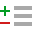 <a href="icons/devav/actions/expandcollapse.svg"><code>expandcollapse.svg</code></a></td>
    <td align="center" valign="top" width="12.5%"> <a href="icons/devav/actions/export.svg"><code>export.svg</code></a></td>
    <td align="center" valign="top" width="12.5%"> <a href="icons/devav/actions/filter.svg"><code>filter.svg</code></a></td>
    <td align="center" valign="top" width="12.5%"> <a href="icons/devav/actions/fittopage.svg"><code>fittopage.svg</code></a></td>
    <td align="center" valign="top" width="12.5%"> <a href="icons/devav/actions/gettingstarted.svg"><code>gettingstarted.svg</code></a></td>
    <td align="center" valign="top" width="12.5%"> <a href="icons/devav/actions/group.svg"><code>group.svg</code></a></td>
    <td align="center" valign="top" width="12.5%"> <a href="icons/devav/actions/hide.svg"><code>hide.svg</code></a></td>
    <td align="center" valign="top" width="12.5%"> <a href="icons/devav/actions/hideproduct.svg"><code>hideproduct.svg</code></a></td>
  </tr>
  <tr>
    <td align="center" valign="top" width="12.5%"> <a href="icons/devav/actions/mailmerge.svg"><code>mailmerge.svg</code></a></td>
    <td align="center" valign="top" width="12.5%"> <a href="icons/devav/actions/mapit.svg"><code>mapit.svg</code></a></td>
    <td align="center" valign="top" width="12.5%"> <a href="icons/devav/actions/merge.svg"><code>merge.svg</code></a></td>
    <td align="center" valign="top" width="12.5%"> <a href="icons/devav/actions/navigate.svg"><code>navigate.svg</code></a></td>
    <td align="center" valign="top" width="12.5%"> <a href="icons/devav/actions/new-group.svg"><code>new-group.svg</code></a></td>
    <td align="center" valign="top" width="12.5%"> <a href="icons/devav/actions/new.svg"><code>new.svg</code></a></td>
    <td align="center" valign="top" width="12.5%"> <a href="icons/devav/actions/newcustomer.svg"><code>newcustomer.svg</code></a></td>
    <td align="center" valign="top" width="12.5%"> <a href="icons/devav/actions/newemployee.svg"><code>newemployee.svg</code></a></td>
  </tr>
  <tr>
    <td align="center" valign="top" width="12.5%"> <a href="icons/devav/actions/newitem.svg"><code>newitem.svg</code></a></td>
    <td align="center" valign="top" width="12.5%"> <a href="icons/devav/actions/newopportunities.svg"><code>newopportunities.svg</code></a></td>
    <td align="center" valign="top" width="12.5%"> <a href="icons/devav/actions/newproducts.svg"><code>newproducts.svg</code></a></td>
    <td align="center" valign="top" width="12.5%"> <a href="icons/devav/actions/newsales.svg"><code>newsales.svg</code></a></td>
    <td align="center" valign="top" width="12.5%"> <a href="icons/devav/actions/open.svg"><code>open.svg</code></a></td>
    <td align="center" valign="top" width="12.5%"> <a href="icons/devav/actions/pagenext.svg"><code>pagenext.svg</code></a></td>
    <td align="center" valign="top" width="12.5%"> <a href="icons/devav/actions/pagepreview.svg"><code>pagepreview.svg</code></a></td>
    <td align="center" valign="top" width="12.5%"> <a href="icons/devav/actions/paste.svg"><code>paste.svg</code></a></td>
  </tr>
  <tr>
    <td align="center" valign="top" width="12.5%"> <a href="icons/devav/actions/picture.svg"><code>picture.svg</code></a></td>
    <td align="center" valign="top" width="12.5%"> <a href="icons/devav/actions/print.svg"><code>print.svg</code></a></td>
    <td align="center" valign="top" width="12.5%"> <a href="icons/devav/actions/printduedate.svg"><code>printduedate.svg</code></a></td>
    <td align="center" valign="top" width="12.5%"> <a href="icons/devav/actions/printexcludeevaluations.svg"><code>printexcludeevaluations.svg</code></a></td>
    <td align="center" valign="top" width="12.5%"> <a href="icons/devav/actions/printincludeevaluations.svg"><code>printincludeevaluations.svg</code></a></td>
    <td align="center" valign="top" width="12.5%"> <a href="icons/devav/actions/printpreview.svg"><code>printpreview.svg</code></a></td>
    <td align="center" valign="top" width="12.5%"> <a href="icons/devav/actions/printquick.svg"><code>printquick.svg</code></a></td>
    <td align="center" valign="top" width="12.5%"> <a href="icons/devav/actions/printsortasc.svg"><code>printsortasc.svg</code></a></td>
  </tr>
  <tr>
    <td align="center" valign="top" width="12.5%"> <a href="icons/devav/actions/printsortdesc.svg"><code>printsortdesc.svg</code></a></td>
    <td align="center" valign="top" width="12.5%"> <a href="icons/devav/actions/printstartdate.svg"><code>printstartdate.svg</code></a></td>
    <td align="center" valign="top" width="12.5%"> <a href="icons/devav/actions/productcomparisons.svg"><code>productcomparisons.svg</code></a></td>
    <td align="center" valign="top" width="12.5%"> <a href="icons/devav/actions/productshipments.svg"><code>productshipments.svg</code></a></td>
    <td align="center" valign="top" width="12.5%"> <a href="icons/devav/actions/producttopsalesperson.svg"><code>producttopsalesperson.svg</code></a></td>
    <td align="center" valign="top" width="12.5%"> <a href="icons/devav/actions/read.svg"><code>read.svg</code></a></td>
    <td align="center" valign="top" width="12.5%"> <a href="icons/devav/actions/redo.svg"><code>redo.svg</code></a></td>
    <td align="center" valign="top" width="12.5%"> <a href="icons/devav/actions/refresh.svg"><code>refresh.svg</code></a></td>
  </tr>
  <tr>
    <td align="center" valign="top" width="12.5%"> <a href="icons/devav/actions/remove.svg"><code>remove.svg</code></a></td>
    <td align="center" valign="top" width="12.5%"> <a href="icons/devav/actions/removeitem.svg"><code>removeitem.svg</code></a></td>
    <td align="center" valign="top" width="12.5%"> <a href="icons/devav/actions/reset2.svg"><code>reset2.svg</code></a></td>
    <td align="center" valign="top" width="12.5%"> <a href="icons/devav/actions/resetchanges.svg"><code>resetchanges.svg</code></a></td>
    <td align="center" valign="top" width="12.5%"> <a href="icons/devav/actions/reverssort.svg"><code>reverssort.svg</code></a></td>
    <td align="center" valign="top" width="12.5%"> <a href="icons/devav/actions/save.svg"><code>save.svg</code></a></td>
    <td align="center" valign="top" width="12.5%"> <a href="icons/devav/actions/saveandedit.svg"><code>saveandedit.svg</code></a></td>
    <td align="center" valign="top" width="12.5%"> <a href="icons/devav/actions/saveas.svg"><code>saveas.svg</code></a></td>
  </tr>
  <tr>
    <td align="center" valign="top" width="12.5%"> <a href="icons/devav/actions/search.svg"><code>search.svg</code></a></td>
    <td align="center" valign="top" width="12.5%"> <a href="icons/devav/actions/select-all.svg"><code>select-all.svg</code></a></td>
    <td align="center" valign="top" width="12.5%"> <a href="icons/devav/actions/select-all2.svg"><code>select-all2.svg</code></a></td>
    <td align="center" valign="top" width="12.5%"> <a href="icons/devav/actions/show.svg"><code>show.svg</code></a></td>
    <td align="center" valign="top" width="12.5%"> <a href="icons/devav/actions/showproduct.svg"><code>showproduct.svg</code></a></td>
    <td align="center" valign="top" width="12.5%"> <a href="icons/devav/actions/sortbyinvoice.svg"><code>sortbyinvoice.svg</code></a></td>
    <td align="center" valign="top" width="12.5%"> <a href="icons/devav/actions/sortbyorderdate.svg"><code>sortbyorderdate.svg</code></a></td>
    <td align="center" valign="top" width="12.5%"> <a href="icons/devav/actions/startdate.svg"><code>startdate.svg</code></a></td>
  </tr>
  <tr>
    <td align="center" valign="top" width="12.5%"> <a href="icons/devav/actions/support.svg"><code>support.svg</code></a></td>
    <td align="center" valign="top" width="12.5%"> <a href="icons/devav/actions/task.svg"><code>task.svg</code></a></td>
    <td align="center" valign="top" width="12.5%"> <a href="icons/devav/actions/thankyou.svg"><code>thankyou.svg</code></a></td>
    <td align="center" valign="top" width="12.5%"> <a href="icons/devav/actions/trash.svg"><code>trash.svg</code></a></td>
    <td align="center" valign="top" width="12.5%"> <a href="icons/devav/actions/undo.svg"><code>undo.svg</code></a></td>
    <td align="center" valign="top" width="12.5%"> <a href="icons/devav/actions/viewreset1.svg"><code>viewreset1.svg</code></a></td>
    <td align="center" valign="top" width="12.5%"> <a href="icons/devav/actions/viewreset2.svg"><code>viewreset2.svg</code></a></td>
    <td align="center" valign="top" width="12.5%"> <a href="icons/devav/actions/viewsetting.svg"><code>viewsetting.svg</code></a></td>
  </tr>
</table>

### arrows

Liczba ikon: 7

<table>
  <tr>
    <td align="center" valign="top" width="12.5%"> <a href="icons/devav/arrows/forward.svg"><code>forward.svg</code></a></td>
    <td align="center" valign="top" width="12.5%"> <a href="icons/devav/arrows/left.svg"><code>left.svg</code></a></td>
    <td align="center" valign="top" width="12.5%"> <a href="icons/devav/arrows/left2.svg"><code>left2.svg</code></a></td>
    <td align="center" valign="top" width="12.5%"> <a href="icons/devav/arrows/right.svg"><code>right.svg</code></a></td>
    <td align="center" valign="top" width="12.5%"> <a href="icons/devav/arrows/right2.svg"><code>right2.svg</code></a></td>
    <td align="center" valign="top" width="12.5%"> <a href="icons/devav/arrows/uturnleft.svg"><code>uturnleft.svg</code></a></td>
    <td align="center" valign="top" width="12.5%"> <a href="icons/devav/arrows/uturnright.svg"><code>uturnright.svg</code></a></td>
    <td></td>
  </tr>
</table>

### contacts

Liczba ikon: 12

<table>
  <tr>
    <td align="center" valign="top" width="12.5%"> <a href="icons/devav/contacts/mail.svg"><code>mail.svg</code></a></td>
    <td align="center" valign="top" width="12.5%"> <a href="icons/devav/contacts/mail1.svg"><code>mail1.svg</code></a></td>
    <td align="center" valign="top" width="12.5%"> <a href="icons/devav/contacts/mail2.svg"><code>mail2.svg</code></a></td>
    <td align="center" valign="top" width="12.5%"> <a href="icons/devav/contacts/mail3.svg"><code>mail3.svg</code></a></td>
    <td align="center" valign="top" width="12.5%"> <a href="icons/devav/contacts/message.svg"><code>message.svg</code></a></td>
    <td align="center" valign="top" width="12.5%"> <a href="icons/devav/contacts/mobilephone.svg"><code>mobilephone.svg</code></a></td>
    <td align="center" valign="top" width="12.5%"> <a href="icons/devav/contacts/mobilephone2.svg"><code>mobilephone2.svg</code></a></td>
    <td align="center" valign="top" width="12.5%"> <a href="icons/devav/contacts/phone.svg"><code>phone.svg</code></a></td>
  </tr>
  <tr>
    <td align="center" valign="top" width="12.5%"> <a href="icons/devav/contacts/phone2.svg"><code>phone2.svg</code></a></td>
    <td align="center" valign="top" width="12.5%"> <a href="icons/devav/contacts/phone3.svg"><code>phone3.svg</code></a></td>
    <td align="center" valign="top" width="12.5%"> <a href="icons/devav/contacts/skype.svg"><code>skype.svg</code></a></td>
    <td align="center" valign="top" width="12.5%"> <a href="icons/devav/contacts/skype2.svg"><code>skype2.svg</code></a></td>
    <td></td>
    <td></td>
    <td></td>
    <td></td>
  </tr>
</table>

### layout

Liczba ikon: 9

<table>
  <tr>
    <td align="center" valign="top" width="12.5%"> <a href="icons/devav/layout/carousel.svg"><code>carousel.svg</code></a></td>
    <td align="center" valign="top" width="12.5%"> <a href="icons/devav/layout/datapanel.svg"><code>datapanel.svg</code></a></td>
    <td align="center" valign="top" width="12.5%"> <a href="icons/devav/layout/folderpanel.svg"><code>folderpanel.svg</code></a></td>
    <td align="center" valign="top" width="12.5%"> <a href="icons/devav/layout/folderpanel2.svg"><code>folderpanel2.svg</code></a></td>
    <td align="center" valign="top" width="12.5%"> <a href="icons/devav/layout/list.svg"><code>list.svg</code></a></td>
    <td align="center" valign="top" width="12.5%"> <a href="icons/devav/layout/pages.svg"><code>pages.svg</code></a></td>
    <td align="center" valign="top" width="12.5%"> <a href="icons/devav/layout/panelbottom.svg"><code>panelbottom.svg</code></a></td>
    <td align="center" valign="top" width="12.5%"> <a href="icons/devav/layout/paneloff.svg"><code>paneloff.svg</code></a></td>
  </tr>
  <tr>
    <td align="center" valign="top" width="12.5%"> <a href="icons/devav/layout/panelright.svg"><code>panelright.svg</code></a></td>
    <td></td>
    <td></td>
    <td></td>
    <td></td>
    <td></td>
    <td></td>
    <td></td>
  </tr>
</table>

### opportunities

Liczba ikon: 4

<table>
  <tr>
    <td align="center" valign="top" width="12.5%"> <a href="icons/devav/opportunities/hight.svg"><code>hight.svg</code></a></td>
    <td align="center" valign="top" width="12.5%"> <a href="icons/devav/opportunities/low.svg"><code>low.svg</code></a></td>
    <td align="center" valign="top" width="12.5%"> <a href="icons/devav/opportunities/medium.svg"><code>medium.svg</code></a></td>
    <td align="center" valign="top" width="12.5%"> <a href="icons/devav/opportunities/unlike.svg"><code>unlike.svg</code></a></td>
    <td></td>
    <td></td>
    <td></td>
    <td></td>
  </tr>
</table>

### other

Liczba ikon: 4

<table>
  <tr>
    <td align="center" valign="top" width="12.5%"> <a href="icons/devav/other/a.svg"><code>a.svg</code></a></td>
    <td align="center" valign="top" width="12.5%"> <a href="icons/devav/other/b.svg"><code>b.svg</code></a></td>
    <td align="center" valign="top" width="12.5%"> <a href="icons/devav/other/brand.svg"><code>brand.svg</code></a></td>
    <td align="center" valign="top" width="12.5%"> <a href="icons/devav/other/map.svg"><code>map.svg</code></a></td>
    <td></td>
    <td></td>
    <td></td>
    <td></td>
  </tr>
</table>

### people

Liczba ikon: 15

<table>
  <tr>
    <td align="center" valign="top" width="12.5%"> <a href="icons/devav/people/customeremployees.svg"><code>customeremployees.svg</code></a></td>
    <td align="center" valign="top" width="12.5%"> <a href="icons/devav/people/customerlocation.svg"><code>customerlocation.svg</code></a></td>
    <td align="center" valign="top" width="12.5%"> <a href="icons/devav/people/customerquicklocations.svg"><code>customerquicklocations.svg</code></a></td>
    <td align="center" valign="top" width="12.5%"> <a href="icons/devav/people/customersales.svg"><code>customersales.svg</code></a></td>
    <td align="center" valign="top" width="12.5%"> <a href="icons/devav/people/doctor.svg"><code>doctor.svg</code></a></td>
    <td align="center" valign="top" width="12.5%"> <a href="icons/devav/people/employeeaward.svg"><code>employeeaward.svg</code></a></td>
    <td align="center" valign="top" width="12.5%"> <a href="icons/devav/people/employeeexcellence.svg"><code>employeeexcellence.svg</code></a></td>
    <td align="center" valign="top" width="12.5%"> <a href="icons/devav/people/employeenotice.svg"><code>employeenotice.svg</code></a></td>
  </tr>
  <tr>
    <td align="center" valign="top" width="12.5%"> <a href="icons/devav/people/employeewelcome.svg"><code>employeewelcome.svg</code></a></td>
    <td align="center" valign="top" width="12.5%"> <a href="icons/devav/people/miss.svg"><code>miss.svg</code></a></td>
    <td align="center" valign="top" width="12.5%"> <a href="icons/devav/people/mr.svg"><code>mr.svg</code></a></td>
    <td align="center" valign="top" width="12.5%"> <a href="icons/devav/people/mrs.svg"><code>mrs.svg</code></a></td>
    <td align="center" valign="top" width="12.5%"> <a href="icons/devav/people/ms.svg"><code>ms.svg</code></a></td>
    <td align="center" valign="top" width="12.5%"> <a href="icons/devav/people/people.svg"><code>people.svg</code></a></td>
    <td align="center" valign="top" width="12.5%"> <a href="icons/devav/people/walking.svg"><code>walking.svg</code></a></td>
    <td></td>
  </tr>
</table>

### print

Liczba ikon: 20

<table>
  <tr>
    <td align="center" valign="top" width="12.5%"> <a href="icons/devav/print/contactdirectory.svg"><code>contactdirectory.svg</code></a></td>
    <td align="center" valign="top" width="12.5%"> <a href="icons/devav/print/employeedirectory.svg"><code>employeedirectory.svg</code></a></td>
    <td align="center" valign="top" width="12.5%"> <a href="icons/devav/print/employeedirectory2.svg"><code>employeedirectory2.svg</code></a></td>
    <td align="center" valign="top" width="12.5%"> <a href="icons/devav/print/productorderdetail.svg"><code>productorderdetail.svg</code></a></td>
    <td align="center" valign="top" width="12.5%"> <a href="icons/devav/print/productsinvoice.svg"><code>productsinvoice.svg</code></a></td>
    <td align="center" valign="top" width="12.5%"> <a href="icons/devav/print/profile.svg"><code>profile.svg</code></a></td>
    <td align="center" valign="top" width="12.5%"> <a href="icons/devav/print/profilereport.svg"><code>profilereport.svg</code></a></td>
    <td align="center" valign="top" width="12.5%"> <a href="icons/devav/print/saledetails.svg"><code>saledetails.svg</code></a></td>
  </tr>
  <tr>
    <td align="center" valign="top" width="12.5%"> <a href="icons/devav/print/salesbystore.svg"><code>salesbystore.svg</code></a></td>
    <td align="center" valign="top" width="12.5%"> <a href="icons/devav/print/salesinvoice.svg"><code>salesinvoice.svg</code></a></td>
    <td align="center" valign="top" width="12.5%"> <a href="icons/devav/print/salesinvoice2.svg"><code>salesinvoice2.svg</code></a></td>
    <td align="center" valign="top" width="12.5%"> <a href="icons/devav/print/salesreport.svg"><code>salesreport.svg</code></a></td>
    <td align="center" valign="top" width="12.5%"> <a href="icons/devav/print/salesreport2.svg"><code>salesreport2.svg</code></a></td>
    <td align="center" valign="top" width="12.5%"> <a href="icons/devav/print/salessummary.svg"><code>salessummary.svg</code></a></td>
    <td align="center" valign="top" width="12.5%"> <a href="icons/devav/print/salessummary2.svg"><code>salessummary2.svg</code></a></td>
    <td align="center" valign="top" width="12.5%"> <a href="icons/devav/print/specificationsummary.svg"><code>specificationsummary.svg</code></a></td>
  </tr>
  <tr>
    <td align="center" valign="top" width="12.5%"> <a href="icons/devav/print/summary.svg"><code>summary.svg</code></a></td>
    <td align="center" valign="top" width="12.5%"> <a href="icons/devav/print/summary2.svg"><code>summary2.svg</code></a></td>
    <td align="center" valign="top" width="12.5%"> <a href="icons/devav/print/tasklist.svg"><code>tasklist.svg</code></a></td>
    <td align="center" valign="top" width="12.5%"> <a href="icons/devav/print/tasklist2.svg"><code>tasklist2.svg</code></a></td>
    <td></td>
    <td></td>
    <td></td>
    <td></td>
  </tr>
</table>

### priorities

Liczba ikon: 4

<table>
  <tr>
    <td align="center" valign="top" width="12.5%"> <a href="icons/devav/priorities/highpriority.svg"><code>highpriority.svg</code></a></td>
    <td align="center" valign="top" width="12.5%"> <a href="icons/devav/priorities/lowpriority.svg"><code>lowpriority.svg</code></a></td>
    <td align="center" valign="top" width="12.5%"> <a href="icons/devav/priorities/mediumpriority.svg"><code>mediumpriority.svg</code></a></td>
    <td align="center" valign="top" width="12.5%"> <a href="icons/devav/priorities/normalpriority.svg"><code>normalpriority.svg</code></a></td>
    <td></td>
    <td></td>
    <td></td>
    <td></td>
  </tr>
</table>

### sales

Liczba ikon: 5

<table>
  <tr>
    <td align="center" valign="top" width="12.5%"> <a href="icons/devav/sales/salesanalysis.svg"><code>salesanalysis.svg</code></a></td>
    <td align="center" valign="top" width="12.5%"> <a href="icons/devav/sales/salesperiodlifetime.svg"><code>salesperiodlifetime.svg</code></a></td>
    <td align="center" valign="top" width="12.5%"> <a href="icons/devav/sales/salesperiodmonth.svg"><code>salesperiodmonth.svg</code></a></td>
    <td align="center" valign="top" width="12.5%"> <a href="icons/devav/sales/salesperiodyear.svg"><code>salesperiodyear.svg</code></a></td>
    <td align="center" valign="top" width="12.5%"> <a href="icons/devav/sales/salesthankyou.svg"><code>salesthankyou.svg</code></a></td>
    <td></td>
    <td></td>
    <td></td>
  </tr>
</table>

### ui

Liczba ikon: 1

<table>
  <tr>
    <td align="center" valign="top" width="12.5%"> <a href="icons/devav/ui/window/window.svg"><code>window.svg</code></a></td>
    <td></td>
    <td></td>
    <td></td>
    <td></td>
    <td></td>
    <td></td>
    <td></td>
  </tr>
</table>

### view

Liczba ikon: 7

<table>
  <tr>
    <td align="center" valign="top" width="12.5%"> <a href="icons/devav/view/card.svg"><code>card.svg</code></a></td>
    <td align="center" valign="top" width="12.5%"> <a href="icons/devav/view/customers.svg"><code>customers.svg</code></a></td>
    <td align="center" valign="top" width="12.5%"> <a href="icons/devav/view/employees.svg"><code>employees.svg</code></a></td>
    <td align="center" valign="top" width="12.5%"> <a href="icons/devav/view/meeting.svg"><code>meeting.svg</code></a></td>
    <td align="center" valign="top" width="12.5%"> <a href="icons/devav/view/opportunities.svg"><code>opportunities.svg</code></a></td>
    <td align="center" valign="top" width="12.5%"> <a href="icons/devav/view/products.svg"><code>products.svg</code></a></td>
    <td align="center" valign="top" width="12.5%"> <a href="icons/devav/view/sales.svg"><code>sales.svg</code></a></td>
    <td></td>
  </tr>
</table>

### zoom

Liczba ikon: 5

<table>
  <tr>
    <td align="center" valign="top" width="12.5%"> <a href="icons/devav/zoom/zoom.svg"><code>zoom.svg</code></a></td>
    <td align="center" valign="top" width="12.5%"> <a href="icons/devav/zoom/zoom100.svg"><code>zoom100.svg</code></a></td>
    <td align="center" valign="top" width="12.5%"> <a href="icons/devav/zoom/zoom2.svg"><code>zoom2.svg</code></a></td>
    <td align="center" valign="top" width="12.5%"> <a href="icons/devav/zoom/zoomin.svg"><code>zoomin.svg</code></a></td>
    <td align="center" valign="top" width="12.5%"> <a href="icons/devav/zoom/zoomout.svg"><code>zoomout.svg</code></a></td>
    <td></td>
    <td></td>
    <td></td>
  </tr>
</table>

## fluentimages

Liczba ikon: 191

### business objects

Liczba ikon: 20

<table>
  <tr>
    <td align="center" valign="top" width="12.5%"> <a href="icons/fluentimages/business-objects/bo_audit_changehistory.svg"><code>bo_audit_changehistory.svg</code></a></td>
    <td align="center" valign="top" width="12.5%"> <a href="icons/fluentimages/business-objects/bo_dashboard.svg"><code>bo_dashboard.svg</code></a></td>
    <td align="center" valign="top" width="12.5%"> <a href="icons/fluentimages/business-objects/bo_department.svg"><code>bo_department.svg</code></a></td>
    <td align="center" valign="top" width="12.5%"> <a href="icons/fluentimages/business-objects/bo_document.svg"><code>bo_document.svg</code></a></td>
    <td align="center" valign="top" width="12.5%"> <a href="icons/fluentimages/business-objects/bo_employee.svg"><code>bo_employee.svg</code></a></td>
    <td align="center" valign="top" width="12.5%"> <a href="icons/fluentimages/business-objects/bo_folder.svg"><code>bo_folder.svg</code></a></td>
    <td align="center" valign="top" width="12.5%"> <a href="icons/fluentimages/business-objects/bo_mydetails.svg"><code>bo_mydetails.svg</code></a></td>
    <td align="center" valign="top" width="12.5%"> <a href="icons/fluentimages/business-objects/bo_note.svg"><code>bo_note.svg</code></a></td>
  </tr>
  <tr>
    <td align="center" valign="top" width="12.5%"> <a href="icons/fluentimages/business-objects/bo_person.svg"><code>bo_person.svg</code></a></td>
    <td align="center" valign="top" width="12.5%"> <a href="icons/fluentimages/business-objects/bo_phone.svg"><code>bo_phone.svg</code></a></td>
    <td align="center" valign="top" width="12.5%"> <a href="icons/fluentimages/business-objects/bo_report.svg"><code>bo_report.svg</code></a></td>
    <td align="center" valign="top" width="12.5%"> <a href="icons/fluentimages/business-objects/bo_resources.svg"><code>bo_resources.svg</code></a></td>
    <td align="center" valign="top" width="12.5%"> <a href="icons/fluentimages/business-objects/bo_resume.svg"><code>bo_resume.svg</code></a></td>
    <td align="center" valign="top" width="12.5%"> <a href="icons/fluentimages/business-objects/bo_role.svg"><code>bo_role.svg</code></a></td>
    <td align="center" valign="top" width="12.5%"> <a href="icons/fluentimages/business-objects/bo_sale_item.svg"><code>bo_sale_item.svg</code></a></td>
    <td align="center" valign="top" width="12.5%"> <a href="icons/fluentimages/business-objects/bo_scheduler.svg"><code>bo_scheduler.svg</code></a></td>
  </tr>
  <tr>
    <td align="center" valign="top" width="12.5%"> <a href="icons/fluentimages/business-objects/bo_statemachine.svg"><code>bo_statemachine.svg</code></a></td>
    <td align="center" valign="top" width="12.5%"> <a href="icons/fluentimages/business-objects/bo_task.svg"><code>bo_task.svg</code></a></td>
    <td align="center" valign="top" width="12.5%"> <a href="icons/fluentimages/business-objects/bo_unknown.svg"><code>bo_unknown.svg</code></a></td>
    <td align="center" valign="top" width="12.5%"> <a href="icons/fluentimages/business-objects/bo_user.svg"><code>bo_user.svg</code></a></td>
    <td></td>
    <td></td>
    <td></td>
    <td></td>
  </tr>
</table>

### xaf

Liczba ikon: 171

<table>
  <tr>
    <td align="center" valign="top" width="12.5%"> <a href="icons/fluentimages/xaf/action_bell.svg"><code>action_bell.svg</code></a></td>
    <td align="center" valign="top" width="12.5%"> <a href="icons/fluentimages/xaf/action_cancel.svg"><code>action_cancel.svg</code></a></td>
    <td align="center" valign="top" width="12.5%"> <a href="icons/fluentimages/xaf/action_change_state.svg"><code>action_change_state.svg</code></a></td>
    <td align="center" valign="top" width="12.5%"> <a href="icons/fluentimages/xaf/action_clear.svg"><code>action_clear.svg</code></a></td>
    <td align="center" valign="top" width="12.5%"> <a href="icons/fluentimages/xaf/action_clear_settings.svg"><code>action_clear_settings.svg</code></a></td>
    <td align="center" valign="top" width="12.5%"> <a href="icons/fluentimages/xaf/action_clonemerge_clone_object.svg"><code>action_clonemerge_clone_object.svg</code></a></td>
    <td align="center" valign="top" width="12.5%"> <a href="icons/fluentimages/xaf/action_close.svg"><code>action_close.svg</code></a></td>
    <td align="center" valign="top" width="12.5%"> <a href="icons/fluentimages/xaf/action_closeallbutthis.svg"><code>action_closeallbutthis.svg</code></a></td>
  </tr>
  <tr>
    <td align="center" valign="top" width="12.5%"> <a href="icons/fluentimages/xaf/action_closealltabs.svg"><code>action_closealltabs.svg</code></a></td>
    <td align="center" valign="top" width="12.5%"> <a href="icons/fluentimages/xaf/action_closetab.svg"><code>action_closetab.svg</code></a></td>
    <td align="center" valign="top" width="12.5%"> <a href="icons/fluentimages/xaf/action_columnchooser.svg"><code>action_columnchooser.svg</code></a></td>
    <td align="center" valign="top" width="12.5%"> <a href="icons/fluentimages/xaf/action_copy.svg"><code>action_copy.svg</code></a></td>
    <td align="center" valign="top" width="12.5%"> <a href="icons/fluentimages/xaf/action_createdashboard.svg"><code>action_createdashboard.svg</code></a></td>
    <td align="center" valign="top" width="12.5%"> <a href="icons/fluentimages/xaf/action_dashboard_designer.svg"><code>action_dashboard_designer.svg</code></a></td>
    <td align="center" valign="top" width="12.5%"> <a href="icons/fluentimages/xaf/action_dashboard_new.svg"><code>action_dashboard_new.svg</code></a></td>
    <td align="center" valign="top" width="12.5%"> <a href="icons/fluentimages/xaf/action_dashboard_showdesigner.svg"><code>action_dashboard_showdesigner.svg</code></a></td>
  </tr>
  <tr>
    <td align="center" valign="top" width="12.5%"> <a href="icons/fluentimages/xaf/action_dashboard_viewer.svg"><code>action_dashboard_viewer.svg</code></a></td>
    <td align="center" valign="top" width="12.5%"> <a href="icons/fluentimages/xaf/action_delete.svg"><code>action_delete.svg</code></a></td>
    <td align="center" valign="top" width="12.5%"> <a href="icons/fluentimages/xaf/action_deletedashboard.svg"><code>action_deletedashboard.svg</code></a></td>
    <td align="center" valign="top" width="12.5%"> <a href="icons/fluentimages/xaf/action_dismiss.svg"><code>action_dismiss.svg</code></a></td>
    <td align="center" valign="top" width="12.5%"> <a href="icons/fluentimages/xaf/action_dismissall.svg"><code>action_dismissall.svg</code></a></td>
    <td align="center" valign="top" width="12.5%"> <a href="icons/fluentimages/xaf/action_document_object_inplace.svg"><code>action_document_object_inplace.svg</code></a></td>
    <td align="center" valign="top" width="12.5%"> <a href="icons/fluentimages/xaf/action_edit.svg"><code>action_edit.svg</code></a></td>
    <td align="center" valign="top" width="12.5%"> <a href="icons/fluentimages/xaf/action_editmodel.svg"><code>action_editmodel.svg</code></a></td>
  </tr>
  <tr>
    <td align="center" valign="top" width="12.5%"> <a href="icons/fluentimages/xaf/action_export.svg"><code>action_export.svg</code></a></td>
    <td align="center" valign="top" width="12.5%"> <a href="icons/fluentimages/xaf/action_export_tocsv.svg"><code>action_export_tocsv.svg</code></a></td>
    <td align="center" valign="top" width="12.5%"> <a href="icons/fluentimages/xaf/action_export_todocx.svg"><code>action_export_todocx.svg</code></a></td>
    <td align="center" valign="top" width="12.5%"> <a href="icons/fluentimages/xaf/action_export_tohtml.svg"><code>action_export_tohtml.svg</code></a></td>
    <td align="center" valign="top" width="12.5%"> <a href="icons/fluentimages/xaf/action_export_toimage.svg"><code>action_export_toimage.svg</code></a></td>
    <td align="center" valign="top" width="12.5%"> <a href="icons/fluentimages/xaf/action_export_tomht.svg"><code>action_export_tomht.svg</code></a></td>
    <td align="center" valign="top" width="12.5%"> <a href="icons/fluentimages/xaf/action_export_topdf.svg"><code>action_export_topdf.svg</code></a></td>
    <td align="center" valign="top" width="12.5%"> <a href="icons/fluentimages/xaf/action_export_tortf.svg"><code>action_export_tortf.svg</code></a></td>
  </tr>
  <tr>
    <td align="center" valign="top" width="12.5%"> <a href="icons/fluentimages/xaf/action_export_totext.svg"><code>action_export_totext.svg</code></a></td>
    <td align="center" valign="top" width="12.5%"> <a href="icons/fluentimages/xaf/action_export_toxls.svg"><code>action_export_toxls.svg</code></a></td>
    <td align="center" valign="top" width="12.5%"> <a href="icons/fluentimages/xaf/action_export_toxlsx.svg"><code>action_export_toxlsx.svg</code></a></td>
    <td align="center" valign="top" width="12.5%"> <a href="icons/fluentimages/xaf/action_filtereditor.svg"><code>action_filtereditor.svg</code></a></td>
    <td align="center" valign="top" width="12.5%"> <a href="icons/fluentimages/xaf/action_hideitem.svg"><code>action_hideitem.svg</code></a></td>
    <td align="center" valign="top" width="12.5%"> <a href="icons/fluentimages/xaf/action_hideitemfromdashboard-1.svg"><code>action_hideitemfromdashboard-1.svg</code></a></td>
    <td align="center" valign="top" width="12.5%"> <a href="icons/fluentimages/xaf/action_hideitemfromdashboard.svg"><code>action_hideitemfromdashboard.svg</code></a></td>
    <td align="center" valign="top" width="12.5%"> <a href="icons/fluentimages/xaf/action_linkunlink_link.svg"><code>action_linkunlink_link.svg</code></a></td>
  </tr>
  <tr>
    <td align="center" valign="top" width="12.5%"> <a href="icons/fluentimages/xaf/action_linkunlink_unlink.svg"><code>action_linkunlink_unlink.svg</code></a></td>
    <td align="center" valign="top" width="12.5%"> <a href="icons/fluentimages/xaf/action_logonviaazuread.svg"><code>action_logonviaazuread.svg</code></a></td>
    <td align="center" valign="top" width="12.5%"> <a href="icons/fluentimages/xaf/action_logonviagithub.svg"><code>action_logonviagithub.svg</code></a></td>
    <td align="center" valign="top" width="12.5%"> <a href="icons/fluentimages/xaf/action_logonviagoogle.svg"><code>action_logonviagoogle.svg</code></a></td>
    <td align="center" valign="top" width="12.5%"> <a href="icons/fluentimages/xaf/action_logonviamicrosoftentraid.svg"><code>action_logonviamicrosoftentraid.svg</code></a></td>
    <td align="center" valign="top" width="12.5%"> <a href="icons/fluentimages/xaf/action_logonvianegotiate.svg"><code>action_logonvianegotiate.svg</code></a></td>
    <td align="center" valign="top" width="12.5%"> <a href="icons/fluentimages/xaf/action_logonviawindows.svg"><code>action_logonviawindows.svg</code></a></td>
    <td align="center" valign="top" width="12.5%"> <a href="icons/fluentimages/xaf/action_markcompleted.svg"><code>action_markcompleted.svg</code></a></td>
  </tr>
  <tr>
    <td align="center" valign="top" width="12.5%"> <a href="icons/fluentimages/xaf/action_modeldifferences_copy.svg"><code>action_modeldifferences_copy.svg</code></a></td>
    <td align="center" valign="top" width="12.5%"> <a href="icons/fluentimages/xaf/action_modeldifferences_create.svg"><code>action_modeldifferences_create.svg</code></a></td>
    <td align="center" valign="top" width="12.5%"> <a href="icons/fluentimages/xaf/action_modeldifferences_export.svg"><code>action_modeldifferences_export.svg</code></a></td>
    <td align="center" valign="top" width="12.5%"> <a href="icons/fluentimages/xaf/action_modeldifferences_import.svg"><code>action_modeldifferences_import.svg</code></a></td>
    <td align="center" valign="top" width="12.5%"> <a href="icons/fluentimages/xaf/action_modeldifferences_reset.svg"><code>action_modeldifferences_reset.svg</code></a></td>
    <td align="center" valign="top" width="12.5%"> <a href="icons/fluentimages/xaf/action_more.svg"><code>action_more.svg</code></a></td>
    <td align="center" valign="top" width="12.5%"> <a href="icons/fluentimages/xaf/action_navigation_chevron_left.svg"><code>action_navigation_chevron_left.svg</code></a></td>
    <td align="center" valign="top" width="12.5%"> <a href="icons/fluentimages/xaf/action_navigation_chevron_right.svg"><code>action_navigation_chevron_right.svg</code></a></td>
  </tr>
  <tr>
    <td align="center" valign="top" width="12.5%"> <a href="icons/fluentimages/xaf/action_navigation_next_object.svg"><code>action_navigation_next_object.svg</code></a></td>
    <td align="center" valign="top" width="12.5%"> <a href="icons/fluentimages/xaf/action_navigation_previous_object.svg"><code>action_navigation_previous_object.svg</code></a></td>
    <td align="center" valign="top" width="12.5%"> <a href="icons/fluentimages/xaf/action_new.svg"><code>action_new.svg</code></a></td>
    <td align="center" valign="top" width="12.5%"> <a href="icons/fluentimages/xaf/action_optimisticlock_ignorecollision.svg"><code>action_optimisticlock_ignorecollision.svg</code></a></td>
    <td align="center" valign="top" width="12.5%"> <a href="icons/fluentimages/xaf/action_optimisticlock_merge.svg"><code>action_optimisticlock_merge.svg</code></a></td>
    <td align="center" valign="top" width="12.5%"> <a href="icons/fluentimages/xaf/action_optimisticlock_refresh.svg"><code>action_optimisticlock_refresh.svg</code></a></td>
    <td align="center" valign="top" width="12.5%"> <a href="icons/fluentimages/xaf/action_optimisticlock_reloadcollision.svg"><code>action_optimisticlock_reloadcollision.svg</code></a></td>
    <td align="center" valign="top" width="12.5%"> <a href="icons/fluentimages/xaf/action_organizedashboard.svg"><code>action_organizedashboard.svg</code></a></td>
  </tr>
  <tr>
    <td align="center" valign="top" width="12.5%"> <a href="icons/fluentimages/xaf/action_postpone.svg"><code>action_postpone.svg</code></a></td>
    <td align="center" valign="top" width="12.5%"> <a href="icons/fluentimages/xaf/action_printing_preview.svg"><code>action_printing_preview.svg</code></a></td>
    <td align="center" valign="top" width="12.5%"> <a href="icons/fluentimages/xaf/action_refresh.svg"><code>action_refresh.svg</code></a></td>
    <td align="center" valign="top" width="12.5%"> <a href="icons/fluentimages/xaf/action_report_showdesigner.svg"><code>action_report_showdesigner.svg</code></a></td>
    <td align="center" valign="top" width="12.5%"> <a href="icons/fluentimages/xaf/action_resetpassword.svg"><code>action_resetpassword.svg</code></a></td>
    <td align="center" valign="top" width="12.5%"> <a href="icons/fluentimages/xaf/action_resetviewsettings.svg"><code>action_resetviewsettings.svg</code></a></td>
    <td align="center" valign="top" width="12.5%"> <a href="icons/fluentimages/xaf/action_save.svg"><code>action_save.svg</code></a></td>
    <td align="center" valign="top" width="12.5%"> <a href="icons/fluentimages/xaf/action_save_alt.svg"><code>action_save_alt.svg</code></a></td>
  </tr>
  <tr>
    <td align="center" valign="top" width="12.5%"> <a href="icons/fluentimages/xaf/action_save_close.svg"><code>action_save_close.svg</code></a></td>
    <td align="center" valign="top" width="12.5%"> <a href="icons/fluentimages/xaf/action_save_new.svg"><code>action_save_new.svg</code></a></td>
    <td align="center" valign="top" width="12.5%"> <a href="icons/fluentimages/xaf/action_search.svg"><code>action_search.svg</code></a></td>
    <td align="center" valign="top" width="12.5%"> <a href="icons/fluentimages/xaf/action_search_lookup.svg"><code>action_search_lookup.svg</code></a></td>
    <td align="center" valign="top" width="12.5%"> <a href="icons/fluentimages/xaf/action_security_changepassword.svg"><code>action_security_changepassword.svg</code></a></td>
    <td align="center" valign="top" width="12.5%"> <a href="icons/fluentimages/xaf/action_showinreport.svg"><code>action_showinreport.svg</code></a></td>
    <td align="center" valign="top" width="12.5%"> <a href="icons/fluentimages/xaf/action_showitemondashboard.svg"><code>action_showitemondashboard.svg</code></a></td>
    <td align="center" valign="top" width="12.5%"> <a href="icons/fluentimages/xaf/action_snooze.svg"><code>action_snooze.svg</code></a></td>
  </tr>
  <tr>
    <td align="center" valign="top" width="12.5%"> <a href="icons/fluentimages/xaf/action_statemachine.svg"><code>action_statemachine.svg</code></a></td>
    <td align="center" valign="top" width="12.5%"> <a href="icons/fluentimages/xaf/action_validation_validate.svg"><code>action_validation_validate.svg</code></a></td>
    <td align="center" valign="top" width="12.5%"> <a href="icons/fluentimages/xaf/add_group.svg"><code>add_group.svg</code></a></td>
    <td align="center" valign="top" width="12.5%"> <a href="icons/fluentimages/xaf/alert_close.svg"><code>alert_close.svg</code></a></td>
    <td align="center" valign="top" width="12.5%"> <a href="icons/fluentimages/xaf/alert_danger.svg"><code>alert_danger.svg</code></a></td>
    <td align="center" valign="top" width="12.5%"> <a href="icons/fluentimages/xaf/alert_info.svg"><code>alert_info.svg</code></a></td>
    <td align="center" valign="top" width="12.5%"> <a href="icons/fluentimages/xaf/alert_options.svg"><code>alert_options.svg</code></a></td>
    <td align="center" valign="top" width="12.5%"> <a href="icons/fluentimages/xaf/alert_warning.svg"><code>alert_warning.svg</code></a></td>
  </tr>
  <tr>
    <td align="center" valign="top" width="12.5%"> <a href="icons/fluentimages/xaf/arrow_left.svg"><code>arrow_left.svg</code></a></td>
    <td align="center" valign="top" width="12.5%"> <a href="icons/fluentimages/xaf/attachment.svg"><code>attachment.svg</code></a></td>
    <td align="center" valign="top" width="12.5%"> <a href="icons/fluentimages/xaf/best_fit.svg"><code>best_fit.svg</code></a></td>
    <td align="center" valign="top" width="12.5%"> <a href="icons/fluentimages/xaf/contextmenu_best_fit_all.svg"><code>contextmenu_best_fit_all.svg</code></a></td>
    <td align="center" valign="top" width="12.5%"> <a href="icons/fluentimages/xaf/contextmenu_clear_all_sorting.svg"><code>contextmenu_clear_all_sorting.svg</code></a></td>
    <td align="center" valign="top" width="12.5%"> <a href="icons/fluentimages/xaf/contextmenu_clear_filter.svg"><code>contextmenu_clear_filter.svg</code></a></td>
    <td align="center" valign="top" width="12.5%"> <a href="icons/fluentimages/xaf/contextmenu_clear_grouping.svg"><code>contextmenu_clear_grouping.svg</code></a></td>
    <td align="center" valign="top" width="12.5%"> <a href="icons/fluentimages/xaf/contextmenu_clear_sorting.svg"><code>contextmenu_clear_sorting.svg</code></a></td>
  </tr>
  <tr>
    <td align="center" valign="top" width="12.5%"> <a href="icons/fluentimages/xaf/contextmenu_group_collapse.svg"><code>contextmenu_group_collapse.svg</code></a></td>
    <td align="center" valign="top" width="12.5%"> <a href="icons/fluentimages/xaf/contextmenu_group_expand.svg"><code>contextmenu_group_expand.svg</code></a></td>
    <td align="center" valign="top" width="12.5%"> <a href="icons/fluentimages/xaf/contextmenu_hide_column.svg"><code>contextmenu_hide_column.svg</code></a></td>
    <td align="center" valign="top" width="12.5%"> <a href="icons/fluentimages/xaf/contextmenu_hide_filter_row.svg"><code>contextmenu_hide_filter_row.svg</code></a></td>
    <td align="center" valign="top" width="12.5%"> <a href="icons/fluentimages/xaf/contextmenu_hide_footer.svg"><code>contextmenu_hide_footer.svg</code></a></td>
    <td align="center" valign="top" width="12.5%"> <a href="icons/fluentimages/xaf/contextmenu_hide_group_panel.svg"><code>contextmenu_hide_group_panel.svg</code></a></td>
    <td align="center" valign="top" width="12.5%"> <a href="icons/fluentimages/xaf/contextmenu_hide_search_panel.svg"><code>contextmenu_hide_search_panel.svg</code></a></td>
    <td align="center" valign="top" width="12.5%"> <a href="icons/fluentimages/xaf/contextmenu_show_column.svg"><code>contextmenu_show_column.svg</code></a></td>
  </tr>
  <tr>
    <td align="center" valign="top" width="12.5%"> <a href="icons/fluentimages/xaf/contextmenu_show_filter_row.svg"><code>contextmenu_show_filter_row.svg</code></a></td>
    <td align="center" valign="top" width="12.5%"> <a href="icons/fluentimages/xaf/contextmenu_show_footer.svg"><code>contextmenu_show_footer.svg</code></a></td>
    <td align="center" valign="top" width="12.5%"> <a href="icons/fluentimages/xaf/contextmenu_show_group_panel.svg"><code>contextmenu_show_group_panel.svg</code></a></td>
    <td align="center" valign="top" width="12.5%"> <a href="icons/fluentimages/xaf/contextmenu_show_search_panel.svg"><code>contextmenu_show_search_panel.svg</code></a></td>
    <td align="center" valign="top" width="12.5%"> <a href="icons/fluentimages/xaf/contextmenu_sort_ascending.svg"><code>contextmenu_sort_ascending.svg</code></a></td>
    <td align="center" valign="top" width="12.5%"> <a href="icons/fluentimages/xaf/contextmenu_sort_descending.svg"><code>contextmenu_sort_descending.svg</code></a></td>
    <td align="center" valign="top" width="12.5%"> <a href="icons/fluentimages/xaf/contextmenu_variants.svg"><code>contextmenu_variants.svg</code></a></td>
    <td align="center" valign="top" width="12.5%"> <a href="icons/fluentimages/xaf/create_tabbed_group.svg"><code>create_tabbed_group.svg</code></a></td>
  </tr>
  <tr>
    <td align="center" valign="top" width="12.5%"> <a href="icons/fluentimages/xaf/filter_editor.svg"><code>filter_editor.svg</code></a></td>
    <td align="center" valign="top" width="12.5%"> <a href="icons/fluentimages/xaf/filter_editor_active.svg"><code>filter_editor_active.svg</code></a></td>
    <td align="center" valign="top" width="12.5%"> <a href="icons/fluentimages/xaf/grid_cancel.svg"><code>grid_cancel.svg</code></a></td>
    <td align="center" valign="top" width="12.5%"> <a href="icons/fluentimages/xaf/grid_edit.svg"><code>grid_edit.svg</code></a></td>
    <td align="center" valign="top" width="12.5%"> <a href="icons/fluentimages/xaf/grid_new.svg"><code>grid_new.svg</code></a></td>
    <td align="center" valign="top" width="12.5%"> <a href="icons/fluentimages/xaf/grid_save.svg"><code>grid_save.svg</code></a></td>
    <td align="center" valign="top" width="12.5%"> <a href="icons/fluentimages/xaf/hamburger.svg"><code>hamburger.svg</code></a></td>
    <td align="center" valign="top" width="12.5%"> <a href="icons/fluentimages/xaf/image_cancel.svg"><code>image_cancel.svg</code></a></td>
  </tr>
  <tr>
    <td align="center" valign="top" width="12.5%"> <a href="icons/fluentimages/xaf/image_delete.svg"><code>image_delete.svg</code></a></td>
    <td align="center" valign="top" width="12.5%"> <a href="icons/fluentimages/xaf/image_edit.svg"><code>image_edit.svg</code></a></td>
    <td align="center" valign="top" width="12.5%"> <a href="icons/fluentimages/xaf/layoutcustomization_group.svg"><code>layoutcustomization_group.svg</code></a></td>
    <td align="center" valign="top" width="12.5%"> <a href="icons/fluentimages/xaf/layoutcustomization_group_hidden.svg"><code>layoutcustomization_group_hidden.svg</code></a></td>
    <td align="center" valign="top" width="12.5%"> <a href="icons/fluentimages/xaf/layoutcustomization_hide.svg"><code>layoutcustomization_hide.svg</code></a></td>
    <td align="center" valign="top" width="12.5%"> <a href="icons/fluentimages/xaf/layoutcustomization_hidetext.svg"><code>layoutcustomization_hidetext.svg</code></a></td>
    <td align="center" valign="top" width="12.5%"> <a href="icons/fluentimages/xaf/layoutcustomization_item.svg"><code>layoutcustomization_item.svg</code></a></td>
    <td align="center" valign="top" width="12.5%"> <a href="icons/fluentimages/xaf/layoutcustomization_item_hidden.svg"><code>layoutcustomization_item_hidden.svg</code></a></td>
  </tr>
  <tr>
    <td align="center" valign="top" width="12.5%"> <a href="icons/fluentimages/xaf/layoutcustomization_makecollapsible.svg"><code>layoutcustomization_makecollapsible.svg</code></a></td>
    <td align="center" valign="top" width="12.5%"> <a href="icons/fluentimages/xaf/layoutcustomization_makenotcollapsible.svg"><code>layoutcustomization_makenotcollapsible.svg</code></a></td>
    <td align="center" valign="top" width="12.5%"> <a href="icons/fluentimages/xaf/layoutcustomization_rename.svg"><code>layoutcustomization_rename.svg</code></a></td>
    <td align="center" valign="top" width="12.5%"> <a href="icons/fluentimages/xaf/layoutcustomization_reset.svg"><code>layoutcustomization_reset.svg</code></a></td>
    <td align="center" valign="top" width="12.5%"> <a href="icons/fluentimages/xaf/layoutcustomization_show.svg"><code>layoutcustomization_show.svg</code></a></td>
    <td align="center" valign="top" width="12.5%"> <a href="icons/fluentimages/xaf/layoutcustomization_showtext.svg"><code>layoutcustomization_showtext.svg</code></a></td>
    <td align="center" valign="top" width="12.5%"> <a href="icons/fluentimages/xaf/layoutcustomization_smallsize.svg"><code>layoutcustomization_smallsize.svg</code></a></td>
    <td align="center" valign="top" width="12.5%"> <a href="icons/fluentimages/xaf/layoutcustomization_tab.svg"><code>layoutcustomization_tab.svg</code></a></td>
  </tr>
  <tr>
    <td align="center" valign="top" width="12.5%"> <a href="icons/fluentimages/xaf/layoutcustomization_tab_hidden.svg"><code>layoutcustomization_tab_hidden.svg</code></a></td>
    <td align="center" valign="top" width="12.5%"> <a href="icons/fluentimages/xaf/layoutcustomization_textposition.svg"><code>layoutcustomization_textposition.svg</code></a></td>
    <td align="center" valign="top" width="12.5%"> <a href="icons/fluentimages/xaf/layoutcustomization_textposition_left.svg"><code>layoutcustomization_textposition_left.svg</code></a></td>
    <td align="center" valign="top" width="12.5%"> <a href="icons/fluentimages/xaf/layoutcustomization_textposition_top.svg"><code>layoutcustomization_textposition_top.svg</code></a></td>
    <td align="center" valign="top" width="12.5%"> <a href="icons/fluentimages/xaf/masterdetail_placeholder.svg"><code>masterdetail_placeholder.svg</code></a></td>
    <td align="center" valign="top" width="12.5%"> <a href="icons/fluentimages/xaf/modeleditor_modelmerge.svg"><code>modeleditor_modelmerge.svg</code></a></td>
    <td align="center" valign="top" width="12.5%"> <a href="icons/fluentimages/xaf/more.svg"><code>more.svg</code></a></td>
    <td align="center" valign="top" width="12.5%"> <a href="icons/fluentimages/xaf/navigation_group_viewvariant.svg"><code>navigation_group_viewvariant.svg</code></a></td>
  </tr>
  <tr>
    <td align="center" valign="top" width="12.5%"> <a href="icons/fluentimages/xaf/navigation_item_dashboard.svg"><code>navigation_item_dashboard.svg</code></a></td>
    <td align="center" valign="top" width="12.5%"> <a href="icons/fluentimages/xaf/navigation_item_view.svg"><code>navigation_item_view.svg</code></a></td>
    <td align="center" valign="top" width="12.5%"> <a href="icons/fluentimages/xaf/navigation_item_viewvariant.svg"><code>navigation_item_viewvariant.svg</code></a></td>
    <td align="center" valign="top" width="12.5%"> <a href="icons/fluentimages/xaf/previewedit.svg"><code>previewedit.svg</code></a></td>
    <td align="center" valign="top" width="12.5%"> <a href="icons/fluentimages/xaf/protectedcontent.svg"><code>protectedcontent.svg</code></a></td>
    <td align="center" valign="top" width="12.5%"> <a href="icons/fluentimages/xaf/sad.svg"><code>sad.svg</code></a></td>
    <td align="center" valign="top" width="12.5%"> <a href="icons/fluentimages/xaf/scheduler_bell.svg"><code>scheduler_bell.svg</code></a></td>
    <td align="center" valign="top" width="12.5%"> <a href="icons/fluentimages/xaf/security_header.svg"><code>security_header.svg</code></a></td>
  </tr>
  <tr>
    <td align="center" valign="top" width="12.5%"> <a href="icons/fluentimages/xaf/security_userlogo.svg"><code>security_userlogo.svg</code></a></td>
    <td align="center" valign="top" width="12.5%"> <a href="icons/fluentimages/xaf/settings.svg"><code>settings.svg</code></a></td>
    <td align="center" valign="top" width="12.5%"> <a href="icons/fluentimages/xaf/state_itemvisibility_hide.svg"><code>state_itemvisibility_hide.svg</code></a></td>
    <td align="center" valign="top" width="12.5%"> <a href="icons/fluentimages/xaf/state_itemvisibility_show.svg"><code>state_itemvisibility_show.svg</code></a></td>
    <td align="center" valign="top" width="12.5%"> <a href="icons/fluentimages/xaf/state_priority_high.svg"><code>state_priority_high.svg</code></a></td>
    <td align="center" valign="top" width="12.5%"> <a href="icons/fluentimages/xaf/state_priority_low.svg"><code>state_priority_low.svg</code></a></td>
    <td align="center" valign="top" width="12.5%"> <a href="icons/fluentimages/xaf/state_priority_normal.svg"><code>state_priority_normal.svg</code></a></td>
    <td align="center" valign="top" width="12.5%"> <a href="icons/fluentimages/xaf/state_task_completed.svg"><code>state_task_completed.svg</code></a></td>
  </tr>
  <tr>
    <td align="center" valign="top" width="12.5%"> <a href="icons/fluentimages/xaf/state_task_deferred.svg"><code>state_task_deferred.svg</code></a></td>
    <td align="center" valign="top" width="12.5%"> <a href="icons/fluentimages/xaf/state_task_inprogress.svg"><code>state_task_inprogress.svg</code></a></td>
    <td align="center" valign="top" width="12.5%"> <a href="icons/fluentimages/xaf/state_task_notstarted.svg"><code>state_task_notstarted.svg</code></a></td>
    <td align="center" valign="top" width="12.5%"> <a href="icons/fluentimages/xaf/state_task_waitingforsomeoneelse.svg"><code>state_task_waitingforsomeoneelse.svg</code></a></td>
    <td align="center" valign="top" width="12.5%"> <a href="icons/fluentimages/xaf/state_validation_information.svg"><code>state_validation_information.svg</code></a></td>
    <td align="center" valign="top" width="12.5%"> <a href="icons/fluentimages/xaf/state_validation_invalid.svg"><code>state_validation_invalid.svg</code></a></td>
    <td align="center" valign="top" width="12.5%"> <a href="icons/fluentimages/xaf/state_validation_skipped.svg"><code>state_validation_skipped.svg</code></a></td>
    <td align="center" valign="top" width="12.5%"> <a href="icons/fluentimages/xaf/state_validation_valid.svg"><code>state_validation_valid.svg</code></a></td>
  </tr>
  <tr>
    <td align="center" valign="top" width="12.5%"> <a href="icons/fluentimages/xaf/state_validation_warning.svg"><code>state_validation_warning.svg</code></a></td>
    <td align="center" valign="top" width="12.5%"> <a href="icons/fluentimages/xaf/task.svg"><code>task.svg</code></a></td>
    <td align="center" valign="top" width="12.5%"> <a href="icons/fluentimages/xaf/ungroup.svg"><code>ungroup.svg</code></a></td>
    <td></td>
    <td></td>
    <td></td>
    <td></td>
    <td></td>
  </tr>
</table>

## images

Liczba ikon: 251

### xaf

Liczba ikon: 251

<table>
  <tr>
    <td align="center" valign="top" width="12.5%"> <a href="icons/images/xaf/templatesv2images/action_bell.svg"><code>action_bell.svg</code></a></td>
    <td align="center" valign="top" width="12.5%"> <a href="icons/images/xaf/templatesv2images/action_cancel.svg"><code>action_cancel.svg</code></a></td>
    <td align="center" valign="top" width="12.5%"> <a href="icons/images/xaf/templatesv2images/action_cancel_disabled.svg"><code>action_cancel_disabled.svg</code></a></td>
    <td align="center" valign="top" width="12.5%"> <a href="icons/images/xaf/templatesv2images/action_clear.svg"><code>action_clear.svg</code></a></td>
    <td align="center" valign="top" width="12.5%"> <a href="icons/images/xaf/templatesv2images/action_clear_24x24.svg"><code>action_clear_24x24.svg</code></a></td>
    <td align="center" valign="top" width="12.5%"> <a href="icons/images/xaf/templatesv2images/action_clear_24x24_disabled.svg"><code>action_clear_24x24_disabled.svg</code></a></td>
    <td align="center" valign="top" width="12.5%"> <a href="icons/images/xaf/templatesv2images/action_clear_disabled.svg"><code>action_clear_disabled.svg</code></a></td>
    <td align="center" valign="top" width="12.5%"> <a href="icons/images/xaf/templatesv2images/action_clonemerge_clone_object.svg"><code>action_clonemerge_clone_object.svg</code></a></td>
  </tr>
  <tr>
    <td align="center" valign="top" width="12.5%"> <a href="icons/images/xaf/templatesv2images/action_clonemerge_clone_object_disabled.svg"><code>action_clonemerge_clone_object_disabled.svg</code></a></td>
    <td align="center" valign="top" width="12.5%"> <a href="icons/images/xaf/templatesv2images/action_copy.svg"><code>action_copy.svg</code></a></td>
    <td align="center" valign="top" width="12.5%"> <a href="icons/images/xaf/templatesv2images/action_copy_disabled.svg"><code>action_copy_disabled.svg</code></a></td>
    <td align="center" valign="top" width="12.5%"> <a href="icons/images/xaf/templatesv2images/action_dashboard_showdesigner.svg"><code>action_dashboard_showdesigner.svg</code></a></td>
    <td align="center" valign="top" width="12.5%"> <a href="icons/images/xaf/templatesv2images/action_dashboard_showdesigner_disabled.svg"><code>action_dashboard_showdesigner_disabled.svg</code></a></td>
    <td align="center" valign="top" width="12.5%"> <a href="icons/images/xaf/templatesv2images/action_delete.svg"><code>action_delete.svg</code></a></td>
    <td align="center" valign="top" width="12.5%"> <a href="icons/images/xaf/templatesv2images/action_delete_disabled.svg"><code>action_delete_disabled.svg</code></a></td>
    <td align="center" valign="top" width="12.5%"> <a href="icons/images/xaf/templatesv2images/action_edit.svg"><code>action_edit.svg</code></a></td>
  </tr>
  <tr>
    <td align="center" valign="top" width="12.5%"> <a href="icons/images/xaf/templatesv2images/action_edit_24x24.svg"><code>action_edit_24x24.svg</code></a></td>
    <td align="center" valign="top" width="12.5%"> <a href="icons/images/xaf/templatesv2images/action_edit_24x24_disabled.svg"><code>action_edit_24x24_disabled.svg</code></a></td>
    <td align="center" valign="top" width="12.5%"> <a href="icons/images/xaf/templatesv2images/action_edit_disabled.svg"><code>action_edit_disabled.svg</code></a></td>
    <td align="center" valign="top" width="12.5%"> <a href="icons/images/xaf/templatesv2images/action_export.svg"><code>action_export.svg</code></a></td>
    <td align="center" valign="top" width="12.5%"> <a href="icons/images/xaf/templatesv2images/action_export_disabled.svg"><code>action_export_disabled.svg</code></a></td>
    <td align="center" valign="top" width="12.5%"> <a href="icons/images/xaf/templatesv2images/action_export_tocsv.svg"><code>action_export_tocsv.svg</code></a></td>
    <td align="center" valign="top" width="12.5%"> <a href="icons/images/xaf/templatesv2images/action_export_tocsv_disabled.svg"><code>action_export_tocsv_disabled.svg</code></a></td>
    <td align="center" valign="top" width="12.5%"> <a href="icons/images/xaf/templatesv2images/action_export_todocx.svg"><code>action_export_todocx.svg</code></a></td>
  </tr>
  <tr>
    <td align="center" valign="top" width="12.5%"> <a href="icons/images/xaf/templatesv2images/action_export_todocx_disabled.svg"><code>action_export_todocx_disabled.svg</code></a></td>
    <td align="center" valign="top" width="12.5%"> <a href="icons/images/xaf/templatesv2images/action_export_toexcel.svg"><code>action_export_toexcel.svg</code></a></td>
    <td align="center" valign="top" width="12.5%"> <a href="icons/images/xaf/templatesv2images/action_export_toexcel_disabled.svg"><code>action_export_toexcel_disabled.svg</code></a></td>
    <td align="center" valign="top" width="12.5%"> <a href="icons/images/xaf/templatesv2images/action_export_tohtml.svg"><code>action_export_tohtml.svg</code></a></td>
    <td align="center" valign="top" width="12.5%"> <a href="icons/images/xaf/templatesv2images/action_export_tohtml_disabled.svg"><code>action_export_tohtml_disabled.svg</code></a></td>
    <td align="center" valign="top" width="12.5%"> <a href="icons/images/xaf/templatesv2images/action_export_toimage.svg"><code>action_export_toimage.svg</code></a></td>
    <td align="center" valign="top" width="12.5%"> <a href="icons/images/xaf/templatesv2images/action_export_toimage_disabled.svg"><code>action_export_toimage_disabled.svg</code></a></td>
    <td align="center" valign="top" width="12.5%"> <a href="icons/images/xaf/templatesv2images/action_export_tomht.svg"><code>action_export_tomht.svg</code></a></td>
  </tr>
  <tr>
    <td align="center" valign="top" width="12.5%"> <a href="icons/images/xaf/templatesv2images/action_export_tomht_disabled.svg"><code>action_export_tomht_disabled.svg</code></a></td>
    <td align="center" valign="top" width="12.5%"> <a href="icons/images/xaf/templatesv2images/action_export_topdf.svg"><code>action_export_topdf.svg</code></a></td>
    <td align="center" valign="top" width="12.5%"> <a href="icons/images/xaf/templatesv2images/action_export_topdf_disabled.svg"><code>action_export_topdf_disabled.svg</code></a></td>
    <td align="center" valign="top" width="12.5%"> <a href="icons/images/xaf/templatesv2images/action_export_tortf.svg"><code>action_export_tortf.svg</code></a></td>
    <td align="center" valign="top" width="12.5%"> <a href="icons/images/xaf/templatesv2images/action_export_tortf_disabled.svg"><code>action_export_tortf_disabled.svg</code></a></td>
    <td align="center" valign="top" width="12.5%"> <a href="icons/images/xaf/templatesv2images/action_export_totext.svg"><code>action_export_totext.svg</code></a></td>
    <td align="center" valign="top" width="12.5%"> <a href="icons/images/xaf/templatesv2images/action_export_totext_disabled.svg"><code>action_export_totext_disabled.svg</code></a></td>
    <td align="center" valign="top" width="12.5%"> <a href="icons/images/xaf/templatesv2images/action_export_toxls.svg"><code>action_export_toxls.svg</code></a></td>
  </tr>
  <tr>
    <td align="center" valign="top" width="12.5%"> <a href="icons/images/xaf/templatesv2images/action_export_toxlsx.svg"><code>action_export_toxlsx.svg</code></a></td>
    <td align="center" valign="top" width="12.5%"> <a href="icons/images/xaf/templatesv2images/action_export_toxlsx_disabled.svg"><code>action_export_toxlsx_disabled.svg</code></a></td>
    <td align="center" valign="top" width="12.5%"> <a href="icons/images/xaf/templatesv2images/action_export_toxls_disabled.svg"><code>action_export_toxls_disabled.svg</code></a></td>
    <td align="center" valign="top" width="12.5%"> <a href="icons/images/xaf/templatesv2images/action_export_toxml.svg"><code>action_export_toxml.svg</code></a></td>
    <td align="center" valign="top" width="12.5%"> <a href="icons/images/xaf/templatesv2images/action_export_toxml_disabled.svg"><code>action_export_toxml_disabled.svg</code></a></td>
    <td align="center" valign="top" width="12.5%"> <a href="icons/images/xaf/templatesv2images/action_fullscreen.svg"><code>action_fullscreen.svg</code></a></td>
    <td align="center" valign="top" width="12.5%"> <a href="icons/images/xaf/templatesv2images/action_fullscreen_disabled.svg"><code>action_fullscreen_disabled.svg</code></a></td>
    <td align="center" valign="top" width="12.5%"> <a href="icons/images/xaf/templatesv2images/action_hideitemfromdashboard.svg"><code>action_hideitemfromdashboard.svg</code></a></td>
  </tr>
  <tr>
    <td align="center" valign="top" width="12.5%"> <a href="icons/images/xaf/templatesv2images/action_hideitemfromdashboard_disabled.svg"><code>action_hideitemfromdashboard_disabled.svg</code></a></td>
    <td align="center" valign="top" width="12.5%"> <a href="icons/images/xaf/templatesv2images/action_inline_edit.svg"><code>action_inline_edit.svg</code></a></td>
    <td align="center" valign="top" width="12.5%"> <a href="icons/images/xaf/templatesv2images/action_inline_new.svg"><code>action_inline_new.svg</code></a></td>
    <td align="center" valign="top" width="12.5%"> <a href="icons/images/xaf/templatesv2images/action_inline_new_disabled.svg"><code>action_inline_new_disabled.svg</code></a></td>
    <td align="center" valign="top" width="12.5%"> <a href="icons/images/xaf/templatesv2images/action_inline_save.svg"><code>action_inline_save.svg</code></a></td>
    <td align="center" valign="top" width="12.5%"> <a href="icons/images/xaf/templatesv2images/action_inline_save_disabled.svg"><code>action_inline_save_disabled.svg</code></a></td>
    <td align="center" valign="top" width="12.5%"> <a href="icons/images/xaf/templatesv2images/action_navigation_history_back.svg"><code>action_navigation_history_back.svg</code></a></td>
    <td align="center" valign="top" width="12.5%"> <a href="icons/images/xaf/templatesv2images/action_navigation_history_back_disabled.svg"><code>action_navigation_history_back_disabled.svg</code></a></td>
  </tr>
  <tr>
    <td align="center" valign="top" width="12.5%"> <a href="icons/images/xaf/templatesv2images/action_navigation_history_forward.svg"><code>action_navigation_history_forward.svg</code></a></td>
    <td align="center" valign="top" width="12.5%"> <a href="icons/images/xaf/templatesv2images/action_navigation_history_forward_disabled.svg"><code>action_navigation_history_forward_disabled.svg</code></a></td>
    <td align="center" valign="top" width="12.5%"> <a href="icons/images/xaf/templatesv2images/action_new.svg"><code>action_new.svg</code></a></td>
    <td align="center" valign="top" width="12.5%"> <a href="icons/images/xaf/templatesv2images/action_organizedashboard.svg"><code>action_organizedashboard.svg</code></a></td>
    <td align="center" valign="top" width="12.5%"> <a href="icons/images/xaf/templatesv2images/action_pauserecording.svg"><code>action_pauserecording.svg</code></a></td>
    <td align="center" valign="top" width="12.5%"> <a href="icons/images/xaf/templatesv2images/action_pauserecording_disabled.svg"><code>action_pauserecording_disabled.svg</code></a></td>
    <td align="center" valign="top" width="12.5%"> <a href="icons/images/xaf/templatesv2images/action_pivotchart_data_bind.svg"><code>action_pivotchart_data_bind.svg</code></a></td>
    <td align="center" valign="top" width="12.5%"> <a href="icons/images/xaf/templatesv2images/action_pivotchart_data_bind_disabled.svg"><code>action_pivotchart_data_bind_disabled.svg</code></a></td>
  </tr>
  <tr>
    <td align="center" valign="top" width="12.5%"> <a href="icons/images/xaf/templatesv2images/action_pivotchart_data_unbind.svg"><code>action_pivotchart_data_unbind.svg</code></a></td>
    <td align="center" valign="top" width="12.5%"> <a href="icons/images/xaf/templatesv2images/action_pivotchart_data_unbind_disabled.svg"><code>action_pivotchart_data_unbind_disabled.svg</code></a></td>
    <td align="center" valign="top" width="12.5%"> <a href="icons/images/xaf/templatesv2images/action_printing_print.svg"><code>action_printing_print.svg</code></a></td>
    <td align="center" valign="top" width="12.5%"> <a href="icons/images/xaf/templatesv2images/action_refresh.svg"><code>action_refresh.svg</code></a></td>
    <td align="center" valign="top" width="12.5%"> <a href="icons/images/xaf/templatesv2images/action_refresh_disabled.svg"><code>action_refresh_disabled.svg</code></a></td>
    <td align="center" valign="top" width="12.5%"> <a href="icons/images/xaf/templatesv2images/action_report_showdesigner.svg"><code>action_report_showdesigner.svg</code></a></td>
    <td align="center" valign="top" width="12.5%"> <a href="icons/images/xaf/templatesv2images/action_report_showdesigner_disabled.svg"><code>action_report_showdesigner_disabled.svg</code></a></td>
    <td align="center" valign="top" width="12.5%"> <a href="icons/images/xaf/templatesv2images/action_resetpassword.svg"><code>action_resetpassword.svg</code></a></td>
  </tr>
  <tr>
    <td align="center" valign="top" width="12.5%"> <a href="icons/images/xaf/templatesv2images/action_resetpassword_disabled.svg"><code>action_resetpassword_disabled.svg</code></a></td>
    <td align="center" valign="top" width="12.5%"> <a href="icons/images/xaf/templatesv2images/action_resetviewsettings.svg"><code>action_resetviewsettings.svg</code></a></td>
    <td align="center" valign="top" width="12.5%"> <a href="icons/images/xaf/templatesv2images/action_resetviewsettings_disabled.svg"><code>action_resetviewsettings_disabled.svg</code></a></td>
    <td align="center" valign="top" width="12.5%"> <a href="icons/images/xaf/templatesv2images/action_save.svg"><code>action_save.svg</code></a></td>
    <td align="center" valign="top" width="12.5%"> <a href="icons/images/xaf/templatesv2images/action_savescript.svg"><code>action_savescript.svg</code></a></td>
    <td align="center" valign="top" width="12.5%"> <a href="icons/images/xaf/templatesv2images/action_savescript_disabled.svg"><code>action_savescript_disabled.svg</code></a></td>
    <td align="center" valign="top" width="12.5%"> <a href="icons/images/xaf/templatesv2images/action_save_24x24.svg"><code>action_save_24x24.svg</code></a></td>
    <td align="center" valign="top" width="12.5%"> <a href="icons/images/xaf/templatesv2images/action_save_close.svg"><code>action_save_close.svg</code></a></td>
  </tr>
  <tr>
    <td align="center" valign="top" width="12.5%"> <a href="icons/images/xaf/templatesv2images/action_save_close_disabled.svg"><code>action_save_close_disabled.svg</code></a></td>
    <td align="center" valign="top" width="12.5%"> <a href="icons/images/xaf/templatesv2images/action_save_disabled.svg"><code>action_save_disabled.svg</code></a></td>
    <td align="center" valign="top" width="12.5%"> <a href="icons/images/xaf/templatesv2images/action_save_new.svg"><code>action_save_new.svg</code></a></td>
    <td align="center" valign="top" width="12.5%"> <a href="icons/images/xaf/templatesv2images/action_save_new_disabled.svg"><code>action_save_new_disabled.svg</code></a></td>
    <td align="center" valign="top" width="12.5%"> <a href="icons/images/xaf/templatesv2images/action_save_to.svg"><code>action_save_to.svg</code></a></td>
    <td align="center" valign="top" width="12.5%"> <a href="icons/images/xaf/templatesv2images/action_save_to_24x24.svg"><code>action_save_to_24x24.svg</code></a></td>
    <td align="center" valign="top" width="12.5%"> <a href="icons/images/xaf/templatesv2images/action_save_to_24x24_disabled.svg"><code>action_save_to_24x24_disabled.svg</code></a></td>
    <td align="center" valign="top" width="12.5%"> <a href="icons/images/xaf/templatesv2images/action_save_to_active.svg"><code>action_save_to_active.svg</code></a></td>
  </tr>
  <tr>
    <td align="center" valign="top" width="12.5%"> <a href="icons/images/xaf/templatesv2images/action_save_to_disabled.svg"><code>action_save_to_disabled.svg</code></a></td>
    <td align="center" valign="top" width="12.5%"> <a href="icons/images/xaf/templatesv2images/action_search.svg"><code>action_search.svg</code></a></td>
    <td align="center" valign="top" width="12.5%"> <a href="icons/images/xaf/templatesv2images/action_search_object_findobjectbyid.svg"><code>action_search_object_findobjectbyid.svg</code></a></td>
    <td align="center" valign="top" width="12.5%"> <a href="icons/images/xaf/templatesv2images/action_search_object_findobjectbyid_24x24.svg"><code>action_search_object_findobjectbyid_24x24.svg</code></a></td>
    <td align="center" valign="top" width="12.5%"> <a href="icons/images/xaf/templatesv2images/action_search_object_findobjectbyid_24x24_disabled.svg"><code>action_search_object_findobjectbyid_24x24_disabled.svg</code></a></td>
    <td align="center" valign="top" width="12.5%"> <a href="icons/images/xaf/templatesv2images/action_search_object_findobjectbyid_disabled.svg"><code>action_search_object_findobjectbyid_disabled.svg</code></a></td>
    <td align="center" valign="top" width="12.5%"> <a href="icons/images/xaf/templatesv2images/action_security_changepassword.svg"><code>action_security_changepassword.svg</code></a></td>
    <td align="center" valign="top" width="12.5%"> <a href="icons/images/xaf/templatesv2images/action_security_changepassword_24x24.svg"><code>action_security_changepassword_24x24.svg</code></a></td>
  </tr>
  <tr>
    <td align="center" valign="top" width="12.5%"> <a href="icons/images/xaf/templatesv2images/action_security_changepassword_24x24_disabled.svg"><code>action_security_changepassword_24x24_disabled.svg</code></a></td>
    <td align="center" valign="top" width="12.5%"> <a href="icons/images/xaf/templatesv2images/action_security_changepassword_active.svg"><code>action_security_changepassword_active.svg</code></a></td>
    <td align="center" valign="top" width="12.5%"> <a href="icons/images/xaf/templatesv2images/action_security_changepassword_disabled.svg"><code>action_security_changepassword_disabled.svg</code></a></td>
    <td align="center" valign="top" width="12.5%"> <a href="icons/images/xaf/templatesv2images/action_setdashboardparameters.svg"><code>action_setdashboardparameters.svg</code></a></td>
    <td align="center" valign="top" width="12.5%"> <a href="icons/images/xaf/templatesv2images/action_setdashboardparameters_disabled.svg"><code>action_setdashboardparameters_disabled.svg</code></a></td>
    <td align="center" valign="top" width="12.5%"> <a href="icons/images/xaf/templatesv2images/action_showhidedatenavigator.svg"><code>action_showhidedatenavigator.svg</code></a></td>
    <td align="center" valign="top" width="12.5%"> <a href="icons/images/xaf/templatesv2images/action_showhidedatenavigator_disabled.svg"><code>action_showhidedatenavigator_disabled.svg</code></a></td>
    <td align="center" valign="top" width="12.5%"> <a href="icons/images/xaf/templatesv2images/action_showitemondashboard.svg"><code>action_showitemondashboard.svg</code></a></td>
  </tr>
  <tr>
    <td align="center" valign="top" width="12.5%"> <a href="icons/images/xaf/templatesv2images/action_showitemondashboard_disabled.svg"><code>action_showitemondashboard_disabled.svg</code></a></td>
    <td align="center" valign="top" width="12.5%"> <a href="icons/images/xaf/templatesv2images/action_showscript.svg"><code>action_showscript.svg</code></a></td>
    <td align="center" valign="top" width="12.5%"> <a href="icons/images/xaf/templatesv2images/action_showscript_disabled.svg"><code>action_showscript_disabled.svg</code></a></td>
    <td align="center" valign="top" width="12.5%"> <a href="icons/images/xaf/templatesv2images/action_simpleaction.svg"><code>action_simpleaction.svg</code></a></td>
    <td align="center" valign="top" width="12.5%"> <a href="icons/images/xaf/templatesv2images/action_validation_validate.svg"><code>action_validation_validate.svg</code></a></td>
    <td align="center" valign="top" width="12.5%"> <a href="icons/images/xaf/templatesv2images/action_validation_validate_disabled.svg"><code>action_validation_validate_disabled.svg</code></a></td>
    <td align="center" valign="top" width="12.5%"> <a href="icons/images/xaf/templatesv2images/action_workflow_activate.svg"><code>action_workflow_activate.svg</code></a></td>
    <td align="center" valign="top" width="12.5%"> <a href="icons/images/xaf/templatesv2images/action_workflow_activate_disabled.svg"><code>action_workflow_activate_disabled.svg</code></a></td>
  </tr>
  <tr>
    <td align="center" valign="top" width="12.5%"> <a href="icons/images/xaf/templatesv2images/action_workflow_deactivate.svg"><code>action_workflow_deactivate.svg</code></a></td>
    <td align="center" valign="top" width="12.5%"> <a href="icons/images/xaf/templatesv2images/action_workflow_deactivate_disabled.svg"><code>action_workflow_deactivate_disabled.svg</code></a></td>
    <td align="center" valign="top" width="12.5%"> <a href="icons/images/xaf/templatesv2images/bo_audit_changehistory.svg"><code>bo_audit_changehistory.svg</code></a></td>
    <td align="center" valign="top" width="12.5%"> <a href="icons/images/xaf/templatesv2images/bo_audit_changehistory_disabled.svg"><code>bo_audit_changehistory_disabled.svg</code></a></td>
    <td align="center" valign="top" width="12.5%"> <a href="icons/images/xaf/templatesv2images/bo_category.svg"><code>bo_category.svg</code></a></td>
    <td align="center" valign="top" width="12.5%"> <a href="icons/images/xaf/templatesv2images/bo_category_active.svg"><code>bo_category_active.svg</code></a></td>
    <td align="center" valign="top" width="12.5%"> <a href="icons/images/xaf/templatesv2images/bo_contact.svg"><code>bo_contact.svg</code></a></td>
    <td align="center" valign="top" width="12.5%"> <a href="icons/images/xaf/templatesv2images/bo_contact_active.svg"><code>bo_contact_active.svg</code></a></td>
  </tr>
  <tr>
    <td align="center" valign="top" width="12.5%"> <a href="icons/images/xaf/templatesv2images/bo_customer.svg"><code>bo_customer.svg</code></a></td>
    <td align="center" valign="top" width="12.5%"> <a href="icons/images/xaf/templatesv2images/bo_customer_active.svg"><code>bo_customer_active.svg</code></a></td>
    <td align="center" valign="top" width="12.5%"> <a href="icons/images/xaf/templatesv2images/bo_dashboard.svg"><code>bo_dashboard.svg</code></a></td>
    <td align="center" valign="top" width="12.5%"> <a href="icons/images/xaf/templatesv2images/bo_dashboard_active.svg"><code>bo_dashboard_active.svg</code></a></td>
    <td align="center" valign="top" width="12.5%"> <a href="icons/images/xaf/templatesv2images/bo_department.svg"><code>bo_department.svg</code></a></td>
    <td align="center" valign="top" width="12.5%"> <a href="icons/images/xaf/templatesv2images/bo_department_active.svg"><code>bo_department_active.svg</code></a></td>
    <td align="center" valign="top" width="12.5%"> <a href="icons/images/xaf/templatesv2images/bo_department_disabled.svg"><code>bo_department_disabled.svg</code></a></td>
    <td align="center" valign="top" width="12.5%"> <a href="icons/images/xaf/templatesv2images/bo_employee.svg"><code>bo_employee.svg</code></a></td>
  </tr>
  <tr>
    <td align="center" valign="top" width="12.5%"> <a href="icons/images/xaf/templatesv2images/bo_employee_active.svg"><code>bo_employee_active.svg</code></a></td>
    <td align="center" valign="top" width="12.5%"> <a href="icons/images/xaf/templatesv2images/bo_employee_disabled.svg"><code>bo_employee_disabled.svg</code></a></td>
    <td align="center" valign="top" width="12.5%"> <a href="icons/images/xaf/templatesv2images/bo_fileattachment.svg"><code>bo_fileattachment.svg</code></a></td>
    <td align="center" valign="top" width="12.5%"> <a href="icons/images/xaf/templatesv2images/bo_fileattachment_disabled.svg"><code>bo_fileattachment_disabled.svg</code></a></td>
    <td align="center" valign="top" width="12.5%"> <a href="icons/images/xaf/templatesv2images/bo_folder.svg"><code>bo_folder.svg</code></a></td>
    <td align="center" valign="top" width="12.5%"> <a href="icons/images/xaf/templatesv2images/bo_folder_disabled.svg"><code>bo_folder_disabled.svg</code></a></td>
    <td align="center" valign="top" width="12.5%"> <a href="icons/images/xaf/templatesv2images/bo_invoice.svg"><code>bo_invoice.svg</code></a></td>
    <td align="center" valign="top" width="12.5%"> <a href="icons/images/xaf/templatesv2images/bo_invoice_active.svg"><code>bo_invoice_active.svg</code></a></td>
  </tr>
  <tr>
    <td align="center" valign="top" width="12.5%"> <a href="icons/images/xaf/templatesv2images/bo_invoice_disabled.svg"><code>bo_invoice_disabled.svg</code></a></td>
    <td align="center" valign="top" width="12.5%"> <a href="icons/images/xaf/templatesv2images/bo_lead.svg"><code>bo_lead.svg</code></a></td>
    <td align="center" valign="top" width="12.5%"> <a href="icons/images/xaf/templatesv2images/bo_lead_active.svg"><code>bo_lead_active.svg</code></a></td>
    <td align="center" valign="top" width="12.5%"> <a href="icons/images/xaf/templatesv2images/bo_mydetails.svg"><code>bo_mydetails.svg</code></a></td>
    <td align="center" valign="top" width="12.5%"> <a href="icons/images/xaf/templatesv2images/bo_mydetails_active.svg"><code>bo_mydetails_active.svg</code></a></td>
    <td align="center" valign="top" width="12.5%"> <a href="icons/images/xaf/templatesv2images/bo_note.svg"><code>bo_note.svg</code></a></td>
    <td align="center" valign="top" width="12.5%"> <a href="icons/images/xaf/templatesv2images/bo_note_24x24.svg"><code>bo_note_24x24.svg</code></a></td>
    <td align="center" valign="top" width="12.5%"> <a href="icons/images/xaf/templatesv2images/bo_note_24x24_disabled.svg"><code>bo_note_24x24_disabled.svg</code></a></td>
  </tr>
  <tr>
    <td align="center" valign="top" width="12.5%"> <a href="icons/images/xaf/templatesv2images/bo_note_active.svg"><code>bo_note_active.svg</code></a></td>
    <td align="center" valign="top" width="12.5%"> <a href="icons/images/xaf/templatesv2images/bo_note_disabled.svg"><code>bo_note_disabled.svg</code></a></td>
    <td align="center" valign="top" width="12.5%"> <a href="icons/images/xaf/templatesv2images/bo_opportunity.svg"><code>bo_opportunity.svg</code></a></td>
    <td align="center" valign="top" width="12.5%"> <a href="icons/images/xaf/templatesv2images/bo_opportunity_active.svg"><code>bo_opportunity_active.svg</code></a></td>
    <td align="center" valign="top" width="12.5%"> <a href="icons/images/xaf/templatesv2images/bo_order.svg"><code>bo_order.svg</code></a></td>
    <td align="center" valign="top" width="12.5%"> <a href="icons/images/xaf/templatesv2images/bo_order_active.svg"><code>bo_order_active.svg</code></a></td>
    <td align="center" valign="top" width="12.5%"> <a href="icons/images/xaf/templatesv2images/bo_person.svg"><code>bo_person.svg</code></a></td>
    <td align="center" valign="top" width="12.5%"> <a href="icons/images/xaf/templatesv2images/bo_person_active.svg"><code>bo_person_active.svg</code></a></td>
  </tr>
  <tr>
    <td align="center" valign="top" width="12.5%"> <a href="icons/images/xaf/templatesv2images/bo_person_disabled.svg"><code>bo_person_disabled.svg</code></a></td>
    <td align="center" valign="top" width="12.5%"> <a href="icons/images/xaf/templatesv2images/bo_phone.svg"><code>bo_phone.svg</code></a></td>
    <td align="center" valign="top" width="12.5%"> <a href="icons/images/xaf/templatesv2images/bo_phone_disabled.svg"><code>bo_phone_disabled.svg</code></a></td>
    <td align="center" valign="top" width="12.5%"> <a href="icons/images/xaf/templatesv2images/bo_pivotchart.svg"><code>bo_pivotchart.svg</code></a></td>
    <td align="center" valign="top" width="12.5%"> <a href="icons/images/xaf/templatesv2images/bo_pivotchart_active.svg"><code>bo_pivotchart_active.svg</code></a></td>
    <td align="center" valign="top" width="12.5%"> <a href="icons/images/xaf/templatesv2images/bo_position.svg"><code>bo_position.svg</code></a></td>
    <td align="center" valign="top" width="12.5%"> <a href="icons/images/xaf/templatesv2images/bo_position_active.svg"><code>bo_position_active.svg</code></a></td>
    <td align="center" valign="top" width="12.5%"> <a href="icons/images/xaf/templatesv2images/bo_position_disabled.svg"><code>bo_position_disabled.svg</code></a></td>
  </tr>
  <tr>
    <td align="center" valign="top" width="12.5%"> <a href="icons/images/xaf/templatesv2images/bo_product.svg"><code>bo_product.svg</code></a></td>
    <td align="center" valign="top" width="12.5%"> <a href="icons/images/xaf/templatesv2images/bo_product_active.svg"><code>bo_product_active.svg</code></a></td>
    <td align="center" valign="top" width="12.5%"> <a href="icons/images/xaf/templatesv2images/bo_quote.svg"><code>bo_quote.svg</code></a></td>
    <td align="center" valign="top" width="12.5%"> <a href="icons/images/xaf/templatesv2images/bo_quote_active.svg"><code>bo_quote_active.svg</code></a></td>
    <td align="center" valign="top" width="12.5%"> <a href="icons/images/xaf/templatesv2images/bo_report.svg"><code>bo_report.svg</code></a></td>
    <td align="center" valign="top" width="12.5%"> <a href="icons/images/xaf/templatesv2images/bo_report_active.svg"><code>bo_report_active.svg</code></a></td>
    <td align="center" valign="top" width="12.5%"> <a href="icons/images/xaf/templatesv2images/bo_resume.svg"><code>bo_resume.svg</code></a></td>
    <td align="center" valign="top" width="12.5%"> <a href="icons/images/xaf/templatesv2images/bo_resume_active.svg"><code>bo_resume_active.svg</code></a></td>
  </tr>
  <tr>
    <td align="center" valign="top" width="12.5%"> <a href="icons/images/xaf/templatesv2images/bo_resume_disabled.svg"><code>bo_resume_disabled.svg</code></a></td>
    <td align="center" valign="top" width="12.5%"> <a href="icons/images/xaf/templatesv2images/bo_role.svg"><code>bo_role.svg</code></a></td>
    <td align="center" valign="top" width="12.5%"> <a href="icons/images/xaf/templatesv2images/bo_role_active.svg"><code>bo_role_active.svg</code></a></td>
    <td align="center" valign="top" width="12.5%"> <a href="icons/images/xaf/templatesv2images/bo_sale.svg"><code>bo_sale.svg</code></a></td>
    <td align="center" valign="top" width="12.5%"> <a href="icons/images/xaf/templatesv2images/bo_sale_active.svg"><code>bo_sale_active.svg</code></a></td>
    <td align="center" valign="top" width="12.5%"> <a href="icons/images/xaf/templatesv2images/bo_sale_item.svg"><code>bo_sale_item.svg</code></a></td>
    <td align="center" valign="top" width="12.5%"> <a href="icons/images/xaf/templatesv2images/bo_sale_item_active.svg"><code>bo_sale_item_active.svg</code></a></td>
    <td align="center" valign="top" width="12.5%"> <a href="icons/images/xaf/templatesv2images/bo_scheduler.svg"><code>bo_scheduler.svg</code></a></td>
  </tr>
  <tr>
    <td align="center" valign="top" width="12.5%"> <a href="icons/images/xaf/templatesv2images/bo_scheduler_active.svg"><code>bo_scheduler_active.svg</code></a></td>
    <td align="center" valign="top" width="12.5%"> <a href="icons/images/xaf/templatesv2images/bo_security_permission_72x72.svg"><code>bo_security_permission_72x72.svg</code></a></td>
    <td align="center" valign="top" width="12.5%"> <a href="icons/images/xaf/templatesv2images/bo_security_permission_action.svg"><code>bo_security_permission_action.svg</code></a></td>
    <td align="center" valign="top" width="12.5%"> <a href="icons/images/xaf/templatesv2images/bo_security_permission_action_disabled.svg"><code>bo_security_permission_action_disabled.svg</code></a></td>
    <td align="center" valign="top" width="12.5%"> <a href="icons/images/xaf/templatesv2images/bo_security_permission_member.svg"><code>bo_security_permission_member.svg</code></a></td>
    <td align="center" valign="top" width="12.5%"> <a href="icons/images/xaf/templatesv2images/bo_security_permission_member_disabled.svg"><code>bo_security_permission_member_disabled.svg</code></a></td>
    <td align="center" valign="top" width="12.5%"> <a href="icons/images/xaf/templatesv2images/bo_security_permission_navigate.svg"><code>bo_security_permission_navigate.svg</code></a></td>
    <td align="center" valign="top" width="12.5%"> <a href="icons/images/xaf/templatesv2images/bo_security_permission_navigate_disabled.svg"><code>bo_security_permission_navigate_disabled.svg</code></a></td>
  </tr>
  <tr>
    <td align="center" valign="top" width="12.5%"> <a href="icons/images/xaf/templatesv2images/bo_security_permission_object.svg"><code>bo_security_permission_object.svg</code></a></td>
    <td align="center" valign="top" width="12.5%"> <a href="icons/images/xaf/templatesv2images/bo_security_permission_object_disabled.svg"><code>bo_security_permission_object_disabled.svg</code></a></td>
    <td align="center" valign="top" width="12.5%"> <a href="icons/images/xaf/templatesv2images/bo_security_permission_type.svg"><code>bo_security_permission_type.svg</code></a></td>
    <td align="center" valign="top" width="12.5%"> <a href="icons/images/xaf/templatesv2images/bo_security_permission_type_disabled.svg"><code>bo_security_permission_type_disabled.svg</code></a></td>
    <td align="center" valign="top" width="12.5%"> <a href="icons/images/xaf/templatesv2images/bo_task.svg"><code>bo_task.svg</code></a></td>
    <td align="center" valign="top" width="12.5%"> <a href="icons/images/xaf/templatesv2images/bo_task_24x24.svg"><code>bo_task_24x24.svg</code></a></td>
    <td align="center" valign="top" width="12.5%"> <a href="icons/images/xaf/templatesv2images/bo_task_24x24_disabled.svg"><code>bo_task_24x24_disabled.svg</code></a></td>
    <td align="center" valign="top" width="12.5%"> <a href="icons/images/xaf/templatesv2images/bo_task_active.svg"><code>bo_task_active.svg</code></a></td>
  </tr>
  <tr>
    <td align="center" valign="top" width="12.5%"> <a href="icons/images/xaf/templatesv2images/bo_task_disabled.svg"><code>bo_task_disabled.svg</code></a></td>
    <td align="center" valign="top" width="12.5%"> <a href="icons/images/xaf/templatesv2images/bo_unknown.svg"><code>bo_unknown.svg</code></a></td>
    <td align="center" valign="top" width="12.5%"> <a href="icons/images/xaf/templatesv2images/bo_unknown_disabled.svg"><code>bo_unknown_disabled.svg</code></a></td>
    <td align="center" valign="top" width="12.5%"> <a href="icons/images/xaf/templatesv2images/bo_user.svg"><code>bo_user.svg</code></a></td>
    <td align="center" valign="top" width="12.5%"> <a href="icons/images/xaf/templatesv2images/bo_user_active.svg"><code>bo_user_active.svg</code></a></td>
    <td align="center" valign="top" width="12.5%"> <a href="icons/images/xaf/templatesv2images/editor_add.svg"><code>editor_add.svg</code></a></td>
    <td align="center" valign="top" width="12.5%"> <a href="icons/images/xaf/templatesv2images/editor_add_disabled.svg"><code>editor_add_disabled.svg</code></a></td>
    <td align="center" valign="top" width="12.5%"> <a href="icons/images/xaf/templatesv2images/editor_clear.svg"><code>editor_clear.svg</code></a></td>
  </tr>
  <tr>
    <td align="center" valign="top" width="12.5%"> <a href="icons/images/xaf/templatesv2images/editor_edit.svg"><code>editor_edit.svg</code></a></td>
    <td align="center" valign="top" width="12.5%"> <a href="icons/images/xaf/templatesv2images/editor_edit_disabled.svg"><code>editor_edit_disabled.svg</code></a></td>
    <td align="center" valign="top" width="12.5%"> <a href="icons/images/xaf/templatesv2images/editor_search.svg"><code>editor_search.svg</code></a></td>
    <td align="center" valign="top" width="12.5%"> <a href="icons/images/xaf/templatesv2images/editor_search_disabled.svg"><code>editor_search_disabled.svg</code></a></td>
    <td align="center" valign="top" width="12.5%"> <a href="icons/images/xaf/templatesv2images/navigation_group_viewvariant.svg"><code>navigation_group_viewvariant.svg</code></a></td>
    <td align="center" valign="top" width="12.5%"> <a href="icons/images/xaf/templatesv2images/navigation_group_viewvariant_active.svg"><code>navigation_group_viewvariant_active.svg</code></a></td>
    <td align="center" valign="top" width="12.5%"> <a href="icons/images/xaf/templatesv2images/navigation_item_dashboard.svg"><code>navigation_item_dashboard.svg</code></a></td>
    <td align="center" valign="top" width="12.5%"> <a href="icons/images/xaf/templatesv2images/navigation_item_dashboard_active.svg"><code>navigation_item_dashboard_active.svg</code></a></td>
  </tr>
  <tr>
    <td align="center" valign="top" width="12.5%"> <a href="icons/images/xaf/templatesv2images/navigation_item_pivotchart.svg"><code>navigation_item_pivotchart.svg</code></a></td>
    <td align="center" valign="top" width="12.5%"> <a href="icons/images/xaf/templatesv2images/navigation_item_pivotchart_disabled.svg"><code>navigation_item_pivotchart_disabled.svg</code></a></td>
    <td align="center" valign="top" width="12.5%"> <a href="icons/images/xaf/templatesv2images/navigation_item_viewvariant.svg"><code>navigation_item_viewvariant.svg</code></a></td>
    <td align="center" valign="top" width="12.5%"> <a href="icons/images/xaf/templatesv2images/navigation_item_viewvariant_active.svg"><code>navigation_item_viewvariant_active.svg</code></a></td>
    <td align="center" valign="top" width="12.5%"> <a href="icons/images/xaf/templatesv2images/state_itemvisibility_hide.svg"><code>state_itemvisibility_hide.svg</code></a></td>
    <td align="center" valign="top" width="12.5%"> <a href="icons/images/xaf/templatesv2images/state_itemvisibility_show.svg"><code>state_itemvisibility_show.svg</code></a></td>
    <td align="center" valign="top" width="12.5%"> <a href="icons/images/xaf/templatesv2images/state_priority_high.svg"><code>state_priority_high.svg</code></a></td>
    <td align="center" valign="top" width="12.5%"> <a href="icons/images/xaf/templatesv2images/state_priority_high_24x24.svg"><code>state_priority_high_24x24.svg</code></a></td>
  </tr>
  <tr>
    <td align="center" valign="top" width="12.5%"> <a href="icons/images/xaf/templatesv2images/state_priority_low.svg"><code>state_priority_low.svg</code></a></td>
    <td align="center" valign="top" width="12.5%"> <a href="icons/images/xaf/templatesv2images/state_priority_low_24x24.svg"><code>state_priority_low_24x24.svg</code></a></td>
    <td align="center" valign="top" width="12.5%"> <a href="icons/images/xaf/templatesv2images/state_priority_normal.svg"><code>state_priority_normal.svg</code></a></td>
    <td align="center" valign="top" width="12.5%"> <a href="icons/images/xaf/templatesv2images/state_priority_normal_24x24.svg"><code>state_priority_normal_24x24.svg</code></a></td>
    <td align="center" valign="top" width="12.5%"> <a href="icons/images/xaf/templatesv2images/state_task_completed.svg"><code>state_task_completed.svg</code></a></td>
    <td align="center" valign="top" width="12.5%"> <a href="icons/images/xaf/templatesv2images/state_task_completed_24x24.svg"><code>state_task_completed_24x24.svg</code></a></td>
    <td align="center" valign="top" width="12.5%"> <a href="icons/images/xaf/templatesv2images/state_task_completed_24x24_disabled.svg"><code>state_task_completed_24x24_disabled.svg</code></a></td>
    <td align="center" valign="top" width="12.5%"> <a href="icons/images/xaf/templatesv2images/state_task_completed_active.svg"><code>state_task_completed_active.svg</code></a></td>
  </tr>
  <tr>
    <td align="center" valign="top" width="12.5%"> <a href="icons/images/xaf/templatesv2images/state_task_completed_disabled.svg"><code>state_task_completed_disabled.svg</code></a></td>
    <td align="center" valign="top" width="12.5%"> <a href="icons/images/xaf/templatesv2images/state_task_deferred.svg"><code>state_task_deferred.svg</code></a></td>
    <td align="center" valign="top" width="12.5%"> <a href="icons/images/xaf/templatesv2images/state_task_deferred_24x24.svg"><code>state_task_deferred_24x24.svg</code></a></td>
    <td align="center" valign="top" width="12.5%"> <a href="icons/images/xaf/templatesv2images/state_task_deferred_24x24_disabled.svg"><code>state_task_deferred_24x24_disabled.svg</code></a></td>
    <td align="center" valign="top" width="12.5%"> <a href="icons/images/xaf/templatesv2images/state_task_deferred_active.svg"><code>state_task_deferred_active.svg</code></a></td>
    <td align="center" valign="top" width="12.5%"> <a href="icons/images/xaf/templatesv2images/state_task_deferred_disabled.svg"><code>state_task_deferred_disabled.svg</code></a></td>
    <td align="center" valign="top" width="12.5%"> <a href="icons/images/xaf/templatesv2images/state_task_inprogress.svg"><code>state_task_inprogress.svg</code></a></td>
    <td align="center" valign="top" width="12.5%"> <a href="icons/images/xaf/templatesv2images/state_task_inprogress_24x24.svg"><code>state_task_inprogress_24x24.svg</code></a></td>
  </tr>
  <tr>
    <td align="center" valign="top" width="12.5%"> <a href="icons/images/xaf/templatesv2images/state_task_inprogress_24x24_disabled.svg"><code>state_task_inprogress_24x24_disabled.svg</code></a></td>
    <td align="center" valign="top" width="12.5%"> <a href="icons/images/xaf/templatesv2images/state_task_inprogress_active.svg"><code>state_task_inprogress_active.svg</code></a></td>
    <td align="center" valign="top" width="12.5%"> <a href="icons/images/xaf/templatesv2images/state_task_inprogress_disabled.svg"><code>state_task_inprogress_disabled.svg</code></a></td>
    <td align="center" valign="top" width="12.5%"> <a href="icons/images/xaf/templatesv2images/state_task_notstarted.svg"><code>state_task_notstarted.svg</code></a></td>
    <td align="center" valign="top" width="12.5%"> <a href="icons/images/xaf/templatesv2images/state_task_notstarted_24x24.svg"><code>state_task_notstarted_24x24.svg</code></a></td>
    <td align="center" valign="top" width="12.5%"> <a href="icons/images/xaf/templatesv2images/state_task_notstarted_24x24_disabled.svg"><code>state_task_notstarted_24x24_disabled.svg</code></a></td>
    <td align="center" valign="top" width="12.5%"> <a href="icons/images/xaf/templatesv2images/state_task_notstarted_active.svg"><code>state_task_notstarted_active.svg</code></a></td>
    <td align="center" valign="top" width="12.5%"> <a href="icons/images/xaf/templatesv2images/state_task_notstarted_disabled.svg"><code>state_task_notstarted_disabled.svg</code></a></td>
  </tr>
  <tr>
    <td align="center" valign="top" width="12.5%"> <a href="icons/images/xaf/templatesv2images/state_task_waitingforsomeoneelse.svg"><code>state_task_waitingforsomeoneelse.svg</code></a></td>
    <td align="center" valign="top" width="12.5%"> <a href="icons/images/xaf/templatesv2images/state_task_waitingforsomeoneelse_24x24.svg"><code>state_task_waitingforsomeoneelse_24x24.svg</code></a></td>
    <td align="center" valign="top" width="12.5%"> <a href="icons/images/xaf/templatesv2images/state_task_waitingforsomeoneelse_24x24_disabled.svg"><code>state_task_waitingforsomeoneelse_24x24_disabled.svg</code></a></td>
    <td align="center" valign="top" width="12.5%"> <a href="icons/images/xaf/templatesv2images/state_task_waitingforsomeoneelse_active.svg"><code>state_task_waitingforsomeoneelse_active.svg</code></a></td>
    <td align="center" valign="top" width="12.5%"> <a href="icons/images/xaf/templatesv2images/state_task_waitingforsomeoneelse_disabled.svg"><code>state_task_waitingforsomeoneelse_disabled.svg</code></a></td>
    <td align="center" valign="top" width="12.5%"> <a href="icons/images/xaf/templatesv2images/state_validation_information.svg"><code>state_validation_information.svg</code></a></td>
    <td align="center" valign="top" width="12.5%"> <a href="icons/images/xaf/templatesv2images/state_validation_invalid.svg"><code>state_validation_invalid.svg</code></a></td>
    <td align="center" valign="top" width="12.5%"> <a href="icons/images/xaf/templatesv2images/state_validation_invalid_48x48.svg"><code>state_validation_invalid_48x48.svg</code></a></td>
  </tr>
  <tr>
    <td align="center" valign="top" width="12.5%"> <a href="icons/images/xaf/templatesv2images/state_validation_valid.svg"><code>state_validation_valid.svg</code></a></td>
    <td align="center" valign="top" width="12.5%"> <a href="icons/images/xaf/templatesv2images/state_validation_valid_48x48.svg"><code>state_validation_valid_48x48.svg</code></a></td>
    <td align="center" valign="top" width="12.5%"> <a href="icons/images/xaf/templatesv2images/state_validation_warning.svg"><code>state_validation_warning.svg</code></a></td>
    <td></td>
    <td></td>
    <td></td>
    <td></td>
    <td></td>
  </tr>
</table>

## svgimages

Liczba ikon: 2242

### actions

Liczba ikon: 6

<table>
  <tr>
    <td align="center" valign="top" width="12.5%"> <a href="icons/svgimages/actions/cleartablestyle.svg"><code>cleartablestyle.svg</code></a></td>
    <td align="center" valign="top" width="12.5%"> <a href="icons/svgimages/actions/new.svg"><code>new.svg</code></a></td>
    <td align="center" valign="top" width="12.5%"> <a href="icons/svgimages/actions/newtablestyle.svg"><code>newtablestyle.svg</code></a></td>
    <td align="center" valign="top" width="12.5%"> <a href="icons/svgimages/actions/open.svg"><code>open.svg</code></a></td>
    <td align="center" valign="top" width="12.5%"> <a href="icons/svgimages/actions/open2.svg"><code>open2.svg</code></a></td>
    <td align="center" valign="top" width="12.5%"> <a href="icons/svgimages/actions/up.svg"><code>up.svg</code></a></td>
    <td></td>
    <td></td>
  </tr>
</table>

### align

Liczba ikon: 6

<table>
  <tr>
    <td align="center" valign="top" width="12.5%"> <a href="icons/svgimages/align/alignhorizontalbottom.svg"><code>alignhorizontalbottom.svg</code></a></td>
    <td align="center" valign="top" width="12.5%"> <a href="icons/svgimages/align/alignhorizontalcenter.svg"><code>alignhorizontalcenter.svg</code></a></td>
    <td align="center" valign="top" width="12.5%"> <a href="icons/svgimages/align/alignhorizontaltop.svg"><code>alignhorizontaltop.svg</code></a></td>
    <td align="center" valign="top" width="12.5%"> <a href="icons/svgimages/align/alignverticalcenter.svg"><code>alignverticalcenter.svg</code></a></td>
    <td align="center" valign="top" width="12.5%"> <a href="icons/svgimages/align/alignverticalleft.svg"><code>alignverticalleft.svg</code></a></td>
    <td align="center" valign="top" width="12.5%"> <a href="icons/svgimages/align/alignverticalright.svg"><code>alignverticalright.svg</code></a></td>
    <td></td>
    <td></td>
  </tr>
</table>

### arrows

Liczba ikon: 12

<table>
  <tr>
    <td align="center" valign="top" width="12.5%"> <a href="icons/svgimages/arrows/doublefirst.svg"><code>doublefirst.svg</code></a></td>
    <td align="center" valign="top" width="12.5%"> <a href="icons/svgimages/arrows/doublelast.svg"><code>doublelast.svg</code></a></td>
    <td align="center" valign="top" width="12.5%"> <a href="icons/svgimages/arrows/doublenext.svg"><code>doublenext.svg</code></a></td>
    <td align="center" valign="top" width="12.5%"> <a href="icons/svgimages/arrows/doubleprev.svg"><code>doubleprev.svg</code></a></td>
    <td align="center" valign="top" width="12.5%"> <a href="icons/svgimages/arrows/first.svg"><code>first.svg</code></a></td>
    <td align="center" valign="top" width="12.5%"> <a href="icons/svgimages/arrows/last.svg"><code>last.svg</code></a></td>
    <td align="center" valign="top" width="12.5%"> <a href="icons/svgimages/arrows/movedown.svg"><code>movedown.svg</code></a></td>
    <td align="center" valign="top" width="12.5%"> <a href="icons/svgimages/arrows/moveup.svg"><code>moveup.svg</code></a></td>
  </tr>
  <tr>
    <td align="center" valign="top" width="12.5%"> <a href="icons/svgimages/arrows/next.svg"><code>next.svg</code></a></td>
    <td align="center" valign="top" width="12.5%"> <a href="icons/svgimages/arrows/pause.svg"><code>pause.svg</code></a></td>
    <td align="center" valign="top" width="12.5%"> <a href="icons/svgimages/arrows/prev.svg"><code>prev.svg</code></a></td>
    <td align="center" valign="top" width="12.5%"> <a href="icons/svgimages/arrows/stop.svg"><code>stop.svg</code></a></td>
    <td></td>
    <td></td>
    <td></td>
    <td></td>
  </tr>
</table>

### business objects

Liczba ikon: 65

<table>
  <tr>
    <td align="center" valign="top" width="12.5%"> <a href="icons/svgimages/business-objects/bo_address.svg"><code>bo_address.svg</code></a></td>
    <td align="center" valign="top" width="12.5%"> <a href="icons/svgimages/business-objects/bo_appearance.svg"><code>bo_appearance.svg</code></a></td>
    <td align="center" valign="top" width="12.5%"> <a href="icons/svgimages/business-objects/bo_appointment.svg"><code>bo_appointment.svg</code></a></td>
    <td align="center" valign="top" width="12.5%"> <a href="icons/svgimages/business-objects/bo_attention.svg"><code>bo_attention.svg</code></a></td>
    <td align="center" valign="top" width="12.5%"> <a href="icons/svgimages/business-objects/bo_audit_changehistory.svg"><code>bo_audit_changehistory.svg</code></a></td>
    <td align="center" valign="top" width="12.5%"> <a href="icons/svgimages/business-objects/bo_category.svg"><code>bo_category.svg</code></a></td>
    <td align="center" valign="top" width="12.5%"> <a href="icons/svgimages/business-objects/bo_contact.svg"><code>bo_contact.svg</code></a></td>
    <td align="center" valign="top" width="12.5%"> <a href="icons/svgimages/business-objects/bo_contract.svg"><code>bo_contract.svg</code></a></td>
  </tr>
  <tr>
    <td align="center" valign="top" width="12.5%"> <a href="icons/svgimages/business-objects/bo_country.svg"><code>bo_country.svg</code></a></td>
    <td align="center" valign="top" width="12.5%"> <a href="icons/svgimages/business-objects/bo_country_v92.svg"><code>bo_country_v92.svg</code></a></td>
    <td align="center" valign="top" width="12.5%"> <a href="icons/svgimages/business-objects/bo_customer.svg"><code>bo_customer.svg</code></a></td>
    <td align="center" valign="top" width="12.5%"> <a href="icons/svgimages/business-objects/bo_dashboard.svg"><code>bo_dashboard.svg</code></a></td>
    <td align="center" valign="top" width="12.5%"> <a href="icons/svgimages/business-objects/bo_department.svg"><code>bo_department.svg</code></a></td>
    <td align="center" valign="top" width="12.5%"> <a href="icons/svgimages/business-objects/bo_document.svg"><code>bo_document.svg</code></a></td>
    <td align="center" valign="top" width="12.5%"> <a href="icons/svgimages/business-objects/bo_employee.svg"><code>bo_employee.svg</code></a></td>
    <td align="center" valign="top" width="12.5%"> <a href="icons/svgimages/business-objects/bo_fileattachment.svg"><code>bo_fileattachment.svg</code></a></td>
  </tr>
  <tr>
    <td align="center" valign="top" width="12.5%"> <a href="icons/svgimages/business-objects/bo_folder.svg"><code>bo_folder.svg</code></a></td>
    <td align="center" valign="top" width="12.5%"> <a href="icons/svgimages/business-objects/bo_invoice.svg"><code>bo_invoice.svg</code></a></td>
    <td align="center" valign="top" width="12.5%"> <a href="icons/svgimages/business-objects/bo_kpi_definition.svg"><code>bo_kpi_definition.svg</code></a></td>
    <td align="center" valign="top" width="12.5%"> <a href="icons/svgimages/business-objects/bo_kpi_scorecard.svg"><code>bo_kpi_scorecard.svg</code></a></td>
    <td align="center" valign="top" width="12.5%"> <a href="icons/svgimages/business-objects/bo_lead.svg"><code>bo_lead.svg</code></a></td>
    <td align="center" valign="top" width="12.5%"> <a href="icons/svgimages/business-objects/bo_list.svg"><code>bo_list.svg</code></a></td>
    <td align="center" valign="top" width="12.5%"> <a href="icons/svgimages/business-objects/bo_localization.svg"><code>bo_localization.svg</code></a></td>
    <td align="center" valign="top" width="12.5%"> <a href="icons/svgimages/business-objects/bo_mydetails.svg"><code>bo_mydetails.svg</code></a></td>
  </tr>
  <tr>
    <td align="center" valign="top" width="12.5%"> <a href="icons/svgimages/business-objects/bo_note.svg"><code>bo_note.svg</code></a></td>
    <td align="center" valign="top" width="12.5%"> <a href="icons/svgimages/business-objects/bo_notifications.svg"><code>bo_notifications.svg</code></a></td>
    <td align="center" valign="top" width="12.5%"> <a href="icons/svgimages/business-objects/bo_opportunity.svg"><code>bo_opportunity.svg</code></a></td>
    <td align="center" valign="top" width="12.5%"> <a href="icons/svgimages/business-objects/bo_order.svg"><code>bo_order.svg</code></a></td>
    <td align="center" valign="top" width="12.5%"> <a href="icons/svgimages/business-objects/bo_order_item.svg"><code>bo_order_item.svg</code></a></td>
    <td align="center" valign="top" width="12.5%"> <a href="icons/svgimages/business-objects/bo_organization.svg"><code>bo_organization.svg</code></a></td>
    <td align="center" valign="top" width="12.5%"> <a href="icons/svgimages/business-objects/bo_person.svg"><code>bo_person.svg</code></a></td>
    <td align="center" valign="top" width="12.5%"> <a href="icons/svgimages/business-objects/bo_phone.svg"><code>bo_phone.svg</code></a></td>
  </tr>
  <tr>
    <td align="center" valign="top" width="12.5%"> <a href="icons/svgimages/business-objects/bo_pivotchart.svg"><code>bo_pivotchart.svg</code></a></td>
    <td align="center" valign="top" width="12.5%"> <a href="icons/svgimages/business-objects/bo_position.svg"><code>bo_position.svg</code></a></td>
    <td align="center" valign="top" width="12.5%"> <a href="icons/svgimages/business-objects/bo_position_v92.svg"><code>bo_position_v92.svg</code></a></td>
    <td align="center" valign="top" width="12.5%"> <a href="icons/svgimages/business-objects/bo_price.svg"><code>bo_price.svg</code></a></td>
    <td align="center" valign="top" width="12.5%"> <a href="icons/svgimages/business-objects/bo_price_item.svg"><code>bo_price_item.svg</code></a></td>
    <td align="center" valign="top" width="12.5%"> <a href="icons/svgimages/business-objects/bo_product.svg"><code>bo_product.svg</code></a></td>
    <td align="center" valign="top" width="12.5%"> <a href="icons/svgimages/business-objects/bo_product_group.svg"><code>bo_product_group.svg</code></a></td>
    <td align="center" valign="top" width="12.5%"> <a href="icons/svgimages/business-objects/bo_project.svg"><code>bo_project.svg</code></a></td>
  </tr>
  <tr>
    <td align="center" valign="top" width="12.5%"> <a href="icons/svgimages/business-objects/bo_quote.svg"><code>bo_quote.svg</code></a></td>
    <td align="center" valign="top" width="12.5%"> <a href="icons/svgimages/business-objects/bo_report.svg"><code>bo_report.svg</code></a></td>
    <td align="center" valign="top" width="12.5%"> <a href="icons/svgimages/business-objects/bo_resume.svg"><code>bo_resume.svg</code></a></td>
    <td align="center" valign="top" width="12.5%"> <a href="icons/svgimages/business-objects/bo_role.svg"><code>bo_role.svg</code></a></td>
    <td align="center" valign="top" width="12.5%"> <a href="icons/svgimages/business-objects/bo_rules.svg"><code>bo_rules.svg</code></a></td>
    <td align="center" valign="top" width="12.5%"> <a href="icons/svgimages/business-objects/bo_sale.svg"><code>bo_sale.svg</code></a></td>
    <td align="center" valign="top" width="12.5%"> <a href="icons/svgimages/business-objects/bo_sale_item.svg"><code>bo_sale_item.svg</code></a></td>
    <td align="center" valign="top" width="12.5%"> <a href="icons/svgimages/business-objects/bo_scheduler.svg"><code>bo_scheduler.svg</code></a></td>
  </tr>
  <tr>
    <td align="center" valign="top" width="12.5%"> <a href="icons/svgimages/business-objects/bo_security_permission.svg"><code>bo_security_permission.svg</code></a></td>
    <td align="center" valign="top" width="12.5%"> <a href="icons/svgimages/business-objects/bo_security_permission_action.svg"><code>bo_security_permission_action.svg</code></a></td>
    <td align="center" valign="top" width="12.5%"> <a href="icons/svgimages/business-objects/bo_security_permission_member.svg"><code>bo_security_permission_member.svg</code></a></td>
    <td align="center" valign="top" width="12.5%"> <a href="icons/svgimages/business-objects/bo_security_permission_model.svg"><code>bo_security_permission_model.svg</code></a></td>
    <td align="center" valign="top" width="12.5%"> <a href="icons/svgimages/business-objects/bo_security_permission_navigate.svg"><code>bo_security_permission_navigate.svg</code></a></td>
    <td align="center" valign="top" width="12.5%"> <a href="icons/svgimages/business-objects/bo_security_permission_object.svg"><code>bo_security_permission_object.svg</code></a></td>
    <td align="center" valign="top" width="12.5%"> <a href="icons/svgimages/business-objects/bo_security_permission_type.svg"><code>bo_security_permission_type.svg</code></a></td>
    <td align="center" valign="top" width="12.5%"> <a href="icons/svgimages/business-objects/bo_skull.svg"><code>bo_skull.svg</code></a></td>
  </tr>
  <tr>
    <td align="center" valign="top" width="12.5%"> <a href="icons/svgimages/business-objects/bo_state.svg"><code>bo_state.svg</code></a></td>
    <td align="center" valign="top" width="12.5%"> <a href="icons/svgimages/business-objects/bo_statemachine.svg"><code>bo_statemachine.svg</code></a></td>
    <td align="center" valign="top" width="12.5%"> <a href="icons/svgimages/business-objects/bo_task.svg"><code>bo_task.svg</code></a></td>
    <td align="center" valign="top" width="12.5%"> <a href="icons/svgimages/business-objects/bo_transition.svg"><code>bo_transition.svg</code></a></td>
    <td align="center" valign="top" width="12.5%"> <a href="icons/svgimages/business-objects/bo_unknown.svg"><code>bo_unknown.svg</code></a></td>
    <td align="center" valign="top" width="12.5%"> <a href="icons/svgimages/business-objects/bo_user.svg"><code>bo_user.svg</code></a></td>
    <td align="center" valign="top" width="12.5%"> <a href="icons/svgimages/business-objects/bo_validation.svg"><code>bo_validation.svg</code></a></td>
    <td align="center" valign="top" width="12.5%"> <a href="icons/svgimages/business-objects/bo_vendor.svg"><code>bo_vendor.svg</code></a></td>
  </tr>
  <tr>
    <td align="center" valign="top" width="12.5%"> <a href="icons/svgimages/business-objects/bo_workflowdefinition.svg"><code>bo_workflowdefinition.svg</code></a></td>
    <td></td>
    <td></td>
    <td></td>
    <td></td>
    <td></td>
    <td></td>
    <td></td>
  </tr>
</table>

### chart

Liczba ikon: 77

<table>
  <tr>
    <td align="center" valign="top" width="12.5%"> <a href="icons/svgimages/chart/chart.svg"><code>chart.svg</code></a></td>
    <td align="center" valign="top" width="12.5%"> <a href="icons/svgimages/chart/charttype/area.svg"><code>area.svg</code></a></td>
    <td align="center" valign="top" width="12.5%"> <a href="icons/svgimages/chart/charttype/area3d.svg"><code>area3d.svg</code></a></td>
    <td align="center" valign="top" width="12.5%"> <a href="icons/svgimages/chart/charttype/area3dstacked.svg"><code>area3dstacked.svg</code></a></td>
    <td align="center" valign="top" width="12.5%"> <a href="icons/svgimages/chart/charttype/area3dstacked100.svg"><code>area3dstacked100.svg</code></a></td>
    <td align="center" valign="top" width="12.5%"> <a href="icons/svgimages/chart/charttype/areastacked.svg"><code>areastacked.svg</code></a></td>
    <td align="center" valign="top" width="12.5%"> <a href="icons/svgimages/chart/charttype/areastacked100.svg"><code>areastacked100.svg</code></a></td>
    <td align="center" valign="top" width="12.5%"> <a href="icons/svgimages/chart/charttype/areastepstacked.svg"><code>areastepstacked.svg</code></a></td>
  </tr>
  <tr>
    <td align="center" valign="top" width="12.5%"> <a href="icons/svgimages/chart/charttype/areastepstacked100.svg"><code>areastepstacked100.svg</code></a></td>
    <td align="center" valign="top" width="12.5%"> <a href="icons/svgimages/chart/charttype/bar.svg"><code>bar.svg</code></a></td>
    <td align="center" valign="top" width="12.5%"> <a href="icons/svgimages/chart/charttype/bar3d.svg"><code>bar3d.svg</code></a></td>
    <td align="center" valign="top" width="12.5%"> <a href="icons/svgimages/chart/charttype/bar3dstacked.svg"><code>bar3dstacked.svg</code></a></td>
    <td align="center" valign="top" width="12.5%"> <a href="icons/svgimages/chart/charttype/bar3dstacked100.svg"><code>bar3dstacked100.svg</code></a></td>
    <td align="center" valign="top" width="12.5%"> <a href="icons/svgimages/chart/charttype/barstacked.svg"><code>barstacked.svg</code></a></td>
    <td align="center" valign="top" width="12.5%"> <a href="icons/svgimages/chart/charttype/barstacked100.svg"><code>barstacked100.svg</code></a></td>
    <td align="center" valign="top" width="12.5%"> <a href="icons/svgimages/chart/charttype/boxplot.svg"><code>boxplot.svg</code></a></td>
  </tr>
  <tr>
    <td align="center" valign="top" width="12.5%"> <a href="icons/svgimages/chart/charttype/bubble.svg"><code>bubble.svg</code></a></td>
    <td align="center" valign="top" width="12.5%"> <a href="icons/svgimages/chart/charttype/bubble3d.svg"><code>bubble3d.svg</code></a></td>
    <td align="center" valign="top" width="12.5%">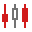 <a href="icons/svgimages/chart/charttype/candlestick.svg"><code>candlestick.svg</code></a></td>
    <td align="center" valign="top" width="12.5%"> <a href="icons/svgimages/chart/charttype/doughnut.svg"><code>doughnut.svg</code></a></td>
    <td align="center" valign="top" width="12.5%"> <a href="icons/svgimages/chart/charttype/doughnut3d.svg"><code>doughnut3d.svg</code></a></td>
    <td align="center" valign="top" width="12.5%"> <a href="icons/svgimages/chart/charttype/funnel.svg"><code>funnel.svg</code></a></td>
    <td align="center" valign="top" width="12.5%"> <a href="icons/svgimages/chart/charttype/funnel3d.svg"><code>funnel3d.svg</code></a></td>
    <td align="center" valign="top" width="12.5%"> <a href="icons/svgimages/chart/charttype/gantt.svg"><code>gantt.svg</code></a></td>
  </tr>
  <tr>
    <td align="center" valign="top" width="12.5%"> <a href="icons/svgimages/chart/charttype/histogram.svg"><code>histogram.svg</code></a></td>
    <td align="center" valign="top" width="12.5%"> <a href="icons/svgimages/chart/charttype/line.svg"><code>line.svg</code></a></td>
    <td align="center" valign="top" width="12.5%"> <a href="icons/svgimages/chart/charttype/line3d.svg"><code>line3d.svg</code></a></td>
    <td align="center" valign="top" width="12.5%"> <a href="icons/svgimages/chart/charttype/line3dstacked.svg"><code>line3dstacked.svg</code></a></td>
    <td align="center" valign="top" width="12.5%"> <a href="icons/svgimages/chart/charttype/line3dstacked100.svg"><code>line3dstacked100.svg</code></a></td>
    <td align="center" valign="top" width="12.5%"> <a href="icons/svgimages/chart/charttype/linestacked.svg"><code>linestacked.svg</code></a></td>
    <td align="center" valign="top" width="12.5%"> <a href="icons/svgimages/chart/charttype/linestacked100.svg"><code>linestacked100.svg</code></a></td>
    <td align="center" valign="top" width="12.5%"> <a href="icons/svgimages/chart/charttype/manhattanbar.svg"><code>manhattanbar.svg</code></a></td>
  </tr>
  <tr>
    <td align="center" valign="top" width="12.5%"> <a href="icons/svgimages/chart/charttype/nesteddoughnut.svg"><code>nesteddoughnut.svg</code></a></td>
    <td align="center" valign="top" width="12.5%"> <a href="icons/svgimages/chart/charttype/pareto.svg"><code>pareto.svg</code></a></td>
    <td align="center" valign="top" width="12.5%"> <a href="icons/svgimages/chart/charttype/pie.svg"><code>pie.svg</code></a></td>
    <td align="center" valign="top" width="12.5%"> <a href="icons/svgimages/chart/charttype/pie3d.svg"><code>pie3d.svg</code></a></td>
    <td align="center" valign="top" width="12.5%"> <a href="icons/svgimages/chart/charttype/point.svg"><code>point.svg</code></a></td>
    <td align="center" valign="top" width="12.5%"> <a href="icons/svgimages/chart/charttype/point3d.svg"><code>point3d.svg</code></a></td>
    <td align="center" valign="top" width="12.5%"> <a href="icons/svgimages/chart/charttype/polararea.svg"><code>polararea.svg</code></a></td>
    <td align="center" valign="top" width="12.5%"> <a href="icons/svgimages/chart/charttype/polarline.svg"><code>polarline.svg</code></a></td>
  </tr>
  <tr>
    <td align="center" valign="top" width="12.5%"> <a href="icons/svgimages/chart/charttype/polarpoint.svg"><code>polarpoint.svg</code></a></td>
    <td align="center" valign="top" width="12.5%"> <a href="icons/svgimages/chart/charttype/polarrangearea.svg"><code>polarrangearea.svg</code></a></td>
    <td align="center" valign="top" width="12.5%"> <a href="icons/svgimages/chart/charttype/radararea.svg"><code>radararea.svg</code></a></td>
    <td align="center" valign="top" width="12.5%"> <a href="icons/svgimages/chart/charttype/radarline.svg"><code>radarline.svg</code></a></td>
    <td align="center" valign="top" width="12.5%"> <a href="icons/svgimages/chart/charttype/radarpoint.svg"><code>radarpoint.svg</code></a></td>
    <td align="center" valign="top" width="12.5%"> <a href="icons/svgimages/chart/charttype/radarrangearea.svg"><code>radarrangearea.svg</code></a></td>
    <td align="center" valign="top" width="12.5%"> <a href="icons/svgimages/chart/charttype/rangearea.svg"><code>rangearea.svg</code></a></td>
    <td align="center" valign="top" width="12.5%"> <a href="icons/svgimages/chart/charttype/rangearea3d.svg"><code>rangearea3d.svg</code></a></td>
  </tr>
  <tr>
    <td align="center" valign="top" width="12.5%"> <a href="icons/svgimages/chart/charttype/rangebar.svg"><code>rangebar.svg</code></a></td>
    <td align="center" valign="top" width="12.5%"> <a href="icons/svgimages/chart/charttype/scatterline.svg"><code>scatterline.svg</code></a></td>
    <td align="center" valign="top" width="12.5%"> <a href="icons/svgimages/chart/charttype/scatterpolarline.svg"><code>scatterpolarline.svg</code></a></td>
    <td align="center" valign="top" width="12.5%"> <a href="icons/svgimages/chart/charttype/scatterradarline.svg"><code>scatterradarline.svg</code></a></td>
    <td align="center" valign="top" width="12.5%"> <a href="icons/svgimages/chart/charttype/sidebysidebar3dstacked.svg"><code>sidebysidebar3dstacked.svg</code></a></td>
    <td align="center" valign="top" width="12.5%"> <a href="icons/svgimages/chart/charttype/sidebysidebar3dstacked100.svg"><code>sidebysidebar3dstacked100.svg</code></a></td>
    <td align="center" valign="top" width="12.5%"> <a href="icons/svgimages/chart/charttype/sidebysidebarstacked.svg"><code>sidebysidebarstacked.svg</code></a></td>
    <td align="center" valign="top" width="12.5%"> <a href="icons/svgimages/chart/charttype/sidebysidebarstacked100.svg"><code>sidebysidebarstacked100.svg</code></a></td>
  </tr>
  <tr>
    <td align="center" valign="top" width="12.5%"> <a href="icons/svgimages/chart/charttype/sidebysidegantt.svg"><code>sidebysidegantt.svg</code></a></td>
    <td align="center" valign="top" width="12.5%"> <a href="icons/svgimages/chart/charttype/sidebysiderangebar.svg"><code>sidebysiderangebar.svg</code></a></td>
    <td align="center" valign="top" width="12.5%"> <a href="icons/svgimages/chart/charttype/spline.svg"><code>spline.svg</code></a></td>
    <td align="center" valign="top" width="12.5%"> <a href="icons/svgimages/chart/charttype/spline3d.svg"><code>spline3d.svg</code></a></td>
    <td align="center" valign="top" width="12.5%"> <a href="icons/svgimages/chart/charttype/splinearea.svg"><code>splinearea.svg</code></a></td>
    <td align="center" valign="top" width="12.5%"> <a href="icons/svgimages/chart/charttype/splinearea3d.svg"><code>splinearea3d.svg</code></a></td>
    <td align="center" valign="top" width="12.5%"> <a href="icons/svgimages/chart/charttype/splinearea3dstacked.svg"><code>splinearea3dstacked.svg</code></a></td>
    <td align="center" valign="top" width="12.5%"> <a href="icons/svgimages/chart/charttype/splinearea3dstacked100.svg"><code>splinearea3dstacked100.svg</code></a></td>
  </tr>
  <tr>
    <td align="center" valign="top" width="12.5%"> <a href="icons/svgimages/chart/charttype/splineareastacked.svg"><code>splineareastacked.svg</code></a></td>
    <td align="center" valign="top" width="12.5%"> <a href="icons/svgimages/chart/charttype/splineareastacked100.svg"><code>splineareastacked100.svg</code></a></td>
    <td align="center" valign="top" width="12.5%"> <a href="icons/svgimages/chart/charttype/steparea.svg"><code>steparea.svg</code></a></td>
    <td align="center" valign="top" width="12.5%"> <a href="icons/svgimages/chart/charttype/steparea3d.svg"><code>steparea3d.svg</code></a></td>
    <td align="center" valign="top" width="12.5%"> <a href="icons/svgimages/chart/charttype/stepline.svg"><code>stepline.svg</code></a></td>
    <td align="center" valign="top" width="12.5%"> <a href="icons/svgimages/chart/charttype/stepline3d.svg"><code>stepline3d.svg</code></a></td>
    <td align="center" valign="top" width="12.5%"> <a href="icons/svgimages/chart/charttype/stock.svg"><code>stock.svg</code></a></td>
    <td align="center" valign="top" width="12.5%"> <a href="icons/svgimages/chart/charttype/sunburst.svg"><code>sunburst.svg</code></a></td>
  </tr>
  <tr>
    <td align="center" valign="top" width="12.5%">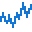 <a href="icons/svgimages/chart/charttype/swiftplot.svg"><code>swiftplot.svg</code></a></td>
    <td align="center" valign="top" width="12.5%"> <a href="icons/svgimages/chart/charttype/waterfall.svg"><code>waterfall.svg</code></a></td>
    <td align="center" valign="top" width="12.5%"> <a href="icons/svgimages/chart/heatmap.svg"><code>heatmap.svg</code></a></td>
    <td align="center" valign="top" width="12.5%"> <a href="icons/svgimages/chart/sankey.svg"><code>sankey.svg</code></a></td>
    <td align="center" valign="top" width="12.5%"> <a href="icons/svgimages/chart/treemap.svg"><code>treemap.svg</code></a></td>
    <td></td>
    <td></td>
    <td></td>
  </tr>
</table>

### comments

Liczba ikon: 3

<table>
  <tr>
    <td align="center" valign="top" width="12.5%"> <a href="icons/svgimages/comments/deletecomment.svg"><code>deletecomment.svg</code></a></td>
    <td align="center" valign="top" width="12.5%"> <a href="icons/svgimages/comments/nextcomment.svg"><code>nextcomment.svg</code></a></td>
    <td align="center" valign="top" width="12.5%"> <a href="icons/svgimages/comments/previouscomment.svg"><code>previouscomment.svg</code></a></td>
    <td></td>
    <td></td>
    <td></td>
    <td></td>
    <td></td>
  </tr>
</table>

### content

Liczba ikon: 2

<table>
  <tr>
    <td align="center" valign="top" width="12.5%"> <a href="icons/svgimages/content/barcode.svg"><code>barcode.svg</code></a></td>
    <td align="center" valign="top" width="12.5%"> <a href="icons/svgimages/content/checkbox.svg"><code>checkbox.svg</code></a></td>
    <td></td>
    <td></td>
    <td></td>
    <td></td>
    <td></td>
    <td></td>
  </tr>
</table>

### dashboards

Liczba ikon: 214

<table>
  <tr>
    <td align="center" valign="top" width="12.5%"> <a href="icons/svgimages/dashboards/addcalculatedfield.svg"><code>addcalculatedfield.svg</code></a></td>
    <td align="center" valign="top" width="12.5%">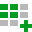 <a href="icons/svgimages/dashboards/addquery.svg"><code>addquery.svg</code></a></td>
    <td align="center" valign="top" width="12.5%"> <a href="icons/svgimages/dashboards/alignmentbottomcenter.svg"><code>alignmentbottomcenter.svg</code></a></td>
    <td align="center" valign="top" width="12.5%"> <a href="icons/svgimages/dashboards/alignmentbottomleft.svg"><code>alignmentbottomleft.svg</code></a></td>
    <td align="center" valign="top" width="12.5%"> <a href="icons/svgimages/dashboards/alignmentbottomright.svg"><code>alignmentbottomright.svg</code></a></td>
    <td align="center" valign="top" width="12.5%"> <a href="icons/svgimages/dashboards/alignmentcentercenter.svg"><code>alignmentcentercenter.svg</code></a></td>
    <td align="center" valign="top" width="12.5%"> <a href="icons/svgimages/dashboards/alignmentcenterleft.svg"><code>alignmentcenterleft.svg</code></a></td>
    <td align="center" valign="top" width="12.5%"> <a href="icons/svgimages/dashboards/alignmentcenterright.svg"><code>alignmentcenterright.svg</code></a></td>
  </tr>
  <tr>
    <td align="center" valign="top" width="12.5%"> <a href="icons/svgimages/dashboards/alignmenttopcenter.svg"><code>alignmenttopcenter.svg</code></a></td>
    <td align="center" valign="top" width="12.5%"> <a href="icons/svgimages/dashboards/alignmenttopleft.svg"><code>alignmenttopleft.svg</code></a></td>
    <td align="center" valign="top" width="12.5%"> <a href="icons/svgimages/dashboards/alignmenttopright.svg"><code>alignmenttopright.svg</code></a></td>
    <td align="center" valign="top" width="12.5%"> <a href="icons/svgimages/dashboards/arrangeincolumns.svg"><code>arrangeincolumns.svg</code></a></td>
    <td align="center" valign="top" width="12.5%"> <a href="icons/svgimages/dashboards/arrangeinrows.svg"><code>arrangeinrows.svg</code></a></td>
    <td align="center" valign="top" width="12.5%"> <a href="icons/svgimages/dashboards/autoarrange.svg"><code>autoarrange.svg</code></a></td>
    <td align="center" valign="top" width="12.5%"> <a href="icons/svgimages/dashboards/autoexpand.svg"><code>autoexpand.svg</code></a></td>
    <td align="center" valign="top" width="12.5%"> <a href="icons/svgimages/dashboards/autofittocontents.svg"><code>autofittocontents.svg</code></a></td>
  </tr>
  <tr>
    <td align="center" valign="top" width="12.5%"> <a href="icons/svgimages/dashboards/autofittogrid.svg"><code>autofittogrid.svg</code></a></td>
    <td align="center" valign="top" width="12.5%"> <a href="icons/svgimages/dashboards/automaticupdates.svg"><code>automaticupdates.svg</code></a></td>
    <td align="center" valign="top" width="12.5%"> <a href="icons/svgimages/dashboards/bandedrows.svg"><code>bandedrows.svg</code></a></td>
    <td align="center" valign="top" width="12.5%"> <a href="icons/svgimages/dashboards/boundimage.svg"><code>boundimage.svg</code></a></td>
    <td align="center" valign="top" width="12.5%"> <a href="icons/svgimages/dashboards/cards.svg"><code>cards.svg</code></a></td>
    <td align="center" valign="top" width="12.5%"> <a href="icons/svgimages/dashboards/changechartseriestype.svg"><code>changechartseriestype.svg</code></a></td>
    <td align="center" valign="top" width="12.5%"> <a href="icons/svgimages/dashboards/changelegendposition.svg"><code>changelegendposition.svg</code></a></td>
    <td align="center" valign="top" width="12.5%"> <a href="icons/svgimages/dashboards/chart.svg"><code>chart.svg</code></a></td>
  </tr>
  <tr>
    <td align="center" valign="top" width="12.5%"> <a href="icons/svgimages/dashboards/chartarea.svg"><code>chartarea.svg</code></a></td>
    <td align="center" valign="top" width="12.5%"> <a href="icons/svgimages/dashboards/chartarguments.svg"><code>chartarguments.svg</code></a></td>
    <td align="center" valign="top" width="12.5%"> <a href="icons/svgimages/dashboards/chartbar.svg"><code>chartbar.svg</code></a></td>
    <td align="center" valign="top" width="12.5%"> <a href="icons/svgimages/dashboards/chartbubble.svg"><code>chartbubble.svg</code></a></td>
    <td align="center" valign="top" width="12.5%"> <a href="icons/svgimages/dashboards/chartfullstackedarea.svg"><code>chartfullstackedarea.svg</code></a></td>
    <td align="center" valign="top" width="12.5%"> <a href="icons/svgimages/dashboards/chartfullstackedbar.svg"><code>chartfullstackedbar.svg</code></a></td>
    <td align="center" valign="top" width="12.5%"> <a href="icons/svgimages/dashboards/chartfullstackedline.svg"><code>chartfullstackedline.svg</code></a></td>
    <td align="center" valign="top" width="12.5%"> <a href="icons/svgimages/dashboards/chartfullstackedsplinearea.svg"><code>chartfullstackedsplinearea.svg</code></a></td>
  </tr>
  <tr>
    <td align="center" valign="top" width="12.5%"> <a href="icons/svgimages/dashboards/chartline.svg"><code>chartline.svg</code></a></td>
    <td align="center" valign="top" width="12.5%">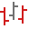 <a href="icons/svgimages/dashboards/chartopenhighlowclosestock.svg"><code>chartopenhighlowclosestock.svg</code></a></td>
    <td align="center" valign="top" width="12.5%"> <a href="icons/svgimages/dashboards/chartpoint.svg"><code>chartpoint.svg</code></a></td>
    <td align="center" valign="top" width="12.5%"> <a href="icons/svgimages/dashboards/chartpoints.svg"><code>chartpoints.svg</code></a></td>
    <td align="center" valign="top" width="12.5%"> <a href="icons/svgimages/dashboards/chartrangearea.svg"><code>chartrangearea.svg</code></a></td>
    <td align="center" valign="top" width="12.5%"> <a href="icons/svgimages/dashboards/chartseries.svg"><code>chartseries.svg</code></a></td>
    <td align="center" valign="top" width="12.5%"> <a href="icons/svgimages/dashboards/chartsidebysiderangebar.svg"><code>chartsidebysiderangebar.svg</code></a></td>
    <td align="center" valign="top" width="12.5%"> <a href="icons/svgimages/dashboards/chartsplinearea.svg"><code>chartsplinearea.svg</code></a></td>
  </tr>
  <tr>
    <td align="center" valign="top" width="12.5%"> <a href="icons/svgimages/dashboards/chartstackedarea.svg"><code>chartstackedarea.svg</code></a></td>
    <td align="center" valign="top" width="12.5%"> <a href="icons/svgimages/dashboards/chartstackedbar.svg"><code>chartstackedbar.svg</code></a></td>
    <td align="center" valign="top" width="12.5%"> <a href="icons/svgimages/dashboards/chartstackedline.svg"><code>chartstackedline.svg</code></a></td>
    <td align="center" valign="top" width="12.5%"> <a href="icons/svgimages/dashboards/chartstackedsplinearea.svg"><code>chartstackedsplinearea.svg</code></a></td>
    <td align="center" valign="top" width="12.5%"> <a href="icons/svgimages/dashboards/chartsteparea.svg"><code>chartsteparea.svg</code></a></td>
    <td align="center" valign="top" width="12.5%"> <a href="icons/svgimages/dashboards/chartstepline.svg"><code>chartstepline.svg</code></a></td>
    <td align="center" valign="top" width="12.5%"> <a href="icons/svgimages/dashboards/chartstockhighlowclose.svg"><code>chartstockhighlowclose.svg</code></a></td>
    <td align="center" valign="top" width="12.5%"> <a href="icons/svgimages/dashboards/chartstockopenhighlowclose.svg"><code>chartstockopenhighlowclose.svg</code></a></td>
  </tr>
  <tr>
    <td align="center" valign="top" width="12.5%"> <a href="icons/svgimages/dashboards/choroplethmap.svg"><code>choroplethmap.svg</code></a></td>
    <td align="center" valign="top" width="12.5%"> <a href="icons/svgimages/dashboards/clearfilter.svg"><code>clearfilter.svg</code></a></td>
    <td align="center" valign="top" width="12.5%"> <a href="icons/svgimages/dashboards/clip.svg"><code>clip.svg</code></a></td>
    <td align="center" valign="top" width="12.5%"> <a href="icons/svgimages/dashboards/columnheaders.svg"><code>columnheaders.svg</code></a></td>
    <td align="center" valign="top" width="12.5%"> <a href="icons/svgimages/dashboards/columntotalsposition.svg"><code>columntotalsposition.svg</code></a></td>
    <td align="center" valign="top" width="12.5%"> <a href="icons/svgimages/dashboards/convertto.svg"><code>convertto.svg</code></a></td>
    <td align="center" valign="top" width="12.5%"> <a href="icons/svgimages/dashboards/crossdatasourcefiltering.svg"><code>crossdatasourcefiltering.svg</code></a></td>
    <td align="center" valign="top" width="12.5%"> <a href="icons/svgimages/dashboards/currency.svg"><code>currency.svg</code></a></td>
  </tr>
  <tr>
    <td align="center" valign="top" width="12.5%"> <a href="icons/svgimages/dashboards/dashboarddesigner.svg"><code>dashboarddesigner.svg</code></a></td>
    <td align="center" valign="top" width="12.5%"> <a href="icons/svgimages/dashboards/datalabels.svg"><code>datalabels.svg</code></a></td>
    <td align="center" valign="top" width="12.5%"> <a href="icons/svgimages/dashboards/datalabelsposition.svg"><code>datalabelsposition.svg</code></a></td>
    <td align="center" valign="top" width="12.5%"> <a href="icons/svgimages/dashboards/defaultmap.svg"><code>defaultmap.svg</code></a></td>
    <td align="center" valign="top" width="12.5%"> <a href="icons/svgimages/dashboards/delete.svg"><code>delete.svg</code></a></td>
    <td align="center" valign="top" width="12.5%"> <a href="icons/svgimages/dashboards/deletedatasource.svg"><code>deletedatasource.svg</code></a></td>
    <td align="center" valign="top" width="12.5%"> <a href="icons/svgimages/dashboards/deletequery.svg"><code>deletequery.svg</code></a></td>
    <td align="center" valign="top" width="12.5%"> <a href="icons/svgimages/dashboards/displayitemaspage.svg"><code>displayitemaspage.svg</code></a></td>
  </tr>
  <tr>
    <td align="center" valign="top" width="12.5%"> <a href="icons/svgimages/dashboards/doughnut.svg"><code>doughnut.svg</code></a></td>
    <td align="center" valign="top" width="12.5%"> <a href="icons/svgimages/dashboards/drilldown.svg"><code>drilldown.svg</code></a></td>
    <td align="center" valign="top" width="12.5%"> <a href="icons/svgimages/dashboards/duplicate.svg"><code>duplicate.svg</code></a></td>
    <td align="center" valign="top" width="12.5%"> <a href="icons/svgimages/dashboards/edit.svg"><code>edit.svg</code></a></td>
    <td align="center" valign="top" width="12.5%"> <a href="icons/svgimages/dashboards/editcolors.svg"><code>editcolors.svg</code></a></td>
    <td align="center" valign="top" width="12.5%"> <a href="icons/svgimages/dashboards/editconnection.svg"><code>editconnection.svg</code></a></td>
    <td align="center" valign="top" width="12.5%"> <a href="icons/svgimages/dashboards/editdatasource.svg"><code>editdatasource.svg</code></a></td>
    <td align="center" valign="top" width="12.5%"> <a href="icons/svgimages/dashboards/editdatetimeperiods.svg"><code>editdatetimeperiods.svg</code></a></td>
  </tr>
  <tr>
    <td align="center" valign="top" width="12.5%"> <a href="icons/svgimages/dashboards/editextractsource.svg"><code>editextractsource.svg</code></a></td>
    <td align="center" valign="top" width="12.5%"> <a href="icons/svgimages/dashboards/editfilter.svg"><code>editfilter.svg</code></a></td>
    <td align="center" valign="top" width="12.5%"> <a href="icons/svgimages/dashboards/editnames.svg"><code>editnames.svg</code></a></td>
    <td align="center" valign="top" width="12.5%"> <a href="icons/svgimages/dashboards/editquery.svg"><code>editquery.svg</code></a></td>
    <td align="center" valign="top" width="12.5%"> <a href="icons/svgimages/dashboards/editrules.svg"><code>editrules.svg</code></a></td>
    <td align="center" valign="top" width="12.5%"> <a href="icons/svgimages/dashboards/enableclustering.svg"><code>enableclustering.svg</code></a></td>
    <td align="center" valign="top" width="12.5%"> <a href="icons/svgimages/dashboards/enablesearch.svg"><code>enablesearch.svg</code></a></td>
    <td align="center" valign="top" width="12.5%"> <a href="icons/svgimages/dashboards/filterelements.svg"><code>filterelements.svg</code></a></td>
  </tr>
  <tr>
    <td align="center" valign="top" width="12.5%"> <a href="icons/svgimages/dashboards/filterquery.svg"><code>filterquery.svg</code></a></td>
    <td align="center" valign="top" width="12.5%"> <a href="icons/svgimages/dashboards/fullextent.svg"><code>fullextent.svg</code></a></td>
    <td align="center" valign="top" width="12.5%"> <a href="icons/svgimages/dashboards/gauges.svg"><code>gauges.svg</code></a></td>
    <td align="center" valign="top" width="12.5%"> <a href="icons/svgimages/dashboards/gaugestylefullcircular.svg"><code>gaugestylefullcircular.svg</code></a></td>
    <td align="center" valign="top" width="12.5%"> <a href="icons/svgimages/dashboards/gaugestylehalfcircular.svg"><code>gaugestylehalfcircular.svg</code></a></td>
    <td align="center" valign="top" width="12.5%"> <a href="icons/svgimages/dashboards/gaugestyleleftquartercircular.svg"><code>gaugestyleleftquartercircular.svg</code></a></td>
    <td align="center" valign="top" width="12.5%"> <a href="icons/svgimages/dashboards/gaugestylelinearhorizontal.svg"><code>gaugestylelinearhorizontal.svg</code></a></td>
    <td align="center" valign="top" width="12.5%"> <a href="icons/svgimages/dashboards/gaugestylelinearvertical.svg"><code>gaugestylelinearvertical.svg</code></a></td>
  </tr>
  <tr>
    <td align="center" valign="top" width="12.5%"> <a href="icons/svgimages/dashboards/gaugestylerightquartercircular.svg"><code>gaugestylerightquartercircular.svg</code></a></td>
    <td align="center" valign="top" width="12.5%"> <a href="icons/svgimages/dashboards/gaugestylethreefourthcircular.svg"><code>gaugestylethreefourthcircular.svg</code></a></td>
    <td align="center" valign="top" width="12.5%"> <a href="icons/svgimages/dashboards/geopointmaps.svg"><code>geopointmaps.svg</code></a></td>
    <td align="center" valign="top" width="12.5%"> <a href="icons/svgimages/dashboards/globalcolors.svg"><code>globalcolors.svg</code></a></td>
    <td align="center" valign="top" width="12.5%"> <a href="icons/svgimages/dashboards/grandtotals.svg"><code>grandtotals.svg</code></a></td>
    <td align="center" valign="top" width="12.5%"> <a href="icons/svgimages/dashboards/grid.svg"><code>grid.svg</code></a></td>
    <td align="center" valign="top" width="12.5%"> <a href="icons/svgimages/dashboards/gridclearsorting.svg"><code>gridclearsorting.svg</code></a></td>
    <td align="center" valign="top" width="12.5%">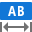 <a href="icons/svgimages/dashboards/gridcolumnfittocontent.svg"><code>gridcolumnfittocontent.svg</code></a></td>
  </tr>
  <tr>
    <td align="center" valign="top" width="12.5%"> <a href="icons/svgimages/dashboards/gridcolumnfixedwidth.svg"><code>gridcolumnfixedwidth.svg</code></a></td>
    <td align="center" valign="top" width="12.5%"> <a href="icons/svgimages/dashboards/gridcolumnwidth.svg"><code>gridcolumnwidth.svg</code></a></td>
    <td align="center" valign="top" width="12.5%"> <a href="icons/svgimages/dashboards/gridresetcolumnwidths.svg"><code>gridresetcolumnwidths.svg</code></a></td>
    <td align="center" valign="top" width="12.5%"> <a href="icons/svgimages/dashboards/gridsortascending.svg"><code>gridsortascending.svg</code></a></td>
    <td align="center" valign="top" width="12.5%"> <a href="icons/svgimages/dashboards/gridsortdescending.svg"><code>gridsortdescending.svg</code></a></td>
    <td align="center" valign="top" width="12.5%"> <a href="icons/svgimages/dashboards/group.svg"><code>group.svg</code></a></td>
    <td align="center" valign="top" width="12.5%"> <a href="icons/svgimages/dashboards/grouplabels.svg"><code>grouplabels.svg</code></a></td>
    <td align="center" valign="top" width="12.5%"> <a href="icons/svgimages/dashboards/grouptooltips.svg"><code>grouptooltips.svg</code></a></td>
  </tr>
  <tr>
    <td align="center" valign="top" width="12.5%"> <a href="icons/svgimages/dashboards/horizontallines.svg"><code>horizontallines.svg</code></a></td>
    <td align="center" valign="top" width="12.5%"> <a href="icons/svgimages/dashboards/ignoremasterfilters.svg"><code>ignoremasterfilters.svg</code></a></td>
    <td align="center" valign="top" width="12.5%"> <a href="icons/svgimages/dashboards/imageimport.svg"><code>imageimport.svg</code></a></td>
    <td align="center" valign="top" width="12.5%"> <a href="icons/svgimages/dashboards/imageload.svg"><code>imageload.svg</code></a></td>
    <td align="center" valign="top" width="12.5%"> <a href="icons/svgimages/dashboards/images.svg"><code>images.svg</code></a></td>
    <td align="center" valign="top" width="12.5%"> <a href="icons/svgimages/dashboards/importmap.svg"><code>importmap.svg</code></a></td>
    <td align="center" valign="top" width="12.5%"> <a href="icons/svgimages/dashboards/initialstate.svg"><code>initialstate.svg</code></a></td>
    <td align="center" valign="top" width="12.5%"> <a href="icons/svgimages/dashboards/insertbubblemap.svg"><code>insertbubblemap.svg</code></a></td>
  </tr>
  <tr>
    <td align="center" valign="top" width="12.5%"> <a href="icons/svgimages/dashboards/insertcombobox.svg"><code>insertcombobox.svg</code></a></td>
    <td align="center" valign="top" width="12.5%"> <a href="icons/svgimages/dashboards/insertfield.svg"><code>insertfield.svg</code></a></td>
    <td align="center" valign="top" width="12.5%"> <a href="icons/svgimages/dashboards/insertlistbox.svg"><code>insertlistbox.svg</code></a></td>
    <td align="center" valign="top" width="12.5%"> <a href="icons/svgimages/dashboards/insertpiemap.svg"><code>insertpiemap.svg</code></a></td>
    <td align="center" valign="top" width="12.5%"> <a href="icons/svgimages/dashboards/inserttabcontainer.svg"><code>inserttabcontainer.svg</code></a></td>
    <td align="center" valign="top" width="12.5%"> <a href="icons/svgimages/dashboards/inserttreeview.svg"><code>inserttreeview.svg</code></a></td>
    <td align="center" valign="top" width="12.5%"> <a href="icons/svgimages/dashboards/itemtypechecked.svg"><code>itemtypechecked.svg</code></a></td>
    <td align="center" valign="top" width="12.5%">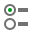 <a href="icons/svgimages/dashboards/itemtypestandard.svg"><code>itemtypestandard.svg</code></a></td>
  </tr>
  <tr>
    <td align="center" valign="top" width="12.5%"> <a href="icons/svgimages/dashboards/layout.svg"><code>layout.svg</code></a></td>
    <td align="center" valign="top" width="12.5%"> <a href="icons/svgimages/dashboards/layoutdirection.svg"><code>layoutdirection.svg</code></a></td>
    <td align="center" valign="top" width="12.5%"> <a href="icons/svgimages/dashboards/loadmap.svg"><code>loadmap.svg</code></a></td>
    <td align="center" valign="top" width="12.5%"> <a href="icons/svgimages/dashboards/localcolors.svg"><code>localcolors.svg</code></a></td>
    <td align="center" valign="top" width="12.5%"> <a href="icons/svgimages/dashboards/locknavigation.svg"><code>locknavigation.svg</code></a></td>
    <td align="center" valign="top" width="12.5%"> <a href="icons/svgimages/dashboards/manual.svg"><code>manual.svg</code></a></td>
    <td align="center" valign="top" width="12.5%"> <a href="icons/svgimages/dashboards/masterfilter.svg"><code>masterfilter.svg</code></a></td>
    <td align="center" valign="top" width="12.5%"> <a href="icons/svgimages/dashboards/mergecells.svg"><code>mergecells.svg</code></a></td>
  </tr>
  <tr>
    <td align="center" valign="top" width="12.5%"> <a href="icons/svgimages/dashboards/multiplemasterfilter.svg"><code>multiplemasterfilter.svg</code></a></td>
    <td align="center" valign="top" width="12.5%"> <a href="icons/svgimages/dashboards/new.svg"><code>new.svg</code></a></td>
    <td align="center" valign="top" width="12.5%"> <a href="icons/svgimages/dashboards/newdatasource.svg"><code>newdatasource.svg</code></a></td>
    <td align="center" valign="top" width="12.5%"> <a href="icons/svgimages/dashboards/open.svg"><code>open.svg</code></a></td>
    <td align="center" valign="top" width="12.5%"> <a href="icons/svgimages/dashboards/parameters.svg"><code>parameters.svg</code></a></td>
    <td align="center" valign="top" width="12.5%"> <a href="icons/svgimages/dashboards/pie.svg"><code>pie.svg</code></a></td>
    <td align="center" valign="top" width="12.5%"> <a href="icons/svgimages/dashboards/piearguments.svg"><code>piearguments.svg</code></a></td>
    <td align="center" valign="top" width="12.5%"> <a href="icons/svgimages/dashboards/piepoints.svg"><code>piepoints.svg</code></a></td>
  </tr>
  <tr>
    <td align="center" valign="top" width="12.5%"> <a href="icons/svgimages/dashboards/pies.svg"><code>pies.svg</code></a></td>
    <td align="center" valign="top" width="12.5%"> <a href="icons/svgimages/dashboards/pieseries.svg"><code>pieseries.svg</code></a></td>
    <td align="center" valign="top" width="12.5%"> <a href="icons/svgimages/dashboards/pinbutton.svg"><code>pinbutton.svg</code></a></td>
    <td align="center" valign="top" width="12.5%"> <a href="icons/svgimages/dashboards/pivot.svg"><code>pivot.svg</code></a></td>
    <td align="center" valign="top" width="12.5%"> <a href="icons/svgimages/dashboards/print.svg"><code>print.svg</code></a></td>
    <td align="center" valign="top" width="12.5%"> <a href="icons/svgimages/dashboards/rangefilter.svg"><code>rangefilter.svg</code></a></td>
    <td align="center" valign="top" width="12.5%"> <a href="icons/svgimages/dashboards/redo.svg"><code>redo.svg</code></a></td>
    <td align="center" valign="top" width="12.5%"> <a href="icons/svgimages/dashboards/relations.svg"><code>relations.svg</code></a></td>
  </tr>
  <tr>
    <td align="center" valign="top" width="12.5%"> <a href="icons/svgimages/dashboards/removedataitems.svg"><code>removedataitems.svg</code></a></td>
    <td align="center" valign="top" width="12.5%"> <a href="icons/svgimages/dashboards/renamedatasource.svg"><code>renamedatasource.svg</code></a></td>
    <td align="center" valign="top" width="12.5%"> <a href="icons/svgimages/dashboards/renamequery.svg"><code>renamequery.svg</code></a></td>
    <td align="center" valign="top" width="12.5%"> <a href="icons/svgimages/dashboards/reordertabs.svg"><code>reordertabs.svg</code></a></td>
    <td align="center" valign="top" width="12.5%"> <a href="icons/svgimages/dashboards/resetlayoutoptions.svg"><code>resetlayoutoptions.svg</code></a></td>
    <td align="center" valign="top" width="12.5%"> <a href="icons/svgimages/dashboards/rotate.svg"><code>rotate.svg</code></a></td>
    <td align="center" valign="top" width="12.5%">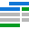 <a href="icons/svgimages/dashboards/rowtotalsposition.svg"><code>rowtotalsposition.svg</code></a></td>
    <td align="center" valign="top" width="12.5%"> <a href="icons/svgimages/dashboards/scatterchart.svg"><code>scatterchart.svg</code></a></td>
  </tr>
  <tr>
    <td align="center" valign="top" width="12.5%"> <a href="icons/svgimages/dashboards/scatterchartlabeloptions.svg"><code>scatterchartlabeloptions.svg</code></a></td>
    <td align="center" valign="top" width="12.5%"> <a href="icons/svgimages/dashboards/servermode.svg"><code>servermode.svg</code></a></td>
    <td align="center" valign="top" width="12.5%"> <a href="icons/svgimages/dashboards/shapelabels.svg"><code>shapelabels.svg</code></a></td>
    <td align="center" valign="top" width="12.5%"> <a href="icons/svgimages/dashboards/showallvalue.svg"><code>showallvalue.svg</code></a></td>
    <td align="center" valign="top" width="12.5%"> <a href="icons/svgimages/dashboards/showcaption.svg"><code>showcaption.svg</code></a></td>
    <td align="center" valign="top" width="12.5%"> <a href="icons/svgimages/dashboards/showgaugecaptions.svg"><code>showgaugecaptions.svg</code></a></td>
    <td align="center" valign="top" width="12.5%"> <a href="icons/svgimages/dashboards/showlegend.svg"><code>showlegend.svg</code></a></td>
    <td align="center" valign="top" width="12.5%"> <a href="icons/svgimages/dashboards/showlegendinsidehorizontalbottomcenter.svg"><code>showlegendinsidehorizontalbottomcenter.svg</code></a></td>
  </tr>
  <tr>
    <td align="center" valign="top" width="12.5%"> <a href="icons/svgimages/dashboards/showlegendinsidehorizontalbottomleft.svg"><code>showlegendinsidehorizontalbottomleft.svg</code></a></td>
    <td align="center" valign="top" width="12.5%"> <a href="icons/svgimages/dashboards/showlegendinsidehorizontalbottomright.svg"><code>showlegendinsidehorizontalbottomright.svg</code></a></td>
    <td align="center" valign="top" width="12.5%"> <a href="icons/svgimages/dashboards/showlegendinsidehorizontaltopcenter.svg"><code>showlegendinsidehorizontaltopcenter.svg</code></a></td>
    <td align="center" valign="top" width="12.5%"> <a href="icons/svgimages/dashboards/showlegendinsidehorizontaltopleft.svg"><code>showlegendinsidehorizontaltopleft.svg</code></a></td>
    <td align="center" valign="top" width="12.5%"> <a href="icons/svgimages/dashboards/showlegendinsidehorizontaltopright.svg"><code>showlegendinsidehorizontaltopright.svg</code></a></td>
    <td align="center" valign="top" width="12.5%"> <a href="icons/svgimages/dashboards/showlegendinsideverticalbottomleft.svg"><code>showlegendinsideverticalbottomleft.svg</code></a></td>
    <td align="center" valign="top" width="12.5%"> <a href="icons/svgimages/dashboards/showlegendinsideverticalbottomright.svg"><code>showlegendinsideverticalbottomright.svg</code></a></td>
    <td align="center" valign="top" width="12.5%"> <a href="icons/svgimages/dashboards/showlegendinsideverticalcenterleft.svg"><code>showlegendinsideverticalcenterleft.svg</code></a></td>
  </tr>
  <tr>
    <td align="center" valign="top" width="12.5%"> <a href="icons/svgimages/dashboards/showlegendinsideverticalcenterright.svg"><code>showlegendinsideverticalcenterright.svg</code></a></td>
    <td align="center" valign="top" width="12.5%"> <a href="icons/svgimages/dashboards/showlegendinsideverticaltopleft.svg"><code>showlegendinsideverticaltopleft.svg</code></a></td>
    <td align="center" valign="top" width="12.5%"> <a href="icons/svgimages/dashboards/showlegendinsideverticaltopright.svg"><code>showlegendinsideverticaltopright.svg</code></a></td>
    <td align="center" valign="top" width="12.5%"> <a href="icons/svgimages/dashboards/showlegendoutsidehorizontalbottomcenter.svg"><code>showlegendoutsidehorizontalbottomcenter.svg</code></a></td>
    <td align="center" valign="top" width="12.5%"> <a href="icons/svgimages/dashboards/showlegendoutsidehorizontalbottomleft.svg"><code>showlegendoutsidehorizontalbottomleft.svg</code></a></td>
    <td align="center" valign="top" width="12.5%"> <a href="icons/svgimages/dashboards/showlegendoutsidehorizontalbottomright.svg"><code>showlegendoutsidehorizontalbottomright.svg</code></a></td>
    <td align="center" valign="top" width="12.5%"> <a href="icons/svgimages/dashboards/showlegendoutsidehorizontaltopcenter.svg"><code>showlegendoutsidehorizontaltopcenter.svg</code></a></td>
    <td align="center" valign="top" width="12.5%"> <a href="icons/svgimages/dashboards/showlegendoutsidehorizontaltopleft.svg"><code>showlegendoutsidehorizontaltopleft.svg</code></a></td>
  </tr>
  <tr>
    <td align="center" valign="top" width="12.5%"> <a href="icons/svgimages/dashboards/showlegendoutsidehorizontaltopright.svg"><code>showlegendoutsidehorizontaltopright.svg</code></a></td>
    <td align="center" valign="top" width="12.5%"> <a href="icons/svgimages/dashboards/showlegendoutsideverticalbottomleft.svg"><code>showlegendoutsideverticalbottomleft.svg</code></a></td>
    <td align="center" valign="top" width="12.5%"> <a href="icons/svgimages/dashboards/showlegendoutsideverticalbottomright.svg"><code>showlegendoutsideverticalbottomright.svg</code></a></td>
    <td align="center" valign="top" width="12.5%"> <a href="icons/svgimages/dashboards/showlegendoutsideverticaltopleft.svg"><code>showlegendoutsideverticaltopleft.svg</code></a></td>
    <td align="center" valign="top" width="12.5%"> <a href="icons/svgimages/dashboards/showlegendoutsideverticaltopright.svg"><code>showlegendoutsideverticaltopright.svg</code></a></td>
    <td align="center" valign="top" width="12.5%"> <a href="icons/svgimages/dashboards/showpiecaptions.svg"><code>showpiecaptions.svg</code></a></td>
    <td align="center" valign="top" width="12.5%"> <a href="icons/svgimages/dashboards/showweightedlegend.svg"><code>showweightedlegend.svg</code></a></td>
    <td align="center" valign="top" width="12.5%"> <a href="icons/svgimages/dashboards/showweightedlegendnested.svg"><code>showweightedlegendnested.svg</code></a></td>
  </tr>
  <tr>
    <td align="center" valign="top" width="12.5%"> <a href="icons/svgimages/dashboards/showweightedlegendnone.svg"><code>showweightedlegendnone.svg</code></a></td>
    <td align="center" valign="top" width="12.5%"> <a href="icons/svgimages/dashboards/singlemasterfilter.svg"><code>singlemasterfilter.svg</code></a></td>
    <td align="center" valign="top" width="12.5%"> <a href="icons/svgimages/dashboards/sliceanddice.svg"><code>sliceanddice.svg</code></a></td>
    <td align="center" valign="top" width="12.5%"> <a href="icons/svgimages/dashboards/squarified.svg"><code>squarified.svg</code></a></td>
    <td align="center" valign="top" width="12.5%"> <a href="icons/svgimages/dashboards/squeeze.svg"><code>squeeze.svg</code></a></td>
    <td align="center" valign="top" width="12.5%"> <a href="icons/svgimages/dashboards/stretch.svg"><code>stretch.svg</code></a></td>
    <td align="center" valign="top" width="12.5%"> <a href="icons/svgimages/dashboards/striped.svg"><code>striped.svg</code></a></td>
    <td align="center" valign="top" width="12.5%"> <a href="icons/svgimages/dashboards/textbox.svg"><code>textbox.svg</code></a></td>
  </tr>
  <tr>
    <td align="center" valign="top" width="12.5%"> <a href="icons/svgimages/dashboards/tilelabels.svg"><code>tilelabels.svg</code></a></td>
    <td align="center" valign="top" width="12.5%"> <a href="icons/svgimages/dashboards/tiletooltips.svg"><code>tiletooltips.svg</code></a></td>
    <td align="center" valign="top" width="12.5%"> <a href="icons/svgimages/dashboards/title.svg"><code>title.svg</code></a></td>
    <td align="center" valign="top" width="12.5%"> <a href="icons/svgimages/dashboards/tooltips.svg"><code>tooltips.svg</code></a></td>
    <td align="center" valign="top" width="12.5%"> <a href="icons/svgimages/dashboards/totals.svg"><code>totals.svg</code></a></td>
    <td align="center" valign="top" width="12.5%"> <a href="icons/svgimages/dashboards/treemap.svg"><code>treemap.svg</code></a></td>
    <td align="center" valign="top" width="12.5%"> <a href="icons/svgimages/dashboards/treemapbottomlefttoprightdirection.svg"><code>treemapbottomlefttoprightdirection.svg</code></a></td>
    <td align="center" valign="top" width="12.5%"> <a href="icons/svgimages/dashboards/treemapbottomrighttopleftdirection.svg"><code>treemapbottomrighttopleftdirection.svg</code></a></td>
  </tr>
  <tr>
    <td align="center" valign="top" width="12.5%"> <a href="icons/svgimages/dashboards/treemaptopleftbottomrightdirection.svg"><code>treemaptopleftbottomrightdirection.svg</code></a></td>
    <td align="center" valign="top" width="12.5%"> <a href="icons/svgimages/dashboards/treemaptoprighbottomleftdirection.svg"><code>treemaptoprighbottomleftdirection.svg</code></a></td>
    <td align="center" valign="top" width="12.5%"> <a href="icons/svgimages/dashboards/undo.svg"><code>undo.svg</code></a></td>
    <td align="center" valign="top" width="12.5%"> <a href="icons/svgimages/dashboards/unpinbutton.svg"><code>unpinbutton.svg</code></a></td>
    <td align="center" valign="top" width="12.5%"> <a href="icons/svgimages/dashboards/update.svg"><code>update.svg</code></a></td>
    <td align="center" valign="top" width="12.5%"> <a href="icons/svgimages/dashboards/updatedataextract.svg"><code>updatedataextract.svg</code></a></td>
    <td align="center" valign="top" width="12.5%"> <a href="icons/svgimages/dashboards/valuesposition.svg"><code>valuesposition.svg</code></a></td>
    <td align="center" valign="top" width="12.5%"> <a href="icons/svgimages/dashboards/verticallines.svg"><code>verticallines.svg</code></a></td>
  </tr>
  <tr>
    <td align="center" valign="top" width="12.5%"> <a href="icons/svgimages/dashboards/weightedpies.svg"><code>weightedpies.svg</code></a></td>
    <td align="center" valign="top" width="12.5%"> <a href="icons/svgimages/dashboards/wordwrap.svg"><code>wordwrap.svg</code></a></td>
    <td align="center" valign="top" width="12.5%"> <a href="icons/svgimages/dashboards/xaxissettings.svg"><code>xaxissettings.svg</code></a></td>
    <td align="center" valign="top" width="12.5%"> <a href="icons/svgimages/dashboards/yaxissettings.svg"><code>yaxissettings.svg</code></a></td>
    <td align="center" valign="top" width="12.5%"> <a href="icons/svgimages/dashboards/zoom.svg"><code>zoom.svg</code></a></td>
    <td align="center" valign="top" width="12.5%"> <a href="icons/svgimages/dashboards/zoom2.svg"><code>zoom2.svg</code></a></td>
    <td></td>
    <td></td>
  </tr>
</table>

### data

Liczba ikon: 3

<table>
  <tr>
    <td align="center" valign="top" width="12.5%"> <a href="icons/svgimages/data/sortasc.svg"><code>sortasc.svg</code></a></td>
    <td align="center" valign="top" width="12.5%"> <a href="icons/svgimages/data/sortdesc.svg"><code>sortdesc.svg</code></a></td>
    <td align="center" valign="top" width="12.5%"> <a href="icons/svgimages/data/summary.svg"><code>summary.svg</code></a></td>
    <td></td>
    <td></td>
    <td></td>
    <td></td>
    <td></td>
  </tr>
</table>

### datetime

Liczba ikon: 35

<table>
  <tr>
    <td align="center" valign="top" width="12.5%"> <a href="icons/svgimages/datetime/aftermidday.svg"><code>aftermidday.svg</code></a></td>
    <td align="center" valign="top" width="12.5%"> <a href="icons/svgimages/datetime/beforemidday.svg"><code>beforemidday.svg</code></a></td>
    <td align="center" valign="top" width="12.5%"> <a href="icons/svgimages/datetime/isafternoon.svg"><code>isafternoon.svg</code></a></td>
    <td align="center" valign="top" width="12.5%"> <a href="icons/svgimages/datetime/isapril.svg"><code>isapril.svg</code></a></td>
    <td align="center" valign="top" width="12.5%"> <a href="icons/svgimages/datetime/isaugust.svg"><code>isaugust.svg</code></a></td>
    <td align="center" valign="top" width="12.5%"> <a href="icons/svgimages/datetime/isdecember.svg"><code>isdecember.svg</code></a></td>
    <td align="center" valign="top" width="12.5%"> <a href="icons/svgimages/datetime/isevening.svg"><code>isevening.svg</code></a></td>
    <td align="center" valign="top" width="12.5%"> <a href="icons/svgimages/datetime/isfebruary.svg"><code>isfebruary.svg</code></a></td>
  </tr>
  <tr>
    <td align="center" valign="top" width="12.5%"> <a href="icons/svgimages/datetime/isfreetime.svg"><code>isfreetime.svg</code></a></td>
    <td align="center" valign="top" width="12.5%"> <a href="icons/svgimages/datetime/isjanuary.svg"><code>isjanuary.svg</code></a></td>
    <td align="center" valign="top" width="12.5%"> <a href="icons/svgimages/datetime/isjuly.svg"><code>isjuly.svg</code></a></td>
    <td align="center" valign="top" width="12.5%"> <a href="icons/svgimages/datetime/isjune.svg"><code>isjune.svg</code></a></td>
    <td align="center" valign="top" width="12.5%"> <a href="icons/svgimages/datetime/islasthour.svg"><code>islasthour.svg</code></a></td>
    <td align="center" valign="top" width="12.5%"> <a href="icons/svgimages/datetime/islastmonth.svg"><code>islastmonth.svg</code></a></td>
    <td align="center" valign="top" width="12.5%"> <a href="icons/svgimages/datetime/islastyear.svg"><code>islastyear.svg</code></a></td>
    <td align="center" valign="top" width="12.5%"> <a href="icons/svgimages/datetime/islunchtime.svg"><code>islunchtime.svg</code></a></td>
  </tr>
  <tr>
    <td align="center" valign="top" width="12.5%"> <a href="icons/svgimages/datetime/ismarch.svg"><code>ismarch.svg</code></a></td>
    <td align="center" valign="top" width="12.5%"> <a href="icons/svgimages/datetime/ismay.svg"><code>ismay.svg</code></a></td>
    <td align="center" valign="top" width="12.5%"> <a href="icons/svgimages/datetime/ismorning.svg"><code>ismorning.svg</code></a></td>
    <td align="center" valign="top" width="12.5%"> <a href="icons/svgimages/datetime/isnexthour.svg"><code>isnexthour.svg</code></a></td>
    <td align="center" valign="top" width="12.5%"> <a href="icons/svgimages/datetime/isnextmonth.svg"><code>isnextmonth.svg</code></a></td>
    <td align="center" valign="top" width="12.5%"> <a href="icons/svgimages/datetime/isnextyear.svg"><code>isnextyear.svg</code></a></td>
    <td align="center" valign="top" width="12.5%"> <a href="icons/svgimages/datetime/isnight.svg"><code>isnight.svg</code></a></td>
    <td align="center" valign="top" width="12.5%"> <a href="icons/svgimages/datetime/isnovember.svg"><code>isnovember.svg</code></a></td>
  </tr>
  <tr>
    <td align="center" valign="top" width="12.5%"> <a href="icons/svgimages/datetime/isoctober.svg"><code>isoctober.svg</code></a></td>
    <td align="center" valign="top" width="12.5%"> <a href="icons/svgimages/datetime/issameday.svg"><code>issameday.svg</code></a></td>
    <td align="center" valign="top" width="12.5%"> <a href="icons/svgimages/datetime/issamehour.svg"><code>issamehour.svg</code></a></td>
    <td align="center" valign="top" width="12.5%"> <a href="icons/svgimages/datetime/issametime.svg"><code>issametime.svg</code></a></td>
    <td align="center" valign="top" width="12.5%"> <a href="icons/svgimages/datetime/isseptember.svg"><code>isseptember.svg</code></a></td>
    <td align="center" valign="top" width="12.5%"> <a href="icons/svgimages/datetime/isthishour.svg"><code>isthishour.svg</code></a></td>
    <td align="center" valign="top" width="12.5%">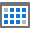 <a href="icons/svgimages/datetime/isthismonth.svg"><code>isthismonth.svg</code></a></td>
    <td align="center" valign="top" width="12.5%"> <a href="icons/svgimages/datetime/isthisweek.svg"><code>isthisweek.svg</code></a></td>
  </tr>
  <tr>
    <td align="center" valign="top" width="12.5%"> <a href="icons/svgimages/datetime/isthisyear.svg"><code>isthisyear.svg</code></a></td>
    <td align="center" valign="top" width="12.5%"> <a href="icons/svgimages/datetime/isworktime.svg"><code>isworktime.svg</code></a></td>
    <td align="center" valign="top" width="12.5%">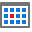 <a href="icons/svgimages/datetime/isyeartodate.svg"><code>isyeartodate.svg</code></a></td>
    <td></td>
    <td></td>
    <td></td>
    <td></td>
    <td></td>
  </tr>
</table>

### diagramicons

Liczba ikon: 133

<table>
  <tr>
    <td align="center" valign="top" width="12.5%"> <a href="icons/svgimages/diagramicons/applychanges.svg"><code>applychanges.svg</code></a></td>
    <td align="center" valign="top" width="12.5%"> <a href="icons/svgimages/diagramicons/arrowdown.svg"><code>arrowdown.svg</code></a></td>
    <td align="center" valign="top" width="12.5%"> <a href="icons/svgimages/diagramicons/arrowup.svg"><code>arrowup.svg</code></a></td>
    <td align="center" valign="top" width="12.5%"> <a href="icons/svgimages/diagramicons/autosize.svg"><code>autosize.svg</code></a></td>
    <td align="center" valign="top" width="12.5%"> <a href="icons/svgimages/diagramicons/autosize_fill.svg"><code>autosize_fill.svg</code></a></td>
    <td align="center" valign="top" width="12.5%"> <a href="icons/svgimages/diagramicons/autosize_none.svg"><code>autosize_none.svg</code></a></td>
    <td align="center" valign="top" width="12.5%"> <a href="icons/svgimages/diagramicons/bestfit.svg"><code>bestfit.svg</code></a></td>
    <td align="center" valign="top" width="12.5%"> <a href="icons/svgimages/diagramicons/bindingeditorhelpicon.svg"><code>bindingeditorhelpicon.svg</code></a></td>
  </tr>
  <tr>
    <td align="center" valign="top" width="12.5%"> <a href="icons/svgimages/diagramicons/bindingindicatoractive.svg"><code>bindingindicatoractive.svg</code></a></td>
    <td align="center" valign="top" width="12.5%"> <a href="icons/svgimages/diagramicons/bindingindicatorinactive.svg"><code>bindingindicatorinactive.svg</code></a></td>
    <td align="center" valign="top" width="12.5%"> <a href="icons/svgimages/diagramicons/brush.svg"><code>brush.svg</code></a></td>
    <td align="center" valign="top" width="12.5%">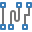 <a href="icons/svgimages/diagramicons/changeconnectortype.svg"><code>changeconnectortype.svg</code></a></td>
    <td align="center" valign="top" width="12.5%"> <a href="icons/svgimages/diagramicons/check.svg"><code>check.svg</code></a></td>
    <td align="center" valign="top" width="12.5%">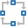 <a href="icons/svgimages/diagramicons/circularlayout.svg"><code>circularlayout.svg</code></a></td>
    <td align="center" valign="top" width="12.5%"> <a href="icons/svgimages/diagramicons/collapsedcontainericon.svg"><code>collapsedcontainericon.svg</code></a></td>
    <td align="center" valign="top" width="12.5%"> <a href="icons/svgimages/diagramicons/collapseselectedcontainers.svg"><code>collapseselectedcontainers.svg</code></a></td>
  </tr>
  <tr>
    <td align="center" valign="top" width="12.5%"> <a href="icons/svgimages/diagramicons/collapsesubordinates.svg"><code>collapsesubordinates.svg</code></a></td>
    <td align="center" valign="top" width="12.5%"> <a href="icons/svgimages/diagramicons/color.svg"><code>color.svg</code></a></td>
    <td align="center" valign="top" width="12.5%"> <a href="icons/svgimages/diagramicons/colors.svg"><code>colors.svg</code></a></td>
    <td align="center" valign="top" width="12.5%">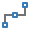 <a href="icons/svgimages/diagramicons/connector.svg"><code>connector.svg</code></a></td>
    <td align="center" valign="top" width="12.5%"> <a href="icons/svgimages/diagramicons/container.svg"><code>container.svg</code></a></td>
    <td align="center" valign="top" width="12.5%"> <a href="icons/svgimages/diagramicons/containerheaderpadding.svg"><code>containerheaderpadding.svg</code></a></td>
    <td align="center" valign="top" width="12.5%"> <a href="icons/svgimages/diagramicons/containerpadding.svg"><code>containerpadding.svg</code></a></td>
    <td align="center" valign="top" width="12.5%"> <a href="icons/svgimages/diagramicons/copy.svg"><code>copy.svg</code></a></td>
  </tr>
  <tr>
    <td align="center" valign="top" width="12.5%"> <a href="icons/svgimages/diagramicons/curvedconnector.svg"><code>curvedconnector.svg</code></a></td>
    <td align="center" valign="top" width="12.5%"> <a href="icons/svgimages/diagramicons/cut.svg"><code>cut.svg</code></a></td>
    <td align="center" valign="top" width="12.5%"> <a href="icons/svgimages/diagramicons/decreasefontsize.svg"><code>decreasefontsize.svg</code></a></td>
    <td align="center" valign="top" width="12.5%"> <a href="icons/svgimages/diagramicons/del.svg"><code>del.svg</code></a></td>
    <td align="center" valign="top" width="12.5%">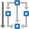 <a href="icons/svgimages/diagramicons/direction/direction1.svg"><code>direction1.svg</code></a></td>
    <td align="center" valign="top" width="12.5%">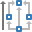 <a href="icons/svgimages/diagramicons/direction/direction2.svg"><code>direction2.svg</code></a></td>
    <td align="center" valign="top" width="12.5%">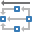 <a href="icons/svgimages/diagramicons/direction/direction3.svg"><code>direction3.svg</code></a></td>
    <td align="center" valign="top" width="12.5%">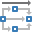 <a href="icons/svgimages/diagramicons/direction/direction4.svg"><code>direction4.svg</code></a></td>
  </tr>
  <tr>
    <td align="center" valign="top" width="12.5%"> <a href="icons/svgimages/diagramicons/direction/re-layout.svg"><code>re-layout.svg</code></a></td>
    <td align="center" valign="top" width="12.5%">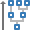 <a href="icons/svgimages/diagramicons/downtop.svg"><code>downtop.svg</code></a></td>
    <td align="center" valign="top" width="12.5%"> <a href="icons/svgimages/diagramicons/expandedcontainericon.svg"><code>expandedcontainericon.svg</code></a></td>
    <td align="center" valign="top" width="12.5%"> <a href="icons/svgimages/diagramicons/expandsubordinates.svg"><code>expandsubordinates.svg</code></a></td>
    <td align="center" valign="top" width="12.5%"> <a href="icons/svgimages/diagramicons/exportas.svg"><code>exportas.svg</code></a></td>
    <td align="center" valign="top" width="12.5%"> <a href="icons/svgimages/diagramicons/exportdiagram_bmp.svg"><code>exportdiagram_bmp.svg</code></a></td>
    <td align="center" valign="top" width="12.5%"> <a href="icons/svgimages/diagramicons/exportdiagram_gif.svg"><code>exportdiagram_gif.svg</code></a></td>
    <td align="center" valign="top" width="12.5%"> <a href="icons/svgimages/diagramicons/exportdiagram_jpeg.svg"><code>exportdiagram_jpeg.svg</code></a></td>
  </tr>
  <tr>
    <td align="center" valign="top" width="12.5%"> <a href="icons/svgimages/diagramicons/exportdiagram_png.svg"><code>exportdiagram_png.svg</code></a></td>
    <td align="center" valign="top" width="12.5%"> <a href="icons/svgimages/diagramicons/exporttopdf.svg"><code>exporttopdf.svg</code></a></td>
    <td align="center" valign="top" width="12.5%"> <a href="icons/svgimages/diagramicons/exporttosvg.svg"><code>exporttosvg.svg</code></a></td>
    <td align="center" valign="top" width="12.5%"> <a href="icons/svgimages/diagramicons/figures/figures1.svg"><code>figures1.svg</code></a></td>
    <td align="center" valign="top" width="12.5%"> <a href="icons/svgimages/diagramicons/figures/figures2.svg"><code>figures2.svg</code></a></td>
    <td align="center" valign="top" width="12.5%"> <a href="icons/svgimages/diagramicons/figures/figures3.svg"><code>figures3.svg</code></a></td>
    <td align="center" valign="top" width="12.5%"> <a href="icons/svgimages/diagramicons/figures/figures4.svg"><code>figures4.svg</code></a></td>
    <td align="center" valign="top" width="12.5%"> <a href="icons/svgimages/diagramicons/fittodrawing.svg"><code>fittodrawing.svg</code></a></td>
  </tr>
  <tr>
    <td align="center" valign="top" width="12.5%"> <a href="icons/svgimages/diagramicons/fittowidth.svg"><code>fittowidth.svg</code></a></td>
    <td align="center" valign="top" width="12.5%"> <a href="icons/svgimages/diagramicons/flipimage_horizontal.svg"><code>flipimage_horizontal.svg</code></a></td>
    <td align="center" valign="top" width="12.5%"> <a href="icons/svgimages/diagramicons/flipimage_vertical.svg"><code>flipimage_vertical.svg</code></a></td>
    <td align="center" valign="top" width="12.5%"> <a href="icons/svgimages/diagramicons/format/format1.svg"><code>format1.svg</code></a></td>
    <td align="center" valign="top" width="12.5%"> <a href="icons/svgimages/diagramicons/format/format2.svg"><code>format2.svg</code></a></td>
    <td align="center" valign="top" width="12.5%"> <a href="icons/svgimages/diagramicons/format/format3.svg"><code>format3.svg</code></a></td>
    <td align="center" valign="top" width="12.5%"> <a href="icons/svgimages/diagramicons/format/format4.svg"><code>format4.svg</code></a></td>
    <td align="center" valign="top" width="12.5%"> <a href="icons/svgimages/diagramicons/imagetoolssetimagescale.svg"><code>imagetoolssetimagescale.svg</code></a></td>
  </tr>
  <tr>
    <td align="center" valign="top" width="12.5%"> <a href="icons/svgimages/diagramicons/image_stretchmode.svg"><code>image_stretchmode.svg</code></a></td>
    <td align="center" valign="top" width="12.5%"> <a href="icons/svgimages/diagramicons/increasefontsize.svg"><code>increasefontsize.svg</code></a></td>
    <td align="center" valign="top" width="12.5%"> <a href="icons/svgimages/diagramicons/insertlist.svg"><code>insertlist.svg</code></a></td>
    <td align="center" valign="top" width="12.5%"> <a href="icons/svgimages/diagramicons/insertpositionadornerarrow.svg"><code>insertpositionadornerarrow.svg</code></a></td>
    <td align="center" valign="top" width="12.5%"> <a href="icons/svgimages/diagramicons/layers/layers1.svg"><code>layers1.svg</code></a></td>
    <td align="center" valign="top" width="12.5%"> <a href="icons/svgimages/diagramicons/layers/layers2.svg"><code>layers2.svg</code></a></td>
    <td align="center" valign="top" width="12.5%"> <a href="icons/svgimages/diagramicons/layers/layers3.svg"><code>layers3.svg</code></a></td>
    <td align="center" valign="top" width="12.5%"> <a href="icons/svgimages/diagramicons/layers/layers4.svg"><code>layers4.svg</code></a></td>
  </tr>
  <tr>
    <td align="center" valign="top" width="12.5%">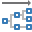 <a href="icons/svgimages/diagramicons/leftright.svg"><code>leftright.svg</code></a></td>
    <td align="center" valign="top" width="12.5%"> <a href="icons/svgimages/diagramicons/loadimage.svg"><code>loadimage.svg</code></a></td>
    <td align="center" valign="top" width="12.5%">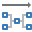 <a href="icons/svgimages/diagramicons/mindmaptree_horizontal.svg"><code>mindmaptree_horizontal.svg</code></a></td>
    <td align="center" valign="top" width="12.5%">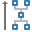 <a href="icons/svgimages/diagramicons/mindmaptree_vertical.svg"><code>mindmaptree_vertical.svg</code></a></td>
    <td align="center" valign="top" width="12.5%"> <a href="icons/svgimages/diagramicons/new.svg"><code>new.svg</code></a></td>
    <td align="center" valign="top" width="12.5%"> <a href="icons/svgimages/diagramicons/nextpage.svg"><code>nextpage.svg</code></a></td>
    <td align="center" valign="top" width="12.5%"> <a href="icons/svgimages/diagramicons/nopicture.svg"><code>nopicture.svg</code></a></td>
    <td align="center" valign="top" width="12.5%"> <a href="icons/svgimages/diagramicons/open.svg"><code>open.svg</code></a></td>
  </tr>
  <tr>
    <td align="center" valign="top" width="12.5%"> <a href="icons/svgimages/diagramicons/orientation/album.svg"><code>album.svg</code></a></td>
    <td align="center" valign="top" width="12.5%"> <a href="icons/svgimages/diagramicons/orientation/listorientation.svg"><code>listorientation.svg</code></a></td>
    <td align="center" valign="top" width="12.5%"> <a href="icons/svgimages/diagramicons/orientation/listorientationhorizontal.svg"><code>listorientationhorizontal.svg</code></a></td>
    <td align="center" valign="top" width="12.5%"> <a href="icons/svgimages/diagramicons/orientation/listorientationvertical.svg"><code>listorientationvertical.svg</code></a></td>
    <td align="center" valign="top" width="12.5%"> <a href="icons/svgimages/diagramicons/orientation/portrait.svg"><code>portrait.svg</code></a></td>
    <td align="center" valign="top" width="12.5%"> <a href="icons/svgimages/diagramicons/orientation/re-format.svg"><code>re-format.svg</code></a></td>
    <td align="center" valign="top" width="12.5%"> <a href="icons/svgimages/diagramicons/pagesize_a3.svg"><code>pagesize_a3.svg</code></a></td>
    <td align="center" valign="top" width="12.5%"> <a href="icons/svgimages/diagramicons/pagesize_a4.svg"><code>pagesize_a4.svg</code></a></td>
  </tr>
  <tr>
    <td align="center" valign="top" width="12.5%"> <a href="icons/svgimages/diagramicons/pagesize_a5.svg"><code>pagesize_a5.svg</code></a></td>
    <td align="center" valign="top" width="12.5%"> <a href="icons/svgimages/diagramicons/palette.svg"><code>palette.svg</code></a></td>
    <td align="center" valign="top" width="12.5%"> <a href="icons/svgimages/diagramicons/panandzoompanel.svg"><code>panandzoompanel.svg</code></a></td>
    <td align="center" valign="top" width="12.5%"> <a href="icons/svgimages/diagramicons/panes.svg"><code>panes.svg</code></a></td>
    <td align="center" valign="top" width="12.5%"> <a href="icons/svgimages/diagramicons/paste.svg"><code>paste.svg</code></a></td>
    <td align="center" valign="top" width="12.5%"> <a href="icons/svgimages/diagramicons/pointer.svg"><code>pointer.svg</code></a></td>
    <td align="center" valign="top" width="12.5%"> <a href="icons/svgimages/diagramicons/previouspage.svg"><code>previouspage.svg</code></a></td>
    <td align="center" valign="top" width="12.5%"> <a href="icons/svgimages/diagramicons/print.svg"><code>print.svg</code></a></td>
  </tr>
  <tr>
    <td align="center" valign="top" width="12.5%"> <a href="icons/svgimages/diagramicons/propertiespanel.svg"><code>propertiespanel.svg</code></a></td>
    <td align="center" valign="top" width="12.5%"> <a href="icons/svgimages/diagramicons/quickprint.svg"><code>quickprint.svg</code></a></td>
    <td align="center" valign="top" width="12.5%"> <a href="icons/svgimages/diagramicons/redo.svg"><code>redo.svg</code></a></td>
    <td align="center" valign="top" width="12.5%">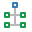 <a href="icons/svgimages/diagramicons/relayoutparts.svg"><code>relayoutparts.svg</code></a></td>
    <td align="center" valign="top" width="12.5%"> <a href="icons/svgimages/diagramicons/resetselectedimages.svg"><code>resetselectedimages.svg</code></a></td>
    <td align="center" valign="top" width="12.5%">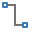 <a href="icons/svgimages/diagramicons/rightangleconnector.svg"><code>rightangleconnector.svg</code></a></td>
    <td align="center" valign="top" width="12.5%">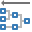 <a href="icons/svgimages/diagramicons/rightleft.svg"><code>rightleft.svg</code></a></td>
    <td align="center" valign="top" width="12.5%"> <a href="icons/svgimages/diagramicons/rotate.svg"><code>rotate.svg</code></a></td>
  </tr>
  <tr>
    <td align="center" valign="top" width="12.5%"> <a href="icons/svgimages/diagramicons/rotate_left90.svg"><code>rotate_left90.svg</code></a></td>
    <td align="center" valign="top" width="12.5%"> <a href="icons/svgimages/diagramicons/rotate_right90.svg"><code>rotate_right90.svg</code></a></td>
    <td align="center" valign="top" width="12.5%"> <a href="icons/svgimages/diagramicons/save-as.svg"><code>save-as.svg</code></a></td>
    <td align="center" valign="top" width="12.5%"> <a href="icons/svgimages/diagramicons/save.svg"><code>save.svg</code></a></td>
    <td align="center" valign="top" width="12.5%"> <a href="icons/svgimages/diagramicons/scale.svg"><code>scale.svg</code></a></td>
    <td align="center" valign="top" width="12.5%"> <a href="icons/svgimages/diagramicons/selecttool_pantool.svg"><code>selecttool_pantool.svg</code></a></td>
    <td align="center" valign="top" width="12.5%"> <a href="icons/svgimages/diagramicons/selecttool_texttool.svg"><code>selecttool_texttool.svg</code></a></td>
    <td align="center" valign="top" width="12.5%"> <a href="icons/svgimages/diagramicons/setselectedimagesstretchmode_stretch.svg"><code>setselectedimagesstretchmode_stretch.svg</code></a></td>
  </tr>
  <tr>
    <td align="center" valign="top" width="12.5%"> <a href="icons/svgimages/diagramicons/setselectedimagesstretchmode_uniform.svg"><code>setselectedimagesstretchmode_uniform.svg</code></a></td>
    <td align="center" valign="top" width="12.5%"> <a href="icons/svgimages/diagramicons/setselectedimagesstretchmode_uniformtofill.svg"><code>setselectedimagesstretchmode_uniformtofill.svg</code></a></td>
    <td align="center" valign="top" width="12.5%"> <a href="icons/svgimages/diagramicons/shapespanel.svg"><code>shapespanel.svg</code></a></td>
    <td align="center" valign="top" width="12.5%"> <a href="icons/svgimages/diagramicons/showcontainerheader.svg"><code>showcontainerheader.svg</code></a></td>
    <td align="center" valign="top" width="12.5%"> <a href="icons/svgimages/diagramicons/showprintpreview.svg"><code>showprintpreview.svg</code></a></td>
    <td align="center" valign="top" width="12.5%"> <a href="icons/svgimages/diagramicons/size.svg"><code>size.svg</code></a></td>
    <td align="center" valign="top" width="12.5%"> <a href="icons/svgimages/diagramicons/snap-to-grid.svg"><code>snap-to-grid.svg</code></a></td>
    <td align="center" valign="top" width="12.5%"> <a href="icons/svgimages/diagramicons/snap-to-item.svg"><code>snap-to-item.svg</code></a></td>
  </tr>
  <tr>
    <td align="center" valign="top" width="12.5%"> <a href="icons/svgimages/diagramicons/straightconnector.svg"><code>straightconnector.svg</code></a></td>
    <td align="center" valign="top" width="12.5%"> <a href="icons/svgimages/diagramicons/symbols/symbols1.svg"><code>symbols1.svg</code></a></td>
    <td align="center" valign="top" width="12.5%"> <a href="icons/svgimages/diagramicons/symbols/symbols2.svg"><code>symbols2.svg</code></a></td>
    <td align="center" valign="top" width="12.5%"> <a href="icons/svgimages/diagramicons/symbols/symbols3.svg"><code>symbols3.svg</code></a></td>
    <td align="center" valign="top" width="12.5%"> <a href="icons/svgimages/diagramicons/symbols/symbols4.svg"><code>symbols4.svg</code></a></td>
    <td align="center" valign="top" width="12.5%"> <a href="icons/svgimages/diagramicons/symbols/symbols5.svg"><code>symbols5.svg</code></a></td>
    <td align="center" valign="top" width="12.5%"> <a href="icons/svgimages/diagramicons/textalignment/textalignment0.svg"><code>textalignment0.svg</code></a></td>
    <td align="center" valign="top" width="12.5%"> <a href="icons/svgimages/diagramicons/textalignment/textalignment1.svg"><code>textalignment1.svg</code></a></td>
  </tr>
  <tr>
    <td align="center" valign="top" width="12.5%"> <a href="icons/svgimages/diagramicons/textalignment/textalignment2.svg"><code>textalignment2.svg</code></a></td>
    <td align="center" valign="top" width="12.5%"> <a href="icons/svgimages/diagramicons/textalignment/textalignment3.svg"><code>textalignment3.svg</code></a></td>
    <td align="center" valign="top" width="12.5%"> <a href="icons/svgimages/diagramicons/textalignment/textalignment4.svg"><code>textalignment4.svg</code></a></td>
    <td align="center" valign="top" width="12.5%"> <a href="icons/svgimages/diagramicons/textalignment/textalignment5.svg"><code>textalignment5.svg</code></a></td>
    <td align="center" valign="top" width="12.5%"> <a href="icons/svgimages/diagramicons/textalignment/textalignment6.svg"><code>textalignment6.svg</code></a></td>
    <td align="center" valign="top" width="12.5%"> <a href="icons/svgimages/diagramicons/textalignment/textalignment7.svg"><code>textalignment7.svg</code></a></td>
    <td align="center" valign="top" width="12.5%">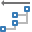 <a href="icons/svgimages/diagramicons/tipovertree_left.svg"><code>tipovertree_left.svg</code></a></td>
    <td align="center" valign="top" width="12.5%">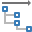 <a href="icons/svgimages/diagramicons/tipovertree_right.svg"><code>tipovertree_right.svg</code></a></td>
  </tr>
  <tr>
    <td align="center" valign="top" width="12.5%">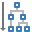 <a href="icons/svgimages/diagramicons/topdown.svg"><code>topdown.svg</code></a></td>
    <td align="center" valign="top" width="12.5%"> <a href="icons/svgimages/diagramicons/undo.svg"><code>undo.svg</code></a></td>
    <td align="center" valign="top" width="12.5%"> <a href="icons/svgimages/diagramicons/zoom.svg"><code>zoom.svg</code></a></td>
    <td align="center" valign="top" width="12.5%"> <a href="icons/svgimages/diagramicons/zoomin.svg"><code>zoomin.svg</code></a></td>
    <td align="center" valign="top" width="12.5%"> <a href="icons/svgimages/diagramicons/zoomout.svg"><code>zoomout.svg</code></a></td>
    <td></td>
    <td></td>
    <td></td>
  </tr>
</table>

### edit

Liczba ikon: 3

<table>
  <tr>
    <td align="center" valign="top" width="12.5%"> <a href="icons/svgimages/edit/copy.svg"><code>copy.svg</code></a></td>
    <td align="center" valign="top" width="12.5%"> <a href="icons/svgimages/edit/cut.svg"><code>cut.svg</code></a></td>
    <td align="center" valign="top" width="12.5%"> <a href="icons/svgimages/edit/paste.svg"><code>paste.svg</code></a></td>
    <td></td>
    <td></td>
    <td></td>
    <td></td>
    <td></td>
  </tr>
</table>

### export

Liczba ikon: 17

<table>
  <tr>
    <td align="center" valign="top" width="12.5%"> <a href="icons/svgimages/export/export.svg"><code>export.svg</code></a></td>
    <td align="center" valign="top" width="12.5%"> <a href="icons/svgimages/export/exportfile.svg"><code>exportfile.svg</code></a></td>
    <td align="center" valign="top" width="12.5%"> <a href="icons/svgimages/export/exporttocsv.svg"><code>exporttocsv.svg</code></a></td>
    <td align="center" valign="top" width="12.5%"> <a href="icons/svgimages/export/exporttodoc.svg"><code>exporttodoc.svg</code></a></td>
    <td align="center" valign="top" width="12.5%"> <a href="icons/svgimages/export/exporttodocx.svg"><code>exporttodocx.svg</code></a></td>
    <td align="center" valign="top" width="12.5%"> <a href="icons/svgimages/export/exporttoepub.svg"><code>exporttoepub.svg</code></a></td>
    <td align="center" valign="top" width="12.5%"> <a href="icons/svgimages/export/exporttohtml.svg"><code>exporttohtml.svg</code></a></td>
    <td align="center" valign="top" width="12.5%"> <a href="icons/svgimages/export/exporttoimg.svg"><code>exporttoimg.svg</code></a></td>
  </tr>
  <tr>
    <td align="center" valign="top" width="12.5%"> <a href="icons/svgimages/export/exporttomht.svg"><code>exporttomht.svg</code></a></td>
    <td align="center" valign="top" width="12.5%"> <a href="icons/svgimages/export/exporttoodt.svg"><code>exporttoodt.svg</code></a></td>
    <td align="center" valign="top" width="12.5%"> <a href="icons/svgimages/export/exporttopdf.svg"><code>exporttopdf.svg</code></a></td>
    <td align="center" valign="top" width="12.5%"> <a href="icons/svgimages/export/exporttortf.svg"><code>exporttortf.svg</code></a></td>
    <td align="center" valign="top" width="12.5%"> <a href="icons/svgimages/export/exporttotxt.svg"><code>exporttotxt.svg</code></a></td>
    <td align="center" valign="top" width="12.5%">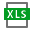 <a href="icons/svgimages/export/exporttoxls.svg"><code>exporttoxls.svg</code></a></td>
    <td align="center" valign="top" width="12.5%"> <a href="icons/svgimages/export/exporttoxlsx.svg"><code>exporttoxlsx.svg</code></a></td>
    <td align="center" valign="top" width="12.5%"> <a href="icons/svgimages/export/exporttoxml.svg"><code>exporttoxml.svg</code></a></td>
  </tr>
  <tr>
    <td align="center" valign="top" width="12.5%"> <a href="icons/svgimages/export/exporttoxps.svg"><code>exporttoxps.svg</code></a></td>
    <td></td>
    <td></td>
    <td></td>
    <td></td>
    <td></td>
    <td></td>
    <td></td>
  </tr>
</table>

### filter

Liczba ikon: 1

<table>
  <tr>
    <td align="center" valign="top" width="12.5%"> <a href="icons/svgimages/filter/filter.svg"><code>filter.svg</code></a></td>
    <td></td>
    <td></td>
    <td></td>
    <td></td>
    <td></td>
    <td></td>
    <td></td>
  </tr>
</table>

### find

Liczba ikon: 1

<table>
  <tr>
    <td align="center" valign="top" width="12.5%"> <a href="icons/svgimages/find/find.svg"><code>find.svg</code></a></td>
    <td></td>
    <td></td>
    <td></td>
    <td></td>
    <td></td>
    <td></td>
    <td></td>
  </tr>
</table>

### format

Liczba ikon: 28

<table>
  <tr>
    <td align="center" valign="top" width="12.5%"> <a href="icons/svgimages/format/aligncenter.svg"><code>aligncenter.svg</code></a></td>
    <td align="center" valign="top" width="12.5%"> <a href="icons/svgimages/format/alignjustify.svg"><code>alignjustify.svg</code></a></td>
    <td align="center" valign="top" width="12.5%"> <a href="icons/svgimages/format/alignleft.svg"><code>alignleft.svg</code></a></td>
    <td align="center" valign="top" width="12.5%"> <a href="icons/svgimages/format/alignright.svg"><code>alignright.svg</code></a></td>
    <td align="center" valign="top" width="12.5%"> <a href="icons/svgimages/format/bold.svg"><code>bold.svg</code></a></td>
    <td align="center" valign="top" width="12.5%"> <a href="icons/svgimages/format/fontsize.svg"><code>fontsize.svg</code></a></td>
    <td align="center" valign="top" width="12.5%"> <a href="icons/svgimages/format/fontsizedecrease.svg"><code>fontsizedecrease.svg</code></a></td>
    <td align="center" valign="top" width="12.5%"> <a href="icons/svgimages/format/fontsizeincrease.svg"><code>fontsizeincrease.svg</code></a></td>
  </tr>
  <tr>
    <td align="center" valign="top" width="12.5%"> <a href="icons/svgimages/format/indentdecrease.svg"><code>indentdecrease.svg</code></a></td>
    <td align="center" valign="top" width="12.5%"> <a href="icons/svgimages/format/indentdecrease_righttoleft.svg"><code>indentdecrease_righttoleft.svg</code></a></td>
    <td align="center" valign="top" width="12.5%"> <a href="icons/svgimages/format/indentincrease.svg"><code>indentincrease.svg</code></a></td>
    <td align="center" valign="top" width="12.5%"> <a href="icons/svgimages/format/indentincrease_righttoleft.svg"><code>indentincrease_righttoleft.svg</code></a></td>
    <td align="center" valign="top" width="12.5%"> <a href="icons/svgimages/format/italic.svg"><code>italic.svg</code></a></td>
    <td align="center" valign="top" width="12.5%"> <a href="icons/svgimages/format/listbullets.svg"><code>listbullets.svg</code></a></td>
    <td align="center" valign="top" width="12.5%"> <a href="icons/svgimages/format/listbullets_righttoleft.svg"><code>listbullets_righttoleft.svg</code></a></td>
    <td align="center" valign="top" width="12.5%"> <a href="icons/svgimages/format/listmultilevel.svg"><code>listmultilevel.svg</code></a></td>
  </tr>
  <tr>
    <td align="center" valign="top" width="12.5%"> <a href="icons/svgimages/format/listmultilevel_righttoleft.svg"><code>listmultilevel_righttoleft.svg</code></a></td>
    <td align="center" valign="top" width="12.5%"> <a href="icons/svgimages/format/listnumbers.svg"><code>listnumbers.svg</code></a></td>
    <td align="center" valign="top" width="12.5%">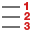 <a href="icons/svgimages/format/listnumbers_righttoleft.svg"><code>listnumbers_righttoleft.svg</code></a></td>
    <td align="center" valign="top" width="12.5%"> <a href="icons/svgimages/format/replace.svg"><code>replace.svg</code></a></td>
    <td align="center" valign="top" width="12.5%"> <a href="icons/svgimages/format/showhidden.svg"><code>showhidden.svg</code></a></td>
    <td align="center" valign="top" width="12.5%"> <a href="icons/svgimages/format/spellcheckasyoutype.svg"><code>spellcheckasyoutype.svg</code></a></td>
    <td align="center" valign="top" width="12.5%"> <a href="icons/svgimages/format/strikeout.svg"><code>strikeout.svg</code></a></td>
    <td align="center" valign="top" width="12.5%"> <a href="icons/svgimages/format/strikeoutdouble.svg"><code>strikeoutdouble.svg</code></a></td>
  </tr>
  <tr>
    <td align="center" valign="top" width="12.5%"> <a href="icons/svgimages/format/subscript.svg"><code>subscript.svg</code></a></td>
    <td align="center" valign="top" width="12.5%"> <a href="icons/svgimages/format/superscript.svg"><code>superscript.svg</code></a></td>
    <td align="center" valign="top" width="12.5%"> <a href="icons/svgimages/format/underline.svg"><code>underline.svg</code></a></td>
    <td align="center" valign="top" width="12.5%"> <a href="icons/svgimages/format/underlinedouble.svg"><code>underlinedouble.svg</code></a></td>
    <td></td>
    <td></td>
    <td></td>
    <td></td>
  </tr>
</table>

### history

Liczba ikon: 2

<table>
  <tr>
    <td align="center" valign="top" width="12.5%"> <a href="icons/svgimages/history/redo.svg"><code>redo.svg</code></a></td>
    <td align="center" valign="top" width="12.5%"> <a href="icons/svgimages/history/undo.svg"><code>undo.svg</code></a></td>
    <td></td>
    <td></td>
    <td></td>
    <td></td>
    <td></td>
    <td></td>
  </tr>
</table>

### hybriddemoicons

Liczba ikon: 66

<table>
  <tr>
    <td align="center" valign="top" width="12.5%"> <a href="icons/svgimages/hybriddemoicons/bottompanel/hybriddemo_ascending.svg"><code>hybriddemo_ascending.svg</code></a></td>
    <td align="center" valign="top" width="12.5%"> <a href="icons/svgimages/hybriddemoicons/bottompanel/hybriddemo_cancel.svg"><code>hybriddemo_cancel.svg</code></a></td>
    <td align="center" valign="top" width="12.5%"> <a href="icons/svgimages/hybriddemoicons/bottompanel/hybriddemo_close.svg"><code>hybriddemo_close.svg</code></a></td>
    <td align="center" valign="top" width="12.5%"> <a href="icons/svgimages/hybriddemoicons/bottompanel/hybriddemo_custom-filter.svg"><code>hybriddemo_custom-filter.svg</code></a></td>
    <td align="center" valign="top" width="12.5%"> <a href="icons/svgimages/hybriddemoicons/bottompanel/hybriddemo_delete.svg"><code>hybriddemo_delete.svg</code></a></td>
    <td align="center" valign="top" width="12.5%"> <a href="icons/svgimages/hybriddemoicons/bottompanel/hybriddemo_descending.svg"><code>hybriddemo_descending.svg</code></a></td>
    <td align="center" valign="top" width="12.5%"> <a href="icons/svgimages/hybriddemoicons/bottompanel/hybriddemo_edit.svg"><code>hybriddemo_edit.svg</code></a></td>
    <td align="center" valign="top" width="12.5%"> <a href="icons/svgimages/hybriddemoicons/bottompanel/hybriddemo_mail-merge.svg"><code>hybriddemo_mail-merge.svg</code></a></td>
  </tr>
  <tr>
    <td align="center" valign="top" width="12.5%"> <a href="icons/svgimages/hybriddemoicons/bottompanel/hybriddemo_map-view.svg"><code>hybriddemo_map-view.svg</code></a></td>
    <td align="center" valign="top" width="12.5%"> <a href="icons/svgimages/hybriddemoicons/bottompanel/hybriddemo_meeting.svg"><code>hybriddemo_meeting.svg</code></a></td>
    <td align="center" valign="top" width="12.5%"> <a href="icons/svgimages/hybriddemoicons/bottompanel/hybriddemo_new.svg"><code>hybriddemo_new.svg</code></a></td>
    <td align="center" valign="top" width="12.5%"> <a href="icons/svgimages/hybriddemoicons/bottompanel/hybriddemo_note.svg"><code>hybriddemo_note.svg</code></a></td>
    <td align="center" valign="top" width="12.5%"> <a href="icons/svgimages/hybriddemoicons/bottompanel/hybriddemo_order-list.svg"><code>hybriddemo_order-list.svg</code></a></td>
    <td align="center" valign="top" width="12.5%"> <a href="icons/svgimages/hybriddemoicons/bottompanel/hybriddemo_pivot-table.svg"><code>hybriddemo_pivot-table.svg</code></a></td>
    <td align="center" valign="top" width="12.5%"> <a href="icons/svgimages/hybriddemoicons/bottompanel/hybriddemo_print.svg"><code>hybriddemo_print.svg</code></a></td>
    <td align="center" valign="top" width="12.5%"> <a href="icons/svgimages/hybriddemoicons/bottompanel/hybriddemo_reports.svg"><code>hybriddemo_reports.svg</code></a></td>
  </tr>
  <tr>
    <td align="center" valign="top" width="12.5%"> <a href="icons/svgimages/hybriddemoicons/bottompanel/hybriddemo_sales-map.svg"><code>hybriddemo_sales-map.svg</code></a></td>
    <td align="center" valign="top" width="12.5%"> <a href="icons/svgimages/hybriddemoicons/bottompanel/hybriddemo_save.svg"><code>hybriddemo_save.svg</code></a></td>
    <td align="center" valign="top" width="12.5%"> <a href="icons/svgimages/hybriddemoicons/bottompanel/hybriddemo_settings.svg"><code>hybriddemo_settings.svg</code></a></td>
    <td align="center" valign="top" width="12.5%"> <a href="icons/svgimages/hybriddemoicons/bottompanel/hybriddemo_task.svg"><code>hybriddemo_task.svg</code></a></td>
    <td align="center" valign="top" width="12.5%"> <a href="icons/svgimages/hybriddemoicons/bottompanel/hybriddemo_zoom-in.svg"><code>hybriddemo_zoom-in.svg</code></a></td>
    <td align="center" valign="top" width="12.5%"> <a href="icons/svgimages/hybriddemoicons/bottompanel/hybriddemo_zoom-out.svg"><code>hybriddemo_zoom-out.svg</code></a></td>
    <td align="center" valign="top" width="12.5%"> <a href="icons/svgimages/hybriddemoicons/editors/hybriddemo_back-button.svg"><code>hybriddemo_back-button.svg</code></a></td>
    <td align="center" valign="top" width="12.5%"> <a href="icons/svgimages/hybriddemoicons/editors/hybriddemo_collapse-filter-button-collapsed.svg"><code>hybriddemo_collapse-filter-button-collapsed.svg</code></a></td>
  </tr>
  <tr>
    <td align="center" valign="top" width="12.5%"> <a href="icons/svgimages/hybriddemoicons/editors/hybriddemo_collapse-filter-button.svg"><code>hybriddemo_collapse-filter-button.svg</code></a></td>
    <td align="center" valign="top" width="12.5%"> <a href="icons/svgimages/hybriddemoicons/editors/hybriddemo_date-edit.svg"><code>hybriddemo_date-edit.svg</code></a></td>
    <td align="center" valign="top" width="12.5%"> <a href="icons/svgimages/hybriddemoicons/editors/hybriddemo_email.svg"><code>hybriddemo_email.svg</code></a></td>
    <td align="center" valign="top" width="12.5%"> <a href="icons/svgimages/hybriddemoicons/editors/hybriddemo_home-phone.svg"><code>hybriddemo_home-phone.svg</code></a></td>
    <td align="center" valign="top" width="12.5%"> <a href="icons/svgimages/hybriddemoicons/editors/hybriddemo_mobile-phone.svg"><code>hybriddemo_mobile-phone.svg</code></a></td>
    <td align="center" valign="top" width="12.5%"> <a href="icons/svgimages/hybriddemoicons/editors/hybriddemo_need-assistance.svg"><code>hybriddemo_need-assistance.svg</code></a></td>
    <td align="center" valign="top" width="12.5%"> <a href="icons/svgimages/hybriddemoicons/editors/hybriddemo_scompleted.svg"><code>hybriddemo_scompleted.svg</code></a></td>
    <td align="center" valign="top" width="12.5%"> <a href="icons/svgimages/hybriddemoicons/editors/hybriddemo_sdeferred.svg"><code>hybriddemo_sdeferred.svg</code></a></td>
  </tr>
  <tr>
    <td align="center" valign="top" width="12.5%"> <a href="icons/svgimages/hybriddemoicons/editors/hybriddemo_search-button.svg"><code>hybriddemo_search-button.svg</code></a></td>
    <td align="center" valign="top" width="12.5%"> <a href="icons/svgimages/hybriddemoicons/editors/hybriddemo_sinprogress.svg"><code>hybriddemo_sinprogress.svg</code></a></td>
    <td align="center" valign="top" width="12.5%"> <a href="icons/svgimages/hybriddemoicons/editors/hybriddemo_skype.svg"><code>hybriddemo_skype.svg</code></a></td>
    <td align="center" valign="top" width="12.5%"> <a href="icons/svgimages/hybriddemoicons/editors/hybriddemo_snotstarted.svg"><code>hybriddemo_snotstarted.svg</code></a></td>
    <td align="center" valign="top" width="12.5%"> <a href="icons/svgimages/hybriddemoicons/editors/priority/hybriddemo_priority-high.svg"><code>hybriddemo_priority-high.svg</code></a></td>
    <td align="center" valign="top" width="12.5%"> <a href="icons/svgimages/hybriddemoicons/editors/priority/hybriddemo_priority-low.svg"><code>hybriddemo_priority-low.svg</code></a></td>
    <td align="center" valign="top" width="12.5%"> <a href="icons/svgimages/hybriddemoicons/editors/priority/hybriddemo_priority-normal.svg"><code>hybriddemo_priority-normal.svg</code></a></td>
    <td align="center" valign="top" width="12.5%"> <a href="icons/svgimages/hybriddemoicons/editors/priority/hybriddemo_priority-urgent.svg"><code>hybriddemo_priority-urgent.svg</code></a></td>
  </tr>
  <tr>
    <td align="center" valign="top" width="12.5%"> <a href="icons/svgimages/hybriddemoicons/tiles/hybriddemo_all-employees.svg"><code>hybriddemo_all-employees.svg</code></a></td>
    <td align="center" valign="top" width="12.5%"> <a href="icons/svgimages/hybriddemoicons/tiles/hybriddemo_all-products.svg"><code>hybriddemo_all-products.svg</code></a></td>
    <td align="center" valign="top" width="12.5%"> <a href="icons/svgimages/hybriddemoicons/tiles/hybriddemo_all-tasks.svg"><code>hybriddemo_all-tasks.svg</code></a></td>
    <td align="center" valign="top" width="12.5%"> <a href="icons/svgimages/hybriddemoicons/tiles/hybriddemo_automation.svg"><code>hybriddemo_automation.svg</code></a></td>
    <td align="center" valign="top" width="12.5%"> <a href="icons/svgimages/hybriddemoicons/tiles/hybriddemo_commission.svg"><code>hybriddemo_commission.svg</code></a></td>
    <td align="center" valign="top" width="12.5%"> <a href="icons/svgimages/hybriddemoicons/tiles/hybriddemo_completed.svg"><code>hybriddemo_completed.svg</code></a></td>
    <td align="center" valign="top" width="12.5%"> <a href="icons/svgimages/hybriddemoicons/tiles/hybriddemo_contract.svg"><code>hybriddemo_contract.svg</code></a></td>
    <td align="center" valign="top" width="12.5%"> <a href="icons/svgimages/hybriddemoicons/tiles/hybriddemo_customers.svg"><code>hybriddemo_customers.svg</code></a></td>
  </tr>
  <tr>
    <td align="center" valign="top" width="12.5%"> <a href="icons/svgimages/hybriddemoicons/tiles/hybriddemo_dashboard.svg"><code>hybriddemo_dashboard.svg</code></a></td>
    <td align="center" valign="top" width="12.5%"> <a href="icons/svgimages/hybriddemoicons/tiles/hybriddemo_deferred.svg"><code>hybriddemo_deferred.svg</code></a></td>
    <td align="center" valign="top" width="12.5%"> <a href="icons/svgimages/hybriddemoicons/tiles/hybriddemo_employees.svg"><code>hybriddemo_employees.svg</code></a></td>
    <td align="center" valign="top" width="12.5%"> <a href="icons/svgimages/hybriddemoicons/tiles/hybriddemo_high-priority.svg"><code>hybriddemo_high-priority.svg</code></a></td>
    <td align="center" valign="top" width="12.5%"> <a href="icons/svgimages/hybriddemoicons/tiles/hybriddemo_in-progress.svg"><code>hybriddemo_in-progress.svg</code></a></td>
    <td align="center" valign="top" width="12.5%"> <a href="icons/svgimages/hybriddemoicons/tiles/hybriddemo_monitors.svg"><code>hybriddemo_monitors.svg</code></a></td>
    <td align="center" valign="top" width="12.5%"> <a href="icons/svgimages/hybriddemoicons/tiles/hybriddemo_not-started.svg"><code>hybriddemo_not-started.svg</code></a></td>
    <td align="center" valign="top" width="12.5%"> <a href="icons/svgimages/hybriddemoicons/tiles/hybriddemo_on-leave.svg"><code>hybriddemo_on-leave.svg</code></a></td>
  </tr>
  <tr>
    <td align="center" valign="top" width="12.5%"> <a href="icons/svgimages/hybriddemoicons/tiles/hybriddemo_opportunities.svg"><code>hybriddemo_opportunities.svg</code></a></td>
    <td align="center" valign="top" width="12.5%"> <a href="icons/svgimages/hybriddemoicons/tiles/hybriddemo_products.svg"><code>hybriddemo_products.svg</code></a></td>
    <td align="center" valign="top" width="12.5%"> <a href="icons/svgimages/hybriddemoicons/tiles/hybriddemo_projectors.svg"><code>hybriddemo_projectors.svg</code></a></td>
    <td align="center" valign="top" width="12.5%"> <a href="icons/svgimages/hybriddemoicons/tiles/hybriddemo_salaried.svg"><code>hybriddemo_salaried.svg</code></a></td>
    <td align="center" valign="top" width="12.5%"> <a href="icons/svgimages/hybriddemoicons/tiles/hybriddemo_sales.svg"><code>hybriddemo_sales.svg</code></a></td>
    <td align="center" valign="top" width="12.5%"> <a href="icons/svgimages/hybriddemoicons/tiles/hybriddemo_tasks.svg"><code>hybriddemo_tasks.svg</code></a></td>
    <td align="center" valign="top" width="12.5%"> <a href="icons/svgimages/hybriddemoicons/tiles/hybriddemo_terminated.svg"><code>hybriddemo_terminated.svg</code></a></td>
    <td align="center" valign="top" width="12.5%"> <a href="icons/svgimages/hybriddemoicons/tiles/hybriddemo_tvs.svg"><code>hybriddemo_tvs.svg</code></a></td>
  </tr>
  <tr>
    <td align="center" valign="top" width="12.5%"> <a href="icons/svgimages/hybriddemoicons/tiles/hybriddemo_urgent.svg"><code>hybriddemo_urgent.svg</code></a></td>
    <td align="center" valign="top" width="12.5%"> <a href="icons/svgimages/hybriddemoicons/tiles/hybriddemo_video-players.svg"><code>hybriddemo_video-players.svg</code></a></td>
    <td></td>
    <td></td>
    <td></td>
    <td></td>
    <td></td>
    <td></td>
  </tr>
</table>

### icon builder

Liczba ikon: 218

<table>
  <tr>
    <td align="center" valign="top" width="12.5%"> <a href="icons/svgimages/icon-builder/actions_add.svg"><code>actions_add.svg</code></a></td>
    <td align="center" valign="top" width="12.5%"> <a href="icons/svgimages/icon-builder/actions_addcircled.svg"><code>actions_addcircled.svg</code></a></td>
    <td align="center" valign="top" width="12.5%"> <a href="icons/svgimages/icon-builder/actions_arrow1down.svg"><code>actions_arrow1down.svg</code></a></td>
    <td align="center" valign="top" width="12.5%"> <a href="icons/svgimages/icon-builder/actions_arrow1left.svg"><code>actions_arrow1left.svg</code></a></td>
    <td align="center" valign="top" width="12.5%"> <a href="icons/svgimages/icon-builder/actions_arrow1leftdown.svg"><code>actions_arrow1leftdown.svg</code></a></td>
    <td align="center" valign="top" width="12.5%"> <a href="icons/svgimages/icon-builder/actions_arrow1leftup.svg"><code>actions_arrow1leftup.svg</code></a></td>
    <td align="center" valign="top" width="12.5%"> <a href="icons/svgimages/icon-builder/actions_arrow1right.svg"><code>actions_arrow1right.svg</code></a></td>
    <td align="center" valign="top" width="12.5%"> <a href="icons/svgimages/icon-builder/actions_arrow1rightdown.svg"><code>actions_arrow1rightdown.svg</code></a></td>
  </tr>
  <tr>
    <td align="center" valign="top" width="12.5%"> <a href="icons/svgimages/icon-builder/actions_arrow1rightup.svg"><code>actions_arrow1rightup.svg</code></a></td>
    <td align="center" valign="top" width="12.5%"> <a href="icons/svgimages/icon-builder/actions_arrow1up.svg"><code>actions_arrow1up.svg</code></a></td>
    <td align="center" valign="top" width="12.5%"> <a href="icons/svgimages/icon-builder/actions_arrow2down.svg"><code>actions_arrow2down.svg</code></a></td>
    <td align="center" valign="top" width="12.5%"> <a href="icons/svgimages/icon-builder/actions_arrow2left.svg"><code>actions_arrow2left.svg</code></a></td>
    <td align="center" valign="top" width="12.5%"> <a href="icons/svgimages/icon-builder/actions_arrow2leftdown.svg"><code>actions_arrow2leftdown.svg</code></a></td>
    <td align="center" valign="top" width="12.5%"> <a href="icons/svgimages/icon-builder/actions_arrow2leftup.svg"><code>actions_arrow2leftup.svg</code></a></td>
    <td align="center" valign="top" width="12.5%"> <a href="icons/svgimages/icon-builder/actions_arrow2right.svg"><code>actions_arrow2right.svg</code></a></td>
    <td align="center" valign="top" width="12.5%"> <a href="icons/svgimages/icon-builder/actions_arrow2rightdown.svg"><code>actions_arrow2rightdown.svg</code></a></td>
  </tr>
  <tr>
    <td align="center" valign="top" width="12.5%"> <a href="icons/svgimages/icon-builder/actions_arrow2rightup.svg"><code>actions_arrow2rightup.svg</code></a></td>
    <td align="center" valign="top" width="12.5%"> <a href="icons/svgimages/icon-builder/actions_arrow2up.svg"><code>actions_arrow2up.svg</code></a></td>
    <td align="center" valign="top" width="12.5%"> <a href="icons/svgimages/icon-builder/actions_arrow3down.svg"><code>actions_arrow3down.svg</code></a></td>
    <td align="center" valign="top" width="12.5%"> <a href="icons/svgimages/icon-builder/actions_arrow3left.svg"><code>actions_arrow3left.svg</code></a></td>
    <td align="center" valign="top" width="12.5%"> <a href="icons/svgimages/icon-builder/actions_arrow3right.svg"><code>actions_arrow3right.svg</code></a></td>
    <td align="center" valign="top" width="12.5%"> <a href="icons/svgimages/icon-builder/actions_arrow3up.svg"><code>actions_arrow3up.svg</code></a></td>
    <td align="center" valign="top" width="12.5%"> <a href="icons/svgimages/icon-builder/actions_arrow4down.svg"><code>actions_arrow4down.svg</code></a></td>
    <td align="center" valign="top" width="12.5%"> <a href="icons/svgimages/icon-builder/actions_arrow4left.svg"><code>actions_arrow4left.svg</code></a></td>
  </tr>
  <tr>
    <td align="center" valign="top" width="12.5%"> <a href="icons/svgimages/icon-builder/actions_arrow4leftdown.svg"><code>actions_arrow4leftdown.svg</code></a></td>
    <td align="center" valign="top" width="12.5%"> <a href="icons/svgimages/icon-builder/actions_arrow4leftup.svg"><code>actions_arrow4leftup.svg</code></a></td>
    <td align="center" valign="top" width="12.5%"> <a href="icons/svgimages/icon-builder/actions_arrow4right.svg"><code>actions_arrow4right.svg</code></a></td>
    <td align="center" valign="top" width="12.5%"> <a href="icons/svgimages/icon-builder/actions_arrow4rightdown.svg"><code>actions_arrow4rightdown.svg</code></a></td>
    <td align="center" valign="top" width="12.5%"> <a href="icons/svgimages/icon-builder/actions_arrow4rightup.svg"><code>actions_arrow4rightup.svg</code></a></td>
    <td align="center" valign="top" width="12.5%"> <a href="icons/svgimages/icon-builder/actions_arrow4up.svg"><code>actions_arrow4up.svg</code></a></td>
    <td align="center" valign="top" width="12.5%"> <a href="icons/svgimages/icon-builder/actions_arrow5downleft.svg"><code>actions_arrow5downleft.svg</code></a></td>
    <td align="center" valign="top" width="12.5%"> <a href="icons/svgimages/icon-builder/actions_arrow5downright.svg"><code>actions_arrow5downright.svg</code></a></td>
  </tr>
  <tr>
    <td align="center" valign="top" width="12.5%"> <a href="icons/svgimages/icon-builder/actions_arrow5leftdown.svg"><code>actions_arrow5leftdown.svg</code></a></td>
    <td align="center" valign="top" width="12.5%"> <a href="icons/svgimages/icon-builder/actions_arrow5leftup.svg"><code>actions_arrow5leftup.svg</code></a></td>
    <td align="center" valign="top" width="12.5%"> <a href="icons/svgimages/icon-builder/actions_arrow5rightdown.svg"><code>actions_arrow5rightdown.svg</code></a></td>
    <td align="center" valign="top" width="12.5%"> <a href="icons/svgimages/icon-builder/actions_arrow5rightup.svg"><code>actions_arrow5rightup.svg</code></a></td>
    <td align="center" valign="top" width="12.5%"> <a href="icons/svgimages/icon-builder/actions_arrow5upleft.svg"><code>actions_arrow5upleft.svg</code></a></td>
    <td align="center" valign="top" width="12.5%"> <a href="icons/svgimages/icon-builder/actions_arrow5upright.svg"><code>actions_arrow5upright.svg</code></a></td>
    <td align="center" valign="top" width="12.5%"> <a href="icons/svgimages/icon-builder/actions_attach.svg"><code>actions_attach.svg</code></a></td>
    <td align="center" valign="top" width="12.5%"> <a href="icons/svgimages/icon-builder/actions_bell.svg"><code>actions_bell.svg</code></a></td>
  </tr>
  <tr>
    <td align="center" valign="top" width="12.5%"> <a href="icons/svgimages/icon-builder/actions_book.svg"><code>actions_book.svg</code></a></td>
    <td align="center" valign="top" width="12.5%"> <a href="icons/svgimages/icon-builder/actions_bookmark.svg"><code>actions_bookmark.svg</code></a></td>
    <td align="center" valign="top" width="12.5%"> <a href="icons/svgimages/icon-builder/actions_calendar.svg"><code>actions_calendar.svg</code></a></td>
    <td align="center" valign="top" width="12.5%"> <a href="icons/svgimages/icon-builder/actions_check.svg"><code>actions_check.svg</code></a></td>
    <td align="center" valign="top" width="12.5%"> <a href="icons/svgimages/icon-builder/actions_checkcircled.svg"><code>actions_checkcircled.svg</code></a></td>
    <td align="center" valign="top" width="12.5%"> <a href="icons/svgimages/icon-builder/actions_clear.svg"><code>actions_clear.svg</code></a></td>
    <td align="center" valign="top" width="12.5%"> <a href="icons/svgimages/icon-builder/actions_clock.svg"><code>actions_clock.svg</code></a></td>
    <td align="center" valign="top" width="12.5%"> <a href="icons/svgimages/icon-builder/actions_comment.svg"><code>actions_comment.svg</code></a></td>
  </tr>
  <tr>
    <td align="center" valign="top" width="12.5%"> <a href="icons/svgimages/icon-builder/actions_copy.svg"><code>actions_copy.svg</code></a></td>
    <td align="center" valign="top" width="12.5%"> <a href="icons/svgimages/icon-builder/actions_cut.svg"><code>actions_cut.svg</code></a></td>
    <td align="center" valign="top" width="12.5%"> <a href="icons/svgimages/icon-builder/actions_database.svg"><code>actions_database.svg</code></a></td>
    <td align="center" valign="top" width="12.5%"> <a href="icons/svgimages/icon-builder/actions_delete.svg"><code>actions_delete.svg</code></a></td>
    <td align="center" valign="top" width="12.5%"> <a href="icons/svgimages/icon-builder/actions_deletecircled.svg"><code>actions_deletecircled.svg</code></a></td>
    <td align="center" valign="top" width="12.5%"> <a href="icons/svgimages/icon-builder/actions_edit.svg"><code>actions_edit.svg</code></a></td>
    <td align="center" valign="top" width="12.5%"> <a href="icons/svgimages/icon-builder/actions_envelopeclose.svg"><code>actions_envelopeclose.svg</code></a></td>
    <td align="center" valign="top" width="12.5%"> <a href="icons/svgimages/icon-builder/actions_envelopeopen.svg"><code>actions_envelopeopen.svg</code></a></td>
  </tr>
  <tr>
    <td align="center" valign="top" width="12.5%"> <a href="icons/svgimages/icon-builder/actions_filter.svg"><code>actions_filter.svg</code></a></td>
    <td align="center" valign="top" width="12.5%"> <a href="icons/svgimages/icon-builder/actions_find.svg"><code>actions_find.svg</code></a></td>
    <td align="center" valign="top" width="12.5%"> <a href="icons/svgimages/icon-builder/actions_flag.svg"><code>actions_flag.svg</code></a></td>
    <td align="center" valign="top" width="12.5%"> <a href="icons/svgimages/icon-builder/actions_folderclose.svg"><code>actions_folderclose.svg</code></a></td>
    <td align="center" valign="top" width="12.5%"> <a href="icons/svgimages/icon-builder/actions_folderopen.svg"><code>actions_folderopen.svg</code></a></td>
    <td align="center" valign="top" width="12.5%"> <a href="icons/svgimages/icon-builder/actions_forbid.svg"><code>actions_forbid.svg</code></a></td>
    <td align="center" valign="top" width="12.5%"> <a href="icons/svgimages/icon-builder/actions_fullscreen.svg"><code>actions_fullscreen.svg</code></a></td>
    <td align="center" valign="top" width="12.5%"> <a href="icons/svgimages/icon-builder/actions_fullscreenexit.svg"><code>actions_fullscreenexit.svg</code></a></td>
  </tr>
  <tr>
    <td align="center" valign="top" width="12.5%"> <a href="icons/svgimages/icon-builder/actions_home.svg"><code>actions_home.svg</code></a></td>
    <td align="center" valign="top" width="12.5%"> <a href="icons/svgimages/icon-builder/actions_hyperlink.svg"><code>actions_hyperlink.svg</code></a></td>
    <td align="center" valign="top" width="12.5%"> <a href="icons/svgimages/icon-builder/actions_image.svg"><code>actions_image.svg</code></a></td>
    <td align="center" valign="top" width="12.5%"> <a href="icons/svgimages/icon-builder/actions_info.svg"><code>actions_info.svg</code></a></td>
    <td align="center" valign="top" width="12.5%"> <a href="icons/svgimages/icon-builder/actions_label.svg"><code>actions_label.svg</code></a></td>
    <td align="center" valign="top" width="12.5%"> <a href="icons/svgimages/icon-builder/actions_list.svg"><code>actions_list.svg</code></a></td>
    <td align="center" valign="top" width="12.5%"> <a href="icons/svgimages/icon-builder/actions_navigationbar.svg"><code>actions_navigationbar.svg</code></a></td>
    <td align="center" valign="top" width="12.5%"> <a href="icons/svgimages/icon-builder/actions_new.svg"><code>actions_new.svg</code></a></td>
  </tr>
  <tr>
    <td align="center" valign="top" width="12.5%"> <a href="icons/svgimages/icon-builder/actions_next.svg"><code>actions_next.svg</code></a></td>
    <td align="center" valign="top" width="12.5%"> <a href="icons/svgimages/icon-builder/actions_options.svg"><code>actions_options.svg</code></a></td>
    <td align="center" valign="top" width="12.5%"> <a href="icons/svgimages/icon-builder/actions_previous.svg"><code>actions_previous.svg</code></a></td>
    <td align="center" valign="top" width="12.5%"> <a href="icons/svgimages/icon-builder/actions_print.svg"><code>actions_print.svg</code></a></td>
    <td align="center" valign="top" width="12.5%"> <a href="icons/svgimages/icon-builder/actions_question.svg"><code>actions_question.svg</code></a></td>
    <td align="center" valign="top" width="12.5%"> <a href="icons/svgimages/icon-builder/actions_rating.svg"><code>actions_rating.svg</code></a></td>
    <td align="center" valign="top" width="12.5%"> <a href="icons/svgimages/icon-builder/actions_redo.svg"><code>actions_redo.svg</code></a></td>
    <td align="center" valign="top" width="12.5%"> <a href="icons/svgimages/icon-builder/actions_refresh.svg"><code>actions_refresh.svg</code></a></td>
  </tr>
  <tr>
    <td align="center" valign="top" width="12.5%"> <a href="icons/svgimages/icon-builder/actions_reload.svg"><code>actions_reload.svg</code></a></td>
    <td align="center" valign="top" width="12.5%"> <a href="icons/svgimages/icon-builder/actions_remove.svg"><code>actions_remove.svg</code></a></td>
    <td align="center" valign="top" width="12.5%"> <a href="icons/svgimages/icon-builder/actions_removecircled.svg"><code>actions_removecircled.svg</code></a></td>
    <td align="center" valign="top" width="12.5%"> <a href="icons/svgimages/icon-builder/actions_rollback.svg"><code>actions_rollback.svg</code></a></td>
    <td align="center" valign="top" width="12.5%"> <a href="icons/svgimages/icon-builder/actions_send.svg"><code>actions_send.svg</code></a></td>
    <td align="center" valign="top" width="12.5%"> <a href="icons/svgimages/icon-builder/actions_settings.svg"><code>actions_settings.svg</code></a></td>
    <td align="center" valign="top" width="12.5%"> <a href="icons/svgimages/icon-builder/actions_sum.svg"><code>actions_sum.svg</code></a></td>
    <td align="center" valign="top" width="12.5%"> <a href="icons/svgimages/icon-builder/actions_table.svg"><code>actions_table.svg</code></a></td>
  </tr>
  <tr>
    <td align="center" valign="top" width="12.5%"> <a href="icons/svgimages/icon-builder/actions_trash.svg"><code>actions_trash.svg</code></a></td>
    <td align="center" valign="top" width="12.5%"> <a href="icons/svgimages/icon-builder/actions_undo.svg"><code>actions_undo.svg</code></a></td>
    <td align="center" valign="top" width="12.5%"> <a href="icons/svgimages/icon-builder/actions_user.svg"><code>actions_user.svg</code></a></td>
    <td align="center" valign="top" width="12.5%"> <a href="icons/svgimages/icon-builder/actions_window.svg"><code>actions_window.svg</code></a></td>
    <td align="center" valign="top" width="12.5%"> <a href="icons/svgimages/icon-builder/actions_zoom.svg"><code>actions_zoom.svg</code></a></td>
    <td align="center" valign="top" width="12.5%"> <a href="icons/svgimages/icon-builder/business_bank.svg"><code>business_bank.svg</code></a></td>
    <td align="center" valign="top" width="12.5%"> <a href="icons/svgimages/icon-builder/business_barchart.svg"><code>business_barchart.svg</code></a></td>
    <td align="center" valign="top" width="12.5%"> <a href="icons/svgimages/icon-builder/business_briefcase.svg"><code>business_briefcase.svg</code></a></td>
  </tr>
  <tr>
    <td align="center" valign="top" width="12.5%"> <a href="icons/svgimages/icon-builder/business_businessman.svg"><code>business_businessman.svg</code></a></td>
    <td align="center" valign="top" width="12.5%"> <a href="icons/svgimages/icon-builder/business_businesswoman.svg"><code>business_businesswoman.svg</code></a></td>
    <td align="center" valign="top" width="12.5%">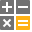 <a href="icons/svgimages/icon-builder/business_calculator.svg"><code>business_calculator.svg</code></a></td>
    <td align="center" valign="top" width="12.5%"> <a href="icons/svgimages/icon-builder/business_cash.svg"><code>business_cash.svg</code></a></td>
    <td align="center" valign="top" width="12.5%"> <a href="icons/svgimages/icon-builder/business_creditcard.svg"><code>business_creditcard.svg</code></a></td>
    <td align="center" valign="top" width="12.5%"> <a href="icons/svgimages/icon-builder/business_diagram.svg"><code>business_diagram.svg</code></a></td>
    <td align="center" valign="top" width="12.5%"> <a href="icons/svgimages/icon-builder/business_dollar.svg"><code>business_dollar.svg</code></a></td>
    <td align="center" valign="top" width="12.5%"> <a href="icons/svgimages/icon-builder/business_dollarcircled.svg"><code>business_dollarcircled.svg</code></a></td>
  </tr>
  <tr>
    <td align="center" valign="top" width="12.5%"> <a href="icons/svgimages/icon-builder/business_doughnutchart.svg"><code>business_doughnutchart.svg</code></a></td>
    <td align="center" valign="top" width="12.5%"> <a href="icons/svgimages/icon-builder/business_euro.svg"><code>business_euro.svg</code></a></td>
    <td align="center" valign="top" width="12.5%"> <a href="icons/svgimages/icon-builder/business_eurocircled.svg"><code>business_eurocircled.svg</code></a></td>
    <td align="center" valign="top" width="12.5%"> <a href="icons/svgimages/icon-builder/business_idea.svg"><code>business_idea.svg</code></a></td>
    <td align="center" valign="top" width="12.5%"> <a href="icons/svgimages/icon-builder/business_linearchart.svg"><code>business_linearchart.svg</code></a></td>
    <td align="center" valign="top" width="12.5%"> <a href="icons/svgimages/icon-builder/business_money.svg"><code>business_money.svg</code></a></td>
    <td align="center" valign="top" width="12.5%"> <a href="icons/svgimages/icon-builder/business_phone.svg"><code>business_phone.svg</code></a></td>
    <td align="center" valign="top" width="12.5%"> <a href="icons/svgimages/icon-builder/business_piechart.svg"><code>business_piechart.svg</code></a></td>
  </tr>
  <tr>
    <td align="center" valign="top" width="12.5%"> <a href="icons/svgimages/icon-builder/business_presentation.svg"><code>business_presentation.svg</code></a></td>
    <td align="center" valign="top" width="12.5%"> <a href="icons/svgimages/icon-builder/business_report.svg"><code>business_report.svg</code></a></td>
    <td align="center" valign="top" width="12.5%"> <a href="icons/svgimages/icon-builder/business_safe.svg"><code>business_safe.svg</code></a></td>
    <td align="center" valign="top" width="12.5%"> <a href="icons/svgimages/icon-builder/business_target.svg"><code>business_target.svg</code></a></td>
    <td align="center" valign="top" width="12.5%"> <a href="icons/svgimages/icon-builder/business_world.svg"><code>business_world.svg</code></a></td>
    <td align="center" valign="top" width="12.5%"> <a href="icons/svgimages/icon-builder/electronics_desktopmac.svg"><code>electronics_desktopmac.svg</code></a></td>
    <td align="center" valign="top" width="12.5%"> <a href="icons/svgimages/icon-builder/electronics_desktopwindows.svg"><code>electronics_desktopwindows.svg</code></a></td>
    <td align="center" valign="top" width="12.5%"> <a href="icons/svgimages/icon-builder/electronics_headphone.svg"><code>electronics_headphone.svg</code></a></td>
  </tr>
  <tr>
    <td align="center" valign="top" width="12.5%"> <a href="icons/svgimages/icon-builder/electronics_keyboard.svg"><code>electronics_keyboard.svg</code></a></td>
    <td align="center" valign="top" width="12.5%"> <a href="icons/svgimages/icon-builder/electronics_laptopmac.svg"><code>electronics_laptopmac.svg</code></a></td>
    <td align="center" valign="top" width="12.5%"> <a href="icons/svgimages/icon-builder/electronics_laptopwindows.svg"><code>electronics_laptopwindows.svg</code></a></td>
    <td align="center" valign="top" width="12.5%"> <a href="icons/svgimages/icon-builder/electronics_microphone.svg"><code>electronics_microphone.svg</code></a></td>
    <td align="center" valign="top" width="12.5%"> <a href="icons/svgimages/icon-builder/electronics_mouse.svg"><code>electronics_mouse.svg</code></a></td>
    <td align="center" valign="top" width="12.5%"> <a href="icons/svgimages/icon-builder/electronics_phoneandroid.svg"><code>electronics_phoneandroid.svg</code></a></td>
    <td align="center" valign="top" width="12.5%"> <a href="icons/svgimages/icon-builder/electronics_phoneiphone.svg"><code>electronics_phoneiphone.svg</code></a></td>
    <td align="center" valign="top" width="12.5%"> <a href="icons/svgimages/icon-builder/electronics_photo.svg"><code>electronics_photo.svg</code></a></td>
  </tr>
  <tr>
    <td align="center" valign="top" width="12.5%"> <a href="icons/svgimages/icon-builder/electronics_printer.svg"><code>electronics_printer.svg</code></a></td>
    <td align="center" valign="top" width="12.5%"> <a href="icons/svgimages/icon-builder/electronics_router.svg"><code>electronics_router.svg</code></a></td>
    <td align="center" valign="top" width="12.5%"> <a href="icons/svgimages/icon-builder/electronics_scanner.svg"><code>electronics_scanner.svg</code></a></td>
    <td align="center" valign="top" width="12.5%"> <a href="icons/svgimages/icon-builder/electronics_tabletmac.svg"><code>electronics_tabletmac.svg</code></a></td>
    <td align="center" valign="top" width="12.5%"> <a href="icons/svgimages/icon-builder/electronics_tabletwindows.svg"><code>electronics_tabletwindows.svg</code></a></td>
    <td align="center" valign="top" width="12.5%"> <a href="icons/svgimages/icon-builder/electronics_tv.svg"><code>electronics_tv.svg</code></a></td>
    <td align="center" valign="top" width="12.5%"> <a href="icons/svgimages/icon-builder/electronics_video.svg"><code>electronics_video.svg</code></a></td>
    <td align="center" valign="top" width="12.5%"> <a href="icons/svgimages/icon-builder/electronics_volume.svg"><code>electronics_volume.svg</code></a></td>
  </tr>
  <tr>
    <td align="center" valign="top" width="12.5%"> <a href="icons/svgimages/icon-builder/security_assistance.svg"><code>security_assistance.svg</code></a></td>
    <td align="center" valign="top" width="12.5%"> <a href="icons/svgimages/icon-builder/security_bug.svg"><code>security_bug.svg</code></a></td>
    <td align="center" valign="top" width="12.5%"> <a href="icons/svgimages/icon-builder/security_fingerprint.svg"><code>security_fingerprint.svg</code></a></td>
    <td align="center" valign="top" width="12.5%"> <a href="icons/svgimages/icon-builder/security_key.svg"><code>security_key.svg</code></a></td>
    <td align="center" valign="top" width="12.5%"> <a href="icons/svgimages/icon-builder/security_lock.svg"><code>security_lock.svg</code></a></td>
    <td align="center" valign="top" width="12.5%"> <a href="icons/svgimages/icon-builder/security_personalid.svg"><code>security_personalid.svg</code></a></td>
    <td align="center" valign="top" width="12.5%"> <a href="icons/svgimages/icon-builder/security_security.svg"><code>security_security.svg</code></a></td>
    <td align="center" valign="top" width="12.5%"> <a href="icons/svgimages/icon-builder/security_stop.svg"><code>security_stop.svg</code></a></td>
  </tr>
  <tr>
    <td align="center" valign="top" width="12.5%"> <a href="icons/svgimages/icon-builder/security_unlock.svg"><code>security_unlock.svg</code></a></td>
    <td align="center" valign="top" width="12.5%"> <a href="icons/svgimages/icon-builder/security_visibility.svg"><code>security_visibility.svg</code></a></td>
    <td align="center" valign="top" width="12.5%"> <a href="icons/svgimages/icon-builder/security_visibilityoff.svg"><code>security_visibilityoff.svg</code></a></td>
    <td align="center" valign="top" width="12.5%"> <a href="icons/svgimages/icon-builder/security_warning.svg"><code>security_warning.svg</code></a></td>
    <td align="center" valign="top" width="12.5%"> <a href="icons/svgimages/icon-builder/security_warningcircled1.svg"><code>security_warningcircled1.svg</code></a></td>
    <td align="center" valign="top" width="12.5%"> <a href="icons/svgimages/icon-builder/security_warningcircled2.svg"><code>security_warningcircled2.svg</code></a></td>
    <td align="center" valign="top" width="12.5%"> <a href="icons/svgimages/icon-builder/shopping_barcode.svg"><code>shopping_barcode.svg</code></a></td>
    <td align="center" valign="top" width="12.5%"> <a href="icons/svgimages/icon-builder/shopping_box.svg"><code>shopping_box.svg</code></a></td>
  </tr>
  <tr>
    <td align="center" valign="top" width="12.5%"> <a href="icons/svgimages/icon-builder/shopping_cashvoucher.svg"><code>shopping_cashvoucher.svg</code></a></td>
    <td align="center" valign="top" width="12.5%"> <a href="icons/svgimages/icon-builder/shopping_coupon.svg"><code>shopping_coupon.svg</code></a></td>
    <td align="center" valign="top" width="12.5%"> <a href="icons/svgimages/icon-builder/shopping_delivery.svg"><code>shopping_delivery.svg</code></a></td>
    <td align="center" valign="top" width="12.5%"> <a href="icons/svgimages/icon-builder/shopping_favorites.svg"><code>shopping_favorites.svg</code></a></td>
    <td align="center" valign="top" width="12.5%"> <a href="icons/svgimages/icon-builder/shopping_gift.svg"><code>shopping_gift.svg</code></a></td>
    <td align="center" valign="top" width="12.5%"> <a href="icons/svgimages/icon-builder/shopping_new.svg"><code>shopping_new.svg</code></a></td>
    <td align="center" valign="top" width="12.5%"> <a href="icons/svgimages/icon-builder/shopping_package.svg"><code>shopping_package.svg</code></a></td>
    <td align="center" valign="top" width="12.5%"> <a href="icons/svgimages/icon-builder/shopping_percent.svg"><code>shopping_percent.svg</code></a></td>
  </tr>
  <tr>
    <td align="center" valign="top" width="12.5%"> <a href="icons/svgimages/icon-builder/shopping_promotion.svg"><code>shopping_promotion.svg</code></a></td>
    <td align="center" valign="top" width="12.5%"> <a href="icons/svgimages/icon-builder/shopping_sales.svg"><code>shopping_sales.svg</code></a></td>
    <td align="center" valign="top" width="12.5%"> <a href="icons/svgimages/icon-builder/shopping_shoppingbasket.svg"><code>shopping_shoppingbasket.svg</code></a></td>
    <td align="center" valign="top" width="12.5%"> <a href="icons/svgimages/icon-builder/shopping_shoppingcart.svg"><code>shopping_shoppingcart.svg</code></a></td>
    <td align="center" valign="top" width="12.5%"> <a href="icons/svgimages/icon-builder/shopping_store.svg"><code>shopping_store.svg</code></a></td>
    <td align="center" valign="top" width="12.5%"> <a href="icons/svgimages/icon-builder/shopping_wallet.svg"><code>shopping_wallet.svg</code></a></td>
    <td align="center" valign="top" width="12.5%"> <a href="icons/svgimages/icon-builder/travel_anchor.svg"><code>travel_anchor.svg</code></a></td>
    <td align="center" valign="top" width="12.5%"> <a href="icons/svgimages/icon-builder/travel_bar.svg"><code>travel_bar.svg</code></a></td>
  </tr>
  <tr>
    <td align="center" valign="top" width="12.5%"> <a href="icons/svgimages/icon-builder/travel_beach.svg"><code>travel_beach.svg</code></a></td>
    <td align="center" valign="top" width="12.5%"> <a href="icons/svgimages/icon-builder/travel_bus.svg"><code>travel_bus.svg</code></a></td>
    <td align="center" valign="top" width="12.5%"> <a href="icons/svgimages/icon-builder/travel_cafe.svg"><code>travel_cafe.svg</code></a></td>
    <td align="center" valign="top" width="12.5%"> <a href="icons/svgimages/icon-builder/travel_camping.svg"><code>travel_camping.svg</code></a></td>
    <td align="center" valign="top" width="12.5%"> <a href="icons/svgimages/icon-builder/travel_car.svg"><code>travel_car.svg</code></a></td>
    <td align="center" valign="top" width="12.5%"> <a href="icons/svgimages/icon-builder/travel_currencyexchange.svg"><code>travel_currencyexchange.svg</code></a></td>
    <td align="center" valign="top" width="12.5%"> <a href="icons/svgimages/icon-builder/travel_doorhanger.svg"><code>travel_doorhanger.svg</code></a></td>
    <td align="center" valign="top" width="12.5%"> <a href="icons/svgimages/icon-builder/travel_forest.svg"><code>travel_forest.svg</code></a></td>
  </tr>
  <tr>
    <td align="center" valign="top" width="12.5%"> <a href="icons/svgimages/icon-builder/travel_handwheel.svg"><code>travel_handwheel.svg</code></a></td>
    <td align="center" valign="top" width="12.5%"> <a href="icons/svgimages/icon-builder/travel_hotel.svg"><code>travel_hotel.svg</code></a></td>
    <td align="center" valign="top" width="12.5%"> <a href="icons/svgimages/icon-builder/travel_map.svg"><code>travel_map.svg</code></a></td>
    <td align="center" valign="top" width="12.5%"> <a href="icons/svgimages/icon-builder/travel_mappointer.svg"><code>travel_mappointer.svg</code></a></td>
    <td align="center" valign="top" width="12.5%"> <a href="icons/svgimages/icon-builder/travel_mountains.svg"><code>travel_mountains.svg</code></a></td>
    <td align="center" valign="top" width="12.5%"> <a href="icons/svgimages/icon-builder/travel_passport.svg"><code>travel_passport.svg</code></a></td>
    <td align="center" valign="top" width="12.5%"> <a href="icons/svgimages/icon-builder/travel_plane.svg"><code>travel_plane.svg</code></a></td>
    <td align="center" valign="top" width="12.5%"> <a href="icons/svgimages/icon-builder/travel_pub.svg"><code>travel_pub.svg</code></a></td>
  </tr>
  <tr>
    <td align="center" valign="top" width="12.5%"> <a href="icons/svgimages/icon-builder/travel_receptionbell.svg"><code>travel_receptionbell.svg</code></a></td>
    <td align="center" valign="top" width="12.5%"> <a href="icons/svgimages/icon-builder/travel_rest.svg"><code>travel_rest.svg</code></a></td>
    <td align="center" valign="top" width="12.5%"> <a href="icons/svgimages/icon-builder/travel_restaurant.svg"><code>travel_restaurant.svg</code></a></td>
    <td align="center" valign="top" width="12.5%"> <a href="icons/svgimages/icon-builder/travel_ship.svg"><code>travel_ship.svg</code></a></td>
    <td align="center" valign="top" width="12.5%"> <a href="icons/svgimages/icon-builder/travel_suitcase.svg"><code>travel_suitcase.svg</code></a></td>
    <td align="center" valign="top" width="12.5%"> <a href="icons/svgimages/icon-builder/travel_swim.svg"><code>travel_swim.svg</code></a></td>
    <td align="center" valign="top" width="12.5%"> <a href="icons/svgimages/icon-builder/travel_taxi.svg"><code>travel_taxi.svg</code></a></td>
    <td align="center" valign="top" width="12.5%"> <a href="icons/svgimages/icon-builder/travel_train.svg"><code>travel_train.svg</code></a></td>
  </tr>
  <tr>
    <td align="center" valign="top" width="12.5%"> <a href="icons/svgimages/icon-builder/travel_walk.svg"><code>travel_walk.svg</code></a></td>
    <td align="center" valign="top" width="12.5%"> <a href="icons/svgimages/icon-builder/weather_cloudy.svg"><code>weather_cloudy.svg</code></a></td>
    <td align="center" valign="top" width="12.5%"> <a href="icons/svgimages/icon-builder/weather_degreecelsius.svg"><code>weather_degreecelsius.svg</code></a></td>
    <td align="center" valign="top" width="12.5%"> <a href="icons/svgimages/icon-builder/weather_degreefahrenheit.svg"><code>weather_degreefahrenheit.svg</code></a></td>
    <td align="center" valign="top" width="12.5%"> <a href="icons/svgimages/icon-builder/weather_fog.svg"><code>weather_fog.svg</code></a></td>
    <td align="center" valign="top" width="12.5%"> <a href="icons/svgimages/icon-builder/weather_hail.svg"><code>weather_hail.svg</code></a></td>
    <td align="center" valign="top" width="12.5%"> <a href="icons/svgimages/icon-builder/weather_humidity.svg"><code>weather_humidity.svg</code></a></td>
    <td align="center" valign="top" width="12.5%"> <a href="icons/svgimages/icon-builder/weather_lightning.svg"><code>weather_lightning.svg</code></a></td>
  </tr>
  <tr>
    <td align="center" valign="top" width="12.5%"> <a href="icons/svgimages/icon-builder/weather_moon.svg"><code>weather_moon.svg</code></a></td>
    <td align="center" valign="top" width="12.5%"> <a href="icons/svgimages/icon-builder/weather_partlycloudyday.svg"><code>weather_partlycloudyday.svg</code></a></td>
    <td align="center" valign="top" width="12.5%"> <a href="icons/svgimages/icon-builder/weather_partlycloudynight.svg"><code>weather_partlycloudynight.svg</code></a></td>
    <td align="center" valign="top" width="12.5%"> <a href="icons/svgimages/icon-builder/weather_rain.svg"><code>weather_rain.svg</code></a></td>
    <td align="center" valign="top" width="12.5%"> <a href="icons/svgimages/icon-builder/weather_rainandhail.svg"><code>weather_rainandhail.svg</code></a></td>
    <td align="center" valign="top" width="12.5%"> <a href="icons/svgimages/icon-builder/weather_rainheavy.svg"><code>weather_rainheavy.svg</code></a></td>
    <td align="center" valign="top" width="12.5%"> <a href="icons/svgimages/icon-builder/weather_rainlight.svg"><code>weather_rainlight.svg</code></a></td>
    <td align="center" valign="top" width="12.5%"> <a href="icons/svgimages/icon-builder/weather_snow.svg"><code>weather_snow.svg</code></a></td>
  </tr>
  <tr>
    <td align="center" valign="top" width="12.5%"> <a href="icons/svgimages/icon-builder/weather_snowfall.svg"><code>weather_snowfall.svg</code></a></td>
    <td align="center" valign="top" width="12.5%"> <a href="icons/svgimages/icon-builder/weather_snowfallheavy.svg"><code>weather_snowfallheavy.svg</code></a></td>
    <td align="center" valign="top" width="12.5%"> <a href="icons/svgimages/icon-builder/weather_snowfalllight.svg"><code>weather_snowfalllight.svg</code></a></td>
    <td align="center" valign="top" width="12.5%"> <a href="icons/svgimages/icon-builder/weather_storm.svg"><code>weather_storm.svg</code></a></td>
    <td align="center" valign="top" width="12.5%"> <a href="icons/svgimages/icon-builder/weather_sunny.svg"><code>weather_sunny.svg</code></a></td>
    <td align="center" valign="top" width="12.5%"> <a href="icons/svgimages/icon-builder/weather_temperature.svg"><code>weather_temperature.svg</code></a></td>
    <td align="center" valign="top" width="12.5%"> <a href="icons/svgimages/icon-builder/weather_umbrella.svg"><code>weather_umbrella.svg</code></a></td>
    <td align="center" valign="top" width="12.5%"> <a href="icons/svgimages/icon-builder/weather_water.svg"><code>weather_water.svg</code></a></td>
  </tr>
  <tr>
    <td align="center" valign="top" width="12.5%"> <a href="icons/svgimages/icon-builder/weather_wind.svg"><code>weather_wind.svg</code></a></td>
    <td align="center" valign="top" width="12.5%"> <a href="icons/svgimages/icon-builder/weather_winddirection.svg"><code>weather_winddirection.svg</code></a></td>
    <td></td>
    <td></td>
    <td></td>
    <td></td>
    <td></td>
    <td></td>
  </tr>
</table>

### layout

Liczba ikon: 8

<table>
  <tr>
    <td align="center" valign="top" width="12.5%"> <a href="icons/svgimages/layout/bottomup.svg"><code>bottomup.svg</code></a></td>
    <td align="center" valign="top" width="12.5%"> <a href="icons/svgimages/layout/flowlayout.svg"><code>flowlayout.svg</code></a></td>
    <td align="center" valign="top" width="12.5%"> <a href="icons/svgimages/layout/freelayout.svg"><code>freelayout.svg</code></a></td>
    <td align="center" valign="top" width="12.5%"> <a href="icons/svgimages/layout/lefttoright.svg"><code>lefttoright.svg</code></a></td>
    <td align="center" valign="top" width="12.5%"> <a href="icons/svgimages/layout/righttoleft.svg"><code>righttoleft.svg</code></a></td>
    <td align="center" valign="top" width="12.5%"> <a href="icons/svgimages/layout/stackedlayout.svg"><code>stackedlayout.svg</code></a></td>
    <td align="center" valign="top" width="12.5%"> <a href="icons/svgimages/layout/tablelayout.svg"><code>tablelayout.svg</code></a></td>
    <td align="center" valign="top" width="12.5%"> <a href="icons/svgimages/layout/topdown.svg"><code>topdown.svg</code></a></td>
  </tr>
</table>

### miscellaneous

Liczba ikon: 3

<table>
  <tr>
    <td align="center" valign="top" width="12.5%"> <a href="icons/svgimages/miscellaneous/ai.svg"><code>ai.svg</code></a></td>
    <td align="center" valign="top" width="12.5%"> <a href="icons/svgimages/miscellaneous/language.svg"><code>language.svg</code></a></td>
    <td align="center" valign="top" width="12.5%"> <a href="icons/svgimages/miscellaneous/windows.svg"><code>windows.svg</code></a></td>
    <td></td>
    <td></td>
    <td></td>
    <td></td>
    <td></td>
  </tr>
</table>

### navigation

Liczba ikon: 2

<table>
  <tr>
    <td align="center" valign="top" width="12.5%"> <a href="icons/svgimages/navigation/backward.svg"><code>backward.svg</code></a></td>
    <td align="center" valign="top" width="12.5%"> <a href="icons/svgimages/navigation/forward.svg"><code>forward.svg</code></a></td>
    <td></td>
    <td></td>
    <td></td>
    <td></td>
    <td></td>
    <td></td>
  </tr>
</table>

### outlook inspired

Liczba ikon: 179

<table>
  <tr>
    <td align="center" valign="top" width="12.5%"> <a href="icons/svgimages/outlook-inspired/about.svg"><code>about.svg</code></a></td>
    <td align="center" valign="top" width="12.5%"> <a href="icons/svgimages/outlook-inspired/addcolumn.svg"><code>addcolumn.svg</code></a></td>
    <td align="center" valign="top" width="12.5%"> <a href="icons/svgimages/outlook-inspired/addfile.svg"><code>addfile.svg</code></a></td>
    <td align="center" valign="top" width="12.5%"> <a href="icons/svgimages/outlook-inspired/aletter.svg"><code>aletter.svg</code></a></td>
    <td align="center" valign="top" width="12.5%"> <a href="icons/svgimages/outlook-inspired/aligncenter.svg"><code>aligncenter.svg</code></a></td>
    <td align="center" valign="top" width="12.5%"> <a href="icons/svgimages/outlook-inspired/alignjustify.svg"><code>alignjustify.svg</code></a></td>
    <td align="center" valign="top" width="12.5%"> <a href="icons/svgimages/outlook-inspired/alignleft.svg"><code>alignleft.svg</code></a></td>
    <td align="center" valign="top" width="12.5%"> <a href="icons/svgimages/outlook-inspired/alignright.svg"><code>alignright.svg</code></a></td>
  </tr>
  <tr>
    <td align="center" valign="top" width="12.5%"> <a href="icons/svgimages/outlook-inspired/arrowbearleft.svg"><code>arrowbearleft.svg</code></a></td>
    <td align="center" valign="top" width="12.5%"> <a href="icons/svgimages/outlook-inspired/arrowbearright.svg"><code>arrowbearright.svg</code></a></td>
    <td align="center" valign="top" width="12.5%"> <a href="icons/svgimages/outlook-inspired/arrowforward.svg"><code>arrowforward.svg</code></a></td>
    <td align="center" valign="top" width="12.5%"> <a href="icons/svgimages/outlook-inspired/arrowleft.svg"><code>arrowleft.svg</code></a></td>
    <td align="center" valign="top" width="12.5%"> <a href="icons/svgimages/outlook-inspired/arrowright.svg"><code>arrowright.svg</code></a></td>
    <td align="center" valign="top" width="12.5%"> <a href="icons/svgimages/outlook-inspired/arrowturnleft.svg"><code>arrowturnleft.svg</code></a></td>
    <td align="center" valign="top" width="12.5%"> <a href="icons/svgimages/outlook-inspired/arrowturnright.svg"><code>arrowturnright.svg</code></a></td>
    <td align="center" valign="top" width="12.5%"> <a href="icons/svgimages/outlook-inspired/assigntask.svg"><code>assigntask.svg</code></a></td>
  </tr>
  <tr>
    <td align="center" valign="top" width="12.5%"> <a href="icons/svgimages/outlook-inspired/attachfile.svg"><code>attachfile.svg</code></a></td>
    <td align="center" valign="top" width="12.5%"> <a href="icons/svgimages/outlook-inspired/bletter.svg"><code>bletter.svg</code></a></td>
    <td align="center" valign="top" width="12.5%"> <a href="icons/svgimages/outlook-inspired/bold.svg"><code>bold.svg</code></a></td>
    <td align="center" valign="top" width="12.5%"> <a href="icons/svgimages/outlook-inspired/buynow.svg"><code>buynow.svg</code></a></td>
    <td align="center" valign="top" width="12.5%"> <a href="icons/svgimages/outlook-inspired/cancel.svg"><code>cancel.svg</code></a></td>
    <td align="center" valign="top" width="12.5%"> <a href="icons/svgimages/outlook-inspired/card.svg"><code>card.svg</code></a></td>
    <td align="center" valign="top" width="12.5%"> <a href="icons/svgimages/outlook-inspired/categorize.svg"><code>categorize.svg</code></a></td>
    <td align="center" valign="top" width="12.5%"> <a href="icons/svgimages/outlook-inspired/changetextcase.svg"><code>changetextcase.svg</code></a></td>
  </tr>
  <tr>
    <td align="center" valign="top" width="12.5%"> <a href="icons/svgimages/outlook-inspired/changeview.svg"><code>changeview.svg</code></a></td>
    <td align="center" valign="top" width="12.5%"> <a href="icons/svgimages/outlook-inspired/clearformatting.svg"><code>clearformatting.svg</code></a></td>
    <td align="center" valign="top" width="12.5%"> <a href="icons/svgimages/outlook-inspired/close.svg"><code>close.svg</code></a></td>
    <td align="center" valign="top" width="12.5%"> <a href="icons/svgimages/outlook-inspired/completed.svg"><code>completed.svg</code></a></td>
    <td align="center" valign="top" width="12.5%"> <a href="icons/svgimages/outlook-inspired/copy.svg"><code>copy.svg</code></a></td>
    <td align="center" valign="top" width="12.5%"> <a href="icons/svgimages/outlook-inspired/costanalysis.svg"><code>costanalysis.svg</code></a></td>
    <td align="center" valign="top" width="12.5%"> <a href="icons/svgimages/outlook-inspired/custom.svg"><code>custom.svg</code></a></td>
    <td align="center" valign="top" width="12.5%"> <a href="icons/svgimages/outlook-inspired/customercontactdirectory.svg"><code>customercontactdirectory.svg</code></a></td>
  </tr>
  <tr>
    <td align="center" valign="top" width="12.5%"> <a href="icons/svgimages/outlook-inspired/customerprofilereport.svg"><code>customerprofilereport.svg</code></a></td>
    <td align="center" valign="top" width="12.5%"> <a href="icons/svgimages/outlook-inspired/customerquicklocations.svg"><code>customerquicklocations.svg</code></a></td>
    <td align="center" valign="top" width="12.5%"> <a href="icons/svgimages/outlook-inspired/customerquicksales.svg"><code>customerquicksales.svg</code></a></td>
    <td align="center" valign="top" width="12.5%"> <a href="icons/svgimages/outlook-inspired/customers.svg"><code>customers.svg</code></a></td>
    <td align="center" valign="top" width="12.5%"> <a href="icons/svgimages/outlook-inspired/customfilter.svg"><code>customfilter.svg</code></a></td>
    <td align="center" valign="top" width="12.5%"> <a href="icons/svgimages/outlook-inspired/customization.svg"><code>customization.svg</code></a></td>
    <td align="center" valign="top" width="12.5%"> <a href="icons/svgimages/outlook-inspired/customizegrid.svg"><code>customizegrid.svg</code></a></td>
    <td align="center" valign="top" width="12.5%"> <a href="icons/svgimages/outlook-inspired/cut.svg"><code>cut.svg</code></a></td>
  </tr>
  <tr>
    <td align="center" valign="top" width="12.5%"> <a href="icons/svgimages/outlook-inspired/datapanel.svg"><code>datapanel.svg</code></a></td>
    <td align="center" valign="top" width="12.5%"> <a href="icons/svgimages/outlook-inspired/defaultprinter.svg"><code>defaultprinter.svg</code></a></td>
    <td align="center" valign="top" width="12.5%"> <a href="icons/svgimages/outlook-inspired/deferred.svg"><code>deferred.svg</code></a></td>
    <td align="center" valign="top" width="12.5%"> <a href="icons/svgimages/outlook-inspired/delete.svg"><code>delete.svg</code></a></td>
    <td align="center" valign="top" width="12.5%"> <a href="icons/svgimages/outlook-inspired/detailed.svg"><code>detailed.svg</code></a></td>
    <td align="center" valign="top" width="12.5%"> <a href="icons/svgimages/outlook-inspired/doctor.svg"><code>doctor.svg</code></a></td>
    <td align="center" valign="top" width="12.5%"> <a href="icons/svgimages/outlook-inspired/driving.svg"><code>driving.svg</code></a></td>
    <td align="center" valign="top" width="12.5%"> <a href="icons/svgimages/outlook-inspired/employeedirectory.svg"><code>employeedirectory.svg</code></a></td>
  </tr>
  <tr>
    <td align="center" valign="top" width="12.5%"> <a href="icons/svgimages/outlook-inspired/employeeprofile.svg"><code>employeeprofile.svg</code></a></td>
    <td align="center" valign="top" width="12.5%"> <a href="icons/svgimages/outlook-inspired/employeequickaward.svg"><code>employeequickaward.svg</code></a></td>
    <td align="center" valign="top" width="12.5%"> <a href="icons/svgimages/outlook-inspired/employeequickexellece.svg"><code>employeequickexellece.svg</code></a></td>
    <td align="center" valign="top" width="12.5%"> <a href="icons/svgimages/outlook-inspired/employeequickprobationnotice.svg"><code>employeequickprobationnotice.svg</code></a></td>
    <td align="center" valign="top" width="12.5%"> <a href="icons/svgimages/outlook-inspired/employeequickwelcome.svg"><code>employeequickwelcome.svg</code></a></td>
    <td align="center" valign="top" width="12.5%"> <a href="icons/svgimages/outlook-inspired/employees.svg"><code>employees.svg</code></a></td>
    <td align="center" valign="top" width="12.5%"> <a href="icons/svgimages/outlook-inspired/employeesummary.svg"><code>employeesummary.svg</code></a></td>
    <td align="center" valign="top" width="12.5%"> <a href="icons/svgimages/outlook-inspired/employeetasklist.svg"><code>employeetasklist.svg</code></a></td>
  </tr>
  <tr>
    <td align="center" valign="top" width="12.5%"> <a href="icons/svgimages/outlook-inspired/expandcollapse.svg"><code>expandcollapse.svg</code></a></td>
    <td align="center" valign="top" width="12.5%"> <a href="icons/svgimages/outlook-inspired/fax.svg"><code>fax.svg</code></a></td>
    <td align="center" valign="top" width="12.5%"> <a href="icons/svgimages/outlook-inspired/find.svg"><code>find.svg</code></a></td>
    <td align="center" valign="top" width="12.5%"> <a href="icons/svgimages/outlook-inspired/fittopage.svg"><code>fittopage.svg</code></a></td>
    <td align="center" valign="top" width="12.5%"> <a href="icons/svgimages/outlook-inspired/folderpanel.svg"><code>folderpanel.svg</code></a></td>
    <td align="center" valign="top" width="12.5%"> <a href="icons/svgimages/outlook-inspired/followup.svg"><code>followup.svg</code></a></td>
    <td align="center" valign="top" width="12.5%"> <a href="icons/svgimages/outlook-inspired/followupall.svg"><code>followupall.svg</code></a></td>
    <td align="center" valign="top" width="12.5%"> <a href="icons/svgimages/outlook-inspired/fontcolor.svg"><code>fontcolor.svg</code></a></td>
  </tr>
  <tr>
    <td align="center" valign="top" width="12.5%"> <a href="icons/svgimages/outlook-inspired/fontsizedecrease.svg"><code>fontsizedecrease.svg</code></a></td>
    <td align="center" valign="top" width="12.5%"> <a href="icons/svgimages/outlook-inspired/fontsizeincrease.svg"><code>fontsizeincrease.svg</code></a></td>
    <td align="center" valign="top" width="12.5%"> <a href="icons/svgimages/outlook-inspired/gettingstarted.svg"><code>gettingstarted.svg</code></a></td>
    <td align="center" valign="top" width="12.5%"> <a href="icons/svgimages/outlook-inspired/glyph_mail.svg"><code>glyph_mail.svg</code></a></td>
    <td align="center" valign="top" width="12.5%"> <a href="icons/svgimages/outlook-inspired/glyph_message.svg"><code>glyph_message.svg</code></a></td>
    <td align="center" valign="top" width="12.5%"> <a href="icons/svgimages/outlook-inspired/glyph_phone.svg"><code>glyph_phone.svg</code></a></td>
    <td align="center" valign="top" width="12.5%"> <a href="icons/svgimages/outlook-inspired/glyph_video.svg"><code>glyph_video.svg</code></a></td>
    <td align="center" valign="top" width="12.5%"> <a href="icons/svgimages/outlook-inspired/high.svg"><code>high.svg</code></a></td>
  </tr>
  <tr>
    <td align="center" valign="top" width="12.5%"> <a href="icons/svgimages/outlook-inspired/highimportance.svg"><code>highimportance.svg</code></a></td>
    <td align="center" valign="top" width="12.5%"> <a href="icons/svgimages/outlook-inspired/highlight.svg"><code>highlight.svg</code></a></td>
    <td align="center" valign="top" width="12.5%"> <a href="icons/svgimages/outlook-inspired/highpriority.svg"><code>highpriority.svg</code></a></td>
    <td align="center" valign="top" width="12.5%"> <a href="icons/svgimages/outlook-inspired/icon_export.svg"><code>icon_export.svg</code></a></td>
    <td align="center" valign="top" width="12.5%"> <a href="icons/svgimages/outlook-inspired/icon_pagenext.svg"><code>icon_pagenext.svg</code></a></td>
    <td align="center" valign="top" width="12.5%"> <a href="icons/svgimages/outlook-inspired/icon_pageprevious.svg"><code>icon_pageprevious.svg</code></a></td>
    <td align="center" valign="top" width="12.5%"> <a href="icons/svgimages/outlook-inspired/icon_pages.svg"><code>icon_pages.svg</code></a></td>
    <td align="center" valign="top" width="12.5%"> <a href="icons/svgimages/outlook-inspired/icon_scale.svg"><code>icon_scale.svg</code></a></td>
  </tr>
  <tr>
    <td align="center" valign="top" width="12.5%"> <a href="icons/svgimages/outlook-inspired/indentdecrease.svg"><code>indentdecrease.svg</code></a></td>
    <td align="center" valign="top" width="12.5%"> <a href="icons/svgimages/outlook-inspired/indentincrease.svg"><code>indentincrease.svg</code></a></td>
    <td align="center" valign="top" width="12.5%">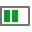 <a href="icons/svgimages/outlook-inspired/inprogress.svg"><code>inprogress.svg</code></a></td>
    <td align="center" valign="top" width="12.5%"> <a href="icons/svgimages/outlook-inspired/italic.svg"><code>italic.svg</code></a></td>
    <td align="center" valign="top" width="12.5%"> <a href="icons/svgimages/outlook-inspired/linespacing.svg"><code>linespacing.svg</code></a></td>
    <td align="center" valign="top" width="12.5%"> <a href="icons/svgimages/outlook-inspired/list.svg"><code>list.svg</code></a></td>
    <td align="center" valign="top" width="12.5%"> <a href="icons/svgimages/outlook-inspired/listbullets.svg"><code>listbullets.svg</code></a></td>
    <td align="center" valign="top" width="12.5%"> <a href="icons/svgimages/outlook-inspired/listmultilevel.svg"><code>listmultilevel.svg</code></a></td>
  </tr>
  <tr>
    <td align="center" valign="top" width="12.5%"> <a href="icons/svgimages/outlook-inspired/listnumbers.svg"><code>listnumbers.svg</code></a></td>
    <td align="center" valign="top" width="12.5%"> <a href="icons/svgimages/outlook-inspired/low.svg"><code>low.svg</code></a></td>
    <td align="center" valign="top" width="12.5%"> <a href="icons/svgimages/outlook-inspired/lowimportance.svg"><code>lowimportance.svg</code></a></td>
    <td align="center" valign="top" width="12.5%"> <a href="icons/svgimages/outlook-inspired/lowpriority.svg"><code>lowpriority.svg</code></a></td>
    <td align="center" valign="top" width="12.5%"> <a href="icons/svgimages/outlook-inspired/mailmerge.svg"><code>mailmerge.svg</code></a></td>
    <td align="center" valign="top" width="12.5%"> <a href="icons/svgimages/outlook-inspired/mapit.svg"><code>mapit.svg</code></a></td>
    <td align="center" valign="top" width="12.5%"> <a href="icons/svgimages/outlook-inspired/markcomplete.svg"><code>markcomplete.svg</code></a></td>
    <td align="center" valign="top" width="12.5%"> <a href="icons/svgimages/outlook-inspired/medium.svg"><code>medium.svg</code></a></td>
  </tr>
  <tr>
    <td align="center" valign="top" width="12.5%"> <a href="icons/svgimages/outlook-inspired/mediumpriority.svg"><code>mediumpriority.svg</code></a></td>
    <td align="center" valign="top" width="12.5%"> <a href="icons/svgimages/outlook-inspired/meeting.svg"><code>meeting.svg</code></a></td>
    <td align="center" valign="top" width="12.5%"> <a href="icons/svgimages/outlook-inspired/miss.svg"><code>miss.svg</code></a></td>
    <td align="center" valign="top" width="12.5%"> <a href="icons/svgimages/outlook-inspired/morecolors.svg"><code>morecolors.svg</code></a></td>
    <td align="center" valign="top" width="12.5%"> <a href="icons/svgimages/outlook-inspired/mr.svg"><code>mr.svg</code></a></td>
    <td align="center" valign="top" width="12.5%"> <a href="icons/svgimages/outlook-inspired/mrs.svg"><code>mrs.svg</code></a></td>
    <td align="center" valign="top" width="12.5%"> <a href="icons/svgimages/outlook-inspired/navigation.svg"><code>navigation.svg</code></a></td>
    <td align="center" valign="top" width="12.5%"> <a href="icons/svgimages/outlook-inspired/needassistance.svg"><code>needassistance.svg</code></a></td>
  </tr>
  <tr>
    <td align="center" valign="top" width="12.5%"> <a href="icons/svgimages/outlook-inspired/new.svg"><code>new.svg</code></a></td>
    <td align="center" valign="top" width="12.5%"> <a href="icons/svgimages/outlook-inspired/newcustomer.svg"><code>newcustomer.svg</code></a></td>
    <td align="center" valign="top" width="12.5%"> <a href="icons/svgimages/outlook-inspired/newemployee.svg"><code>newemployee.svg</code></a></td>
    <td align="center" valign="top" width="12.5%"> <a href="icons/svgimages/outlook-inspired/neworder.svg"><code>neworder.svg</code></a></td>
    <td align="center" valign="top" width="12.5%"> <a href="icons/svgimages/outlook-inspired/newproduct.svg"><code>newproduct.svg</code></a></td>
    <td align="center" valign="top" width="12.5%"> <a href="icons/svgimages/outlook-inspired/newtask.svg"><code>newtask.svg</code></a></td>
    <td align="center" valign="top" width="12.5%"> <a href="icons/svgimages/outlook-inspired/nextweek.svg"><code>nextweek.svg</code></a></td>
    <td align="center" valign="top" width="12.5%"> <a href="icons/svgimages/outlook-inspired/nodate.svg"><code>nodate.svg</code></a></td>
  </tr>
  <tr>
    <td align="center" valign="top" width="12.5%"> <a href="icons/svgimages/outlook-inspired/normalpriority.svg"><code>normalpriority.svg</code></a></td>
    <td align="center" valign="top" width="12.5%"> <a href="icons/svgimages/outlook-inspired/notstarted.svg"><code>notstarted.svg</code></a></td>
    <td align="center" valign="top" width="12.5%"> <a href="icons/svgimages/outlook-inspired/office2010.svg"><code>office2010.svg</code></a></td>
    <td align="center" valign="top" width="12.5%"> <a href="icons/svgimages/outlook-inspired/officeslim.svg"><code>officeslim.svg</code></a></td>
    <td align="center" valign="top" width="12.5%"> <a href="icons/svgimages/outlook-inspired/open.svg"><code>open.svg</code></a></td>
    <td align="center" valign="top" width="12.5%"> <a href="icons/svgimages/outlook-inspired/opportunities.svg"><code>opportunities.svg</code></a></td>
    <td align="center" valign="top" width="12.5%"> <a href="icons/svgimages/outlook-inspired/paid.svg"><code>paid.svg</code></a></td>
    <td align="center" valign="top" width="12.5%"> <a href="icons/svgimages/outlook-inspired/panelbottom.svg"><code>panelbottom.svg</code></a></td>
  </tr>
  <tr>
    <td align="center" valign="top" width="12.5%"> <a href="icons/svgimages/outlook-inspired/paneloff.svg"><code>paneloff.svg</code></a></td>
    <td align="center" valign="top" width="12.5%"> <a href="icons/svgimages/outlook-inspired/panelright.svg"><code>panelright.svg</code></a></td>
    <td align="center" valign="top" width="12.5%"> <a href="icons/svgimages/outlook-inspired/paste.svg"><code>paste.svg</code></a></td>
    <td align="center" valign="top" width="12.5%"> <a href="icons/svgimages/outlook-inspired/pastespecial.svg"><code>pastespecial.svg</code></a></td>
    <td align="center" valign="top" width="12.5%"> <a href="icons/svgimages/outlook-inspired/payment.svg"><code>payment.svg</code></a></td>
    <td align="center" valign="top" width="12.5%"> <a href="icons/svgimages/outlook-inspired/paymentpaid.svg"><code>paymentpaid.svg</code></a></td>
    <td align="center" valign="top" width="12.5%"> <a href="icons/svgimages/outlook-inspired/paymentrefund.svg"><code>paymentrefund.svg</code></a></td>
    <td align="center" valign="top" width="12.5%"> <a href="icons/svgimages/outlook-inspired/paymentunpaid.svg"><code>paymentunpaid.svg</code></a></td>
  </tr>
  <tr>
    <td align="center" valign="top" width="12.5%"> <a href="icons/svgimages/outlook-inspired/print.svg"><code>print.svg</code></a></td>
    <td align="center" valign="top" width="12.5%"> <a href="icons/svgimages/outlook-inspired/printer.svg"><code>printer.svg</code></a></td>
    <td align="center" valign="top" width="12.5%"> <a href="icons/svgimages/outlook-inspired/printquick.svg"><code>printquick.svg</code></a></td>
    <td align="center" valign="top" width="12.5%"> <a href="icons/svgimages/outlook-inspired/prioritized.svg"><code>prioritized.svg</code></a></td>
    <td align="center" valign="top" width="12.5%"> <a href="icons/svgimages/outlook-inspired/private.svg"><code>private.svg</code></a></td>
    <td align="center" valign="top" width="12.5%"> <a href="icons/svgimages/outlook-inspired/productorderdetail-21.svg"><code>productorderdetail-21.svg</code></a></td>
    <td align="center" valign="top" width="12.5%"> <a href="icons/svgimages/outlook-inspired/productquickcomparisons.svg"><code>productquickcomparisons.svg</code></a></td>
    <td align="center" valign="top" width="12.5%"> <a href="icons/svgimages/outlook-inspired/productquickshippments.svg"><code>productquickshippments.svg</code></a></td>
  </tr>
  <tr>
    <td align="center" valign="top" width="12.5%"> <a href="icons/svgimages/outlook-inspired/productquictopsalesperson.svg"><code>productquictopsalesperson.svg</code></a></td>
    <td align="center" valign="top" width="12.5%"> <a href="icons/svgimages/outlook-inspired/products.svg"><code>products.svg</code></a></td>
    <td align="center" valign="top" width="12.5%"> <a href="icons/svgimages/outlook-inspired/productspecificationssummary.svg"><code>productspecificationssummary.svg</code></a></td>
    <td align="center" valign="top" width="12.5%"> <a href="icons/svgimages/outlook-inspired/redo.svg"><code>redo.svg</code></a></td>
    <td align="center" valign="top" width="12.5%"> <a href="icons/svgimages/outlook-inspired/refund.svg"><code>refund.svg</code></a></td>
    <td align="center" valign="top" width="12.5%"> <a href="icons/svgimages/outlook-inspired/replace.svg"><code>replace.svg</code></a></td>
    <td align="center" valign="top" width="12.5%"> <a href="icons/svgimages/outlook-inspired/reset.svg"><code>reset.svg</code></a></td>
    <td align="center" valign="top" width="12.5%"> <a href="icons/svgimages/outlook-inspired/resetview.svg"><code>resetview.svg</code></a></td>
  </tr>
  <tr>
    <td align="center" valign="top" width="12.5%"> <a href="icons/svgimages/outlook-inspired/reverssort.svg"><code>reverssort.svg</code></a></td>
    <td align="center" valign="top" width="12.5%"> <a href="icons/svgimages/outlook-inspired/revertdirection.svg"><code>revertdirection.svg</code></a></td>
    <td align="center" valign="top" width="12.5%"> <a href="icons/svgimages/outlook-inspired/sales.svg"><code>sales.svg</code></a></td>
    <td align="center" valign="top" width="12.5%"> <a href="icons/svgimages/outlook-inspired/salesanalysis.svg"><code>salesanalysis.svg</code></a></td>
    <td align="center" valign="top" width="12.5%"> <a href="icons/svgimages/outlook-inspired/save.svg"><code>save.svg</code></a></td>
    <td align="center" valign="top" width="12.5%"> <a href="icons/svgimages/outlook-inspired/saveandclose.svg"><code>saveandclose.svg</code></a></td>
    <td align="center" valign="top" width="12.5%"> <a href="icons/svgimages/outlook-inspired/saveas.svg"><code>saveas.svg</code></a></td>
    <td align="center" valign="top" width="12.5%"> <a href="icons/svgimages/outlook-inspired/shading.svg"><code>shading.svg</code></a></td>
  </tr>
  <tr>
    <td align="center" valign="top" width="12.5%"> <a href="icons/svgimages/outlook-inspired/shipment.svg"><code>shipment.svg</code></a></td>
    <td align="center" valign="top" width="12.5%"> <a href="icons/svgimages/outlook-inspired/shipmentawaiting.svg"><code>shipmentawaiting.svg</code></a></td>
    <td align="center" valign="top" width="12.5%"> <a href="icons/svgimages/outlook-inspired/shipmentreceived.svg"><code>shipmentreceived.svg</code></a></td>
    <td align="center" valign="top" width="12.5%"> <a href="icons/svgimages/outlook-inspired/shipmenttransit.svg"><code>shipmenttransit.svg</code></a></td>
    <td align="center" valign="top" width="12.5%"> <a href="icons/svgimages/outlook-inspired/showhidden.svg"><code>showhidden.svg</code></a></td>
    <td align="center" valign="top" width="12.5%"> <a href="icons/svgimages/outlook-inspired/sortasc.svg"><code>sortasc.svg</code></a></td>
    <td align="center" valign="top" width="12.5%"> <a href="icons/svgimages/outlook-inspired/sortdesc.svg"><code>sortdesc.svg</code></a></td>
    <td align="center" valign="top" width="12.5%"> <a href="icons/svgimages/outlook-inspired/spellcheck.svg"><code>spellcheck.svg</code></a></td>
  </tr>
  <tr>
    <td align="center" valign="top" width="12.5%"> <a href="icons/svgimages/outlook-inspired/strikeout.svg"><code>strikeout.svg</code></a></td>
    <td align="center" valign="top" width="12.5%"> <a href="icons/svgimages/outlook-inspired/strikeoutdouble.svg"><code>strikeoutdouble.svg</code></a></td>
    <td align="center" valign="top" width="12.5%"> <a href="icons/svgimages/outlook-inspired/subscript.svg"><code>subscript.svg</code></a></td>
    <td align="center" valign="top" width="12.5%"> <a href="icons/svgimages/outlook-inspired/superscript.svg"><code>superscript.svg</code></a></td>
    <td align="center" valign="top" width="12.5%"> <a href="icons/svgimages/outlook-inspired/support.svg"><code>support.svg</code></a></td>
    <td align="center" valign="top" width="12.5%"> <a href="icons/svgimages/outlook-inspired/tabletoffice.svg"><code>tabletoffice.svg</code></a></td>
    <td align="center" valign="top" width="12.5%"> <a href="icons/svgimages/outlook-inspired/task.svg"><code>task.svg</code></a></td>
    <td align="center" valign="top" width="12.5%"> <a href="icons/svgimages/outlook-inspired/tasklist.svg"><code>tasklist.svg</code></a></td>
  </tr>
  <tr>
    <td align="center" valign="top" width="12.5%"> <a href="icons/svgimages/outlook-inspired/tasks.svg"><code>tasks.svg</code></a></td>
    <td align="center" valign="top" width="12.5%"> <a href="icons/svgimages/outlook-inspired/thankyounote.svg"><code>thankyounote.svg</code></a></td>
    <td align="center" valign="top" width="12.5%"> <a href="icons/svgimages/outlook-inspired/thisweek.svg"><code>thisweek.svg</code></a></td>
    <td align="center" valign="top" width="12.5%"> <a href="icons/svgimages/outlook-inspired/today.svg"><code>today.svg</code></a></td>
    <td align="center" valign="top" width="12.5%"> <a href="icons/svgimages/outlook-inspired/tomorrow.svg"><code>tomorrow.svg</code></a></td>
    <td align="center" valign="top" width="12.5%"> <a href="icons/svgimages/outlook-inspired/underline.svg"><code>underline.svg</code></a></td>
    <td align="center" valign="top" width="12.5%"> <a href="icons/svgimages/outlook-inspired/underlinedouble.svg"><code>underlinedouble.svg</code></a></td>
    <td align="center" valign="top" width="12.5%"> <a href="icons/svgimages/outlook-inspired/underlineword.svg"><code>underlineword.svg</code></a></td>
  </tr>
  <tr>
    <td align="center" valign="top" width="12.5%"> <a href="icons/svgimages/outlook-inspired/undo.svg"><code>undo.svg</code></a></td>
    <td align="center" valign="top" width="12.5%"> <a href="icons/svgimages/outlook-inspired/unlike.svg"><code>unlike.svg</code></a></td>
    <td align="center" valign="top" width="12.5%"> <a href="icons/svgimages/outlook-inspired/walking.svg"><code>walking.svg</code></a></td>
    <td></td>
    <td></td>
    <td></td>
    <td></td>
    <td></td>
  </tr>
</table>

### pages

Liczba ikon: 1

<table>
  <tr>
    <td align="center" valign="top" width="12.5%"> <a href="icons/svgimages/pages/insertpagebreak.svg"><code>insertpagebreak.svg</code></a></td>
    <td></td>
    <td></td>
    <td></td>
    <td></td>
    <td></td>
    <td></td>
    <td></td>
  </tr>
</table>

### pdf viewer

Liczba ikon: 31

<table>
  <tr>
    <td align="center" valign="top" width="12.5%"> <a href="icons/svgimages/pdf-viewer/attachments.svg"><code>attachments.svg</code></a></td>
    <td align="center" valign="top" width="12.5%"> <a href="icons/svgimages/pdf-viewer/copy.svg"><code>copy.svg</code></a></td>
    <td align="center" valign="top" width="12.5%"> <a href="icons/svgimages/pdf-viewer/documentpdf.svg"><code>documentpdf.svg</code></a></td>
    <td align="center" valign="top" width="12.5%"> <a href="icons/svgimages/pdf-viewer/enablescrolling.svg"><code>enablescrolling.svg</code></a></td>
    <td align="center" valign="top" width="12.5%"> <a href="icons/svgimages/pdf-viewer/expandbookmark.svg"><code>expandbookmark.svg</code></a></td>
    <td align="center" valign="top" width="12.5%"> <a href="icons/svgimages/pdf-viewer/handtool.svg"><code>handtool.svg</code></a></td>
    <td align="center" valign="top" width="12.5%"> <a href="icons/svgimages/pdf-viewer/highlight.svg"><code>highlight.svg</code></a></td>
    <td align="center" valign="top" width="12.5%"> <a href="icons/svgimages/pdf-viewer/import.svg"><code>import.svg</code></a></td>
  </tr>
  <tr>
    <td align="center" valign="top" width="12.5%"> <a href="icons/svgimages/pdf-viewer/marqueezoom.svg"><code>marqueezoom.svg</code></a></td>
    <td align="center" valign="top" width="12.5%"> <a href="icons/svgimages/pdf-viewer/menu.svg"><code>menu.svg</code></a></td>
    <td align="center" valign="top" width="12.5%"> <a href="icons/svgimages/pdf-viewer/next.svg"><code>next.svg</code></a></td>
    <td align="center" valign="top" width="12.5%"> <a href="icons/svgimages/pdf-viewer/nextview.svg"><code>nextview.svg</code></a></td>
    <td align="center" valign="top" width="12.5%"> <a href="icons/svgimages/pdf-viewer/open.svg"><code>open.svg</code></a></td>
    <td align="center" valign="top" width="12.5%"> <a href="icons/svgimages/pdf-viewer/openfromweb.svg"><code>openfromweb.svg</code></a></td>
    <td align="center" valign="top" width="12.5%"> <a href="icons/svgimages/pdf-viewer/preview.svg"><code>preview.svg</code></a></td>
    <td align="center" valign="top" width="12.5%"> <a href="icons/svgimages/pdf-viewer/previous.svg"><code>previous.svg</code></a></td>
  </tr>
  <tr>
    <td align="center" valign="top" width="12.5%"> <a href="icons/svgimages/pdf-viewer/previousview.svg"><code>previousview.svg</code></a></td>
    <td align="center" valign="top" width="12.5%"> <a href="icons/svgimages/pdf-viewer/print.svg"><code>print.svg</code></a></td>
    <td align="center" valign="top" width="12.5%"> <a href="icons/svgimages/pdf-viewer/rotateclockwise.svg"><code>rotateclockwise.svg</code></a></td>
    <td align="center" valign="top" width="12.5%"> <a href="icons/svgimages/pdf-viewer/rotatecounterclockwise.svg"><code>rotatecounterclockwise.svg</code></a></td>
    <td align="center" valign="top" width="12.5%"> <a href="icons/svgimages/pdf-viewer/saveas.svg"><code>saveas.svg</code></a></td>
    <td align="center" valign="top" width="12.5%"> <a href="icons/svgimages/pdf-viewer/searchsettingbutton.svg"><code>searchsettingbutton.svg</code></a></td>
    <td align="center" valign="top" width="12.5%"> <a href="icons/svgimages/pdf-viewer/select.svg"><code>select.svg</code></a></td>
    <td align="center" valign="top" width="12.5%"> <a href="icons/svgimages/pdf-viewer/selectall.svg"><code>selectall.svg</code></a></td>
  </tr>
  <tr>
    <td align="center" valign="top" width="12.5%"> <a href="icons/svgimages/pdf-viewer/singlepageview.svg"><code>singlepageview.svg</code></a></td>
    <td align="center" valign="top" width="12.5%"> <a href="icons/svgimages/pdf-viewer/strikeout.svg"><code>strikeout.svg</code></a></td>
    <td align="center" valign="top" width="12.5%"> <a href="icons/svgimages/pdf-viewer/twopagescrolling.svg"><code>twopagescrolling.svg</code></a></td>
    <td align="center" valign="top" width="12.5%"> <a href="icons/svgimages/pdf-viewer/twopageview.svg"><code>twopageview.svg</code></a></td>
    <td align="center" valign="top" width="12.5%"> <a href="icons/svgimages/pdf-viewer/underline.svg"><code>underline.svg</code></a></td>
    <td align="center" valign="top" width="12.5%"> <a href="icons/svgimages/pdf-viewer/zoom.svg"><code>zoom.svg</code></a></td>
    <td align="center" valign="top" width="12.5%"> <a href="icons/svgimages/pdf-viewer/zoomout.svg"><code>zoomout.svg</code></a></td>
    <td></td>
  </tr>
</table>

### print

Liczba ikon: 3

<table>
  <tr>
    <td align="center" valign="top" width="12.5%"> <a href="icons/svgimages/print/preview.svg"><code>preview.svg</code></a></td>
    <td align="center" valign="top" width="12.5%"> <a href="icons/svgimages/print/print.svg"><code>print.svg</code></a></td>
    <td align="center" valign="top" width="12.5%"> <a href="icons/svgimages/print/printdialog.svg"><code>printdialog.svg</code></a></td>
    <td></td>
    <td></td>
    <td></td>
    <td></td>
    <td></td>
  </tr>
</table>

### reports

Liczba ikon: 55

<table>
  <tr>
    <td align="center" valign="top" width="12.5%"> <a href="icons/svgimages/reports/addcalculatedfield.svg"><code>addcalculatedfield.svg</code></a></td>
    <td align="center" valign="top" width="12.5%"> <a href="icons/svgimages/reports/addparameter.svg"><code>addparameter.svg</code></a></td>
    <td align="center" valign="top" width="12.5%"> <a href="icons/svgimages/reports/alignmentbottomcenter.svg"><code>alignmentbottomcenter.svg</code></a></td>
    <td align="center" valign="top" width="12.5%"> <a href="icons/svgimages/reports/alignmentbottomleft.svg"><code>alignmentbottomleft.svg</code></a></td>
    <td align="center" valign="top" width="12.5%"> <a href="icons/svgimages/reports/alignmentbottomright.svg"><code>alignmentbottomright.svg</code></a></td>
    <td align="center" valign="top" width="12.5%"> <a href="icons/svgimages/reports/alignmentcentercenter.svg"><code>alignmentcentercenter.svg</code></a></td>
    <td align="center" valign="top" width="12.5%"> <a href="icons/svgimages/reports/alignmentcenterleft.svg"><code>alignmentcenterleft.svg</code></a></td>
    <td align="center" valign="top" width="12.5%"> <a href="icons/svgimages/reports/alignmentcenterright.svg"><code>alignmentcenterright.svg</code></a></td>
  </tr>
  <tr>
    <td align="center" valign="top" width="12.5%"> <a href="icons/svgimages/reports/alignmenttopcenter.svg"><code>alignmenttopcenter.svg</code></a></td>
    <td align="center" valign="top" width="12.5%"> <a href="icons/svgimages/reports/alignmenttopleft.svg"><code>alignmenttopleft.svg</code></a></td>
    <td align="center" valign="top" width="12.5%"> <a href="icons/svgimages/reports/alignmenttopright.svg"><code>alignmenttopright.svg</code></a></td>
    <td align="center" valign="top" width="12.5%"> <a href="icons/svgimages/reports/aligntogrid.svg"><code>aligntogrid.svg</code></a></td>
    <td align="center" valign="top" width="12.5%"> <a href="icons/svgimages/reports/automodule.svg"><code>automodule.svg</code></a></td>
    <td align="center" valign="top" width="12.5%">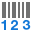 <a href="icons/svgimages/reports/barcodeshowtext.svg"><code>barcodeshowtext.svg</code></a></td>
    <td align="center" valign="top" width="12.5%"> <a href="icons/svgimages/reports/changecharttype.svg"><code>changecharttype.svg</code></a></td>
    <td align="center" valign="top" width="12.5%"> <a href="icons/svgimages/reports/chartdesigner.svg"><code>chartdesigner.svg</code></a></td>
  </tr>
  <tr>
    <td align="center" valign="top" width="12.5%"> <a href="icons/svgimages/reports/distributecolumnsevenly.svg"><code>distributecolumnsevenly.svg</code></a></td>
    <td align="center" valign="top" width="12.5%"> <a href="icons/svgimages/reports/distributerowsevenly.svg"><code>distributerowsevenly.svg</code></a></td>
    <td align="center" valign="top" width="12.5%"> <a href="icons/svgimages/reports/extractstyle.svg"><code>extractstyle.svg</code></a></td>
    <td align="center" valign="top" width="12.5%"> <a href="icons/svgimages/reports/fitboundstocontainer.svg"><code>fitboundstocontainer.svg</code></a></td>
    <td align="center" valign="top" width="12.5%"> <a href="icons/svgimages/reports/fitboundstogrid.svg"><code>fitboundstogrid.svg</code></a></td>
    <td align="center" valign="top" width="12.5%"> <a href="icons/svgimages/reports/fitboundstotext.svg"><code>fitboundstotext.svg</code></a></td>
    <td align="center" valign="top" width="12.5%"> <a href="icons/svgimages/reports/fittexttobounds.svg"><code>fittexttobounds.svg</code></a></td>
    <td align="center" valign="top" width="12.5%"> <a href="icons/svgimages/reports/gaugestylefullcircular.svg"><code>gaugestylefullcircular.svg</code></a></td>
  </tr>
  <tr>
    <td align="center" valign="top" width="12.5%"> <a href="icons/svgimages/reports/gaugestylehalfcircular.svg"><code>gaugestylehalfcircular.svg</code></a></td>
    <td align="center" valign="top" width="12.5%"> <a href="icons/svgimages/reports/gaugestyleleftquartercircular.svg"><code>gaugestyleleftquartercircular.svg</code></a></td>
    <td align="center" valign="top" width="12.5%"> <a href="icons/svgimages/reports/gaugestylelinearhorizontal.svg"><code>gaugestylelinearhorizontal.svg</code></a></td>
    <td align="center" valign="top" width="12.5%"> <a href="icons/svgimages/reports/gaugestylelinearvertical.svg"><code>gaugestylelinearvertical.svg</code></a></td>
    <td align="center" valign="top" width="12.5%"> <a href="icons/svgimages/reports/gaugestylerightquartercircular.svg"><code>gaugestylerightquartercircular.svg</code></a></td>
    <td align="center" valign="top" width="12.5%"> <a href="icons/svgimages/reports/gaugestylethreeforthcircular.svg"><code>gaugestylethreeforthcircular.svg</code></a></td>
    <td align="center" valign="top" width="12.5%"> <a href="icons/svgimages/reports/groupfooter.svg"><code>groupfooter.svg</code></a></td>
    <td align="center" valign="top" width="12.5%"> <a href="icons/svgimages/reports/groupheader.svg"><code>groupheader.svg</code></a></td>
  </tr>
  <tr>
    <td align="center" valign="top" width="12.5%"> <a href="icons/svgimages/reports/imageannotation.svg"><code>imageannotation.svg</code></a></td>
    <td align="center" valign="top" width="12.5%"> <a href="icons/svgimages/reports/loadchart.svg"><code>loadchart.svg</code></a></td>
    <td align="center" valign="top" width="12.5%"> <a href="icons/svgimages/reports/mergecells.svg"><code>mergecells.svg</code></a></td>
    <td align="center" valign="top" width="12.5%"> <a href="icons/svgimages/reports/pivotgriddesigner.svg"><code>pivotgriddesigner.svg</code></a></td>
    <td align="center" valign="top" width="12.5%"> <a href="icons/svgimages/reports/preview.svg"><code>preview.svg</code></a></td>
    <td align="center" valign="top" width="12.5%"> <a href="icons/svgimages/reports/printallpages.svg"><code>printallpages.svg</code></a></td>
    <td align="center" valign="top" width="12.5%"> <a href="icons/svgimages/reports/printcollated.svg"><code>printcollated.svg</code></a></td>
    <td align="center" valign="top" width="12.5%"> <a href="icons/svgimages/reports/printcurrentpage.svg"><code>printcurrentpage.svg</code></a></td>
  </tr>
  <tr>
    <td align="center" valign="top" width="12.5%"> <a href="icons/svgimages/reports/printnotcollated.svg"><code>printnotcollated.svg</code></a></td>
    <td align="center" valign="top" width="12.5%"> <a href="icons/svgimages/reports/printpagerange.svg"><code>printpagerange.svg</code></a></td>
    <td align="center" valign="top" width="12.5%"> <a href="icons/svgimages/reports/repeatcolumnheadersoneverypage.svg"><code>repeatcolumnheadersoneverypage.svg</code></a></td>
    <td align="center" valign="top" width="12.5%"> <a href="icons/svgimages/reports/repeatrowheadersoneverypage.svg"><code>repeatrowheadersoneverypage.svg</code></a></td>
    <td align="center" valign="top" width="12.5%"> <a href="icons/svgimages/reports/showexportwarnings.svg"><code>showexportwarnings.svg</code></a></td>
    <td align="center" valign="top" width="12.5%"> <a href="icons/svgimages/reports/showgridlines.svg"><code>showgridlines.svg</code></a></td>
    <td align="center" valign="top" width="12.5%"> <a href="icons/svgimages/reports/showhorizontallines.svg"><code>showhorizontallines.svg</code></a></td>
    <td align="center" valign="top" width="12.5%"> <a href="icons/svgimages/reports/showprintingwarnings.svg"><code>showprintingwarnings.svg</code></a></td>
  </tr>
  <tr>
    <td align="center" valign="top" width="12.5%"> <a href="icons/svgimages/reports/showverticallines.svg"><code>showverticallines.svg</code></a></td>
    <td align="center" valign="top" width="12.5%"> <a href="icons/svgimages/reports/sparklinearea.svg"><code>sparklinearea.svg</code></a></td>
    <td align="center" valign="top" width="12.5%"> <a href="icons/svgimages/reports/sparklinebar.svg"><code>sparklinebar.svg</code></a></td>
    <td align="center" valign="top" width="12.5%"> <a href="icons/svgimages/reports/sparklineline.svg"><code>sparklineline.svg</code></a></td>
    <td align="center" valign="top" width="12.5%"> <a href="icons/svgimages/reports/sparklinewinloss.svg"><code>sparklinewinloss.svg</code></a></td>
    <td align="center" valign="top" width="12.5%"> <a href="icons/svgimages/reports/splitcells.svg"><code>splitcells.svg</code></a></td>
    <td align="center" valign="top" width="12.5%"> <a href="icons/svgimages/reports/textannotation.svg"><code>textannotation.svg</code></a></td>
    <td></td>
  </tr>
</table>

### richedit

Liczba ikon: 245

<table>
  <tr>
    <td align="center" valign="top" width="12.5%"> <a href="icons/svgimages/richedit/addparagraphtotableofcontents.svg"><code>addparagraphtotableofcontents.svg</code></a></td>
    <td align="center" valign="top" width="12.5%"> <a href="icons/svgimages/richedit/alignbottomcenter.svg"><code>alignbottomcenter.svg</code></a></td>
    <td align="center" valign="top" width="12.5%"> <a href="icons/svgimages/richedit/alignbottomcenterrotated.svg"><code>alignbottomcenterrotated.svg</code></a></td>
    <td align="center" valign="top" width="12.5%"> <a href="icons/svgimages/richedit/alignbottomleft.svg"><code>alignbottomleft.svg</code></a></td>
    <td align="center" valign="top" width="12.5%"> <a href="icons/svgimages/richedit/alignbottomleftrotated.svg"><code>alignbottomleftrotated.svg</code></a></td>
    <td align="center" valign="top" width="12.5%"> <a href="icons/svgimages/richedit/alignbottomright.svg"><code>alignbottomright.svg</code></a></td>
    <td align="center" valign="top" width="12.5%"> <a href="icons/svgimages/richedit/alignbottomrightrotated.svg"><code>alignbottomrightrotated.svg</code></a></td>
    <td align="center" valign="top" width="12.5%"> <a href="icons/svgimages/richedit/alignfloatingobjectbottomcenter.svg"><code>alignfloatingobjectbottomcenter.svg</code></a></td>
  </tr>
  <tr>
    <td align="center" valign="top" width="12.5%"> <a href="icons/svgimages/richedit/alignfloatingobjectbottomleft.svg"><code>alignfloatingobjectbottomleft.svg</code></a></td>
    <td align="center" valign="top" width="12.5%"> <a href="icons/svgimages/richedit/alignfloatingobjectbottomright.svg"><code>alignfloatingobjectbottomright.svg</code></a></td>
    <td align="center" valign="top" width="12.5%"> <a href="icons/svgimages/richedit/alignfloatingobjectmiddlecenter.svg"><code>alignfloatingobjectmiddlecenter.svg</code></a></td>
    <td align="center" valign="top" width="12.5%"> <a href="icons/svgimages/richedit/alignfloatingobjectmiddleleft.svg"><code>alignfloatingobjectmiddleleft.svg</code></a></td>
    <td align="center" valign="top" width="12.5%"> <a href="icons/svgimages/richedit/alignfloatingobjectmiddleright.svg"><code>alignfloatingobjectmiddleright.svg</code></a></td>
    <td align="center" valign="top" width="12.5%"> <a href="icons/svgimages/richedit/alignfloatingobjecttopcenter.svg"><code>alignfloatingobjecttopcenter.svg</code></a></td>
    <td align="center" valign="top" width="12.5%"> <a href="icons/svgimages/richedit/alignfloatingobjecttopleft.svg"><code>alignfloatingobjecttopleft.svg</code></a></td>
    <td align="center" valign="top" width="12.5%"> <a href="icons/svgimages/richedit/alignfloatingobjecttopright.svg"><code>alignfloatingobjecttopright.svg</code></a></td>
  </tr>
  <tr>
    <td align="center" valign="top" width="12.5%"> <a href="icons/svgimages/richedit/alignmiddlecenter.svg"><code>alignmiddlecenter.svg</code></a></td>
    <td align="center" valign="top" width="12.5%"> <a href="icons/svgimages/richedit/alignmiddlecenterrotated.svg"><code>alignmiddlecenterrotated.svg</code></a></td>
    <td align="center" valign="top" width="12.5%"> <a href="icons/svgimages/richedit/alignmiddleleft.svg"><code>alignmiddleleft.svg</code></a></td>
    <td align="center" valign="top" width="12.5%"> <a href="icons/svgimages/richedit/alignmiddleleftrotated.svg"><code>alignmiddleleftrotated.svg</code></a></td>
    <td align="center" valign="top" width="12.5%"> <a href="icons/svgimages/richedit/alignmiddleright.svg"><code>alignmiddleright.svg</code></a></td>
    <td align="center" valign="top" width="12.5%"> <a href="icons/svgimages/richedit/alignmiddlerightrotated.svg"><code>alignmiddlerightrotated.svg</code></a></td>
    <td align="center" valign="top" width="12.5%"> <a href="icons/svgimages/richedit/alignright.svg"><code>alignright.svg</code></a></td>
    <td align="center" valign="top" width="12.5%"> <a href="icons/svgimages/richedit/aligntopcenter.svg"><code>aligntopcenter.svg</code></a></td>
  </tr>
  <tr>
    <td align="center" valign="top" width="12.5%"> <a href="icons/svgimages/richedit/aligntopcenterrotated.svg"><code>aligntopcenterrotated.svg</code></a></td>
    <td align="center" valign="top" width="12.5%"> <a href="icons/svgimages/richedit/aligntopleft.svg"><code>aligntopleft.svg</code></a></td>
    <td align="center" valign="top" width="12.5%"> <a href="icons/svgimages/richedit/aligntopleftrotated.svg"><code>aligntopleftrotated.svg</code></a></td>
    <td align="center" valign="top" width="12.5%"> <a href="icons/svgimages/richedit/aligntopright.svg"><code>aligntopright.svg</code></a></td>
    <td align="center" valign="top" width="12.5%"> <a href="icons/svgimages/richedit/aligntoprightrotated.svg"><code>aligntoprightrotated.svg</code></a></td>
    <td align="center" valign="top" width="12.5%"> <a href="icons/svgimages/richedit/bold.svg"><code>bold.svg</code></a></td>
    <td align="center" valign="top" width="12.5%">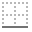 <a href="icons/svgimages/richedit/borderbottom.svg"><code>borderbottom.svg</code></a></td>
    <td align="center" valign="top" width="12.5%">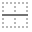 <a href="icons/svgimages/richedit/borderinsidehorizontal.svg"><code>borderinsidehorizontal.svg</code></a></td>
  </tr>
  <tr>
    <td align="center" valign="top" width="12.5%">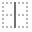 <a href="icons/svgimages/richedit/borderinsidevertical.svg"><code>borderinsidevertical.svg</code></a></td>
    <td align="center" valign="top" width="12.5%">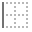 <a href="icons/svgimages/richedit/borderleft.svg"><code>borderleft.svg</code></a></td>
    <td align="center" valign="top" width="12.5%">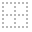 <a href="icons/svgimages/richedit/bordernone.svg"><code>bordernone.svg</code></a></td>
    <td align="center" valign="top" width="12.5%">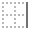 <a href="icons/svgimages/richedit/borderright.svg"><code>borderright.svg</code></a></td>
    <td align="center" valign="top" width="12.5%"> <a href="icons/svgimages/richedit/bordersall.svg"><code>bordersall.svg</code></a></td>
    <td align="center" valign="top" width="12.5%"> <a href="icons/svgimages/richedit/bordersandshading.svg"><code>bordersandshading.svg</code></a></td>
    <td align="center" valign="top" width="12.5%"> <a href="icons/svgimages/richedit/bordersbox.svg"><code>bordersbox.svg</code></a></td>
    <td align="center" valign="top" width="12.5%"> <a href="icons/svgimages/richedit/borderscustom.svg"><code>borderscustom.svg</code></a></td>
  </tr>
  <tr>
    <td align="center" valign="top" width="12.5%"> <a href="icons/svgimages/richedit/bordersgrid.svg"><code>bordersgrid.svg</code></a></td>
    <td align="center" valign="top" width="12.5%">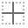 <a href="icons/svgimages/richedit/bordersinside.svg"><code>bordersinside.svg</code></a></td>
    <td align="center" valign="top" width="12.5%"> <a href="icons/svgimages/richedit/bordersoutside.svg"><code>bordersoutside.svg</code></a></td>
    <td align="center" valign="top" width="12.5%"> <a href="icons/svgimages/richedit/bordertop.svg"><code>bordertop.svg</code></a></td>
    <td align="center" valign="top" width="12.5%"> <a href="icons/svgimages/richedit/bringtofrontoftext.svg"><code>bringtofrontoftext.svg</code></a></td>
    <td align="center" valign="top" width="12.5%"> <a href="icons/svgimages/richedit/changefontstyle.svg"><code>changefontstyle.svg</code></a></td>
    <td align="center" valign="top" width="12.5%"> <a href="icons/svgimages/richedit/changetextcase.svg"><code>changetextcase.svg</code></a></td>
    <td align="center" valign="top" width="12.5%"> <a href="icons/svgimages/richedit/clearheaderandfooter.svg"><code>clearheaderandfooter.svg</code></a></td>
  </tr>
  <tr>
    <td align="center" valign="top" width="12.5%"> <a href="icons/svgimages/richedit/closeheaderandfooter.svg"><code>closeheaderandfooter.svg</code></a></td>
    <td align="center" valign="top" width="12.5%"> <a href="icons/svgimages/richedit/columns.svg"><code>columns.svg</code></a></td>
    <td align="center" valign="top" width="12.5%"> <a href="icons/svgimages/richedit/columnsleft.svg"><code>columnsleft.svg</code></a></td>
    <td align="center" valign="top" width="12.5%"> <a href="icons/svgimages/richedit/columnsone.svg"><code>columnsone.svg</code></a></td>
    <td align="center" valign="top" width="12.5%"> <a href="icons/svgimages/richedit/columnsright.svg"><code>columnsright.svg</code></a></td>
    <td align="center" valign="top" width="12.5%"> <a href="icons/svgimages/richedit/columnsthree.svg"><code>columnsthree.svg</code></a></td>
    <td align="center" valign="top" width="12.5%"> <a href="icons/svgimages/richedit/columnstwo.svg"><code>columnstwo.svg</code></a></td>
    <td align="center" valign="top" width="12.5%"> <a href="icons/svgimages/richedit/copy.svg"><code>copy.svg</code></a></td>
  </tr>
  <tr>
    <td align="center" valign="top" width="12.5%"> <a href="icons/svgimages/richedit/customizemergefield.svg"><code>customizemergefield.svg</code></a></td>
    <td align="center" valign="top" width="12.5%"> <a href="icons/svgimages/richedit/cut.svg"><code>cut.svg</code></a></td>
    <td align="center" valign="top" width="12.5%"> <a href="icons/svgimages/richedit/deletecomment.svg"><code>deletecomment.svg</code></a></td>
    <td align="center" valign="top" width="12.5%"> <a href="icons/svgimages/richedit/deletehyperlink.svg"><code>deletehyperlink.svg</code></a></td>
    <td align="center" valign="top" width="12.5%"> <a href="icons/svgimages/richedit/deletetable.svg"><code>deletetable.svg</code></a></td>
    <td align="center" valign="top" width="12.5%"> <a href="icons/svgimages/richedit/deletetablecells.svg"><code>deletetablecells.svg</code></a></td>
    <td align="center" valign="top" width="12.5%"> <a href="icons/svgimages/richedit/deletetablecolumns.svg"><code>deletetablecolumns.svg</code></a></td>
    <td align="center" valign="top" width="12.5%"> <a href="icons/svgimages/richedit/deletetablerows.svg"><code>deletetablerows.svg</code></a></td>
  </tr>
  <tr>
    <td align="center" valign="top" width="12.5%"> <a href="icons/svgimages/richedit/deletewatermark.svg"><code>deletewatermark.svg</code></a></td>
    <td align="center" valign="top" width="12.5%"> <a href="icons/svgimages/richedit/differentfirstpage.svg"><code>differentfirstpage.svg</code></a></td>
    <td align="center" valign="top" width="12.5%"> <a href="icons/svgimages/richedit/differentoddevenpages.svg"><code>differentoddevenpages.svg</code></a></td>
    <td align="center" valign="top" width="12.5%"> <a href="icons/svgimages/richedit/distributed.svg"><code>distributed.svg</code></a></td>
    <td align="center" valign="top" width="12.5%"> <a href="icons/svgimages/richedit/documentproperties.svg"><code>documentproperties.svg</code></a></td>
    <td align="center" valign="top" width="12.5%"> <a href="icons/svgimages/richedit/documentstatistics.svg"><code>documentstatistics.svg</code></a></td>
    <td align="center" valign="top" width="12.5%"> <a href="icons/svgimages/richedit/draftview.svg"><code>draftview.svg</code></a></td>
    <td align="center" valign="top" width="12.5%"> <a href="icons/svgimages/richedit/editrangepermission.svg"><code>editrangepermission.svg</code></a></td>
  </tr>
  <tr>
    <td align="center" valign="top" width="12.5%"> <a href="icons/svgimages/richedit/editwatermark.svg"><code>editwatermark.svg</code></a></td>
    <td align="center" valign="top" width="12.5%"> <a href="icons/svgimages/richedit/editwrappoints.svg"><code>editwrappoints.svg</code></a></td>
    <td align="center" valign="top" width="12.5%"> <a href="icons/svgimages/richedit/encryptdocument.svg"><code>encryptdocument.svg</code></a></td>
    <td align="center" valign="top" width="12.5%"> <a href="icons/svgimages/richedit/first.svg"><code>first.svg</code></a></td>
    <td align="center" valign="top" width="12.5%"> <a href="icons/svgimages/richedit/floatingobjectalignment.svg"><code>floatingobjectalignment.svg</code></a></td>
    <td align="center" valign="top" width="12.5%"> <a href="icons/svgimages/richedit/floatingobjectbringforward.svg"><code>floatingobjectbringforward.svg</code></a></td>
    <td align="center" valign="top" width="12.5%"> <a href="icons/svgimages/richedit/floatingobjectbringinfrontoftext.svg"><code>floatingobjectbringinfrontoftext.svg</code></a></td>
    <td align="center" valign="top" width="12.5%"> <a href="icons/svgimages/richedit/floatingobjectbringtofront.svg"><code>floatingobjectbringtofront.svg</code></a></td>
  </tr>
  <tr>
    <td align="center" valign="top" width="12.5%"> <a href="icons/svgimages/richedit/floatingobjectbringtofrontoftext.svg"><code>floatingobjectbringtofrontoftext.svg</code></a></td>
    <td align="center" valign="top" width="12.5%"> <a href="icons/svgimages/richedit/floatingobjectfillcolor.svg"><code>floatingobjectfillcolor.svg</code></a></td>
    <td align="center" valign="top" width="12.5%"> <a href="icons/svgimages/richedit/floatingobjectlayoutoptions.svg"><code>floatingobjectlayoutoptions.svg</code></a></td>
    <td align="center" valign="top" width="12.5%"> <a href="icons/svgimages/richedit/floatingobjectoutlinecolor.svg"><code>floatingobjectoutlinecolor.svg</code></a></td>
    <td align="center" valign="top" width="12.5%"> <a href="icons/svgimages/richedit/floatingobjectsendbackward.svg"><code>floatingobjectsendbackward.svg</code></a></td>
    <td align="center" valign="top" width="12.5%"> <a href="icons/svgimages/richedit/floatingobjectsendbehindtext.svg"><code>floatingobjectsendbehindtext.svg</code></a></td>
    <td align="center" valign="top" width="12.5%"> <a href="icons/svgimages/richedit/floatingobjectsendtoback.svg"><code>floatingobjectsendtoback.svg</code></a></td>
    <td align="center" valign="top" width="12.5%"> <a href="icons/svgimages/richedit/floatingobjecttextwraptype.svg"><code>floatingobjecttextwraptype.svg</code></a></td>
  </tr>
  <tr>
    <td align="center" valign="top" width="12.5%"> <a href="icons/svgimages/richedit/font.svg"><code>font.svg</code></a></td>
    <td align="center" valign="top" width="12.5%"> <a href="icons/svgimages/richedit/fontcolor.svg"><code>fontcolor.svg</code></a></td>
    <td align="center" valign="top" width="12.5%"> <a href="icons/svgimages/richedit/fontsize.svg"><code>fontsize.svg</code></a></td>
    <td align="center" valign="top" width="12.5%"> <a href="icons/svgimages/richedit/fontsizedecrease.svg"><code>fontsizedecrease.svg</code></a></td>
    <td align="center" valign="top" width="12.5%"> <a href="icons/svgimages/richedit/fontsizeincrease.svg"><code>fontsizeincrease.svg</code></a></td>
    <td align="center" valign="top" width="12.5%"> <a href="icons/svgimages/richedit/footer.svg"><code>footer.svg</code></a></td>
    <td align="center" valign="top" width="12.5%"> <a href="icons/svgimages/richedit/gotofooter.svg"><code>gotofooter.svg</code></a></td>
    <td align="center" valign="top" width="12.5%"> <a href="icons/svgimages/richedit/gotoheader.svg"><code>gotoheader.svg</code></a></td>
  </tr>
  <tr>
    <td align="center" valign="top" width="12.5%"> <a href="icons/svgimages/richedit/gotonextheaderfooter.svg"><code>gotonextheaderfooter.svg</code></a></td>
    <td align="center" valign="top" width="12.5%"> <a href="icons/svgimages/richedit/gotopreviousheaderfooter.svg"><code>gotopreviousheaderfooter.svg</code></a></td>
    <td align="center" valign="top" width="12.5%"> <a href="icons/svgimages/richedit/header.svg"><code>header.svg</code></a></td>
    <td align="center" valign="top" width="12.5%"> <a href="icons/svgimages/richedit/highlight.svg"><code>highlight.svg</code></a></td>
    <td align="center" valign="top" width="12.5%"> <a href="icons/svgimages/richedit/hyperlink.svg"><code>hyperlink.svg</code></a></td>
    <td align="center" valign="top" width="12.5%"> <a href="icons/svgimages/richedit/hyphenation.svg"><code>hyphenation.svg</code></a></td>
    <td align="center" valign="top" width="12.5%"> <a href="icons/svgimages/richedit/indentincrease.svg"><code>indentincrease.svg</code></a></td>
    <td align="center" valign="top" width="12.5%"> <a href="icons/svgimages/richedit/inlinewithtext.svg"><code>inlinewithtext.svg</code></a></td>
  </tr>
  <tr>
    <td align="center" valign="top" width="12.5%"> <a href="icons/svgimages/richedit/insertcaption.svg"><code>insertcaption.svg</code></a></td>
    <td align="center" valign="top" width="12.5%"> <a href="icons/svgimages/richedit/insertcolumnbreak.svg"><code>insertcolumnbreak.svg</code></a></td>
    <td align="center" valign="top" width="12.5%"> <a href="icons/svgimages/richedit/insertdatafield.svg"><code>insertdatafield.svg</code></a></td>
    <td align="center" valign="top" width="12.5%"> <a href="icons/svgimages/richedit/insertendnote.svg"><code>insertendnote.svg</code></a></td>
    <td align="center" valign="top" width="12.5%"> <a href="icons/svgimages/richedit/insertequationcaption.svg"><code>insertequationcaption.svg</code></a></td>
    <td align="center" valign="top" width="12.5%"> <a href="icons/svgimages/richedit/insertfigurecaption.svg"><code>insertfigurecaption.svg</code></a></td>
    <td align="center" valign="top" width="12.5%"> <a href="icons/svgimages/richedit/insertfloatingobjectimage.svg"><code>insertfloatingobjectimage.svg</code></a></td>
    <td align="center" valign="top" width="12.5%"> <a href="icons/svgimages/richedit/insertfootnote.svg"><code>insertfootnote.svg</code></a></td>
  </tr>
  <tr>
    <td align="center" valign="top" width="12.5%"> <a href="icons/svgimages/richedit/insertimage.svg"><code>insertimage.svg</code></a></td>
    <td align="center" valign="top" width="12.5%"> <a href="icons/svgimages/richedit/insertpagebreak.svg"><code>insertpagebreak.svg</code></a></td>
    <td align="center" valign="top" width="12.5%"> <a href="icons/svgimages/richedit/insertpagecount.svg"><code>insertpagecount.svg</code></a></td>
    <td align="center" valign="top" width="12.5%"> <a href="icons/svgimages/richedit/insertpagenumber.svg"><code>insertpagenumber.svg</code></a></td>
    <td align="center" valign="top" width="12.5%"> <a href="icons/svgimages/richedit/insertsectionbreakcontinuous.svg"><code>insertsectionbreakcontinuous.svg</code></a></td>
    <td align="center" valign="top" width="12.5%">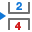 <a href="icons/svgimages/richedit/insertsectionbreakevenpage.svg"><code>insertsectionbreakevenpage.svg</code></a></td>
    <td align="center" valign="top" width="12.5%"> <a href="icons/svgimages/richedit/insertsectionbreaknextpage.svg"><code>insertsectionbreaknextpage.svg</code></a></td>
    <td align="center" valign="top" width="12.5%"> <a href="icons/svgimages/richedit/insertsectionbreakoddpage.svg"><code>insertsectionbreakoddpage.svg</code></a></td>
  </tr>
  <tr>
    <td align="center" valign="top" width="12.5%"> <a href="icons/svgimages/richedit/inserttable.svg"><code>inserttable.svg</code></a></td>
    <td align="center" valign="top" width="12.5%"> <a href="icons/svgimages/richedit/inserttablecaption.svg"><code>inserttablecaption.svg</code></a></td>
    <td align="center" valign="top" width="12.5%"> <a href="icons/svgimages/richedit/inserttablecells.svg"><code>inserttablecells.svg</code></a></td>
    <td align="center" valign="top" width="12.5%"> <a href="icons/svgimages/richedit/inserttablecolumnstotheleft.svg"><code>inserttablecolumnstotheleft.svg</code></a></td>
    <td align="center" valign="top" width="12.5%"> <a href="icons/svgimages/richedit/inserttablecolumnstotheright.svg"><code>inserttablecolumnstotheright.svg</code></a></td>
    <td align="center" valign="top" width="12.5%"> <a href="icons/svgimages/richedit/inserttablecolumnstotheright2.svg"><code>inserttablecolumnstotheright2.svg</code></a></td>
    <td align="center" valign="top" width="12.5%"> <a href="icons/svgimages/richedit/inserttableofcaptions.svg"><code>inserttableofcaptions.svg</code></a></td>
    <td align="center" valign="top" width="12.5%"> <a href="icons/svgimages/richedit/inserttableofcontents.svg"><code>inserttableofcontents.svg</code></a></td>
  </tr>
  <tr>
    <td align="center" valign="top" width="12.5%"> <a href="icons/svgimages/richedit/inserttableofequations.svg"><code>inserttableofequations.svg</code></a></td>
    <td align="center" valign="top" width="12.5%"> <a href="icons/svgimages/richedit/inserttableoffigures.svg"><code>inserttableoffigures.svg</code></a></td>
    <td align="center" valign="top" width="12.5%"> <a href="icons/svgimages/richedit/inserttablerowsabove.svg"><code>inserttablerowsabove.svg</code></a></td>
    <td align="center" valign="top" width="12.5%"> <a href="icons/svgimages/richedit/inserttablerowsbelow.svg"><code>inserttablerowsbelow.svg</code></a></td>
    <td align="center" valign="top" width="12.5%"> <a href="icons/svgimages/richedit/inserttextbox.svg"><code>inserttextbox.svg</code></a></td>
    <td align="center" valign="top" width="12.5%"> <a href="icons/svgimages/richedit/justify_high.svg"><code>justify_high.svg</code></a></td>
    <td align="center" valign="top" width="12.5%"> <a href="icons/svgimages/richedit/justify_low.svg"><code>justify_low.svg</code></a></td>
    <td align="center" valign="top" width="12.5%"> <a href="icons/svgimages/richedit/justify_medium.svg"><code>justify_medium.svg</code></a></td>
  </tr>
  <tr>
    <td align="center" valign="top" width="12.5%"> <a href="icons/svgimages/richedit/language.svg"><code>language.svg</code></a></td>
    <td align="center" valign="top" width="12.5%"> <a href="icons/svgimages/richedit/last.svg"><code>last.svg</code></a></td>
    <td align="center" valign="top" width="12.5%"> <a href="icons/svgimages/richedit/linenumbering.svg"><code>linenumbering.svg</code></a></td>
    <td align="center" valign="top" width="12.5%"> <a href="icons/svgimages/richedit/linespacing.svg"><code>linespacing.svg</code></a></td>
    <td align="center" valign="top" width="12.5%"> <a href="icons/svgimages/richedit/linktoprevious.svg"><code>linktoprevious.svg</code></a></td>
    <td align="center" valign="top" width="12.5%"> <a href="icons/svgimages/richedit/listbullets.svg"><code>listbullets.svg</code></a></td>
    <td align="center" valign="top" width="12.5%"> <a href="icons/svgimages/richedit/listmultilevel.svg"><code>listmultilevel.svg</code></a></td>
    <td align="center" valign="top" width="12.5%">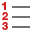 <a href="icons/svgimages/richedit/listnumbers.svg"><code>listnumbers.svg</code></a></td>
  </tr>
  <tr>
    <td align="center" valign="top" width="12.5%"> <a href="icons/svgimages/richedit/mailmerge.svg"><code>mailmerge.svg</code></a></td>
    <td align="center" valign="top" width="12.5%"> <a href="icons/svgimages/richedit/mergetablecells.svg"><code>mergetablecells.svg</code></a></td>
    <td align="center" valign="top" width="12.5%"> <a href="icons/svgimages/richedit/modifytablestyle.svg"><code>modifytablestyle.svg</code></a></td>
    <td align="center" valign="top" width="12.5%"> <a href="icons/svgimages/richedit/morelayoutoptions.svg"><code>morelayoutoptions.svg</code></a></td>
    <td align="center" valign="top" width="12.5%"> <a href="icons/svgimages/richedit/new.svg"><code>new.svg</code></a></td>
    <td align="center" valign="top" width="12.5%"> <a href="icons/svgimages/richedit/newcomment.svg"><code>newcomment.svg</code></a></td>
    <td align="center" valign="top" width="12.5%"> <a href="icons/svgimages/richedit/next.svg"><code>next.svg</code></a></td>
    <td align="center" valign="top" width="12.5%"> <a href="icons/svgimages/richedit/nextcomment.svg"><code>nextcomment.svg</code></a></td>
  </tr>
  <tr>
    <td align="center" valign="top" width="12.5%"> <a href="icons/svgimages/richedit/nextfootnote.svg"><code>nextfootnote.svg</code></a></td>
    <td align="center" valign="top" width="12.5%"> <a href="icons/svgimages/richedit/object.svg"><code>object.svg</code></a></td>
    <td align="center" valign="top" width="12.5%"> <a href="icons/svgimages/richedit/open.svg"><code>open.svg</code></a></td>
    <td align="center" valign="top" width="12.5%"> <a href="icons/svgimages/richedit/pagebreak.svg"><code>pagebreak.svg</code></a></td>
    <td align="center" valign="top" width="12.5%"> <a href="icons/svgimages/richedit/pagecolor.svg"><code>pagecolor.svg</code></a></td>
    <td align="center" valign="top" width="12.5%"> <a href="icons/svgimages/richedit/pagemarginsmoderate.svg"><code>pagemarginsmoderate.svg</code></a></td>
    <td align="center" valign="top" width="12.5%"> <a href="icons/svgimages/richedit/pagemarginsnarrow.svg"><code>pagemarginsnarrow.svg</code></a></td>
    <td align="center" valign="top" width="12.5%"> <a href="icons/svgimages/richedit/pagemarginsnormal.svg"><code>pagemarginsnormal.svg</code></a></td>
  </tr>
  <tr>
    <td align="center" valign="top" width="12.5%"> <a href="icons/svgimages/richedit/pagemarginswide.svg"><code>pagemarginswide.svg</code></a></td>
    <td align="center" valign="top" width="12.5%"> <a href="icons/svgimages/richedit/pageorientation.svg"><code>pageorientation.svg</code></a></td>
    <td align="center" valign="top" width="12.5%"> <a href="icons/svgimages/richedit/paragraph.svg"><code>paragraph.svg</code></a></td>
    <td align="center" valign="top" width="12.5%"> <a href="icons/svgimages/richedit/pastespecial.svg"><code>pastespecial.svg</code></a></td>
    <td align="center" valign="top" width="12.5%"> <a href="icons/svgimages/richedit/pencolor.svg"><code>pencolor.svg</code></a></td>
    <td align="center" valign="top" width="12.5%"> <a href="icons/svgimages/richedit/prev.svg"><code>prev.svg</code></a></td>
    <td align="center" valign="top" width="12.5%"> <a href="icons/svgimages/richedit/preview.svg"><code>preview.svg</code></a></td>
    <td align="center" valign="top" width="12.5%"> <a href="icons/svgimages/richedit/previouscomment.svg"><code>previouscomment.svg</code></a></td>
  </tr>
  <tr>
    <td align="center" valign="top" width="12.5%"> <a href="icons/svgimages/richedit/print.svg"><code>print.svg</code></a></td>
    <td align="center" valign="top" width="12.5%"> <a href="icons/svgimages/richedit/printlayoutview.svg"><code>printlayoutview.svg</code></a></td>
    <td align="center" valign="top" width="12.5%"> <a href="icons/svgimages/richedit/protectdocument.svg"><code>protectdocument.svg</code></a></td>
    <td align="center" valign="top" width="12.5%"> <a href="icons/svgimages/richedit/readingdirectionlefttoright.svg"><code>readingdirectionlefttoright.svg</code></a></td>
    <td align="center" valign="top" width="12.5%"> <a href="icons/svgimages/richedit/readingdirectionrighttoleft.svg"><code>readingdirectionrighttoleft.svg</code></a></td>
    <td align="center" valign="top" width="12.5%"> <a href="icons/svgimages/richedit/redo.svg"><code>redo.svg</code></a></td>
    <td align="center" valign="top" width="12.5%"> <a href="icons/svgimages/richedit/replace.svg"><code>replace.svg</code></a></td>
    <td align="center" valign="top" width="12.5%"> <a href="icons/svgimages/richedit/reviewers.svg"><code>reviewers.svg</code></a></td>
  </tr>
  <tr>
    <td align="center" valign="top" width="12.5%"> <a href="icons/svgimages/richedit/reviewingpane.svg"><code>reviewingpane.svg</code></a></td>
    <td align="center" valign="top" width="12.5%"> <a href="icons/svgimages/richedit/richeditbookmark.svg"><code>richeditbookmark.svg</code></a></td>
    <td align="center" valign="top" width="12.5%"> <a href="icons/svgimages/richedit/richeditclearformatting.svg"><code>richeditclearformatting.svg</code></a></td>
    <td align="center" valign="top" width="12.5%"> <a href="icons/svgimages/richedit/richeditpagemargins.svg"><code>richeditpagemargins.svg</code></a></td>
    <td align="center" valign="top" width="12.5%"> <a href="icons/svgimages/richedit/richeditpageorientation.svg"><code>richeditpageorientation.svg</code></a></td>
    <td align="center" valign="top" width="12.5%"> <a href="icons/svgimages/richedit/richeditpapersize.svg"><code>richeditpapersize.svg</code></a></td>
    <td align="center" valign="top" width="12.5%"> <a href="icons/svgimages/richedit/rulerhorizontal.svg"><code>rulerhorizontal.svg</code></a></td>
    <td align="center" valign="top" width="12.5%"> <a href="icons/svgimages/richedit/rulervertical.svg"><code>rulervertical.svg</code></a></td>
  </tr>
  <tr>
    <td align="center" valign="top" width="12.5%"> <a href="icons/svgimages/richedit/select.svg"><code>select.svg</code></a></td>
    <td align="center" valign="top" width="12.5%"> <a href="icons/svgimages/richedit/selecttable.svg"><code>selecttable.svg</code></a></td>
    <td align="center" valign="top" width="12.5%"> <a href="icons/svgimages/richedit/selecttablecell.svg"><code>selecttablecell.svg</code></a></td>
    <td align="center" valign="top" width="12.5%"> <a href="icons/svgimages/richedit/selecttablecolumn.svg"><code>selecttablecolumn.svg</code></a></td>
    <td align="center" valign="top" width="12.5%"> <a href="icons/svgimages/richedit/selecttablerow.svg"><code>selecttablerow.svg</code></a></td>
    <td align="center" valign="top" width="12.5%"> <a href="icons/svgimages/richedit/sendbehindtext.svg"><code>sendbehindtext.svg</code></a></td>
    <td align="center" valign="top" width="12.5%"> <a href="icons/svgimages/richedit/shading.svg"><code>shading.svg</code></a></td>
    <td align="center" valign="top" width="12.5%"> <a href="icons/svgimages/richedit/showallfieldcodes.svg"><code>showallfieldcodes.svg</code></a></td>
  </tr>
  <tr>
    <td align="center" valign="top" width="12.5%"> <a href="icons/svgimages/richedit/showallfieldresults.svg"><code>showallfieldresults.svg</code></a></td>
    <td align="center" valign="top" width="12.5%"> <a href="icons/svgimages/richedit/showcomments.svg"><code>showcomments.svg</code></a></td>
    <td align="center" valign="top" width="12.5%"> <a href="icons/svgimages/richedit/showhidden.svg"><code>showhidden.svg</code></a></td>
    <td align="center" valign="top" width="12.5%"> <a href="icons/svgimages/richedit/shownext.svg"><code>shownext.svg</code></a></td>
    <td align="center" valign="top" width="12.5%"> <a href="icons/svgimages/richedit/shownotes.svg"><code>shownotes.svg</code></a></td>
    <td align="center" valign="top" width="12.5%"> <a href="icons/svgimages/richedit/showprevious.svg"><code>showprevious.svg</code></a></td>
    <td align="center" valign="top" width="12.5%"> <a href="icons/svgimages/richedit/simpleview.svg"><code>simpleview.svg</code></a></td>
    <td align="center" valign="top" width="12.5%"> <a href="icons/svgimages/richedit/spacingdecrease.svg"><code>spacingdecrease.svg</code></a></td>
  </tr>
  <tr>
    <td align="center" valign="top" width="12.5%"> <a href="icons/svgimages/richedit/spellcheck.svg"><code>spellcheck.svg</code></a></td>
    <td align="center" valign="top" width="12.5%"> <a href="icons/svgimages/richedit/spellcheckasyoutype.svg"><code>spellcheckasyoutype.svg</code></a></td>
    <td align="center" valign="top" width="12.5%"> <a href="icons/svgimages/richedit/splittable.svg"><code>splittable.svg</code></a></td>
    <td align="center" valign="top" width="12.5%"> <a href="icons/svgimages/richedit/splittablecells.svg"><code>splittablecells.svg</code></a></td>
    <td align="center" valign="top" width="12.5%"> <a href="icons/svgimages/richedit/strikeout.svg"><code>strikeout.svg</code></a></td>
    <td align="center" valign="top" width="12.5%"> <a href="icons/svgimages/richedit/strikeoutdouble.svg"><code>strikeoutdouble.svg</code></a></td>
    <td align="center" valign="top" width="12.5%"> <a href="icons/svgimages/richedit/subscript.svg"><code>subscript.svg</code></a></td>
    <td align="center" valign="top" width="12.5%"> <a href="icons/svgimages/richedit/superscript.svg"><code>superscript.svg</code></a></td>
  </tr>
  <tr>
    <td align="center" valign="top" width="12.5%"> <a href="icons/svgimages/richedit/symbol.svg"><code>symbol.svg</code></a></td>
    <td align="center" valign="top" width="12.5%"> <a href="icons/svgimages/richedit/tableautofitcontents.svg"><code>tableautofitcontents.svg</code></a></td>
    <td align="center" valign="top" width="12.5%">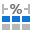 <a href="icons/svgimages/richedit/tableautofitwindow.svg"><code>tableautofitwindow.svg</code></a></td>
    <td align="center" valign="top" width="12.5%">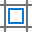 <a href="icons/svgimages/richedit/tablecellmargins.svg"><code>tablecellmargins.svg</code></a></td>
    <td align="center" valign="top" width="12.5%">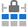 <a href="icons/svgimages/richedit/tablefixedcolumnwidth.svg"><code>tablefixedcolumnwidth.svg</code></a></td>
    <td align="center" valign="top" width="12.5%"> <a href="icons/svgimages/richedit/tableproperties.svg"><code>tableproperties.svg</code></a></td>
    <td align="center" valign="top" width="12.5%"> <a href="icons/svgimages/richedit/textdirectionhorizontal.svg"><code>textdirectionhorizontal.svg</code></a></td>
    <td align="center" valign="top" width="12.5%"> <a href="icons/svgimages/richedit/textdirectionrotate270.svg"><code>textdirectionrotate270.svg</code></a></td>
  </tr>
  <tr>
    <td align="center" valign="top" width="12.5%"> <a href="icons/svgimages/richedit/textdirectionrotate90.svg"><code>textdirectionrotate90.svg</code></a></td>
    <td align="center" valign="top" width="12.5%"> <a href="icons/svgimages/richedit/textdirectionvertical.svg"><code>textdirectionvertical.svg</code></a></td>
    <td align="center" valign="top" width="12.5%"> <a href="icons/svgimages/richedit/textwrapbehind.svg"><code>textwrapbehind.svg</code></a></td>
    <td align="center" valign="top" width="12.5%"> <a href="icons/svgimages/richedit/textwrapinfrontoftext.svg"><code>textwrapinfrontoftext.svg</code></a></td>
    <td align="center" valign="top" width="12.5%"> <a href="icons/svgimages/richedit/textwrapinlinewithtext.svg"><code>textwrapinlinewithtext.svg</code></a></td>
    <td align="center" valign="top" width="12.5%"> <a href="icons/svgimages/richedit/textwrapsquare.svg"><code>textwrapsquare.svg</code></a></td>
    <td align="center" valign="top" width="12.5%"> <a href="icons/svgimages/richedit/textwrapthrough.svg"><code>textwrapthrough.svg</code></a></td>
    <td align="center" valign="top" width="12.5%"> <a href="icons/svgimages/richedit/textwraptight.svg"><code>textwraptight.svg</code></a></td>
  </tr>
  <tr>
    <td align="center" valign="top" width="12.5%"> <a href="icons/svgimages/richedit/textwraptopandbottom.svg"><code>textwraptopandbottom.svg</code></a></td>
    <td align="center" valign="top" width="12.5%"> <a href="icons/svgimages/richedit/thai_distributed.svg"><code>thai_distributed.svg</code></a></td>
    <td align="center" valign="top" width="12.5%"> <a href="icons/svgimages/richedit/togglefieldcodes.svg"><code>togglefieldcodes.svg</code></a></td>
    <td align="center" valign="top" width="12.5%"> <a href="icons/svgimages/richedit/trackingchanges_accept.svg"><code>trackingchanges_accept.svg</code></a></td>
    <td align="center" valign="top" width="12.5%"> <a href="icons/svgimages/richedit/trackingchanges_allmarkup.svg"><code>trackingchanges_allmarkup.svg</code></a></td>
    <td align="center" valign="top" width="12.5%"> <a href="icons/svgimages/richedit/trackingchanges_locktracking.svg"><code>trackingchanges_locktracking.svg</code></a></td>
    <td align="center" valign="top" width="12.5%"> <a href="icons/svgimages/richedit/trackingchanges_next.svg"><code>trackingchanges_next.svg</code></a></td>
    <td align="center" valign="top" width="12.5%"> <a href="icons/svgimages/richedit/trackingchanges_previous.svg"><code>trackingchanges_previous.svg</code></a></td>
  </tr>
  <tr>
    <td align="center" valign="top" width="12.5%"> <a href="icons/svgimages/richedit/trackingchanges_reject.svg"><code>trackingchanges_reject.svg</code></a></td>
    <td align="center" valign="top" width="12.5%"> <a href="icons/svgimages/richedit/trackingchanges_showmarkup.svg"><code>trackingchanges_showmarkup.svg</code></a></td>
    <td align="center" valign="top" width="12.5%"> <a href="icons/svgimages/richedit/trackingchanges_trackchanges.svg"><code>trackingchanges_trackchanges.svg</code></a></td>
    <td align="center" valign="top" width="12.5%"> <a href="icons/svgimages/richedit/underlinedouble.svg"><code>underlinedouble.svg</code></a></td>
    <td align="center" valign="top" width="12.5%"> <a href="icons/svgimages/richedit/undo.svg"><code>undo.svg</code></a></td>
    <td align="center" valign="top" width="12.5%"> <a href="icons/svgimages/richedit/unprotectdocument.svg"><code>unprotectdocument.svg</code></a></td>
    <td align="center" valign="top" width="12.5%"> <a href="icons/svgimages/richedit/updatefield.svg"><code>updatefield.svg</code></a></td>
    <td align="center" valign="top" width="12.5%"> <a href="icons/svgimages/richedit/updatetableofcontents.svg"><code>updatetableofcontents.svg</code></a></td>
  </tr>
  <tr>
    <td align="center" valign="top" width="12.5%"> <a href="icons/svgimages/richedit/updatetableofcontents2.svg"><code>updatetableofcontents2.svg</code></a></td>
    <td align="center" valign="top" width="12.5%"> <a href="icons/svgimages/richedit/viewalttext.svg"><code>viewalttext.svg</code></a></td>
    <td align="center" valign="top" width="12.5%"> <a href="icons/svgimages/richedit/viewmergeddata.svg"><code>viewmergeddata.svg</code></a></td>
    <td align="center" valign="top" width="12.5%"> <a href="icons/svgimages/richedit/viewtablegridlines.svg"><code>viewtablegridlines.svg</code></a></td>
    <td align="center" valign="top" width="12.5%"> <a href="icons/svgimages/richedit/zoomout.svg"><code>zoomout.svg</code></a></td>
    <td></td>
    <td></td>
    <td></td>
  </tr>
</table>

### save

Liczba ikon: 7

<table>
  <tr>
    <td align="center" valign="top" width="12.5%"> <a href="icons/svgimages/save/save.svg"><code>save.svg</code></a></td>
    <td align="center" valign="top" width="12.5%"> <a href="icons/svgimages/save/saveall.svg"><code>saveall.svg</code></a></td>
    <td align="center" valign="top" width="12.5%"> <a href="icons/svgimages/save/saveandclose.svg"><code>saveandclose.svg</code></a></td>
    <td align="center" valign="top" width="12.5%"> <a href="icons/svgimages/save/saveandclose2.svg"><code>saveandclose2.svg</code></a></td>
    <td align="center" valign="top" width="12.5%"> <a href="icons/svgimages/save/saveandnew.svg"><code>saveandnew.svg</code></a></td>
    <td align="center" valign="top" width="12.5%"> <a href="icons/svgimages/save/saveas.svg"><code>saveas.svg</code></a></td>
    <td align="center" valign="top" width="12.5%"> <a href="icons/svgimages/save/savedialog.svg"><code>savedialog.svg</code></a></td>
    <td></td>
  </tr>
</table>

### scheduling

Liczba ikon: 69

<table>
  <tr>
    <td align="center" valign="top" width="12.5%"> <a href="icons/svgimages/scheduling/agendaview.svg"><code>agendaview.svg</code></a></td>
    <td align="center" valign="top" width="12.5%"> <a href="icons/svgimages/scheduling/appointment.svg"><code>appointment.svg</code></a></td>
    <td align="center" valign="top" width="12.5%"> <a href="icons/svgimages/scheduling/appointmentchangedoccurrence.svg"><code>appointmentchangedoccurrence.svg</code></a></td>
    <td align="center" valign="top" width="12.5%"> <a href="icons/svgimages/scheduling/appointmentdayclock.svg"><code>appointmentdayclock.svg</code></a></td>
    <td align="center" valign="top" width="12.5%"> <a href="icons/svgimages/scheduling/appointmentendcontinuearrow.svg"><code>appointmentendcontinuearrow.svg</code></a></td>
    <td align="center" valign="top" width="12.5%"> <a href="icons/svgimages/scheduling/appointmentnightclock.svg"><code>appointmentnightclock.svg</code></a></td>
    <td align="center" valign="top" width="12.5%"> <a href="icons/svgimages/scheduling/appointmentoccurrence.svg"><code>appointmentoccurrence.svg</code></a></td>
    <td align="center" valign="top" width="12.5%"> <a href="icons/svgimages/scheduling/appointmentreminder.svg"><code>appointmentreminder.svg</code></a></td>
  </tr>
  <tr>
    <td align="center" valign="top" width="12.5%"> <a href="icons/svgimages/scheduling/appointmentstartcontinuearrow.svg"><code>appointmentstartcontinuearrow.svg</code></a></td>
    <td align="center" valign="top" width="12.5%"> <a href="icons/svgimages/scheduling/backward.svg"><code>backward.svg</code></a></td>
    <td align="center" valign="top" width="12.5%"> <a href="icons/svgimages/scheduling/calendar.svg"><code>calendar.svg</code></a></td>
    <td align="center" valign="top" width="12.5%"> <a href="icons/svgimages/scheduling/categorize.svg"><code>categorize.svg</code></a></td>
    <td align="center" valign="top" width="12.5%">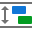 <a href="icons/svgimages/scheduling/cellsautoheight.svg"><code>cellsautoheight.svg</code></a></td>
    <td align="center" valign="top" width="12.5%"> <a href="icons/svgimages/scheduling/changelabel.svg"><code>changelabel.svg</code></a></td>
    <td align="center" valign="top" width="12.5%"> <a href="icons/svgimages/scheduling/changelabel2.svg"><code>changelabel2.svg</code></a></td>
    <td align="center" valign="top" width="12.5%"> <a href="icons/svgimages/scheduling/changestatus.svg"><code>changestatus.svg</code></a></td>
  </tr>
  <tr>
    <td align="center" valign="top" width="12.5%"> <a href="icons/svgimages/scheduling/changestatus2.svg"><code>changestatus2.svg</code></a></td>
    <td align="center" valign="top" width="12.5%"> <a href="icons/svgimages/scheduling/compressweekend.svg"><code>compressweekend.svg</code></a></td>
    <td align="center" valign="top" width="12.5%"> <a href="icons/svgimages/scheduling/dayview.svg"><code>dayview.svg</code></a></td>
    <td align="center" valign="top" width="12.5%"> <a href="icons/svgimages/scheduling/delete.svg"><code>delete.svg</code></a></td>
    <td align="center" valign="top" width="12.5%"> <a href="icons/svgimages/scheduling/forward.svg"><code>forward.svg</code></a></td>
    <td align="center" valign="top" width="12.5%"> <a href="icons/svgimages/scheduling/fullweekview.svg"><code>fullweekview.svg</code></a></td>
    <td align="center" valign="top" width="12.5%"> <a href="icons/svgimages/scheduling/ganttview.svg"><code>ganttview.svg</code></a></td>
    <td align="center" valign="top" width="12.5%"> <a href="icons/svgimages/scheduling/gotodate.svg"><code>gotodate.svg</code></a></td>
  </tr>
  <tr>
    <td align="center" valign="top" width="12.5%"> <a href="icons/svgimages/scheduling/gototoday.svg"><code>gototoday.svg</code></a></td>
    <td align="center" valign="top" width="12.5%"> <a href="icons/svgimages/scheduling/groupbydate.svg"><code>groupbydate.svg</code></a></td>
    <td align="center" valign="top" width="12.5%"> <a href="icons/svgimages/scheduling/groupbynone.svg"><code>groupbynone.svg</code></a></td>
    <td align="center" valign="top" width="12.5%"> <a href="icons/svgimages/scheduling/groupbyresource.svg"><code>groupbyresource.svg</code></a></td>
    <td align="center" valign="top" width="12.5%"> <a href="icons/svgimages/scheduling/highimportance.svg"><code>highimportance.svg</code></a></td>
    <td align="center" valign="top" width="12.5%">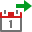 <a href="icons/svgimages/scheduling/icalendarexport.svg"><code>icalendarexport.svg</code></a></td>
    <td align="center" valign="top" width="12.5%">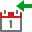 <a href="icons/svgimages/scheduling/icalendarimport.svg"><code>icalendarimport.svg</code></a></td>
    <td align="center" valign="top" width="12.5%"> <a href="icons/svgimages/scheduling/import.svg"><code>import.svg</code></a></td>
  </tr>
  <tr>
    <td align="center" valign="top" width="12.5%"> <a href="icons/svgimages/scheduling/listview.svg"><code>listview.svg</code></a></td>
    <td align="center" valign="top" width="12.5%"> <a href="icons/svgimages/scheduling/listviewappointment.svg"><code>listviewappointment.svg</code></a></td>
    <td align="center" valign="top" width="12.5%"> <a href="icons/svgimages/scheduling/listviewappointmentchangedoccurrence.svg"><code>listviewappointmentchangedoccurrence.svg</code></a></td>
    <td align="center" valign="top" width="12.5%"> <a href="icons/svgimages/scheduling/listviewappointmentdeletedoccurrence.svg"><code>listviewappointmentdeletedoccurrence.svg</code></a></td>
    <td align="center" valign="top" width="12.5%"> <a href="icons/svgimages/scheduling/listviewappointmentpattern.svg"><code>listviewappointmentpattern.svg</code></a></td>
    <td align="center" valign="top" width="12.5%"> <a href="icons/svgimages/scheduling/lowimportance.svg"><code>lowimportance.svg</code></a></td>
    <td align="center" valign="top" width="12.5%">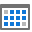 <a href="icons/svgimages/scheduling/monthview.svg"><code>monthview.svg</code></a></td>
    <td align="center" valign="top" width="12.5%"> <a href="icons/svgimages/scheduling/newappointment.svg"><code>newappointment.svg</code></a></td>
  </tr>
  <tr>
    <td align="center" valign="top" width="12.5%"> <a href="icons/svgimages/scheduling/newrecurringappointment.svg"><code>newrecurringappointment.svg</code></a></td>
    <td align="center" valign="top" width="12.5%"> <a href="icons/svgimages/scheduling/next7days.svg"><code>next7days.svg</code></a></td>
    <td align="center" valign="top" width="12.5%"> <a href="icons/svgimages/scheduling/open.svg"><code>open.svg</code></a></td>
    <td align="center" valign="top" width="12.5%"> <a href="icons/svgimages/scheduling/open2.svg"><code>open2.svg</code></a></td>
    <td align="center" valign="top" width="12.5%"> <a href="icons/svgimages/scheduling/opencalendar.svg"><code>opencalendar.svg</code></a></td>
    <td align="center" valign="top" width="12.5%"> <a href="icons/svgimages/scheduling/outlookexport.svg"><code>outlookexport.svg</code></a></td>
    <td align="center" valign="top" width="12.5%"> <a href="icons/svgimages/scheduling/outlookimport.svg"><code>outlookimport.svg</code></a></td>
    <td align="center" valign="top" width="12.5%"> <a href="icons/svgimages/scheduling/pagesetup.svg"><code>pagesetup.svg</code></a></td>
  </tr>
  <tr>
    <td align="center" valign="top" width="12.5%"> <a href="icons/svgimages/scheduling/print.svg"><code>print.svg</code></a></td>
    <td align="center" valign="top" width="12.5%"> <a href="icons/svgimages/scheduling/private.svg"><code>private.svg</code></a></td>
    <td align="center" valign="top" width="12.5%"> <a href="icons/svgimages/scheduling/properties.svg"><code>properties.svg</code></a></td>
    <td align="center" valign="top" width="12.5%"> <a href="icons/svgimages/scheduling/recurrence.svg"><code>recurrence.svg</code></a></td>
    <td align="center" valign="top" width="12.5%"> <a href="icons/svgimages/scheduling/recurringappointment.svg"><code>recurringappointment.svg</code></a></td>
    <td align="center" valign="top" width="12.5%"> <a href="icons/svgimages/scheduling/reminder.svg"><code>reminder.svg</code></a></td>
    <td align="center" valign="top" width="12.5%"> <a href="icons/svgimages/scheduling/reminderswindow.svg"><code>reminderswindow.svg</code></a></td>
    <td align="center" valign="top" width="12.5%"> <a href="icons/svgimages/scheduling/resetview.svg"><code>resetview.svg</code></a></td>
  </tr>
  <tr>
    <td align="center" valign="top" width="12.5%"> <a href="icons/svgimages/scheduling/saveandclose.svg"><code>saveandclose.svg</code></a></td>
    <td align="center" valign="top" width="12.5%"> <a href="icons/svgimages/scheduling/showworktimeonly.svg"><code>showworktimeonly.svg</code></a></td>
    <td align="center" valign="top" width="12.5%"> <a href="icons/svgimages/scheduling/snaptocells.svg"><code>snaptocells.svg</code></a></td>
    <td align="center" valign="top" width="12.5%"> <a href="icons/svgimages/scheduling/splitappointment.svg"><code>splitappointment.svg</code></a></td>
    <td align="center" valign="top" width="12.5%"> <a href="icons/svgimages/scheduling/switchtimescalesto.svg"><code>switchtimescalesto.svg</code></a></td>
    <td align="center" valign="top" width="12.5%"> <a href="icons/svgimages/scheduling/time.svg"><code>time.svg</code></a></td>
    <td align="center" valign="top" width="12.5%"> <a href="icons/svgimages/scheduling/timelineview.svg"><code>timelineview.svg</code></a></td>
    <td align="center" valign="top" width="12.5%"> <a href="icons/svgimages/scheduling/timezones.svg"><code>timezones.svg</code></a></td>
  </tr>
  <tr>
    <td align="center" valign="top" width="12.5%">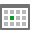 <a href="icons/svgimages/scheduling/today.svg"><code>today.svg</code></a></td>
    <td align="center" valign="top" width="12.5%"> <a href="icons/svgimages/scheduling/viewsettings.svg"><code>viewsettings.svg</code></a></td>
    <td align="center" valign="top" width="12.5%"> <a href="icons/svgimages/scheduling/weekview.svg"><code>weekview.svg</code></a></td>
    <td align="center" valign="top" width="12.5%"> <a href="icons/svgimages/scheduling/workinghours.svg"><code>workinghours.svg</code></a></td>
    <td align="center" valign="top" width="12.5%"> <a href="icons/svgimages/scheduling/workweekview.svg"><code>workweekview.svg</code></a></td>
    <td></td>
    <td></td>
    <td></td>
  </tr>
</table>

### send

Liczba ikon: 9

<table>
  <tr>
    <td align="center" valign="top" width="12.5%"> <a href="icons/svgimages/send/sendbehindtext.svg"><code>sendbehindtext.svg</code></a></td>
    <td align="center" valign="top" width="12.5%"> <a href="icons/svgimages/send/sendcsv.svg"><code>sendcsv.svg</code></a></td>
    <td align="center" valign="top" width="12.5%"> <a href="icons/svgimages/send/sendimg.svg"><code>sendimg.svg</code></a></td>
    <td align="center" valign="top" width="12.5%"> <a href="icons/svgimages/send/sendmht.svg"><code>sendmht.svg</code></a></td>
    <td align="center" valign="top" width="12.5%"> <a href="icons/svgimages/send/sendpdf.svg"><code>sendpdf.svg</code></a></td>
    <td align="center" valign="top" width="12.5%"> <a href="icons/svgimages/send/sendrtf.svg"><code>sendrtf.svg</code></a></td>
    <td align="center" valign="top" width="12.5%"> <a href="icons/svgimages/send/sendtxt.svg"><code>sendtxt.svg</code></a></td>
    <td align="center" valign="top" width="12.5%"> <a href="icons/svgimages/send/sendxls.svg"><code>sendxls.svg</code></a></td>
  </tr>
  <tr>
    <td align="center" valign="top" width="12.5%"> <a href="icons/svgimages/send/sendxlsx.svg"><code>sendxlsx.svg</code></a></td>
    <td></td>
    <td></td>
    <td></td>
    <td></td>
    <td></td>
    <td></td>
    <td></td>
  </tr>
</table>

### setup

Liczba ikon: 2

<table>
  <tr>
    <td align="center" valign="top" width="12.5%"> <a href="icons/svgimages/setup/pagesetup.svg"><code>pagesetup.svg</code></a></td>
    <td align="center" valign="top" width="12.5%"> <a href="icons/svgimages/setup/properties.svg"><code>properties.svg</code></a></td>
    <td></td>
    <td></td>
    <td></td>
    <td></td>
    <td></td>
    <td></td>
  </tr>
</table>

### snap

Liczba ikon: 72

<table>
  <tr>
    <td align="center" valign="top" width="12.5%"> <a href="icons/svgimages/snap/addnewdatasource.svg"><code>addnewdatasource.svg</code></a></td>
    <td align="center" valign="top" width="12.5%"> <a href="icons/svgimages/snap/arrangegroups.svg"><code>arrangegroups.svg</code></a></td>
    <td align="center" valign="top" width="12.5%"> <a href="icons/svgimages/snap/array.svg"><code>array.svg</code></a></td>
    <td align="center" valign="top" width="12.5%"> <a href="icons/svgimages/snap/barcode.svg"><code>barcode.svg</code></a></td>
    <td align="center" valign="top" width="12.5%"> <a href="icons/svgimages/snap/bool.svg"><code>bool.svg</code></a></td>
    <td align="center" valign="top" width="12.5%"> <a href="icons/svgimages/snap/calcbool.svg"><code>calcbool.svg</code></a></td>
    <td align="center" valign="top" width="12.5%"> <a href="icons/svgimages/snap/calcdate.svg"><code>calcdate.svg</code></a></td>
    <td align="center" valign="top" width="12.5%"> <a href="icons/svgimages/snap/calcdefault.svg"><code>calcdefault.svg</code></a></td>
  </tr>
  <tr>
    <td align="center" valign="top" width="12.5%"> <a href="icons/svgimages/snap/calcfloat.svg"><code>calcfloat.svg</code></a></td>
    <td align="center" valign="top" width="12.5%"> <a href="icons/svgimages/snap/calcguid.svg"><code>calcguid.svg</code></a></td>
    <td align="center" valign="top" width="12.5%"> <a href="icons/svgimages/snap/calcinteger.svg"><code>calcinteger.svg</code></a></td>
    <td align="center" valign="top" width="12.5%"> <a href="icons/svgimages/snap/calcstring.svg"><code>calcstring.svg</code></a></td>
    <td align="center" valign="top" width="12.5%"> <a href="icons/svgimages/snap/chart.svg"><code>chart.svg</code></a></td>
    <td align="center" valign="top" width="12.5%"> <a href="icons/svgimages/snap/checkbox.svg"><code>checkbox.svg</code></a></td>
    <td align="center" valign="top" width="12.5%"> <a href="icons/svgimages/snap/cleartablestyle.svg"><code>cleartablestyle.svg</code></a></td>
    <td align="center" valign="top" width="12.5%"> <a href="icons/svgimages/snap/datasource.svg"><code>datasource.svg</code></a></td>
  </tr>
  <tr>
    <td align="center" valign="top" width="12.5%"> <a href="icons/svgimages/snap/date.svg"><code>date.svg</code></a></td>
    <td align="center" valign="top" width="12.5%"> <a href="icons/svgimages/snap/default.svg"><code>default.svg</code></a></td>
    <td align="center" valign="top" width="12.5%"> <a href="icons/svgimages/snap/emptytablerowseparatorlist.svg"><code>emptytablerowseparatorlist.svg</code></a></td>
    <td align="center" valign="top" width="12.5%"> <a href="icons/svgimages/snap/enum.svg"><code>enum.svg</code></a></td>
    <td align="center" valign="top" width="12.5%"> <a href="icons/svgimages/snap/finishmerge.svg"><code>finishmerge.svg</code></a></td>
    <td align="center" valign="top" width="12.5%"> <a href="icons/svgimages/snap/float.svg"><code>float.svg</code></a></td>
    <td align="center" valign="top" width="12.5%"> <a href="icons/svgimages/snap/groupby.svg"><code>groupby.svg</code></a></td>
    <td align="center" valign="top" width="12.5%"> <a href="icons/svgimages/snap/groupbyfield.svg"><code>groupbyfield.svg</code></a></td>
  </tr>
  <tr>
    <td align="center" valign="top" width="12.5%"> <a href="icons/svgimages/snap/groupfieldscollection.svg"><code>groupfieldscollection.svg</code></a></td>
    <td align="center" valign="top" width="12.5%"> <a href="icons/svgimages/snap/groupfooter.svg"><code>groupfooter.svg</code></a></td>
    <td align="center" valign="top" width="12.5%"> <a href="icons/svgimages/snap/groupheader.svg"><code>groupheader.svg</code></a></td>
    <td align="center" valign="top" width="12.5%"> <a href="icons/svgimages/snap/guid.svg"><code>guid.svg</code></a></td>
    <td align="center" valign="top" width="12.5%"> <a href="icons/svgimages/snap/highlight.svg"><code>highlight.svg</code></a></td>
    <td align="center" valign="top" width="12.5%"> <a href="icons/svgimages/snap/highlightactiveelement.svg"><code>highlightactiveelement.svg</code></a></td>
    <td align="center" valign="top" width="12.5%"> <a href="icons/svgimages/snap/highlightfields.svg"><code>highlightfields.svg</code></a></td>
    <td align="center" valign="top" width="12.5%"> <a href="icons/svgimages/snap/insertgroupfooter.svg"><code>insertgroupfooter.svg</code></a></td>
  </tr>
  <tr>
    <td align="center" valign="top" width="12.5%"> <a href="icons/svgimages/snap/insertgroupheader.svg"><code>insertgroupheader.svg</code></a></td>
    <td align="center" valign="top" width="12.5%"> <a href="icons/svgimages/snap/integer.svg"><code>integer.svg</code></a></td>
    <td align="center" valign="top" width="12.5%"> <a href="icons/svgimages/snap/list.svg"><code>list.svg</code></a></td>
    <td align="center" valign="top" width="12.5%"> <a href="icons/svgimages/snap/listofparameters.svg"><code>listofparameters.svg</code></a></td>
    <td align="center" valign="top" width="12.5%"> <a href="icons/svgimages/snap/listsource.svg"><code>listsource.svg</code></a></td>
    <td align="center" valign="top" width="12.5%"> <a href="icons/svgimages/snap/modifytablestyle.svg"><code>modifytablestyle.svg</code></a></td>
    <td align="center" valign="top" width="12.5%"> <a href="icons/svgimages/snap/newdatasource.svg"><code>newdatasource.svg</code></a></td>
    <td align="center" valign="top" width="12.5%"> <a href="icons/svgimages/snap/newtablestyle.svg"><code>newtablestyle.svg</code></a></td>
  </tr>
  <tr>
    <td align="center" valign="top" width="12.5%"> <a href="icons/svgimages/snap/none.svg"><code>none.svg</code></a></td>
    <td align="center" valign="top" width="12.5%"> <a href="icons/svgimages/snap/properties.svg"><code>properties.svg</code></a></td>
    <td align="center" valign="top" width="12.5%"> <a href="icons/svgimages/snap/quickfilter.svg"><code>quickfilter.svg</code></a></td>
    <td align="center" valign="top" width="12.5%"> <a href="icons/svgimages/snap/range.svg"><code>range.svg</code></a></td>
    <td align="center" valign="top" width="12.5%"> <a href="icons/svgimages/snap/removefooter.svg"><code>removefooter.svg</code></a></td>
    <td align="center" valign="top" width="12.5%"> <a href="icons/svgimages/snap/removegroupfooter.svg"><code>removegroupfooter.svg</code></a></td>
    <td align="center" valign="top" width="12.5%"> <a href="icons/svgimages/snap/removegroupheader.svg"><code>removegroupheader.svg</code></a></td>
    <td align="center" valign="top" width="12.5%"> <a href="icons/svgimages/snap/removeheader.svg"><code>removeheader.svg</code></a></td>
  </tr>
  <tr>
    <td align="center" valign="top" width="12.5%"> <a href="icons/svgimages/snap/rowindex.svg"><code>rowindex.svg</code></a></td>
    <td align="center" valign="top" width="12.5%"> <a href="icons/svgimages/snap/sectionbreakslist_evenpage.svg"><code>sectionbreakslist_evenpage.svg</code></a></td>
    <td align="center" valign="top" width="12.5%"> <a href="icons/svgimages/snap/sectionbreakslist_nextpage.svg"><code>sectionbreakslist_nextpage.svg</code></a></td>
    <td align="center" valign="top" width="12.5%"> <a href="icons/svgimages/snap/sectionbreakslist_oddpage.svg"><code>sectionbreakslist_oddpage.svg</code></a></td>
    <td align="center" valign="top" width="12.5%"> <a href="icons/svgimages/snap/separatorlist.svg"><code>separatorlist.svg</code></a></td>
    <td align="center" valign="top" width="12.5%"> <a href="icons/svgimages/snap/separatorlistnone.svg"><code>separatorlistnone.svg</code></a></td>
    <td align="center" valign="top" width="12.5%"> <a href="icons/svgimages/snap/separatorpagebreaklist.svg"><code>separatorpagebreaklist.svg</code></a></td>
    <td align="center" valign="top" width="12.5%"> <a href="icons/svgimages/snap/snapconverttoparagraphs.svg"><code>snapconverttoparagraphs.svg</code></a></td>
  </tr>
  <tr>
    <td align="center" valign="top" width="12.5%"> <a href="icons/svgimages/snap/snapdeletelist.svg"><code>snapdeletelist.svg</code></a></td>
    <td align="center" valign="top" width="12.5%"> <a href="icons/svgimages/snap/snapemptyparagraphseparator.svg"><code>snapemptyparagraphseparator.svg</code></a></td>
    <td align="center" valign="top" width="12.5%"> <a href="icons/svgimages/snap/snapemptytablerowseparator.svg"><code>snapemptytablerowseparator.svg</code></a></td>
    <td align="center" valign="top" width="12.5%"> <a href="icons/svgimages/snap/snapfooter.svg"><code>snapfooter.svg</code></a></td>
    <td align="center" valign="top" width="12.5%"> <a href="icons/svgimages/snap/snapheader.svg"><code>snapheader.svg</code></a></td>
    <td align="center" valign="top" width="12.5%"> <a href="icons/svgimages/snap/snapinsertfooter.svg"><code>snapinsertfooter.svg</code></a></td>
    <td align="center" valign="top" width="12.5%"> <a href="icons/svgimages/snap/snapinsertheader.svg"><code>snapinsertheader.svg</code></a></td>
    <td align="center" valign="top" width="12.5%"> <a href="icons/svgimages/snap/snaptogglefieldhighlighting.svg"><code>snaptogglefieldhighlighting.svg</code></a></td>
  </tr>
  <tr>
    <td align="center" valign="top" width="12.5%"> <a href="icons/svgimages/snap/sort.svg"><code>sort.svg</code></a></td>
    <td align="center" valign="top" width="12.5%"> <a href="icons/svgimages/snap/sortasc.svg"><code>sortasc.svg</code></a></td>
    <td align="center" valign="top" width="12.5%"> <a href="icons/svgimages/snap/sortdesc.svg"><code>sortdesc.svg</code></a></td>
    <td align="center" valign="top" width="12.5%"> <a href="icons/svgimages/snap/sparkline.svg"><code>sparkline.svg</code></a></td>
    <td align="center" valign="top" width="12.5%"> <a href="icons/svgimages/snap/string.svg"><code>string.svg</code></a></td>
    <td align="center" valign="top" width="12.5%"> <a href="icons/svgimages/snap/sumdefault.svg"><code>sumdefault.svg</code></a></td>
    <td align="center" valign="top" width="12.5%"> <a href="icons/svgimages/snap/summary.svg"><code>summary.svg</code></a></td>
    <td align="center" valign="top" width="12.5%"> <a href="icons/svgimages/snap/windows.svg"><code>windows.svg</code></a></td>
  </tr>
</table>

### spreadsheet

Liczba ikon: 445

<table>
  <tr>
    <td align="center" valign="top" width="12.5%"> <a href="icons/svgimages/spreadsheet/100percent.svg"><code>100percent.svg</code></a></td>
    <td align="center" valign="top" width="12.5%"> <a href="icons/svgimages/spreadsheet/3arrowscolored.svg"><code>3arrowscolored.svg</code></a></td>
    <td align="center" valign="top" width="12.5%"> <a href="icons/svgimages/spreadsheet/3arrowsgray.svg"><code>3arrowsgray.svg</code></a></td>
    <td align="center" valign="top" width="12.5%"> <a href="icons/svgimages/spreadsheet/3flags.svg"><code>3flags.svg</code></a></td>
    <td align="center" valign="top" width="12.5%"> <a href="icons/svgimages/spreadsheet/3signs.svg"><code>3signs.svg</code></a></td>
    <td align="center" valign="top" width="12.5%"> <a href="icons/svgimages/spreadsheet/3stars.svg"><code>3stars.svg</code></a></td>
    <td align="center" valign="top" width="12.5%"> <a href="icons/svgimages/spreadsheet/3symbolscircled.svg"><code>3symbolscircled.svg</code></a></td>
    <td align="center" valign="top" width="12.5%"> <a href="icons/svgimages/spreadsheet/3symbolsuncircled.svg"><code>3symbolsuncircled.svg</code></a></td>
  </tr>
  <tr>
    <td align="center" valign="top" width="12.5%"> <a href="icons/svgimages/spreadsheet/3trafficlights.svg"><code>3trafficlights.svg</code></a></td>
    <td align="center" valign="top" width="12.5%"> <a href="icons/svgimages/spreadsheet/3trafficlightsrimmed.svg"><code>3trafficlightsrimmed.svg</code></a></td>
    <td align="center" valign="top" width="12.5%"> <a href="icons/svgimages/spreadsheet/3triangles.svg"><code>3triangles.svg</code></a></td>
    <td align="center" valign="top" width="12.5%"> <a href="icons/svgimages/spreadsheet/4arrowscolored.svg"><code>4arrowscolored.svg</code></a></td>
    <td align="center" valign="top" width="12.5%"> <a href="icons/svgimages/spreadsheet/4arrowsgray.svg"><code>4arrowsgray.svg</code></a></td>
    <td align="center" valign="top" width="12.5%"> <a href="icons/svgimages/spreadsheet/4ratings.svg"><code>4ratings.svg</code></a></td>
    <td align="center" valign="top" width="12.5%"> <a href="icons/svgimages/spreadsheet/4trafficlights.svg"><code>4trafficlights.svg</code></a></td>
    <td align="center" valign="top" width="12.5%"> <a href="icons/svgimages/spreadsheet/5arrowscolored.svg"><code>5arrowscolored.svg</code></a></td>
  </tr>
  <tr>
    <td align="center" valign="top" width="12.5%"> <a href="icons/svgimages/spreadsheet/5arrowsgray.svg"><code>5arrowsgray.svg</code></a></td>
    <td align="center" valign="top" width="12.5%"> <a href="icons/svgimages/spreadsheet/5boxes.svg"><code>5boxes.svg</code></a></td>
    <td align="center" valign="top" width="12.5%"> <a href="icons/svgimages/spreadsheet/5quarters.svg"><code>5quarters.svg</code></a></td>
    <td align="center" valign="top" width="12.5%"> <a href="icons/svgimages/spreadsheet/5ratings.svg"><code>5ratings.svg</code></a></td>
    <td align="center" valign="top" width="12.5%"> <a href="icons/svgimages/spreadsheet/above-average.svg"><code>above-average.svg</code></a></td>
    <td align="center" valign="top" width="12.5%"> <a href="icons/svgimages/spreadsheet/accounting.svg"><code>accounting.svg</code></a></td>
    <td align="center" valign="top" width="12.5%"> <a href="icons/svgimages/spreadsheet/accountingnumberformat.svg"><code>accountingnumberformat.svg</code></a></td>
    <td align="center" valign="top" width="12.5%"> <a href="icons/svgimages/spreadsheet/adateoccuring.svg"><code>adateoccuring.svg</code></a></td>
  </tr>
  <tr>
    <td align="center" valign="top" width="12.5%"> <a href="icons/svgimages/spreadsheet/adddatasource.svg"><code>adddatasource.svg</code></a></td>
    <td align="center" valign="top" width="12.5%"> <a href="icons/svgimages/spreadsheet/alignright.svg"><code>alignright.svg</code></a></td>
    <td align="center" valign="top" width="12.5%"> <a href="icons/svgimages/spreadsheet/allborders.svg"><code>allborders.svg</code></a></td>
    <td align="center" valign="top" width="12.5%"> <a href="icons/svgimages/spreadsheet/allowuserstoeditranges.svg"><code>allowuserstoeditranges.svg</code></a></td>
    <td align="center" valign="top" width="12.5%"> <a href="icons/svgimages/spreadsheet/area.svg"><code>area.svg</code></a></td>
    <td align="center" valign="top" width="12.5%"> <a href="icons/svgimages/spreadsheet/autosum.svg"><code>autosum.svg</code></a></td>
    <td align="center" valign="top" width="12.5%"> <a href="icons/svgimages/spreadsheet/bar.svg"><code>bar.svg</code></a></td>
    <td align="center" valign="top" width="12.5%"> <a href="icons/svgimages/spreadsheet/belowaverage.svg"><code>belowaverage.svg</code></a></td>
  </tr>
  <tr>
    <td align="center" valign="top" width="12.5%"> <a href="icons/svgimages/spreadsheet/between.svg"><code>between.svg</code></a></td>
    <td align="center" valign="top" width="12.5%"> <a href="icons/svgimages/spreadsheet/bluedatabargradient.svg"><code>bluedatabargradient.svg</code></a></td>
    <td align="center" valign="top" width="12.5%"> <a href="icons/svgimages/spreadsheet/bluedatabarsolid.svg"><code>bluedatabarsolid.svg</code></a></td>
    <td align="center" valign="top" width="12.5%"> <a href="icons/svgimages/spreadsheet/bluewhiteredcolorscale.svg"><code>bluewhiteredcolorscale.svg</code></a></td>
    <td align="center" valign="top" width="12.5%"> <a href="icons/svgimages/spreadsheet/bold.svg"><code>bold.svg</code></a></td>
    <td align="center" valign="top" width="12.5%"> <a href="icons/svgimages/spreadsheet/bottom10items.svg"><code>bottom10items.svg</code></a></td>
    <td align="center" valign="top" width="12.5%"> <a href="icons/svgimages/spreadsheet/bottom10percent.svg"><code>bottom10percent.svg</code></a></td>
    <td align="center" valign="top" width="12.5%"> <a href="icons/svgimages/spreadsheet/bottomalign.svg"><code>bottomalign.svg</code></a></td>
  </tr>
  <tr>
    <td align="center" valign="top" width="12.5%"> <a href="icons/svgimages/spreadsheet/bottomborder.svg"><code>bottomborder.svg</code></a></td>
    <td align="center" valign="top" width="12.5%"> <a href="icons/svgimages/spreadsheet/bottomdoubleborder.svg"><code>bottomdoubleborder.svg</code></a></td>
    <td align="center" valign="top" width="12.5%"> <a href="icons/svgimages/spreadsheet/bringforward.svg"><code>bringforward.svg</code></a></td>
    <td align="center" valign="top" width="12.5%"> <a href="icons/svgimages/spreadsheet/bringtofront.svg"><code>bringtofront.svg</code></a></td>
    <td align="center" valign="top" width="12.5%"> <a href="icons/svgimages/spreadsheet/calculatenow.svg"><code>calculatenow.svg</code></a></td>
    <td align="center" valign="top" width="12.5%"> <a href="icons/svgimages/spreadsheet/calculatesheet.svg"><code>calculatesheet.svg</code></a></td>
    <td align="center" valign="top" width="12.5%"> <a href="icons/svgimages/spreadsheet/calculationoptions.svg"><code>calculationoptions.svg</code></a></td>
    <td align="center" valign="top" width="12.5%"> <a href="icons/svgimages/spreadsheet/cellstyles.svg"><code>cellstyles.svg</code></a></td>
  </tr>
  <tr>
    <td align="center" valign="top" width="12.5%"> <a href="icons/svgimages/spreadsheet/changedatasourcepivottable.svg"><code>changedatasourcepivottable.svg</code></a></td>
    <td align="center" valign="top" width="12.5%"> <a href="icons/svgimages/spreadsheet/chartaxesgroup.svg"><code>chartaxesgroup.svg</code></a></td>
    <td align="center" valign="top" width="12.5%"> <a href="icons/svgimages/spreadsheet/chartaxistitlegroup.svg"><code>chartaxistitlegroup.svg</code></a></td>
    <td align="center" valign="top" width="12.5%"> <a href="icons/svgimages/spreadsheet/chartaxistitlehorizontal.svg"><code>chartaxistitlehorizontal.svg</code></a></td>
    <td align="center" valign="top" width="12.5%"> <a href="icons/svgimages/spreadsheet/chartaxistitlehorizontal_none.svg"><code>chartaxistitlehorizontal_none.svg</code></a></td>
    <td align="center" valign="top" width="12.5%"> <a href="icons/svgimages/spreadsheet/chartaxistitlevertical.svg"><code>chartaxistitlevertical.svg</code></a></td>
    <td align="center" valign="top" width="12.5%"> <a href="icons/svgimages/spreadsheet/chartaxistitlevertical_horizontaltitle.svg"><code>chartaxistitlevertical_horizontaltitle.svg</code></a></td>
    <td align="center" valign="top" width="12.5%"> <a href="icons/svgimages/spreadsheet/chartaxistitlevertical_none.svg"><code>chartaxistitlevertical_none.svg</code></a></td>
  </tr>
  <tr>
    <td align="center" valign="top" width="12.5%"> <a href="icons/svgimages/spreadsheet/chartaxistitlevertical_rotatedtitle.svg"><code>chartaxistitlevertical_rotatedtitle.svg</code></a></td>
    <td align="center" valign="top" width="12.5%"> <a href="icons/svgimages/spreadsheet/chartaxistitlevertical_verticaltitle.svg"><code>chartaxistitlevertical_verticaltitle.svg</code></a></td>
    <td align="center" valign="top" width="12.5%"> <a href="icons/svgimages/spreadsheet/chartchangelayout.svg"><code>chartchangelayout.svg</code></a></td>
    <td align="center" valign="top" width="12.5%"> <a href="icons/svgimages/spreadsheet/chartchangestyle.svg"><code>chartchangestyle.svg</code></a></td>
    <td align="center" valign="top" width="12.5%"> <a href="icons/svgimages/spreadsheet/chartdatalabelsgroup.svg"><code>chartdatalabelsgroup.svg</code></a></td>
    <td align="center" valign="top" width="12.5%"> <a href="icons/svgimages/spreadsheet/chartdatalabels_above.svg"><code>chartdatalabels_above.svg</code></a></td>
    <td align="center" valign="top" width="12.5%"> <a href="icons/svgimages/spreadsheet/chartdatalabels_below.svg"><code>chartdatalabels_below.svg</code></a></td>
    <td align="center" valign="top" width="12.5%"> <a href="icons/svgimages/spreadsheet/chartdatalabels_bestfit.svg"><code>chartdatalabels_bestfit.svg</code></a></td>
  </tr>
  <tr>
    <td align="center" valign="top" width="12.5%"> <a href="icons/svgimages/spreadsheet/chartdatalabels_center.svg"><code>chartdatalabels_center.svg</code></a></td>
    <td align="center" valign="top" width="12.5%"> <a href="icons/svgimages/spreadsheet/chartdatalabels_insidebase.svg"><code>chartdatalabels_insidebase.svg</code></a></td>
    <td align="center" valign="top" width="12.5%"> <a href="icons/svgimages/spreadsheet/chartdatalabels_insideend.svg"><code>chartdatalabels_insideend.svg</code></a></td>
    <td align="center" valign="top" width="12.5%"> <a href="icons/svgimages/spreadsheet/chartdatalabels_left.svg"><code>chartdatalabels_left.svg</code></a></td>
    <td align="center" valign="top" width="12.5%"> <a href="icons/svgimages/spreadsheet/chartdatalabels_linecenter.svg"><code>chartdatalabels_linecenter.svg</code></a></td>
    <td align="center" valign="top" width="12.5%"> <a href="icons/svgimages/spreadsheet/chartdatalabels_linenone.svg"><code>chartdatalabels_linenone.svg</code></a></td>
    <td align="center" valign="top" width="12.5%"> <a href="icons/svgimages/spreadsheet/chartdatalabels_none.svg"><code>chartdatalabels_none.svg</code></a></td>
    <td align="center" valign="top" width="12.5%"> <a href="icons/svgimages/spreadsheet/chartdatalabels_right.svg"><code>chartdatalabels_right.svg</code></a></td>
  </tr>
  <tr>
    <td align="center" valign="top" width="12.5%"> <a href="icons/svgimages/spreadsheet/chartgridlines.svg"><code>chartgridlines.svg</code></a></td>
    <td align="center" valign="top" width="12.5%"> <a href="icons/svgimages/spreadsheet/chartgridlineshorizontal_major.svg"><code>chartgridlineshorizontal_major.svg</code></a></td>
    <td align="center" valign="top" width="12.5%"> <a href="icons/svgimages/spreadsheet/chartgridlineshorizontal_majorminor.svg"><code>chartgridlineshorizontal_majorminor.svg</code></a></td>
    <td align="center" valign="top" width="12.5%"> <a href="icons/svgimages/spreadsheet/chartgridlineshorizontal_minor.svg"><code>chartgridlineshorizontal_minor.svg</code></a></td>
    <td align="center" valign="top" width="12.5%"> <a href="icons/svgimages/spreadsheet/chartgridlineshorizontal_none.svg"><code>chartgridlineshorizontal_none.svg</code></a></td>
    <td align="center" valign="top" width="12.5%"> <a href="icons/svgimages/spreadsheet/chartgridlinesvertical_major.svg"><code>chartgridlinesvertical_major.svg</code></a></td>
    <td align="center" valign="top" width="12.5%"> <a href="icons/svgimages/spreadsheet/chartgridlinesvertical_majorminor.svg"><code>chartgridlinesvertical_majorminor.svg</code></a></td>
    <td align="center" valign="top" width="12.5%"> <a href="icons/svgimages/spreadsheet/chartgridlinesvertical_minor.svg"><code>chartgridlinesvertical_minor.svg</code></a></td>
  </tr>
  <tr>
    <td align="center" valign="top" width="12.5%"> <a href="icons/svgimages/spreadsheet/chartgridlinesvertical_none.svg"><code>chartgridlinesvertical_none.svg</code></a></td>
    <td align="center" valign="top" width="12.5%"> <a href="icons/svgimages/spreadsheet/chartgroupscatter.svg"><code>chartgroupscatter.svg</code></a></td>
    <td align="center" valign="top" width="12.5%"> <a href="icons/svgimages/spreadsheet/charthorizontalaxis_billions.svg"><code>charthorizontalaxis_billions.svg</code></a></td>
    <td align="center" valign="top" width="12.5%"> <a href="icons/svgimages/spreadsheet/charthorizontalaxis_default.svg"><code>charthorizontalaxis_default.svg</code></a></td>
    <td align="center" valign="top" width="12.5%"> <a href="icons/svgimages/spreadsheet/charthorizontalaxis_lefttoright.svg"><code>charthorizontalaxis_lefttoright.svg</code></a></td>
    <td align="center" valign="top" width="12.5%"> <a href="icons/svgimages/spreadsheet/charthorizontalaxis_logscale.svg"><code>charthorizontalaxis_logscale.svg</code></a></td>
    <td align="center" valign="top" width="12.5%"> <a href="icons/svgimages/spreadsheet/charthorizontalaxis_millions.svg"><code>charthorizontalaxis_millions.svg</code></a></td>
    <td align="center" valign="top" width="12.5%"> <a href="icons/svgimages/spreadsheet/charthorizontalaxis_none.svg"><code>charthorizontalaxis_none.svg</code></a></td>
  </tr>
  <tr>
    <td align="center" valign="top" width="12.5%"> <a href="icons/svgimages/spreadsheet/charthorizontalaxis_righttoleft.svg"><code>charthorizontalaxis_righttoleft.svg</code></a></td>
    <td align="center" valign="top" width="12.5%"> <a href="icons/svgimages/spreadsheet/charthorizontalaxis_thousands.svg"><code>charthorizontalaxis_thousands.svg</code></a></td>
    <td align="center" valign="top" width="12.5%"> <a href="icons/svgimages/spreadsheet/charthorizontalaxis_withoutlabeling.svg"><code>charthorizontalaxis_withoutlabeling.svg</code></a></td>
    <td align="center" valign="top" width="12.5%"> <a href="icons/svgimages/spreadsheet/chartlegendgroup.svg"><code>chartlegendgroup.svg</code></a></td>
    <td align="center" valign="top" width="12.5%"> <a href="icons/svgimages/spreadsheet/chartlegend_none.svg"><code>chartlegend_none.svg</code></a></td>
    <td align="center" valign="top" width="12.5%"> <a href="icons/svgimages/spreadsheet/chartlegend_overlaylegendatleft.svg"><code>chartlegend_overlaylegendatleft.svg</code></a></td>
    <td align="center" valign="top" width="12.5%"> <a href="icons/svgimages/spreadsheet/chartlegend_overlaylegendatright.svg"><code>chartlegend_overlaylegendatright.svg</code></a></td>
    <td align="center" valign="top" width="12.5%"> <a href="icons/svgimages/spreadsheet/chartlegend_showlegendatbottom.svg"><code>chartlegend_showlegendatbottom.svg</code></a></td>
  </tr>
  <tr>
    <td align="center" valign="top" width="12.5%"> <a href="icons/svgimages/spreadsheet/chartlegend_showlegendatleft.svg"><code>chartlegend_showlegendatleft.svg</code></a></td>
    <td align="center" valign="top" width="12.5%"> <a href="icons/svgimages/spreadsheet/chartlegend_showlegendatright.svg"><code>chartlegend_showlegendatright.svg</code></a></td>
    <td align="center" valign="top" width="12.5%"> <a href="icons/svgimages/spreadsheet/chartlegend_showlegendattop.svg"><code>chartlegend_showlegendattop.svg</code></a></td>
    <td align="center" valign="top" width="12.5%"> <a href="icons/svgimages/spreadsheet/charttitleabove.svg"><code>charttitleabove.svg</code></a></td>
    <td align="center" valign="top" width="12.5%"> <a href="icons/svgimages/spreadsheet/charttitlecenteredoverlay.svg"><code>charttitlecenteredoverlay.svg</code></a></td>
    <td align="center" valign="top" width="12.5%"> <a href="icons/svgimages/spreadsheet/charttitlenone.svg"><code>charttitlenone.svg</code></a></td>
    <td align="center" valign="top" width="12.5%"> <a href="icons/svgimages/spreadsheet/chartverticalaxis_billions.svg"><code>chartverticalaxis_billions.svg</code></a></td>
    <td align="center" valign="top" width="12.5%"> <a href="icons/svgimages/spreadsheet/chartverticalaxis_bottomtoup.svg"><code>chartverticalaxis_bottomtoup.svg</code></a></td>
  </tr>
  <tr>
    <td align="center" valign="top" width="12.5%"> <a href="icons/svgimages/spreadsheet/chartverticalaxis_default.svg"><code>chartverticalaxis_default.svg</code></a></td>
    <td align="center" valign="top" width="12.5%"> <a href="icons/svgimages/spreadsheet/chartverticalaxis_logscale.svg"><code>chartverticalaxis_logscale.svg</code></a></td>
    <td align="center" valign="top" width="12.5%"> <a href="icons/svgimages/spreadsheet/chartverticalaxis_millions.svg"><code>chartverticalaxis_millions.svg</code></a></td>
    <td align="center" valign="top" width="12.5%"> <a href="icons/svgimages/spreadsheet/chartverticalaxis_none.svg"><code>chartverticalaxis_none.svg</code></a></td>
    <td align="center" valign="top" width="12.5%"> <a href="icons/svgimages/spreadsheet/chartverticalaxis_thousands.svg"><code>chartverticalaxis_thousands.svg</code></a></td>
    <td align="center" valign="top" width="12.5%"> <a href="icons/svgimages/spreadsheet/chartverticalaxis_toptodown.svg"><code>chartverticalaxis_toptodown.svg</code></a></td>
    <td align="center" valign="top" width="12.5%"> <a href="icons/svgimages/spreadsheet/chartverticalaxis_withoutlabeling.svg"><code>chartverticalaxis_withoutlabeling.svg</code></a></td>
    <td align="center" valign="top" width="12.5%"> <a href="icons/svgimages/spreadsheet/circleinvaliddata.svg"><code>circleinvaliddata.svg</code></a></td>
  </tr>
  <tr>
    <td align="center" valign="top" width="12.5%"> <a href="icons/svgimages/spreadsheet/clearall.svg"><code>clearall.svg</code></a></td>
    <td align="center" valign="top" width="12.5%"> <a href="icons/svgimages/spreadsheet/clearfilter.svg"><code>clearfilter.svg</code></a></td>
    <td align="center" valign="top" width="12.5%"> <a href="icons/svgimages/spreadsheet/clearformats.svg"><code>clearformats.svg</code></a></td>
    <td align="center" valign="top" width="12.5%"> <a href="icons/svgimages/spreadsheet/clearhyperlinks.svg"><code>clearhyperlinks.svg</code></a></td>
    <td align="center" valign="top" width="12.5%"> <a href="icons/svgimages/spreadsheet/clearpivottable.svg"><code>clearpivottable.svg</code></a></td>
    <td align="center" valign="top" width="12.5%"> <a href="icons/svgimages/spreadsheet/clearrules.svg"><code>clearrules.svg</code></a></td>
    <td align="center" valign="top" width="12.5%"> <a href="icons/svgimages/spreadsheet/clearvalidationcircles.svg"><code>clearvalidationcircles.svg</code></a></td>
    <td align="center" valign="top" width="12.5%"> <a href="icons/svgimages/spreadsheet/collapsefieldpivottable.svg"><code>collapsefieldpivottable.svg</code></a></td>
  </tr>
  <tr>
    <td align="center" valign="top" width="12.5%"> <a href="icons/svgimages/spreadsheet/collated.svg"><code>collated.svg</code></a></td>
    <td align="center" valign="top" width="12.5%"> <a href="icons/svgimages/spreadsheet/column.svg"><code>column.svg</code></a></td>
    <td align="center" valign="top" width="12.5%"> <a href="icons/svgimages/spreadsheet/commastyle.svg"><code>commastyle.svg</code></a></td>
    <td align="center" valign="top" width="12.5%"> <a href="icons/svgimages/spreadsheet/conditionalformatting.svg"><code>conditionalformatting.svg</code></a></td>
    <td align="center" valign="top" width="12.5%"> <a href="icons/svgimages/spreadsheet/copy.svg"><code>copy.svg</code></a></td>
    <td align="center" valign="top" width="12.5%"> <a href="icons/svgimages/spreadsheet/create-rotated-bar-chart.svg"><code>create-rotated-bar-chart.svg</code></a></td>
    <td align="center" valign="top" width="12.5%"> <a href="icons/svgimages/spreadsheet/createarea3dchart.svg"><code>createarea3dchart.svg</code></a></td>
    <td align="center" valign="top" width="12.5%"> <a href="icons/svgimages/spreadsheet/createareachart.svg"><code>createareachart.svg</code></a></td>
  </tr>
  <tr>
    <td align="center" valign="top" width="12.5%"> <a href="icons/svgimages/spreadsheet/createbar3dchart.svg"><code>createbar3dchart.svg</code></a></td>
    <td align="center" valign="top" width="12.5%"> <a href="icons/svgimages/spreadsheet/createbarchart.svg"><code>createbarchart.svg</code></a></td>
    <td align="center" valign="top" width="12.5%"> <a href="icons/svgimages/spreadsheet/createbubble3dchart.svg"><code>createbubble3dchart.svg</code></a></td>
    <td align="center" valign="top" width="12.5%"> <a href="icons/svgimages/spreadsheet/createbubblechart.svg"><code>createbubblechart.svg</code></a></td>
    <td align="center" valign="top" width="12.5%"> <a href="icons/svgimages/spreadsheet/createconebar3dchart.svg"><code>createconebar3dchart.svg</code></a></td>
    <td align="center" valign="top" width="12.5%"> <a href="icons/svgimages/spreadsheet/createconefullstackedbar3dchart.svg"><code>createconefullstackedbar3dchart.svg</code></a></td>
    <td align="center" valign="top" width="12.5%"> <a href="icons/svgimages/spreadsheet/createconemanhattanbarchart.svg"><code>createconemanhattanbarchart.svg</code></a></td>
    <td align="center" valign="top" width="12.5%"> <a href="icons/svgimages/spreadsheet/createconestackedbar3dchart.svg"><code>createconestackedbar3dchart.svg</code></a></td>
  </tr>
  <tr>
    <td align="center" valign="top" width="12.5%"> <a href="icons/svgimages/spreadsheet/createcylinderbar3dchart.svg"><code>createcylinderbar3dchart.svg</code></a></td>
    <td align="center" valign="top" width="12.5%"> <a href="icons/svgimages/spreadsheet/createcylinderfullstackedbar3dchart.svg"><code>createcylinderfullstackedbar3dchart.svg</code></a></td>
    <td align="center" valign="top" width="12.5%"> <a href="icons/svgimages/spreadsheet/createcylindermanhattanbarchart.svg"><code>createcylindermanhattanbarchart.svg</code></a></td>
    <td align="center" valign="top" width="12.5%"> <a href="icons/svgimages/spreadsheet/createcylinderstackedbar3dchart.svg"><code>createcylinderstackedbar3dchart.svg</code></a></td>
    <td align="center" valign="top" width="12.5%"> <a href="icons/svgimages/spreadsheet/createdoughnutchart.svg"><code>createdoughnutchart.svg</code></a></td>
    <td align="center" valign="top" width="12.5%"> <a href="icons/svgimages/spreadsheet/createexplodeddoughnutchart.svg"><code>createexplodeddoughnutchart.svg</code></a></td>
    <td align="center" valign="top" width="12.5%"> <a href="icons/svgimages/spreadsheet/createexplodedpie3dchart.svg"><code>createexplodedpie3dchart.svg</code></a></td>
    <td align="center" valign="top" width="12.5%"> <a href="icons/svgimages/spreadsheet/createexplodedpiechart.svg"><code>createexplodedpiechart.svg</code></a></td>
  </tr>
  <tr>
    <td align="center" valign="top" width="12.5%"> <a href="icons/svgimages/spreadsheet/createfromselection.svg"><code>createfromselection.svg</code></a></td>
    <td align="center" valign="top" width="12.5%"> <a href="icons/svgimages/spreadsheet/createfullstackedarea3dchart.svg"><code>createfullstackedarea3dchart.svg</code></a></td>
    <td align="center" valign="top" width="12.5%"> <a href="icons/svgimages/spreadsheet/createfullstackedareachart.svg"><code>createfullstackedareachart.svg</code></a></td>
    <td align="center" valign="top" width="12.5%"> <a href="icons/svgimages/spreadsheet/createfullstackedbar3dchart.svg"><code>createfullstackedbar3dchart.svg</code></a></td>
    <td align="center" valign="top" width="12.5%"> <a href="icons/svgimages/spreadsheet/createfullstackedbarchart.svg"><code>createfullstackedbarchart.svg</code></a></td>
    <td align="center" valign="top" width="12.5%"> <a href="icons/svgimages/spreadsheet/createfullstackedlinechart.svg"><code>createfullstackedlinechart.svg</code></a></td>
    <td align="center" valign="top" width="12.5%"> <a href="icons/svgimages/spreadsheet/createfullstackedlinechartnomarkers.svg"><code>createfullstackedlinechartnomarkers.svg</code></a></td>
    <td align="center" valign="top" width="12.5%"> <a href="icons/svgimages/spreadsheet/createline3dchart.svg"><code>createline3dchart.svg</code></a></td>
  </tr>
  <tr>
    <td align="center" valign="top" width="12.5%"> <a href="icons/svgimages/spreadsheet/createlinechart.svg"><code>createlinechart.svg</code></a></td>
    <td align="center" valign="top" width="12.5%"> <a href="icons/svgimages/spreadsheet/createlinechartnomarkers.svg"><code>createlinechartnomarkers.svg</code></a></td>
    <td align="center" valign="top" width="12.5%"> <a href="icons/svgimages/spreadsheet/createmanhattanbarchart.svg"><code>createmanhattanbarchart.svg</code></a></td>
    <td align="center" valign="top" width="12.5%"> <a href="icons/svgimages/spreadsheet/createpie3dchart.svg"><code>createpie3dchart.svg</code></a></td>
    <td align="center" valign="top" width="12.5%"> <a href="icons/svgimages/spreadsheet/createpiechart.svg"><code>createpiechart.svg</code></a></td>
    <td align="center" valign="top" width="12.5%"> <a href="icons/svgimages/spreadsheet/createpyramidbar3dchart.svg"><code>createpyramidbar3dchart.svg</code></a></td>
    <td align="center" valign="top" width="12.5%"> <a href="icons/svgimages/spreadsheet/createpyramidfullstackedbar3dchart.svg"><code>createpyramidfullstackedbar3dchart.svg</code></a></td>
    <td align="center" valign="top" width="12.5%"> <a href="icons/svgimages/spreadsheet/createpyramidmanhattanbarchart.svg"><code>createpyramidmanhattanbarchart.svg</code></a></td>
  </tr>
  <tr>
    <td align="center" valign="top" width="12.5%"> <a href="icons/svgimages/spreadsheet/createpyramidstackedbar3dchart.svg"><code>createpyramidstackedbar3dchart.svg</code></a></td>
    <td align="center" valign="top" width="12.5%"> <a href="icons/svgimages/spreadsheet/createradarlinechart.svg"><code>createradarlinechart.svg</code></a></td>
    <td align="center" valign="top" width="12.5%"> <a href="icons/svgimages/spreadsheet/createradarlinechartfilled.svg"><code>createradarlinechartfilled.svg</code></a></td>
    <td align="center" valign="top" width="12.5%"> <a href="icons/svgimages/spreadsheet/createradarlinechartnomarkers.svg"><code>createradarlinechartnomarkers.svg</code></a></td>
    <td align="center" valign="top" width="12.5%"> <a href="icons/svgimages/spreadsheet/createrotatedbar3dchart.svg"><code>createrotatedbar3dchart.svg</code></a></td>
    <td align="center" valign="top" width="12.5%"> <a href="icons/svgimages/spreadsheet/createrotatedconebar3dchart.svg"><code>createrotatedconebar3dchart.svg</code></a></td>
    <td align="center" valign="top" width="12.5%"> <a href="icons/svgimages/spreadsheet/createrotatedcylinderbar3dchart.svg"><code>createrotatedcylinderbar3dchart.svg</code></a></td>
    <td align="center" valign="top" width="12.5%"> <a href="icons/svgimages/spreadsheet/createrotatedfullstackedbar3dchart.svg"><code>createrotatedfullstackedbar3dchart.svg</code></a></td>
  </tr>
  <tr>
    <td align="center" valign="top" width="12.5%"> <a href="icons/svgimages/spreadsheet/createrotatedfullstackedbarchart.svg"><code>createrotatedfullstackedbarchart.svg</code></a></td>
    <td align="center" valign="top" width="12.5%"> <a href="icons/svgimages/spreadsheet/createrotatedfullstackedconebar3dchart.svg"><code>createrotatedfullstackedconebar3dchart.svg</code></a></td>
    <td align="center" valign="top" width="12.5%"> <a href="icons/svgimages/spreadsheet/createrotatedfullstackedcylinderbar3dchart.svg"><code>createrotatedfullstackedcylinderbar3dchart.svg</code></a></td>
    <td align="center" valign="top" width="12.5%"> <a href="icons/svgimages/spreadsheet/createrotatedfullstackedpyramidbar3dchart.svg"><code>createrotatedfullstackedpyramidbar3dchart.svg</code></a></td>
    <td align="center" valign="top" width="12.5%"> <a href="icons/svgimages/spreadsheet/createrotatedpyramidbar3dchart.svg"><code>createrotatedpyramidbar3dchart.svg</code></a></td>
    <td align="center" valign="top" width="12.5%"> <a href="icons/svgimages/spreadsheet/createrotatedstackedbar3dchart.svg"><code>createrotatedstackedbar3dchart.svg</code></a></td>
    <td align="center" valign="top" width="12.5%"> <a href="icons/svgimages/spreadsheet/createrotatedstackedbarchart.svg"><code>createrotatedstackedbarchart.svg</code></a></td>
    <td align="center" valign="top" width="12.5%"> <a href="icons/svgimages/spreadsheet/createrotatedstackedconebar3dchart.svg"><code>createrotatedstackedconebar3dchart.svg</code></a></td>
  </tr>
  <tr>
    <td align="center" valign="top" width="12.5%"> <a href="icons/svgimages/spreadsheet/createrotatedstackedcylinderbar3dchart.svg"><code>createrotatedstackedcylinderbar3dchart.svg</code></a></td>
    <td align="center" valign="top" width="12.5%"> <a href="icons/svgimages/spreadsheet/createrotatedstackedpyramidbar3dchart.svg"><code>createrotatedstackedpyramidbar3dchart.svg</code></a></td>
    <td align="center" valign="top" width="12.5%"> <a href="icons/svgimages/spreadsheet/createscatterchartlines.svg"><code>createscatterchartlines.svg</code></a></td>
    <td align="center" valign="top" width="12.5%"> <a href="icons/svgimages/spreadsheet/createscatterchartlinesandmarkers.svg"><code>createscatterchartlinesandmarkers.svg</code></a></td>
    <td align="center" valign="top" width="12.5%"> <a href="icons/svgimages/spreadsheet/createscatterchartsmoothlines.svg"><code>createscatterchartsmoothlines.svg</code></a></td>
    <td align="center" valign="top" width="12.5%"> <a href="icons/svgimages/spreadsheet/createscatterchartsmoothlinesandmarkers.svg"><code>createscatterchartsmoothlinesandmarkers.svg</code></a></td>
    <td align="center" valign="top" width="12.5%"> <a href="icons/svgimages/spreadsheet/createstackedarea3dchart.svg"><code>createstackedarea3dchart.svg</code></a></td>
    <td align="center" valign="top" width="12.5%"> <a href="icons/svgimages/spreadsheet/createstackedareachart.svg"><code>createstackedareachart.svg</code></a></td>
  </tr>
  <tr>
    <td align="center" valign="top" width="12.5%"> <a href="icons/svgimages/spreadsheet/createstackedbar3dchart.svg"><code>createstackedbar3dchart.svg</code></a></td>
    <td align="center" valign="top" width="12.5%"> <a href="icons/svgimages/spreadsheet/createstackedbarchart.svg"><code>createstackedbarchart.svg</code></a></td>
    <td align="center" valign="top" width="12.5%"> <a href="icons/svgimages/spreadsheet/createstackedlinechart.svg"><code>createstackedlinechart.svg</code></a></td>
    <td align="center" valign="top" width="12.5%"> <a href="icons/svgimages/spreadsheet/createstackedlinechartnomarkers.svg"><code>createstackedlinechartnomarkers.svg</code></a></td>
    <td align="center" valign="top" width="12.5%"> <a href="icons/svgimages/spreadsheet/createstockcharthighlowclose.svg"><code>createstockcharthighlowclose.svg</code></a></td>
    <td align="center" valign="top" width="12.5%"> <a href="icons/svgimages/spreadsheet/createstockchartopenhighlowclose.svg"><code>createstockchartopenhighlowclose.svg</code></a></td>
    <td align="center" valign="top" width="12.5%"> <a href="icons/svgimages/spreadsheet/createstockchartvolumehighlowclose.svg"><code>createstockchartvolumehighlowclose.svg</code></a></td>
    <td align="center" valign="top" width="12.5%"> <a href="icons/svgimages/spreadsheet/createstockchartvolumeopenhighlowclose.svg"><code>createstockchartvolumeopenhighlowclose.svg</code></a></td>
  </tr>
  <tr>
    <td align="center" valign="top" width="12.5%"> <a href="icons/svgimages/spreadsheet/custommargins.svg"><code>custommargins.svg</code></a></td>
    <td align="center" valign="top" width="12.5%"> <a href="icons/svgimages/spreadsheet/custompapersize.svg"><code>custompapersize.svg</code></a></td>
    <td align="center" valign="top" width="12.5%"> <a href="icons/svgimages/spreadsheet/customscaling.svg"><code>customscaling.svg</code></a></td>
    <td align="center" valign="top" width="12.5%"> <a href="icons/svgimages/spreadsheet/cut.svg"><code>cut.svg</code></a></td>
    <td align="center" valign="top" width="12.5%"> <a href="icons/svgimages/spreadsheet/datavalidation.svg"><code>datavalidation.svg</code></a></td>
    <td align="center" valign="top" width="12.5%"> <a href="icons/svgimages/spreadsheet/date&time.svg"><code>date&time.svg</code></a></td>
    <td align="center" valign="top" width="12.5%"> <a href="icons/svgimages/spreadsheet/decreasedecimal.svg"><code>decreasedecimal.svg</code></a></td>
    <td align="center" valign="top" width="12.5%"> <a href="icons/svgimages/spreadsheet/definednameuseinformula.svg"><code>definednameuseinformula.svg</code></a></td>
  </tr>
  <tr>
    <td align="center" valign="top" width="12.5%"> <a href="icons/svgimages/spreadsheet/definename.svg"><code>definename.svg</code></a></td>
    <td align="center" valign="top" width="12.5%"> <a href="icons/svgimages/spreadsheet/deletecomment.svg"><code>deletecomment.svg</code></a></td>
    <td align="center" valign="top" width="12.5%"> <a href="icons/svgimages/spreadsheet/document-properties.svg"><code>document-properties.svg</code></a></td>
    <td align="center" valign="top" width="12.5%"> <a href="icons/svgimages/spreadsheet/documentorientation.svg"><code>documentorientation.svg</code></a></td>
    <td align="center" valign="top" width="12.5%"> <a href="icons/svgimages/spreadsheet/donotrepeatitemlabelspivottable.svg"><code>donotrepeatitemlabelspivottable.svg</code></a></td>
    <td align="center" valign="top" width="12.5%"> <a href="icons/svgimages/spreadsheet/donotshowsubtotalspivottable.svg"><code>donotshowsubtotalspivottable.svg</code></a></td>
    <td align="center" valign="top" width="12.5%"> <a href="icons/svgimages/spreadsheet/dropandhighlowlines.svg"><code>dropandhighlowlines.svg</code></a></td>
    <td align="center" valign="top" width="12.5%"> <a href="icons/svgimages/spreadsheet/droplines.svg"><code>droplines.svg</code></a></td>
  </tr>
  <tr>
    <td align="center" valign="top" width="12.5%"> <a href="icons/svgimages/spreadsheet/droplinesnone.svg"><code>droplinesnone.svg</code></a></td>
    <td align="center" valign="top" width="12.5%"> <a href="icons/svgimages/spreadsheet/duplicatevalues.svg"><code>duplicatevalues.svg</code></a></td>
    <td align="center" valign="top" width="12.5%"> <a href="icons/svgimages/spreadsheet/editcomment.svg"><code>editcomment.svg</code></a></td>
    <td align="center" valign="top" width="12.5%"> <a href="icons/svgimages/spreadsheet/editfilter.svg"><code>editfilter.svg</code></a></td>
    <td align="center" valign="top" width="12.5%"> <a href="icons/svgimages/spreadsheet/encrypt.svg"><code>encrypt.svg</code></a></td>
    <td align="center" valign="top" width="12.5%"> <a href="icons/svgimages/spreadsheet/equalto.svg"><code>equalto.svg</code></a></td>
    <td align="center" valign="top" width="12.5%"> <a href="icons/svgimages/spreadsheet/errorbars.svg"><code>errorbars.svg</code></a></td>
    <td align="center" valign="top" width="12.5%"> <a href="icons/svgimages/spreadsheet/errorbarsnone.svg"><code>errorbarsnone.svg</code></a></td>
  </tr>
  <tr>
    <td align="center" valign="top" width="12.5%"> <a href="icons/svgimages/spreadsheet/errorbarswithpercentage.svg"><code>errorbarswithpercentage.svg</code></a></td>
    <td align="center" valign="top" width="12.5%"> <a href="icons/svgimages/spreadsheet/errorbarswithstandarddeviation.svg"><code>errorbarswithstandarddeviation.svg</code></a></td>
    <td align="center" valign="top" width="12.5%"> <a href="icons/svgimages/spreadsheet/expandcollapsebuttonpivottable.svg"><code>expandcollapsebuttonpivottable.svg</code></a></td>
    <td align="center" valign="top" width="12.5%"> <a href="icons/svgimages/spreadsheet/expandfieldpivottable.svg"><code>expandfieldpivottable.svg</code></a></td>
    <td align="center" valign="top" width="12.5%"> <a href="icons/svgimages/spreadsheet/fieldheaderspivottable.svg"><code>fieldheaderspivottable.svg</code></a></td>
    <td align="center" valign="top" width="12.5%"> <a href="icons/svgimages/spreadsheet/fieldlistpanelpivottable.svg"><code>fieldlistpanelpivottable.svg</code></a></td>
    <td align="center" valign="top" width="12.5%"> <a href="icons/svgimages/spreadsheet/fieldsettingspivottable.svg"><code>fieldsettingspivottable.svg</code></a></td>
    <td align="center" valign="top" width="12.5%"> <a href="icons/svgimages/spreadsheet/fillbackground.svg"><code>fillbackground.svg</code></a></td>
  </tr>
  <tr>
    <td align="center" valign="top" width="12.5%"> <a href="icons/svgimages/spreadsheet/fillcolor.svg"><code>fillcolor.svg</code></a></td>
    <td align="center" valign="top" width="12.5%"> <a href="icons/svgimages/spreadsheet/filldown.svg"><code>filldown.svg</code></a></td>
    <td align="center" valign="top" width="12.5%"> <a href="icons/svgimages/spreadsheet/fillleft.svg"><code>fillleft.svg</code></a></td>
    <td align="center" valign="top" width="12.5%"> <a href="icons/svgimages/spreadsheet/fillright.svg"><code>fillright.svg</code></a></td>
    <td align="center" valign="top" width="12.5%"> <a href="icons/svgimages/spreadsheet/fillup.svg"><code>fillup.svg</code></a></td>
    <td align="center" valign="top" width="12.5%"> <a href="icons/svgimages/spreadsheet/financial.svg"><code>financial.svg</code></a></td>
    <td align="center" valign="top" width="12.5%"> <a href="icons/svgimages/spreadsheet/fitallcolumnsonepage.svg"><code>fitallcolumnsonepage.svg</code></a></td>
    <td align="center" valign="top" width="12.5%"> <a href="icons/svgimages/spreadsheet/fitallrowsonepage.svg"><code>fitallrowsonepage.svg</code></a></td>
  </tr>
  <tr>
    <td align="center" valign="top" width="12.5%"> <a href="icons/svgimages/spreadsheet/fitsheetonepage.svg"><code>fitsheetonepage.svg</code></a></td>
    <td align="center" valign="top" width="12.5%"> <a href="icons/svgimages/spreadsheet/fontcolor.svg"><code>fontcolor.svg</code></a></td>
    <td align="center" valign="top" width="12.5%"> <a href="icons/svgimages/spreadsheet/format.svg"><code>format.svg</code></a></td>
    <td align="center" valign="top" width="12.5%"> <a href="icons/svgimages/spreadsheet/formatastable.svg"><code>formatastable.svg</code></a></td>
    <td align="center" valign="top" width="12.5%"> <a href="icons/svgimages/spreadsheet/formatcells.svg"><code>formatcells.svg</code></a></td>
    <td align="center" valign="top" width="12.5%"> <a href="icons/svgimages/spreadsheet/fraction.svg"><code>fraction.svg</code></a></td>
    <td align="center" valign="top" width="12.5%"> <a href="icons/svgimages/spreadsheet/freezefirstcolumn.svg"><code>freezefirstcolumn.svg</code></a></td>
    <td align="center" valign="top" width="12.5%"> <a href="icons/svgimages/spreadsheet/freezepanes.svg"><code>freezepanes.svg</code></a></td>
  </tr>
  <tr>
    <td align="center" valign="top" width="12.5%"> <a href="icons/svgimages/spreadsheet/freezetoprow.svg"><code>freezetoprow.svg</code></a></td>
    <td align="center" valign="top" width="12.5%"> <a href="icons/svgimages/spreadsheet/functionscompatibility.svg"><code>functionscompatibility.svg</code></a></td>
    <td align="center" valign="top" width="12.5%"> <a href="icons/svgimages/spreadsheet/functionsengineering.svg"><code>functionsengineering.svg</code></a></td>
    <td align="center" valign="top" width="12.5%"> <a href="icons/svgimages/spreadsheet/functionsinformation.svg"><code>functionsinformation.svg</code></a></td>
    <td align="center" valign="top" width="12.5%"> <a href="icons/svgimages/spreadsheet/functionsstatistical.svg"><code>functionsstatistical.svg</code></a></td>
    <td align="center" valign="top" width="12.5%"> <a href="icons/svgimages/spreadsheet/functionsweb.svg"><code>functionsweb.svg</code></a></td>
    <td align="center" valign="top" width="12.5%"> <a href="icons/svgimages/spreadsheet/general.svg"><code>general.svg</code></a></td>
    <td align="center" valign="top" width="12.5%"> <a href="icons/svgimages/spreadsheet/grandtotalsoffrowscolumnspivottable.svg"><code>grandtotalsoffrowscolumnspivottable.svg</code></a></td>
  </tr>
  <tr>
    <td align="center" valign="top" width="12.5%"> <a href="icons/svgimages/spreadsheet/grandtotalsoncolumnsonlypivottable.svg"><code>grandtotalsoncolumnsonlypivottable.svg</code></a></td>
    <td align="center" valign="top" width="12.5%"> <a href="icons/svgimages/spreadsheet/grandtotalsonrowscolumnspivottable.svg"><code>grandtotalsonrowscolumnspivottable.svg</code></a></td>
    <td align="center" valign="top" width="12.5%"> <a href="icons/svgimages/spreadsheet/grandtotalsonrowsonlypivottable.svg"><code>grandtotalsonrowsonlypivottable.svg</code></a></td>
    <td align="center" valign="top" width="12.5%"> <a href="icons/svgimages/spreadsheet/grandtotalspivottable.svg"><code>grandtotalspivottable.svg</code></a></td>
    <td align="center" valign="top" width="12.5%"> <a href="icons/svgimages/spreadsheet/greaterthan.svg"><code>greaterthan.svg</code></a></td>
    <td align="center" valign="top" width="12.5%"> <a href="icons/svgimages/spreadsheet/greendatabargradient.svg"><code>greendatabargradient.svg</code></a></td>
    <td align="center" valign="top" width="12.5%"> <a href="icons/svgimages/spreadsheet/greendatabarsolid.svg"><code>greendatabarsolid.svg</code></a></td>
    <td align="center" valign="top" width="12.5%"> <a href="icons/svgimages/spreadsheet/greenwhitecolorscale.svg"><code>greenwhitecolorscale.svg</code></a></td>
  </tr>
  <tr>
    <td align="center" valign="top" width="12.5%"> <a href="icons/svgimages/spreadsheet/greenwhiteredcolorscale.svg"><code>greenwhiteredcolorscale.svg</code></a></td>
    <td align="center" valign="top" width="12.5%"> <a href="icons/svgimages/spreadsheet/greenyellowcolorscale.svg"><code>greenyellowcolorscale.svg</code></a></td>
    <td align="center" valign="top" width="12.5%"> <a href="icons/svgimages/spreadsheet/greenyellowredcolorscale.svg"><code>greenyellowredcolorscale.svg</code></a></td>
    <td align="center" valign="top" width="12.5%"> <a href="icons/svgimages/spreadsheet/group.svg"><code>group.svg</code></a></td>
    <td align="center" valign="top" width="12.5%"> <a href="icons/svgimages/spreadsheet/groupfooter.svg"><code>groupfooter.svg</code></a></td>
    <td align="center" valign="top" width="12.5%"> <a href="icons/svgimages/spreadsheet/groupheader.svg"><code>groupheader.svg</code></a></td>
    <td align="center" valign="top" width="12.5%"> <a href="icons/svgimages/spreadsheet/growfont.svg"><code>growfont.svg</code></a></td>
    <td align="center" valign="top" width="12.5%"> <a href="icons/svgimages/spreadsheet/hidedetail.svg"><code>hidedetail.svg</code></a></td>
  </tr>
  <tr>
    <td align="center" valign="top" width="12.5%"> <a href="icons/svgimages/spreadsheet/highlightcellsrules.svg"><code>highlightcellsrules.svg</code></a></td>
    <td align="center" valign="top" width="12.5%"> <a href="icons/svgimages/spreadsheet/highlowlines.svg"><code>highlowlines.svg</code></a></td>
    <td align="center" valign="top" width="12.5%"> <a href="icons/svgimages/spreadsheet/horizontalmode.svg"><code>horizontalmode.svg</code></a></td>
    <td align="center" valign="top" width="12.5%"> <a href="icons/svgimages/spreadsheet/hyperlink.svg"><code>hyperlink.svg</code></a></td>
    <td align="center" valign="top" width="12.5%"> <a href="icons/svgimages/spreadsheet/iconsets.svg"><code>iconsets.svg</code></a></td>
    <td align="center" valign="top" width="12.5%"> <a href="icons/svgimages/spreadsheet/increasedecimal.svg"><code>increasedecimal.svg</code></a></td>
    <td align="center" valign="top" width="12.5%"> <a href="icons/svgimages/spreadsheet/indent-increase.svg"><code>indent-increase.svg</code></a></td>
    <td align="center" valign="top" width="12.5%"> <a href="icons/svgimages/spreadsheet/insertblanklinepivottable.svg"><code>insertblanklinepivottable.svg</code></a></td>
  </tr>
  <tr>
    <td align="center" valign="top" width="12.5%"> <a href="icons/svgimages/spreadsheet/insertcellscommandgroup.svg"><code>insertcellscommandgroup.svg</code></a></td>
    <td align="center" valign="top" width="12.5%"> <a href="icons/svgimages/spreadsheet/insertsheet.svg"><code>insertsheet.svg</code></a></td>
    <td align="center" valign="top" width="12.5%"> <a href="icons/svgimages/spreadsheet/insertsheetcolumns.svg"><code>insertsheetcolumns.svg</code></a></td>
    <td align="center" valign="top" width="12.5%"> <a href="icons/svgimages/spreadsheet/insertsheetrows.svg"><code>insertsheetrows.svg</code></a></td>
    <td align="center" valign="top" width="12.5%"> <a href="icons/svgimages/spreadsheet/inserttablecolumnstotheleft.svg"><code>inserttablecolumnstotheleft.svg</code></a></td>
    <td align="center" valign="top" width="12.5%"> <a href="icons/svgimages/spreadsheet/inserttablecolumnstotheright.svg"><code>inserttablecolumnstotheright.svg</code></a></td>
    <td align="center" valign="top" width="12.5%"> <a href="icons/svgimages/spreadsheet/inserttablerowsabove.svg"><code>inserttablerowsabove.svg</code></a></td>
    <td align="center" valign="top" width="12.5%"> <a href="icons/svgimages/spreadsheet/inserttablerowsbelow.svg"><code>inserttablerowsbelow.svg</code></a></td>
  </tr>
  <tr>
    <td align="center" valign="top" width="12.5%"> <a href="icons/svgimages/spreadsheet/landscape.svg"><code>landscape.svg</code></a></td>
    <td align="center" valign="top" width="12.5%"> <a href="icons/svgimages/spreadsheet/leftborder.svg"><code>leftborder.svg</code></a></td>
    <td align="center" valign="top" width="12.5%"> <a href="icons/svgimages/spreadsheet/lessthan.svg"><code>lessthan.svg</code></a></td>
    <td align="center" valign="top" width="12.5%"> <a href="icons/svgimages/spreadsheet/lightbluedatabargradient.svg"><code>lightbluedatabargradient.svg</code></a></td>
    <td align="center" valign="top" width="12.5%"> <a href="icons/svgimages/spreadsheet/lightbluedatabarsolid.svg"><code>lightbluedatabarsolid.svg</code></a></td>
    <td align="center" valign="top" width="12.5%"> <a href="icons/svgimages/spreadsheet/line.svg"><code>line.svg</code></a></td>
    <td align="center" valign="top" width="12.5%"> <a href="icons/svgimages/spreadsheet/linecolor.svg"><code>linecolor.svg</code></a></td>
    <td align="center" valign="top" width="12.5%"> <a href="icons/svgimages/spreadsheet/linestyle.svg"><code>linestyle.svg</code></a></td>
  </tr>
  <tr>
    <td align="center" valign="top" width="12.5%"> <a href="icons/svgimages/spreadsheet/link.svg"><code>link.svg</code></a></td>
    <td align="center" valign="top" width="12.5%"> <a href="icons/svgimages/spreadsheet/logical.svg"><code>logical.svg</code></a></td>
    <td align="center" valign="top" width="12.5%"> <a href="icons/svgimages/spreadsheet/longdate.svg"><code>longdate.svg</code></a></td>
    <td align="center" valign="top" width="12.5%"> <a href="icons/svgimages/spreadsheet/lookup&reference.svg"><code>lookup&reference.svg</code></a></td>
    <td align="center" valign="top" width="12.5%"> <a href="icons/svgimages/spreadsheet/mailmergepreview.svg"><code>mailmergepreview.svg</code></a></td>
    <td align="center" valign="top" width="12.5%"> <a href="icons/svgimages/spreadsheet/managedatasource.svg"><code>managedatasource.svg</code></a></td>
    <td align="center" valign="top" width="12.5%"> <a href="icons/svgimages/spreadsheet/managequeries.svg"><code>managequeries.svg</code></a></td>
    <td align="center" valign="top" width="12.5%"> <a href="icons/svgimages/spreadsheet/managerelations.svg"><code>managerelations.svg</code></a></td>
  </tr>
  <tr>
    <td align="center" valign="top" width="12.5%"> <a href="icons/svgimages/spreadsheet/managerules.svg"><code>managerules.svg</code></a></td>
    <td align="center" valign="top" width="12.5%"> <a href="icons/svgimages/spreadsheet/math&trig.svg"><code>math&trig.svg</code></a></td>
    <td align="center" valign="top" width="12.5%"> <a href="icons/svgimages/spreadsheet/merge&center.svg"><code>merge&center.svg</code></a></td>
    <td align="center" valign="top" width="12.5%"> <a href="icons/svgimages/spreadsheet/mergeacross.svg"><code>mergeacross.svg</code></a></td>
    <td align="center" valign="top" width="12.5%"> <a href="icons/svgimages/spreadsheet/mergecells.svg"><code>mergecells.svg</code></a></td>
    <td align="center" valign="top" width="12.5%"> <a href="icons/svgimages/spreadsheet/middlealign.svg"><code>middlealign.svg</code></a></td>
    <td align="center" valign="top" width="12.5%"> <a href="icons/svgimages/spreadsheet/more.svg"><code>more.svg</code></a></td>
    <td align="center" valign="top" width="12.5%"> <a href="icons/svgimages/spreadsheet/movechart.svg"><code>movechart.svg</code></a></td>
  </tr>
  <tr>
    <td align="center" valign="top" width="12.5%"> <a href="icons/svgimages/spreadsheet/movechartnewsheet.svg"><code>movechartnewsheet.svg</code></a></td>
    <td align="center" valign="top" width="12.5%"> <a href="icons/svgimages/spreadsheet/movechartobjectin.svg"><code>movechartobjectin.svg</code></a></td>
    <td align="center" valign="top" width="12.5%"> <a href="icons/svgimages/spreadsheet/movepivottable.svg"><code>movepivottable.svg</code></a></td>
    <td align="center" valign="top" width="12.5%"> <a href="icons/svgimages/spreadsheet/multipledocuments.svg"><code>multipledocuments.svg</code></a></td>
    <td align="center" valign="top" width="12.5%"> <a href="icons/svgimages/spreadsheet/multiplesheet.svg"><code>multiplesheet.svg</code></a></td>
    <td align="center" valign="top" width="12.5%"> <a href="icons/svgimages/spreadsheet/namemanager.svg"><code>namemanager.svg</code></a></td>
    <td align="center" valign="top" width="12.5%"> <a href="icons/svgimages/spreadsheet/narrowmargins.svg"><code>narrowmargins.svg</code></a></td>
    <td align="center" valign="top" width="12.5%"> <a href="icons/svgimages/spreadsheet/new.svg"><code>new.svg</code></a></td>
  </tr>
  <tr>
    <td align="center" valign="top" width="12.5%"> <a href="icons/svgimages/spreadsheet/newcomment.svg"><code>newcomment.svg</code></a></td>
    <td align="center" valign="top" width="12.5%"> <a href="icons/svgimages/spreadsheet/newrule.svg"><code>newrule.svg</code></a></td>
    <td align="center" valign="top" width="12.5%"> <a href="icons/svgimages/spreadsheet/noborder.svg"><code>noborder.svg</code></a></td>
    <td align="center" valign="top" width="12.5%"> <a href="icons/svgimages/spreadsheet/normalmargins.svg"><code>normalmargins.svg</code></a></td>
    <td align="center" valign="top" width="12.5%"> <a href="icons/svgimages/spreadsheet/normalview.svg"><code>normalview.svg</code></a></td>
    <td align="center" valign="top" width="12.5%"> <a href="icons/svgimages/spreadsheet/noscaling.svg"><code>noscaling.svg</code></a></td>
    <td align="center" valign="top" width="12.5%"> <a href="icons/svgimages/spreadsheet/number.svg"><code>number.svg</code></a></td>
    <td align="center" valign="top" width="12.5%"> <a href="icons/svgimages/spreadsheet/open.svg"><code>open.svg</code></a></td>
  </tr>
  <tr>
    <td align="center" valign="top" width="12.5%"> <a href="icons/svgimages/spreadsheet/orientation.svg"><code>orientation.svg</code></a></td>
    <td align="center" valign="top" width="12.5%"> <a href="icons/svgimages/spreadsheet/other-charts.svg"><code>other-charts.svg</code></a></td>
    <td align="center" valign="top" width="12.5%"> <a href="icons/svgimages/spreadsheet/outsideborder.svg"><code>outsideborder.svg</code></a></td>
    <td align="center" valign="top" width="12.5%"> <a href="icons/svgimages/spreadsheet/pagebreakpreview.svg"><code>pagebreakpreview.svg</code></a></td>
    <td align="center" valign="top" width="12.5%"> <a href="icons/svgimages/spreadsheet/papersize.svg"><code>papersize.svg</code></a></td>
    <td align="center" valign="top" width="12.5%"> <a href="icons/svgimages/spreadsheet/pastespecial.svg"><code>pastespecial.svg</code></a></td>
    <td align="center" valign="top" width="12.5%"> <a href="icons/svgimages/spreadsheet/percentstyle.svg"><code>percentstyle.svg</code></a></td>
    <td align="center" valign="top" width="12.5%"> <a href="icons/svgimages/spreadsheet/picture.svg"><code>picture.svg</code></a></td>
  </tr>
  <tr>
    <td align="center" valign="top" width="12.5%"> <a href="icons/svgimages/spreadsheet/pie.svg"><code>pie.svg</code></a></td>
    <td align="center" valign="top" width="12.5%"> <a href="icons/svgimages/spreadsheet/pivottable.svg"><code>pivottable.svg</code></a></td>
    <td align="center" valign="top" width="12.5%"> <a href="icons/svgimages/spreadsheet/pivottablecalculationsfieldsitemssetsgroup.svg"><code>pivottablecalculationsfieldsitemssetsgroup.svg</code></a></td>
    <td align="center" valign="top" width="12.5%"> <a href="icons/svgimages/spreadsheet/pivottablegroupfield.svg"><code>pivottablegroupfield.svg</code></a></td>
    <td align="center" valign="top" width="12.5%"> <a href="icons/svgimages/spreadsheet/pivottablegroupselection.svg"><code>pivottablegroupselection.svg</code></a></td>
    <td align="center" valign="top" width="12.5%"> <a href="icons/svgimages/spreadsheet/pivottableoptions.svg"><code>pivottableoptions.svg</code></a></td>
    <td align="center" valign="top" width="12.5%"> <a href="icons/svgimages/spreadsheet/pivottableungroup.svg"><code>pivottableungroup.svg</code></a></td>
    <td align="center" valign="top" width="12.5%"> <a href="icons/svgimages/spreadsheet/portrait.svg"><code>portrait.svg</code></a></td>
  </tr>
  <tr>
    <td align="center" valign="top" width="12.5%"> <a href="icons/svgimages/spreadsheet/print.svg"><code>print.svg</code></a></td>
    <td align="center" valign="top" width="12.5%"> <a href="icons/svgimages/spreadsheet/printactivesheets.svg"><code>printactivesheets.svg</code></a></td>
    <td align="center" valign="top" width="12.5%"> <a href="icons/svgimages/spreadsheet/printarea.svg"><code>printarea.svg</code></a></td>
    <td align="center" valign="top" width="12.5%"> <a href="icons/svgimages/spreadsheet/printentireworkbook.svg"><code>printentireworkbook.svg</code></a></td>
    <td align="center" valign="top" width="12.5%"> <a href="icons/svgimages/spreadsheet/printpreview.svg"><code>printpreview.svg</code></a></td>
    <td align="center" valign="top" width="12.5%"> <a href="icons/svgimages/spreadsheet/printsheetselection.svg"><code>printsheetselection.svg</code></a></td>
    <td align="center" valign="top" width="12.5%"> <a href="icons/svgimages/spreadsheet/printtitles.svg"><code>printtitles.svg</code></a></td>
    <td align="center" valign="top" width="12.5%"> <a href="icons/svgimages/spreadsheet/protectsheet.svg"><code>protectsheet.svg</code></a></td>
  </tr>
  <tr>
    <td align="center" valign="top" width="12.5%"> <a href="icons/svgimages/spreadsheet/protectworkbook.svg"><code>protectworkbook.svg</code></a></td>
    <td align="center" valign="top" width="12.5%"> <a href="icons/svgimages/spreadsheet/purpledatabargradient.svg"><code>purpledatabargradient.svg</code></a></td>
    <td align="center" valign="top" width="12.5%"> <a href="icons/svgimages/spreadsheet/purpledatabarsolid.svg"><code>purpledatabarsolid.svg</code></a></td>
    <td align="center" valign="top" width="12.5%"> <a href="icons/svgimages/spreadsheet/quickprint.svg"><code>quickprint.svg</code></a></td>
    <td align="center" valign="top" width="12.5%"> <a href="icons/svgimages/spreadsheet/reapply.svg"><code>reapply.svg</code></a></td>
    <td align="center" valign="top" width="12.5%"> <a href="icons/svgimages/spreadsheet/reddatabargradient.svg"><code>reddatabargradient.svg</code></a></td>
    <td align="center" valign="top" width="12.5%"> <a href="icons/svgimages/spreadsheet/reddatabarsolid.svg"><code>reddatabarsolid.svg</code></a></td>
    <td align="center" valign="top" width="12.5%"> <a href="icons/svgimages/spreadsheet/redo.svg"><code>redo.svg</code></a></td>
  </tr>
  <tr>
    <td align="center" valign="top" width="12.5%"> <a href="icons/svgimages/spreadsheet/redtoblack.svg"><code>redtoblack.svg</code></a></td>
    <td align="center" valign="top" width="12.5%"> <a href="icons/svgimages/spreadsheet/redwhitebluecolorscale.svg"><code>redwhitebluecolorscale.svg</code></a></td>
    <td align="center" valign="top" width="12.5%"> <a href="icons/svgimages/spreadsheet/redwhitecolorscale.svg"><code>redwhitecolorscale.svg</code></a></td>
    <td align="center" valign="top" width="12.5%"> <a href="icons/svgimages/spreadsheet/redwhitegreencolorscale.svg"><code>redwhitegreencolorscale.svg</code></a></td>
    <td align="center" valign="top" width="12.5%"> <a href="icons/svgimages/spreadsheet/redyellowgreencolorscale.svg"><code>redyellowgreencolorscale.svg</code></a></td>
    <td align="center" valign="top" width="12.5%"> <a href="icons/svgimages/spreadsheet/refreshallpivottable.svg"><code>refreshallpivottable.svg</code></a></td>
    <td align="center" valign="top" width="12.5%"> <a href="icons/svgimages/spreadsheet/refreshpivottable.svg"><code>refreshpivottable.svg</code></a></td>
    <td align="center" valign="top" width="12.5%"> <a href="icons/svgimages/spreadsheet/removeblanklinepivottable.svg"><code>removeblanklinepivottable.svg</code></a></td>
  </tr>
  <tr>
    <td align="center" valign="top" width="12.5%"> <a href="icons/svgimages/spreadsheet/removecellscommandgroup.svg"><code>removecellscommandgroup.svg</code></a></td>
    <td align="center" valign="top" width="12.5%"> <a href="icons/svgimages/spreadsheet/removesheet.svg"><code>removesheet.svg</code></a></td>
    <td align="center" valign="top" width="12.5%"> <a href="icons/svgimages/spreadsheet/removesheetcolumns.svg"><code>removesheetcolumns.svg</code></a></td>
    <td align="center" valign="top" width="12.5%"> <a href="icons/svgimages/spreadsheet/removesheetrows.svg"><code>removesheetrows.svg</code></a></td>
    <td align="center" valign="top" width="12.5%"> <a href="icons/svgimages/spreadsheet/removetablecolumns.svg"><code>removetablecolumns.svg</code></a></td>
    <td align="center" valign="top" width="12.5%"> <a href="icons/svgimages/spreadsheet/removetablerows.svg"><code>removetablerows.svg</code></a></td>
    <td align="center" valign="top" width="12.5%"> <a href="icons/svgimages/spreadsheet/repeatallitemlabelspivottable.svg"><code>repeatallitemlabelspivottable.svg</code></a></td>
    <td align="center" valign="top" width="12.5%"> <a href="icons/svgimages/spreadsheet/replace.svg"><code>replace.svg</code></a></td>
  </tr>
  <tr>
    <td align="center" valign="top" width="12.5%"> <a href="icons/svgimages/spreadsheet/reportlayoutpivottable.svg"><code>reportlayoutpivottable.svg</code></a></td>
    <td align="center" valign="top" width="12.5%"> <a href="icons/svgimages/spreadsheet/resetrange.svg"><code>resetrange.svg</code></a></td>
    <td align="center" valign="top" width="12.5%"> <a href="icons/svgimages/spreadsheet/rightborder.svg"><code>rightborder.svg</code></a></td>
    <td align="center" valign="top" width="12.5%"> <a href="icons/svgimages/spreadsheet/scatter.svg"><code>scatter.svg</code></a></td>
    <td align="center" valign="top" width="12.5%"> <a href="icons/svgimages/spreadsheet/scientific.svg"><code>scientific.svg</code></a></td>
    <td align="center" valign="top" width="12.5%"> <a href="icons/svgimages/spreadsheet/selectdata.svg"><code>selectdata.svg</code></a></td>
    <td align="center" valign="top" width="12.5%"> <a href="icons/svgimages/spreadsheet/selectdatamember.svg"><code>selectdatamember.svg</code></a></td>
    <td align="center" valign="top" width="12.5%"> <a href="icons/svgimages/spreadsheet/selectdatasource.svg"><code>selectdatasource.svg</code></a></td>
  </tr>
  <tr>
    <td align="center" valign="top" width="12.5%"> <a href="icons/svgimages/spreadsheet/selectlabelspivottable.svg"><code>selectlabelspivottable.svg</code></a></td>
    <td align="center" valign="top" width="12.5%"> <a href="icons/svgimages/spreadsheet/selectpivottable.svg"><code>selectpivottable.svg</code></a></td>
    <td align="center" valign="top" width="12.5%"> <a href="icons/svgimages/spreadsheet/selectvaluespivottable.svg"><code>selectvaluespivottable.svg</code></a></td>
    <td align="center" valign="top" width="12.5%"> <a href="icons/svgimages/spreadsheet/sendbackward.svg"><code>sendbackward.svg</code></a></td>
    <td align="center" valign="top" width="12.5%"> <a href="icons/svgimages/spreadsheet/sendtoback.svg"><code>sendtoback.svg</code></a></td>
    <td align="center" valign="top" width="12.5%"> <a href="icons/svgimages/spreadsheet/serieslines.svg"><code>serieslines.svg</code></a></td>
    <td align="center" valign="top" width="12.5%"> <a href="icons/svgimages/spreadsheet/setdetaildatamember.svg"><code>setdetaildatamember.svg</code></a></td>
    <td align="center" valign="top" width="12.5%"> <a href="icons/svgimages/spreadsheet/setdetaillevel.svg"><code>setdetaillevel.svg</code></a></td>
  </tr>
  <tr>
    <td align="center" valign="top" width="12.5%"> <a href="icons/svgimages/spreadsheet/setdetailrange.svg"><code>setdetailrange.svg</code></a></td>
    <td align="center" valign="top" width="12.5%"> <a href="icons/svgimages/spreadsheet/setfooterrange.svg"><code>setfooterrange.svg</code></a></td>
    <td align="center" valign="top" width="12.5%"> <a href="icons/svgimages/spreadsheet/setheaderrange.svg"><code>setheaderrange.svg</code></a></td>
    <td align="center" valign="top" width="12.5%"> <a href="icons/svgimages/spreadsheet/shortdate.svg"><code>shortdate.svg</code></a></td>
    <td align="center" valign="top" width="12.5%"> <a href="icons/svgimages/spreadsheet/showallsubtotalsatbottompivottable.svg"><code>showallsubtotalsatbottompivottable.svg</code></a></td>
    <td align="center" valign="top" width="12.5%"> <a href="icons/svgimages/spreadsheet/showallsubtotalsattoppivottable.svg"><code>showallsubtotalsattoppivottable.svg</code></a></td>
    <td align="center" valign="top" width="12.5%"> <a href="icons/svgimages/spreadsheet/showcompactformpivottable.svg"><code>showcompactformpivottable.svg</code></a></td>
    <td align="center" valign="top" width="12.5%"> <a href="icons/svgimages/spreadsheet/showdetail.svg"><code>showdetail.svg</code></a></td>
  </tr>
  <tr>
    <td align="center" valign="top" width="12.5%"> <a href="icons/svgimages/spreadsheet/showformulas.svg"><code>showformulas.svg</code></a></td>
    <td align="center" valign="top" width="12.5%"> <a href="icons/svgimages/spreadsheet/showhidecomments.svg"><code>showhidecomments.svg</code></a></td>
    <td align="center" valign="top" width="12.5%"> <a href="icons/svgimages/spreadsheet/showoutlineformpivottable.svg"><code>showoutlineformpivottable.svg</code></a></td>
    <td align="center" valign="top" width="12.5%"> <a href="icons/svgimages/spreadsheet/showranges.svg"><code>showranges.svg</code></a></td>
    <td align="center" valign="top" width="12.5%"> <a href="icons/svgimages/spreadsheet/showtabularformpivottable.svg"><code>showtabularformpivottable.svg</code></a></td>
    <td align="center" valign="top" width="12.5%"> <a href="icons/svgimages/spreadsheet/shrinkfont.svg"><code>shrinkfont.svg</code></a></td>
    <td align="center" valign="top" width="12.5%"> <a href="icons/svgimages/spreadsheet/singlesheet.svg"><code>singlesheet.svg</code></a></td>
    <td align="center" valign="top" width="12.5%"> <a href="icons/svgimages/spreadsheet/size.svg"><code>size.svg</code></a></td>
  </tr>
  <tr>
    <td align="center" valign="top" width="12.5%"> <a href="icons/svgimages/spreadsheet/sort&filter.svg"><code>sort&filter.svg</code></a></td>
    <td align="center" valign="top" width="12.5%"> <a href="icons/svgimages/spreadsheet/sortatoz.svg"><code>sortatoz.svg</code></a></td>
    <td align="center" valign="top" width="12.5%"> <a href="icons/svgimages/spreadsheet/sortfields.svg"><code>sortfields.svg</code></a></td>
    <td align="center" valign="top" width="12.5%"> <a href="icons/svgimages/spreadsheet/sortztoa.svg"><code>sortztoa.svg</code></a></td>
    <td align="center" valign="top" width="12.5%"> <a href="icons/svgimages/spreadsheet/strikeout.svg"><code>strikeout.svg</code></a></td>
    <td align="center" valign="top" width="12.5%"> <a href="icons/svgimages/spreadsheet/strikeoutdouble.svg"><code>strikeoutdouble.svg</code></a></td>
    <td align="center" valign="top" width="12.5%"> <a href="icons/svgimages/spreadsheet/subtotal.svg"><code>subtotal.svg</code></a></td>
    <td align="center" valign="top" width="12.5%"> <a href="icons/svgimages/spreadsheet/subtotalspivottable.svg"><code>subtotalspivottable.svg</code></a></td>
  </tr>
  <tr>
    <td align="center" valign="top" width="12.5%"> <a href="icons/svgimages/spreadsheet/switchrowcolumns.svg"><code>switchrowcolumns.svg</code></a></td>
    <td align="center" valign="top" width="12.5%"> <a href="icons/svgimages/spreadsheet/symbol.svg"><code>symbol.svg</code></a></td>
    <td align="center" valign="top" width="12.5%"> <a href="icons/svgimages/spreadsheet/table.svg"><code>table.svg</code></a></td>
    <td align="center" valign="top" width="12.5%"> <a href="icons/svgimages/spreadsheet/tableconverttorange.svg"><code>tableconverttorange.svg</code></a></td>
    <td align="center" valign="top" width="12.5%"> <a href="icons/svgimages/spreadsheet/text.svg"><code>text.svg</code></a></td>
    <td align="center" valign="top" width="12.5%"> <a href="icons/svgimages/spreadsheet/text2.svg"><code>text2.svg</code></a></td>
    <td align="center" valign="top" width="12.5%"> <a href="icons/svgimages/spreadsheet/textthatcontains.svg"><code>textthatcontains.svg</code></a></td>
    <td align="center" valign="top" width="12.5%"> <a href="icons/svgimages/spreadsheet/thickbottomborder.svg"><code>thickbottomborder.svg</code></a></td>
  </tr>
  <tr>
    <td align="center" valign="top" width="12.5%"> <a href="icons/svgimages/spreadsheet/thickboxborder.svg"><code>thickboxborder.svg</code></a></td>
    <td align="center" valign="top" width="12.5%"> <a href="icons/svgimages/spreadsheet/time.svg"><code>time.svg</code></a></td>
    <td align="center" valign="top" width="12.5%"> <a href="icons/svgimages/spreadsheet/top10items.svg"><code>top10items.svg</code></a></td>
    <td align="center" valign="top" width="12.5%"> <a href="icons/svgimages/spreadsheet/top10percent.svg"><code>top10percent.svg</code></a></td>
    <td align="center" valign="top" width="12.5%"> <a href="icons/svgimages/spreadsheet/topalign.svg"><code>topalign.svg</code></a></td>
    <td align="center" valign="top" width="12.5%"> <a href="icons/svgimages/spreadsheet/topandbottomborder.svg"><code>topandbottomborder.svg</code></a></td>
    <td align="center" valign="top" width="12.5%"> <a href="icons/svgimages/spreadsheet/topanddoublebottomborder.svg"><code>topanddoublebottomborder.svg</code></a></td>
    <td align="center" valign="top" width="12.5%"> <a href="icons/svgimages/spreadsheet/topandthickbottomborder.svg"><code>topandthickbottomborder.svg</code></a></td>
  </tr>
  <tr>
    <td align="center" valign="top" width="12.5%"> <a href="icons/svgimages/spreadsheet/topborder.svg"><code>topborder.svg</code></a></td>
    <td align="center" valign="top" width="12.5%"> <a href="icons/svgimages/spreadsheet/topbottomrules.svg"><code>topbottomrules.svg</code></a></td>
    <td align="center" valign="top" width="12.5%"> <a href="icons/svgimages/spreadsheet/uncollated.svg"><code>uncollated.svg</code></a></td>
    <td align="center" valign="top" width="12.5%"> <a href="icons/svgimages/spreadsheet/underlinedouble.svg"><code>underlinedouble.svg</code></a></td>
    <td align="center" valign="top" width="12.5%"> <a href="icons/svgimages/spreadsheet/undo.svg"><code>undo.svg</code></a></td>
    <td align="center" valign="top" width="12.5%"> <a href="icons/svgimages/spreadsheet/unfreezepanes.svg"><code>unfreezepanes.svg</code></a></td>
    <td align="center" valign="top" width="12.5%"> <a href="icons/svgimages/spreadsheet/ungroup.svg"><code>ungroup.svg</code></a></td>
    <td align="center" valign="top" width="12.5%"> <a href="icons/svgimages/spreadsheet/unlink.svg"><code>unlink.svg</code></a></td>
  </tr>
  <tr>
    <td align="center" valign="top" width="12.5%"> <a href="icons/svgimages/spreadsheet/unmergecells.svg"><code>unmergecells.svg</code></a></td>
    <td align="center" valign="top" width="12.5%"> <a href="icons/svgimages/spreadsheet/updownbars.svg"><code>updownbars.svg</code></a></td>
    <td align="center" valign="top" width="12.5%"> <a href="icons/svgimages/spreadsheet/updownbarsnone.svg"><code>updownbarsnone.svg</code></a></td>
    <td align="center" valign="top" width="12.5%"> <a href="icons/svgimages/spreadsheet/verticalmode.svg"><code>verticalmode.svg</code></a></td>
    <td align="center" valign="top" width="12.5%"> <a href="icons/svgimages/spreadsheet/whitegreencolorscale.svg"><code>whitegreencolorscale.svg</code></a></td>
    <td align="center" valign="top" width="12.5%"> <a href="icons/svgimages/spreadsheet/whiteredcolorscale.svg"><code>whiteredcolorscale.svg</code></a></td>
    <td align="center" valign="top" width="12.5%"> <a href="icons/svgimages/spreadsheet/widemargins.svg"><code>widemargins.svg</code></a></td>
    <td align="center" valign="top" width="12.5%"> <a href="icons/svgimages/spreadsheet/wraptext.svg"><code>wraptext.svg</code></a></td>
  </tr>
  <tr>
    <td align="center" valign="top" width="12.5%"> <a href="icons/svgimages/spreadsheet/yellowdatabargradient.svg"><code>yellowdatabargradient.svg</code></a></td>
    <td align="center" valign="top" width="12.5%"> <a href="icons/svgimages/spreadsheet/yellowdatabarsolid.svg"><code>yellowdatabarsolid.svg</code></a></td>
    <td align="center" valign="top" width="12.5%"> <a href="icons/svgimages/spreadsheet/yellowgreencolorscale.svg"><code>yellowgreencolorscale.svg</code></a></td>
    <td align="center" valign="top" width="12.5%"> <a href="icons/svgimages/spreadsheet/zoom.svg"><code>zoom.svg</code></a></td>
    <td align="center" valign="top" width="12.5%"> <a href="icons/svgimages/spreadsheet/zoomout.svg"><code>zoomout.svg</code></a></td>
    <td></td>
    <td></td>
    <td></td>
  </tr>
</table>

### status

Liczba ikon: 1

<table>
  <tr>
    <td align="center" valign="top" width="12.5%"> <a href="icons/svgimages/status/warning.svg"><code>warning.svg</code></a></td>
    <td></td>
    <td></td>
    <td></td>
    <td></td>
    <td></td>
    <td></td>
    <td></td>
  </tr>
</table>

### toolbox items

Liczba ikon: 1

<table>
  <tr>
    <td align="center" valign="top" width="12.5%"> <a href="icons/svgimages/toolbox-items/sparkline.svg"><code>sparkline.svg</code></a></td>
    <td></td>
    <td></td>
    <td></td>
    <td></td>
    <td></td>
    <td></td>
    <td></td>
  </tr>
</table>

### xaf

Liczba ikon: 214

<table>
  <tr>
    <td align="center" valign="top" width="12.5%"> <a href="icons/svgimages/xaf/actioncontainerbaritem.svg"><code>actioncontainerbaritem.svg</code></a></td>
    <td align="center" valign="top" width="12.5%"> <a href="icons/svgimages/xaf/actioncontainermenubaritem.svg"><code>actioncontainermenubaritem.svg</code></a></td>
    <td align="center" valign="top" width="12.5%"> <a href="icons/svgimages/xaf/actiongroup_easytestrecorder.svg"><code>actiongroup_easytestrecorder.svg</code></a></td>
    <td align="center" valign="top" width="12.5%"> <a href="icons/svgimages/xaf/actionsindetailview.svg"><code>actionsindetailview.svg</code></a></td>
    <td align="center" valign="top" width="12.5%"> <a href="icons/svgimages/xaf/action_aboutinfo.svg"><code>action_aboutinfo.svg</code></a></td>
    <td align="center" valign="top" width="12.5%"> <a href="icons/svgimages/xaf/action_bell.svg"><code>action_bell.svg</code></a></td>
    <td align="center" valign="top" width="12.5%"> <a href="icons/svgimages/xaf/action_cancel.svg"><code>action_cancel.svg</code></a></td>
    <td align="center" valign="top" width="12.5%"> <a href="icons/svgimages/xaf/action_change_state.svg"><code>action_change_state.svg</code></a></td>
  </tr>
  <tr>
    <td align="center" valign="top" width="12.5%"> <a href="icons/svgimages/xaf/action_chartdatavertical.svg"><code>action_chartdatavertical.svg</code></a></td>
    <td align="center" valign="top" width="12.5%"> <a href="icons/svgimages/xaf/action_chart_options.svg"><code>action_chart_options.svg</code></a></td>
    <td align="center" valign="top" width="12.5%"> <a href="icons/svgimages/xaf/action_chart_printing_preview.svg"><code>action_chart_printing_preview.svg</code></a></td>
    <td align="center" valign="top" width="12.5%"> <a href="icons/svgimages/xaf/action_chart_showdesigner.svg"><code>action_chart_showdesigner.svg</code></a></td>
    <td align="center" valign="top" width="12.5%"> <a href="icons/svgimages/xaf/action_chooseskin.svg"><code>action_chooseskin.svg</code></a></td>
    <td align="center" valign="top" width="12.5%"> <a href="icons/svgimages/xaf/action_clear.svg"><code>action_clear.svg</code></a></td>
    <td align="center" valign="top" width="12.5%"> <a href="icons/svgimages/xaf/action_clear_settings.svg"><code>action_clear_settings.svg</code></a></td>
    <td align="center" valign="top" width="12.5%"> <a href="icons/svgimages/xaf/action_clonemerge_clone_object.svg"><code>action_clonemerge_clone_object.svg</code></a></td>
  </tr>
  <tr>
    <td align="center" valign="top" width="12.5%"> <a href="icons/svgimages/xaf/action_clonemerge_merge_object.svg"><code>action_clonemerge_merge_object.svg</code></a></td>
    <td align="center" valign="top" width="12.5%"> <a href="icons/svgimages/xaf/action_close.svg"><code>action_close.svg</code></a></td>
    <td align="center" valign="top" width="12.5%"> <a href="icons/svgimages/xaf/action_closeallwindows.svg"><code>action_closeallwindows.svg</code></a></td>
    <td align="center" valign="top" width="12.5%"> <a href="icons/svgimages/xaf/action_copy.svg"><code>action_copy.svg</code></a></td>
    <td align="center" valign="top" width="12.5%"> <a href="icons/svgimages/xaf/action_copy_cellvalue.svg"><code>action_copy_cellvalue.svg</code></a></td>
    <td align="center" valign="top" width="12.5%"> <a href="icons/svgimages/xaf/action_createdashboard.svg"><code>action_createdashboard.svg</code></a></td>
    <td align="center" valign="top" width="12.5%"> <a href="icons/svgimages/xaf/action_dashboard_showdesigner.svg"><code>action_dashboard_showdesigner.svg</code></a></td>
    <td align="center" valign="top" width="12.5%"> <a href="icons/svgimages/xaf/action_debug_breakpoint_toggle.svg"><code>action_debug_breakpoint_toggle.svg</code></a></td>
  </tr>
  <tr>
    <td align="center" valign="top" width="12.5%"> <a href="icons/svgimages/xaf/action_debug_start.svg"><code>action_debug_start.svg</code></a></td>
    <td align="center" valign="top" width="12.5%"> <a href="icons/svgimages/xaf/action_debug_step.svg"><code>action_debug_step.svg</code></a></td>
    <td align="center" valign="top" width="12.5%"> <a href="icons/svgimages/xaf/action_debug_stop.svg"><code>action_debug_stop.svg</code></a></td>
    <td align="center" valign="top" width="12.5%"> <a href="icons/svgimages/xaf/action_delete.svg"><code>action_delete.svg</code></a></td>
    <td align="center" valign="top" width="12.5%"> <a href="icons/svgimages/xaf/action_deletedashboard.svg"><code>action_deletedashboard.svg</code></a></td>
    <td align="center" valign="top" width="12.5%"> <a href="icons/svgimages/xaf/action_deny.svg"><code>action_deny.svg</code></a></td>
    <td align="center" valign="top" width="12.5%"> <a href="icons/svgimages/xaf/action_deny_set.svg"><code>action_deny_set.svg</code></a></td>
    <td align="center" valign="top" width="12.5%"> <a href="icons/svgimages/xaf/action_document_object_inplace.svg"><code>action_document_object_inplace.svg</code></a></td>
  </tr>
  <tr>
    <td align="center" valign="top" width="12.5%"> <a href="icons/svgimages/xaf/action_edit.svg"><code>action_edit.svg</code></a></td>
    <td align="center" valign="top" width="12.5%"> <a href="icons/svgimages/xaf/action_editmodel.svg"><code>action_editmodel.svg</code></a></td>
    <td align="center" valign="top" width="12.5%"> <a href="icons/svgimages/xaf/action_exit.svg"><code>action_exit.svg</code></a></td>
    <td align="center" valign="top" width="12.5%"> <a href="icons/svgimages/xaf/action_export.svg"><code>action_export.svg</code></a></td>
    <td align="center" valign="top" width="12.5%"> <a href="icons/svgimages/xaf/action_export_chart.svg"><code>action_export_chart.svg</code></a></td>
    <td align="center" valign="top" width="12.5%"> <a href="icons/svgimages/xaf/action_export_pivot.svg"><code>action_export_pivot.svg</code></a></td>
    <td align="center" valign="top" width="12.5%"> <a href="icons/svgimages/xaf/action_export_tocsv.svg"><code>action_export_tocsv.svg</code></a></td>
    <td align="center" valign="top" width="12.5%"> <a href="icons/svgimages/xaf/action_export_todocx.svg"><code>action_export_todocx.svg</code></a></td>
  </tr>
  <tr>
    <td align="center" valign="top" width="12.5%"> <a href="icons/svgimages/xaf/action_export_tohtml.svg"><code>action_export_tohtml.svg</code></a></td>
    <td align="center" valign="top" width="12.5%"> <a href="icons/svgimages/xaf/action_export_toimage.svg"><code>action_export_toimage.svg</code></a></td>
    <td align="center" valign="top" width="12.5%"> <a href="icons/svgimages/xaf/action_export_tomht.svg"><code>action_export_tomht.svg</code></a></td>
    <td align="center" valign="top" width="12.5%"> <a href="icons/svgimages/xaf/action_export_topdf.svg"><code>action_export_topdf.svg</code></a></td>
    <td align="center" valign="top" width="12.5%"> <a href="icons/svgimages/xaf/action_export_tortf.svg"><code>action_export_tortf.svg</code></a></td>
    <td align="center" valign="top" width="12.5%"> <a href="icons/svgimages/xaf/action_export_totext.svg"><code>action_export_totext.svg</code></a></td>
    <td align="center" valign="top" width="12.5%"> <a href="icons/svgimages/xaf/action_export_toxls.svg"><code>action_export_toxls.svg</code></a></td>
    <td align="center" valign="top" width="12.5%"> <a href="icons/svgimages/xaf/action_export_toxlsx.svg"><code>action_export_toxlsx.svg</code></a></td>
  </tr>
  <tr>
    <td align="center" valign="top" width="12.5%"> <a href="icons/svgimages/xaf/action_export_toxml.svg"><code>action_export_toxml.svg</code></a></td>
    <td align="center" valign="top" width="12.5%"> <a href="icons/svgimages/xaf/action_fileattachment_attach.svg"><code>action_fileattachment_attach.svg</code></a></td>
    <td align="center" valign="top" width="12.5%"> <a href="icons/svgimages/xaf/action_filter.svg"><code>action_filter.svg</code></a></td>
    <td align="center" valign="top" width="12.5%"> <a href="icons/svgimages/xaf/action_grand_totals_column.svg"><code>action_grand_totals_column.svg</code></a></td>
    <td align="center" valign="top" width="12.5%"> <a href="icons/svgimages/xaf/action_grand_totals_row.svg"><code>action_grand_totals_row.svg</code></a></td>
    <td align="center" valign="top" width="12.5%"> <a href="icons/svgimages/xaf/action_grant.svg"><code>action_grant.svg</code></a></td>
    <td align="center" valign="top" width="12.5%"> <a href="icons/svgimages/xaf/action_grant_set.svg"><code>action_grant_set.svg</code></a></td>
    <td align="center" valign="top" width="12.5%"> <a href="icons/svgimages/xaf/action_hideitemfromdashboard.svg"><code>action_hideitemfromdashboard.svg</code></a></td>
  </tr>
  <tr>
    <td align="center" valign="top" width="12.5%"> <a href="icons/svgimages/xaf/action_hide_chart.svg"><code>action_hide_chart.svg</code></a></td>
    <td align="center" valign="top" width="12.5%"> <a href="icons/svgimages/xaf/action_inline_edit.svg"><code>action_inline_edit.svg</code></a></td>
    <td align="center" valign="top" width="12.5%"> <a href="icons/svgimages/xaf/action_inline_new.svg"><code>action_inline_new.svg</code></a></td>
    <td align="center" valign="top" width="12.5%"> <a href="icons/svgimages/xaf/action_linkunlink_link.svg"><code>action_linkunlink_link.svg</code></a></td>
    <td align="center" valign="top" width="12.5%"> <a href="icons/svgimages/xaf/action_linkunlink_unlink.svg"><code>action_linkunlink_unlink.svg</code></a></td>
    <td align="center" valign="top" width="12.5%"> <a href="icons/svgimages/xaf/action_localizationexport.svg"><code>action_localizationexport.svg</code></a></td>
    <td align="center" valign="top" width="12.5%"> <a href="icons/svgimages/xaf/action_localizationimport.svg"><code>action_localizationimport.svg</code></a></td>
    <td align="center" valign="top" width="12.5%"> <a href="icons/svgimages/xaf/action_logoff.svg"><code>action_logoff.svg</code></a></td>
  </tr>
  <tr>
    <td align="center" valign="top" width="12.5%"> <a href="icons/svgimages/xaf/action_logonviaazuread.svg"><code>action_logonviaazuread.svg</code></a></td>
    <td align="center" valign="top" width="12.5%"> <a href="icons/svgimages/xaf/action_logonviaentraid.svg"><code>action_logonviaentraid.svg</code></a></td>
    <td align="center" valign="top" width="12.5%"> <a href="icons/svgimages/xaf/action_logonviawindows.svg"><code>action_logonviawindows.svg</code></a></td>
    <td align="center" valign="top" width="12.5%"> <a href="icons/svgimages/xaf/action_modeldifferences_copy.svg"><code>action_modeldifferences_copy.svg</code></a></td>
    <td align="center" valign="top" width="12.5%"> <a href="icons/svgimages/xaf/action_modeldifferences_create.svg"><code>action_modeldifferences_create.svg</code></a></td>
    <td align="center" valign="top" width="12.5%"> <a href="icons/svgimages/xaf/action_modeldifferences_export.svg"><code>action_modeldifferences_export.svg</code></a></td>
    <td align="center" valign="top" width="12.5%"> <a href="icons/svgimages/xaf/action_modeldifferences_import.svg"><code>action_modeldifferences_import.svg</code></a></td>
    <td align="center" valign="top" width="12.5%"> <a href="icons/svgimages/xaf/action_modeldifferences_reset.svg"><code>action_modeldifferences_reset.svg</code></a></td>
  </tr>
  <tr>
    <td align="center" valign="top" width="12.5%"> <a href="icons/svgimages/xaf/action_navigation.svg"><code>action_navigation.svg</code></a></td>
    <td align="center" valign="top" width="12.5%"> <a href="icons/svgimages/xaf/action_navigationbar.svg"><code>action_navigationbar.svg</code></a></td>
    <td align="center" valign="top" width="12.5%"> <a href="icons/svgimages/xaf/action_navigation_history_back.svg"><code>action_navigation_history_back.svg</code></a></td>
    <td align="center" valign="top" width="12.5%"> <a href="icons/svgimages/xaf/action_navigation_history_forward.svg"><code>action_navigation_history_forward.svg</code></a></td>
    <td align="center" valign="top" width="12.5%"> <a href="icons/svgimages/xaf/action_navigation_next_object.svg"><code>action_navigation_next_object.svg</code></a></td>
    <td align="center" valign="top" width="12.5%"> <a href="icons/svgimages/xaf/action_navigation_previous_object.svg"><code>action_navigation_previous_object.svg</code></a></td>
    <td align="center" valign="top" width="12.5%"> <a href="icons/svgimages/xaf/action_new.svg"><code>action_new.svg</code></a></td>
    <td align="center" valign="top" width="12.5%"> <a href="icons/svgimages/xaf/action_open.svg"><code>action_open.svg</code></a></td>
  </tr>
  <tr>
    <td align="center" valign="top" width="12.5%"> <a href="icons/svgimages/xaf/action_open_object.svg"><code>action_open_object.svg</code></a></td>
    <td align="center" valign="top" width="12.5%"> <a href="icons/svgimages/xaf/action_optimisticlock_ignorecollision.svg"><code>action_optimisticlock_ignorecollision.svg</code></a></td>
    <td align="center" valign="top" width="12.5%"> <a href="icons/svgimages/xaf/action_optimisticlock_merge.svg"><code>action_optimisticlock_merge.svg</code></a></td>
    <td align="center" valign="top" width="12.5%"> <a href="icons/svgimages/xaf/action_optimisticlock_refresh.svg"><code>action_optimisticlock_refresh.svg</code></a></td>
    <td align="center" valign="top" width="12.5%"> <a href="icons/svgimages/xaf/action_optimisticlock_reloadcollision.svg"><code>action_optimisticlock_reloadcollision.svg</code></a></td>
    <td align="center" valign="top" width="12.5%"> <a href="icons/svgimages/xaf/action_organizedashboard.svg"><code>action_organizedashboard.svg</code></a></td>
    <td align="center" valign="top" width="12.5%"> <a href="icons/svgimages/xaf/action_parametrizedaction.svg"><code>action_parametrizedaction.svg</code></a></td>
    <td align="center" valign="top" width="12.5%"> <a href="icons/svgimages/xaf/action_parametrizedaction_clear.svg"><code>action_parametrizedaction_clear.svg</code></a></td>
  </tr>
  <tr>
    <td align="center" valign="top" width="12.5%"> <a href="icons/svgimages/xaf/action_paste.svg"><code>action_paste.svg</code></a></td>
    <td align="center" valign="top" width="12.5%"> <a href="icons/svgimages/xaf/action_pauserecording.svg"><code>action_pauserecording.svg</code></a></td>
    <td align="center" valign="top" width="12.5%"> <a href="icons/svgimages/xaf/action_pivotchart_data_bind.svg"><code>action_pivotchart_data_bind.svg</code></a></td>
    <td align="center" valign="top" width="12.5%"> <a href="icons/svgimages/xaf/action_pivotchart_data_unbind.svg"><code>action_pivotchart_data_unbind.svg</code></a></td>
    <td align="center" valign="top" width="12.5%"> <a href="icons/svgimages/xaf/action_pivot_printing_preview.svg"><code>action_pivot_printing_preview.svg</code></a></td>
    <td align="center" valign="top" width="12.5%"> <a href="icons/svgimages/xaf/action_popupwindowshowaction.svg"><code>action_popupwindowshowaction.svg</code></a></td>
    <td align="center" valign="top" width="12.5%"> <a href="icons/svgimages/xaf/action_printing_pagesetup.svg"><code>action_printing_pagesetup.svg</code></a></td>
    <td align="center" valign="top" width="12.5%"> <a href="icons/svgimages/xaf/action_printing_preview.svg"><code>action_printing_preview.svg</code></a></td>
  </tr>
  <tr>
    <td align="center" valign="top" width="12.5%"> <a href="icons/svgimages/xaf/action_printing_print.svg"><code>action_printing_print.svg</code></a></td>
    <td align="center" valign="top" width="12.5%"> <a href="icons/svgimages/xaf/action_redo.svg"><code>action_redo.svg</code></a></td>
    <td align="center" valign="top" width="12.5%"> <a href="icons/svgimages/xaf/action_refresh.svg"><code>action_refresh.svg</code></a></td>
    <td align="center" valign="top" width="12.5%"> <a href="icons/svgimages/xaf/action_refresh_kpi.svg"><code>action_refresh_kpi.svg</code></a></td>
    <td align="center" valign="top" width="12.5%"> <a href="icons/svgimages/xaf/action_reload.svg"><code>action_reload.svg</code></a></td>
    <td align="center" valign="top" width="12.5%"> <a href="icons/svgimages/xaf/action_report_object_inplace_preview.svg"><code>action_report_object_inplace_preview.svg</code></a></td>
    <td align="center" valign="top" width="12.5%"> <a href="icons/svgimages/xaf/action_report_showdesigner.svg"><code>action_report_showdesigner.svg</code></a></td>
    <td align="center" valign="top" width="12.5%"> <a href="icons/svgimages/xaf/action_resetpassword.svg"><code>action_resetpassword.svg</code></a></td>
  </tr>
  <tr>
    <td align="center" valign="top" width="12.5%"> <a href="icons/svgimages/xaf/action_resetviewsettings.svg"><code>action_resetviewsettings.svg</code></a></td>
    <td align="center" valign="top" width="12.5%"> <a href="icons/svgimages/xaf/action_resumerecording.svg"><code>action_resumerecording.svg</code></a></td>
    <td align="center" valign="top" width="12.5%"> <a href="icons/svgimages/xaf/action_save.svg"><code>action_save.svg</code></a></td>
    <td align="center" valign="top" width="12.5%"> <a href="icons/svgimages/xaf/action_savescript.svg"><code>action_savescript.svg</code></a></td>
    <td align="center" valign="top" width="12.5%"> <a href="icons/svgimages/xaf/action_save_close.svg"><code>action_save_close.svg</code></a></td>
    <td align="center" valign="top" width="12.5%"> <a href="icons/svgimages/xaf/action_save_new.svg"><code>action_save_new.svg</code></a></td>
    <td align="center" valign="top" width="12.5%"> <a href="icons/svgimages/xaf/action_save_to.svg"><code>action_save_to.svg</code></a></td>
    <td align="center" valign="top" width="12.5%"> <a href="icons/svgimages/xaf/action_search.svg"><code>action_search.svg</code></a></td>
  </tr>
  <tr>
    <td align="center" valign="top" width="12.5%"> <a href="icons/svgimages/xaf/action_search_object_findobjectbyid.svg"><code>action_search_object_findobjectbyid.svg</code></a></td>
    <td align="center" valign="top" width="12.5%"> <a href="icons/svgimages/xaf/action_security_changepassword.svg"><code>action_security_changepassword.svg</code></a></td>
    <td align="center" valign="top" width="12.5%"> <a href="icons/svgimages/xaf/action_setdashboardparameters.svg"><code>action_setdashboardparameters.svg</code></a></td>
    <td align="center" valign="top" width="12.5%"> <a href="icons/svgimages/xaf/action_showitemondashboard.svg"><code>action_showitemondashboard.svg</code></a></td>
    <td align="center" valign="top" width="12.5%"> <a href="icons/svgimages/xaf/action_showscript.svg"><code>action_showscript.svg</code></a></td>
    <td align="center" valign="top" width="12.5%"> <a href="icons/svgimages/xaf/action_show_chart.svg"><code>action_show_chart.svg</code></a></td>
    <td align="center" valign="top" width="12.5%"> <a href="icons/svgimages/xaf/action_show_pivotgrid_designer.svg"><code>action_show_pivotgrid_designer.svg</code></a></td>
    <td align="center" valign="top" width="12.5%"> <a href="icons/svgimages/xaf/action_simpleaction.svg"><code>action_simpleaction.svg</code></a></td>
  </tr>
  <tr>
    <td align="center" valign="top" width="12.5%"> <a href="icons/svgimages/xaf/action_singlechoiceaction.svg"><code>action_singlechoiceaction.svg</code></a></td>
    <td align="center" valign="top" width="12.5%"> <a href="icons/svgimages/xaf/action_sorting_ascending.svg"><code>action_sorting_ascending.svg</code></a></td>
    <td align="center" valign="top" width="12.5%"> <a href="icons/svgimages/xaf/action_sorting_descending.svg"><code>action_sorting_descending.svg</code></a></td>
    <td align="center" valign="top" width="12.5%"> <a href="icons/svgimages/xaf/action_statemachine.svg"><code>action_statemachine.svg</code></a></td>
    <td align="center" valign="top" width="12.5%"> <a href="icons/svgimages/xaf/action_totals_column.svg"><code>action_totals_column.svg</code></a></td>
    <td align="center" valign="top" width="12.5%"> <a href="icons/svgimages/xaf/action_totals_row.svg"><code>action_totals_row.svg</code></a></td>
    <td align="center" valign="top" width="12.5%"> <a href="icons/svgimages/xaf/action_translate.svg"><code>action_translate.svg</code></a></td>
    <td align="center" valign="top" width="12.5%"> <a href="icons/svgimages/xaf/action_validation_validate.svg"><code>action_validation_validate.svg</code></a></td>
  </tr>
  <tr>
    <td align="center" valign="top" width="12.5%"> <a href="icons/svgimages/xaf/action_view_chart.svg"><code>action_view_chart.svg</code></a></td>
    <td align="center" valign="top" width="12.5%"> <a href="icons/svgimages/xaf/action_windowlist.svg"><code>action_windowlist.svg</code></a></td>
    <td align="center" valign="top" width="12.5%"> <a href="icons/svgimages/xaf/action_workflow_activate.svg"><code>action_workflow_activate.svg</code></a></td>
    <td align="center" valign="top" width="12.5%"> <a href="icons/svgimages/xaf/action_workflow_deactivate.svg"><code>action_workflow_deactivate.svg</code></a></td>
    <td align="center" valign="top" width="12.5%"> <a href="icons/svgimages/xaf/action_workflow_showworkflowinstances.svg"><code>action_workflow_showworkflowinstances.svg</code></a></td>
    <td align="center" valign="top" width="12.5%"> <a href="icons/svgimages/xaf/context_menu_show_in_popup.svg"><code>context_menu_show_in_popup.svg</code></a></td>
    <td align="center" valign="top" width="12.5%"> <a href="icons/svgimages/xaf/demo_salesoverview.svg"><code>demo_salesoverview.svg</code></a></td>
    <td align="center" valign="top" width="12.5%"> <a href="icons/svgimages/xaf/demo_security_fullaccess.svg"><code>demo_security_fullaccess.svg</code></a></td>
  </tr>
  <tr>
    <td align="center" valign="top" width="12.5%"> <a href="icons/svgimages/xaf/demo_security_irremovable.svg"><code>demo_security_irremovable.svg</code></a></td>
    <td align="center" valign="top" width="12.5%"> <a href="icons/svgimages/xaf/demo_security_memberbycriteria.svg"><code>demo_security_memberbycriteria.svg</code></a></td>
    <td align="center" valign="top" width="12.5%"> <a href="icons/svgimages/xaf/demo_security_memberlevel.svg"><code>demo_security_memberlevel.svg</code></a></td>
    <td align="center" valign="top" width="12.5%"> <a href="icons/svgimages/xaf/demo_security_objectlevel.svg"><code>demo_security_objectlevel.svg</code></a></td>
    <td align="center" valign="top" width="12.5%"> <a href="icons/svgimages/xaf/demo_security_protectedcontent.svg"><code>demo_security_protectedcontent.svg</code></a></td>
    <td align="center" valign="top" width="12.5%"> <a href="icons/svgimages/xaf/demo_security_readonly.svg"><code>demo_security_readonly.svg</code></a></td>
    <td align="center" valign="top" width="12.5%"> <a href="icons/svgimages/xaf/demo_security_uncreatable.svg"><code>demo_security_uncreatable.svg</code></a></td>
    <td align="center" valign="top" width="12.5%"> <a href="icons/svgimages/xaf/demo_shippingcountries.svg"><code>demo_shippingcountries.svg</code></a></td>
  </tr>
  <tr>
    <td align="center" valign="top" width="12.5%"> <a href="icons/svgimages/xaf/editor_edit.svg"><code>editor_edit.svg</code></a></td>
    <td align="center" valign="top" width="12.5%"> <a href="icons/svgimages/xaf/filtereditor_user.svg"><code>filtereditor_user.svg</code></a></td>
    <td align="center" valign="top" width="12.5%"> <a href="icons/svgimages/xaf/mainmenuitem.svg"><code>mainmenuitem.svg</code></a></td>
    <td align="center" valign="top" width="12.5%"> <a href="icons/svgimages/xaf/modeleditor_actions.svg"><code>modeleditor_actions.svg</code></a></td>
    <td align="center" valign="top" width="12.5%"> <a href="icons/svgimages/xaf/modeleditor_actions_actiondesign.svg"><code>modeleditor_actions_actiondesign.svg</code></a></td>
    <td align="center" valign="top" width="12.5%"> <a href="icons/svgimages/xaf/modeleditor_actions_actiontocontainermapping.svg"><code>modeleditor_actions_actiontocontainermapping.svg</code></a></td>
    <td align="center" valign="top" width="12.5%"> <a href="icons/svgimages/xaf/modeleditor_actions_disablereasons.svg"><code>modeleditor_actions_disablereasons.svg</code></a></td>
    <td align="center" valign="top" width="12.5%"> <a href="icons/svgimages/xaf/modeleditor_action_modules.svg"><code>modeleditor_action_modules.svg</code></a></td>
  </tr>
  <tr>
    <td align="center" valign="top" width="12.5%"> <a href="icons/svgimages/xaf/modeleditor_action_open_object.svg"><code>modeleditor_action_open_object.svg</code></a></td>
    <td align="center" valign="top" width="12.5%"> <a href="icons/svgimages/xaf/modeleditor_action_resetdifferences_xml.svg"><code>modeleditor_action_resetdifferences_xml.svg</code></a></td>
    <td align="center" valign="top" width="12.5%"> <a href="icons/svgimages/xaf/modeleditor_action_schema.svg"><code>modeleditor_action_schema.svg</code></a></td>
    <td align="center" valign="top" width="12.5%"> <a href="icons/svgimages/xaf/modeleditor_action_showdifferences_xml.svg"><code>modeleditor_action_showdifferences_xml.svg</code></a></td>
    <td align="center" valign="top" width="12.5%"> <a href="icons/svgimages/xaf/modeleditor_action_xml.svg"><code>modeleditor_action_xml.svg</code></a></td>
    <td align="center" valign="top" width="12.5%"> <a href="icons/svgimages/xaf/modeleditor_alphabetic.svg"><code>modeleditor_alphabetic.svg</code></a></td>
    <td align="center" valign="top" width="12.5%"> <a href="icons/svgimages/xaf/modeleditor_application.svg"><code>modeleditor_application.svg</code></a></td>
    <td align="center" valign="top" width="12.5%"> <a href="icons/svgimages/xaf/modeleditor_business_object_model.svg"><code>modeleditor_business_object_model.svg</code></a></td>
  </tr>
  <tr>
    <td align="center" valign="top" width="12.5%"> <a href="icons/svgimages/xaf/modeleditor_categorized.svg"><code>modeleditor_categorized.svg</code></a></td>
    <td align="center" valign="top" width="12.5%"> <a href="icons/svgimages/xaf/modeleditor_class_object.svg"><code>modeleditor_class_object.svg</code></a></td>
    <td align="center" valign="top" width="12.5%"> <a href="icons/svgimages/xaf/modeleditor_controllers.svg"><code>modeleditor_controllers.svg</code></a></td>
    <td align="center" valign="top" width="12.5%"> <a href="icons/svgimages/xaf/modeleditor_creatableitems_object.svg"><code>modeleditor_creatableitems_object.svg</code></a></td>
    <td align="center" valign="top" width="12.5%"> <a href="icons/svgimages/xaf/modeleditor_dashboardview.svg"><code>modeleditor_dashboardview.svg</code></a></td>
    <td align="center" valign="top" width="12.5%"> <a href="icons/svgimages/xaf/modeleditor_default.svg"><code>modeleditor_default.svg</code></a></td>
    <td align="center" valign="top" width="12.5%"> <a href="icons/svgimages/xaf/modeleditor_detailview.svg"><code>modeleditor_detailview.svg</code></a></td>
    <td align="center" valign="top" width="12.5%"> <a href="icons/svgimages/xaf/modeleditor_detailviewitems.svg"><code>modeleditor_detailviewitems.svg</code></a></td>
  </tr>
  <tr>
    <td align="center" valign="top" width="12.5%"> <a href="icons/svgimages/xaf/modeleditor_editmodel.svg"><code>modeleditor_editmodel.svg</code></a></td>
    <td align="center" valign="top" width="12.5%"> <a href="icons/svgimages/xaf/modeleditor_editorfactory.svg"><code>modeleditor_editorfactory.svg</code></a></td>
    <td align="center" valign="top" width="12.5%"> <a href="icons/svgimages/xaf/modeleditor_generatecontent.svg"><code>modeleditor_generatecontent.svg</code></a></td>
    <td align="center" valign="top" width="12.5%"> <a href="icons/svgimages/xaf/modeleditor_gotoobject.svg"><code>modeleditor_gotoobject.svg</code></a></td>
    <td align="center" valign="top" width="12.5%"> <a href="icons/svgimages/xaf/modeleditor_group.svg"><code>modeleditor_group.svg</code></a></td>
    <td align="center" valign="top" width="12.5%"> <a href="icons/svgimages/xaf/modeleditor_hyperlink.svg"><code>modeleditor_hyperlink.svg</code></a></td>
    <td align="center" valign="top" width="12.5%"> <a href="icons/svgimages/xaf/modeleditor_imagesources.svg"><code>modeleditor_imagesources.svg</code></a></td>
    <td align="center" valign="top" width="12.5%"> <a href="icons/svgimages/xaf/modeleditor_indexdown.svg"><code>modeleditor_indexdown.svg</code></a></td>
  </tr>
  <tr>
    <td align="center" valign="top" width="12.5%"> <a href="icons/svgimages/xaf/modeleditor_indexup.svg"><code>modeleditor_indexup.svg</code></a></td>
    <td align="center" valign="top" width="12.5%"> <a href="icons/svgimages/xaf/modeleditor_keyproperty.svg"><code>modeleditor_keyproperty.svg</code></a></td>
    <td align="center" valign="top" width="12.5%"> <a href="icons/svgimages/xaf/modeleditor_links.svg"><code>modeleditor_links.svg</code></a></td>
    <td align="center" valign="top" width="12.5%"> <a href="icons/svgimages/xaf/modeleditor_listview.svg"><code>modeleditor_listview.svg</code></a></td>
    <td align="center" valign="top" width="12.5%"> <a href="icons/svgimages/xaf/modeleditor_localization.svg"><code>modeleditor_localization.svg</code></a></td>
    <td align="center" valign="top" width="12.5%"> <a href="icons/svgimages/xaf/modeleditor_localization_localized.svg"><code>modeleditor_localization_localized.svg</code></a></td>
    <td align="center" valign="top" width="12.5%"> <a href="icons/svgimages/xaf/modeleditor_member.svg"><code>modeleditor_member.svg</code></a></td>
    <td align="center" valign="top" width="12.5%"> <a href="icons/svgimages/xaf/modeleditor_modelmerge.svg"><code>modeleditor_modelmerge.svg</code></a></td>
  </tr>
  <tr>
    <td align="center" valign="top" width="12.5%"> <a href="icons/svgimages/xaf/modeleditor_navigation_items.svg"><code>modeleditor_navigation_items.svg</code></a></td>
    <td align="center" valign="top" width="12.5%"> <a href="icons/svgimages/xaf/modeleditor_requiredproperty.svg"><code>modeleditor_requiredproperty.svg</code></a></td>
    <td align="center" valign="top" width="12.5%"> <a href="icons/svgimages/xaf/modeleditor_settings.svg"><code>modeleditor_settings.svg</code></a></td>
    <td align="center" valign="top" width="12.5%"> <a href="icons/svgimages/xaf/modeleditor_showunusablenodes.svg"><code>modeleditor_showunusablenodes.svg</code></a></td>
    <td align="center" valign="top" width="12.5%"> <a href="icons/svgimages/xaf/modeleditor_views.svg"><code>modeleditor_views.svg</code></a></td>
    <td align="center" valign="top" width="12.5%"> <a href="icons/svgimages/xaf/navigationoptions.svg"><code>navigationoptions.svg</code></a></td>
    <td align="center" valign="top" width="12.5%"> <a href="icons/svgimages/xaf/navigation_group_viewvariant.svg"><code>navigation_group_viewvariant.svg</code></a></td>
    <td align="center" valign="top" width="12.5%"> <a href="icons/svgimages/xaf/navigation_item_dashboard.svg"><code>navigation_item_dashboard.svg</code></a></td>
  </tr>
  <tr>
    <td align="center" valign="top" width="12.5%"> <a href="icons/svgimages/xaf/navigation_item_pivotchart.svg"><code>navigation_item_pivotchart.svg</code></a></td>
    <td align="center" valign="top" width="12.5%"> <a href="icons/svgimages/xaf/navigation_item_report.svg"><code>navigation_item_report.svg</code></a></td>
    <td align="center" valign="top" width="12.5%"> <a href="icons/svgimages/xaf/navigation_item_view.svg"><code>navigation_item_view.svg</code></a></td>
    <td align="center" valign="top" width="12.5%"> <a href="icons/svgimages/xaf/navigation_item_viewvariant.svg"><code>navigation_item_viewvariant.svg</code></a></td>
    <td align="center" valign="top" width="12.5%"> <a href="icons/svgimages/xaf/outlooknavigation_normal.svg"><code>outlooknavigation_normal.svg</code></a></td>
    <td align="center" valign="top" width="12.5%"> <a href="icons/svgimages/xaf/outlooknavigation_reading.svg"><code>outlooknavigation_reading.svg</code></a></td>
    <td align="center" valign="top" width="12.5%"> <a href="icons/svgimages/xaf/state_itemvisibility_hide.svg"><code>state_itemvisibility_hide.svg</code></a></td>
    <td align="center" valign="top" width="12.5%"> <a href="icons/svgimages/xaf/state_itemvisibility_show.svg"><code>state_itemvisibility_show.svg</code></a></td>
  </tr>
  <tr>
    <td align="center" valign="top" width="12.5%"> <a href="icons/svgimages/xaf/state_priority_high.svg"><code>state_priority_high.svg</code></a></td>
    <td align="center" valign="top" width="12.5%"> <a href="icons/svgimages/xaf/state_priority_low.svg"><code>state_priority_low.svg</code></a></td>
    <td align="center" valign="top" width="12.5%"> <a href="icons/svgimages/xaf/state_priority_normal.svg"><code>state_priority_normal.svg</code></a></td>
    <td align="center" valign="top" width="12.5%"> <a href="icons/svgimages/xaf/state_task_completed.svg"><code>state_task_completed.svg</code></a></td>
    <td align="center" valign="top" width="12.5%"> <a href="icons/svgimages/xaf/state_task_deferred.svg"><code>state_task_deferred.svg</code></a></td>
    <td align="center" valign="top" width="12.5%"> <a href="icons/svgimages/xaf/state_task_inprogress.svg"><code>state_task_inprogress.svg</code></a></td>
    <td align="center" valign="top" width="12.5%"> <a href="icons/svgimages/xaf/state_task_notstarted.svg"><code>state_task_notstarted.svg</code></a></td>
    <td align="center" valign="top" width="12.5%"> <a href="icons/svgimages/xaf/state_task_waitingforsomeoneelse.svg"><code>state_task_waitingforsomeoneelse.svg</code></a></td>
  </tr>
  <tr>
    <td align="center" valign="top" width="12.5%"> <a href="icons/svgimages/xaf/state_validation_information.svg"><code>state_validation_information.svg</code></a></td>
    <td align="center" valign="top" width="12.5%"> <a href="icons/svgimages/xaf/state_validation_invalid.svg"><code>state_validation_invalid.svg</code></a></td>
    <td align="center" valign="top" width="12.5%"> <a href="icons/svgimages/xaf/state_validation_skipped.svg"><code>state_validation_skipped.svg</code></a></td>
    <td align="center" valign="top" width="12.5%"> <a href="icons/svgimages/xaf/state_validation_valid.svg"><code>state_validation_valid.svg</code></a></td>
    <td align="center" valign="top" width="12.5%"> <a href="icons/svgimages/xaf/state_validation_warning.svg"><code>state_validation_warning.svg</code></a></td>
    <td align="center" valign="top" width="12.5%"> <a href="icons/svgimages/xaf/xafbarlinkcontaineritem.svg"><code>xafbarlinkcontaineritem.svg</code></a></td>
    <td></td>
    <td></td>
  </tr>
</table>

### zoom

Liczba ikon: 3

<table>
  <tr>
    <td align="center" valign="top" width="12.5%"> <a href="icons/svgimages/zoom/zoom100.svg"><code>zoom100.svg</code></a></td>
    <td align="center" valign="top" width="12.5%"> <a href="icons/svgimages/zoom/zoomin.svg"><code>zoomin.svg</code></a></td>
    <td align="center" valign="top" width="12.5%"> <a href="icons/svgimages/zoom/zoomout.svg"><code>zoomout.svg</code></a></td>
    <td></td>
    <td></td>
    <td></td>
    <td></td>
    <td></td>
  </tr>
</table>

